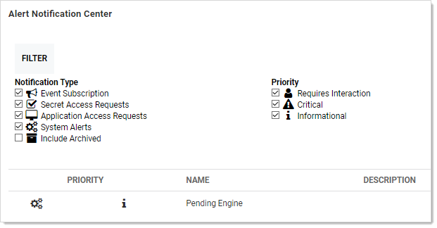

[title]: # (Approving a Request)
[tags]: # (Access Requests)
[priority]: # (10)

# Approving a Request

Once a request for access to a secret has been made, approvers receive an email.

The email contains one link to the secret **Access Request Approval** page for that request in SS, and five additional links to approve or deny the request if the **Allow Approval for Access from Email** configuration setting is enabled.

The approver can either click one of the links contained in the email or navigate to the **Notification Center** in the user menu within SS.

If choosing the latter, in the displayed grid click the access request name. This takes you to the secret's Access Request Approval page.

From here, you can accept or deny the request as well as set an expiration date.

The requestor has access to the secret until the specified date.

Selecting the current date is the smallest window of time allowed and grants access to the end of the day.

With **Allow Approval for Access from Email** enabled, clicking one of the five additional links in the email allows access for 1, 2, 4, or 8 hours or deny the request, per the link description in the email.

> **Note:** The expiration date referred to in approval requests is **not** the same as secret expiration.
