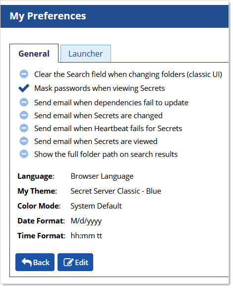
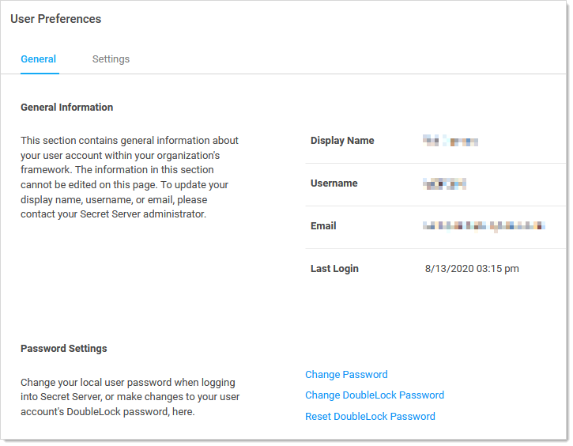
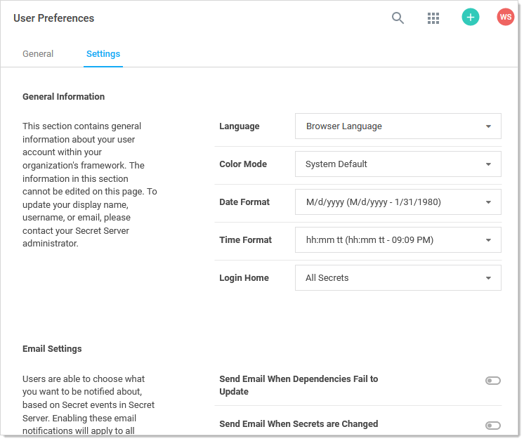

[title]: # (User Interfaces, Themes, and Color Modes)
[tags]: # (color modes, Themes, ui, user interfaces)
[priority]: # (1000)

# User Interfaces, Themes, and Color Modes

## Overview

Secret Server has two categories of user interface (UI) "skins"—the "new UI" and the "classic UI."

> **Important:** The availability of these features is up to your SS admin. It is possible that you do not have access to the classic UI at all. At your SS admin's discretion, your SS can default to either UI when you first open it.

### Terms

Settings and terminology for the two UIs are intertwined in in SS, so some clarification is in order—some definitions:

- **Classic UI**: The original, utilitarian, "90s-looking" interface, which many still prefer. It is sometimes called Secret Server classic.
- **New UI**: The refined, modern-looking interface with enhanced usability and aesthetics.
- **Theme** or **Classic Theme**: A color scheme (skin) for the classic UI. The "real" themes are Secret Server Classic - Blue, Secret Server Classic - Dark, Secret Server Classic - Default (Thycotic green), Secret Server Classic - Gray, and Secret Server Classic - Green. The new UI masquerading as a classic UI theme is called "Secret Server New" (see [Best Practices](#best-practices)).
- **Color Mode**: A color scheme (skin) for the new UI. The color modes are System Default, Light, and Dark. System default means whatever color was chosen on your system for the Windows application default.
- **Secret Server Classic:** An alternate name for the classic UI. This appears at times in SS.

### Best Practices

#### For Users

It is easy to get befuddled about settings and terms in the two UIs because:

- Two different terms are used to denote essentially the same thing—*themes* and *color mode*. The former is used for the classic UI and the latter for the new UI.
- You can configure settings for the new UI while in the classic UI. That is, you can set the default color mode while in the classic UI, which does not use color modes. Presumably, this was intended to make it easier to switch back and forth between the two UIs. It also makes it easier to confuse which setting goes with which UI.
- The "My Theme" dropdown list in the "Edit My Preferences" section of the classic UI lists the new UI as one of the themes, which it is not—it is an entirely new UI. This means that *can* use that dropdown to set your default UI to the new UI and switch to it right away (as soon as you click the Save button), but we suggest avoiding that. The dropdown's stated purpose is setting the theme for the classic UI. We recommend not using it to switch from the class UI to the new UI or to set the new UI color mode—do that from the new UI.

To combat that we recommend:

- Most importantly, just remember that themes are for the classic UI and color modes are for the new UI. They both refer to color (and icon) schemes (skins) for their respective interfaces.
- Pick one UI and stick with it. We recommend the new UI.
- If you want to use the classic UI, set your user default theme right after reading this, while this topic is fresh in your mind, and then leave it be.

#### For Admins

You can set the default theme for new users. With the correct settings chosen by the you, users can override the SS defaults.

We recommend encouraging your users to use the new UI. As an admin, you can limit your users using two settings on the **Admin > Configuration** page:

- **Enable New User Interface As Default for New Users** check box.
- **Allow Users to Select Classic Theme** check box.

You can also control the ability for users to set themes at the role level using the "Allow User to Select Themes" role permission.

## Procedures for Users

> **Important:** The availability of these features is up to your SS admin.

### Switching to the New UI from the Classic UI

Hover the mouse pointer over the user icon at the top right of any SS page and select **View in New UI**. The interface changes to the new UI (set to the default color mode for the logged on user).

### Switching to the Classic UI from the New UI

Click the user icon at the top right of any SS page and select **View in Classic UI**. The interface changes to the classic interface (set to the default theme for the logged on user).

### Setting Your Default Classic UI Theme

1. If necessary, switch to the classic UI: Click the user icon in the top right of any page and select **View in Classic UI**. The user interface changes to the classic UI.

1. Hover the mouse pointer over the user icon at the top right of any SS page and select **Account Settings**. The General tab of the My Preferences page appears:

   

1. Click the **Edit** button. The page becomes editable.

1. Click the **My Theme** dropdown list to select the desired theme (skin). Do **not** select Secret Server New (see the note below). The default setting simply means you want to use your SS admin's choice, not yours.

1. Leave the **Color Mode** dropdown list alone—it only applies to the new UI (see the note below).

1. Click the **Save** button. The current theme changes to your choice, and your default is set.

> **Note:** You *can* select Secret Server (New) to change your default to the new UI. As soon as you click the Save button, the interface changes to the new UI until you change it, even if you log off. If you choose Secret Server (New), the Color Mode dropdown list becomes relevant, so you should set it before clicking the Save button. For clarity, we recommend configuring new UI settings from the new UI and using the user icon to switch between UIs, but it is your choice (see [Best Practices](#best-practices)).

### Setting Your Default Color Mode

>**Note:** While it is possible to set this while in the classic UI, we recommend changing it while in the new UI (see [Best Practices](#best-practices)).

1. If necessary, switch the new UI: Hover the mouse pointer over the user icon at the top right of any SS page and select **View in New UI**. The interface changes to the new UI (set to the default color mode for the logged on user).

1. Click the user icon at the top right of any page and select **User Preferences**. The User Preferences Page appears:

   

1. Click the **Settings** tab:

   

1. Click the **Color Mode** dropdown list to select the desire color mode. Your choices are:

   - Light
   - Dark
   - System Default: The color chosen for your Windows default application color.

## Procedures for Admins

### Choosing the Default Classic UI and Theme for New Users

This is a procedure for admin users that determines what all newly created users default to.

>**Note:** This instruction assumes you are using the new user interface. The method for the classic user interface is nearly identical.

1. Go to **Admin > Configuration**.

1. Ensure the **General** tab is selected.

1. Click the **Edit** button at the bottom of the page. The page becomes editable.

1. Go to the **User Interface** section.

1. Click the **Select Default Classic Theme** dropdown list to select the theme. Your choices are:

   - Secret Server Classic - Blue
   - Secret Server Classic - Dark
   - Secret Server Classic - Default
   - Secret Server Classic - Gray
   - Secret Server Classic - Green

1. Click the **Save** button. The classic user interface theme for new users is now set.

### Choosing the Default New UI Color Mode for New Users

This is not configurable by design. Users default to the system default (Windows application) color mode.