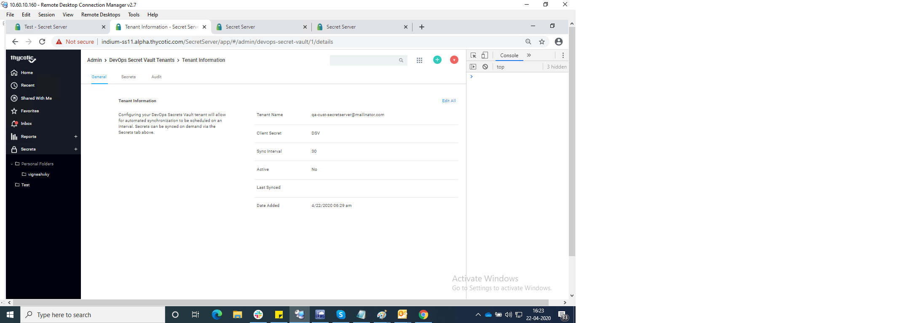
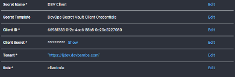

[title]: # (Synching with DevOps Secret Vault)
[tags]: # (dsv, DevOps Secret Vault)
[priority]: # (1000)
[display]: # (all)


# Synching with DevOps Secret Vault

## Overview

Secret Server (SS) can push its secrets to DevOps Secret Vault by creating a secret based on the "DevOps Secret Vault Client Credentials" template, which holds the client credentials for a DevOps Secret Vault tenant. Using the REST API, you can then register a DevOps Secret Vault tenant in SS. That tenant references that secret to push secrets to DevOps Secret Vault at a set sync interval.

## Behavior

Secrets can be manually pushed to the DSV tenant, in addition to SS checking for secrets to push to tenants on a timer. SS will check for if a tenant needs to be updated every 30 minutes on the cloud, or 10 minutes for an on-premises installation. Users will be prevented from setting a Tenant’s sync interval to be less than SS’s timed iteration as there would be no benefit for it. When SS checks for secrets to be pushed to DSV, it will only push secrets that have been changed since the last time they were updated in DSV. When a secret is pushed to DSV, then its sync time will be updated.

## Setup in Secret Server

To allow pushing secrets to DSV use the Admin | Devops Secrets Vault menu for the integration on the Secret Server user side to specify the DSV tenant.



## API Examples

### DevOps Secret Vault Client Credentials Template



Using the DSV Client Template, you provide the Client ID, Secret, the Tenant URL, and the client’s role (role field might be removed).

### Creating a DevOps Secret Vault Tenant

```rest
{
  "Data": {
    "secretId": { "value": 79, "dirty": true },
    "tenantName": { "value": "LJDevTenant", "dirty": true },
    "syncInterval": { "value": 60, "dirty": true },
    "active": { "value": true, "dirty": true }
  }
}
```

A POST to /api/v1/devops-secrets-vault/tenant using this body allows you to create a Tenant in Secret Server. The Secret ID is the ID of the DSV Client Credentials Secret. The Sync Interval is how often SS will check if secrets needs to be pushed to DSV. Only secrets associated to Active tenants are pushed to DSV.

You are returned the Tenant ID if the POST is successful.

### Creating a Sync Map

```rest
{
"data": {
  "secretId": {
    "dirty": true,
    "value": 60
  },

  "dsvTenantId": {
    "dirty": true,
    "value": 1
  },

  "active": {
    "dirty": true,
    "value": true
  },

  "fieldNamesPath":{
    "dirty": true,
    "value": [
      "Demo","\$domain","qagreentest"
      ]
    }
  }
}
```

A POST to /api/v1/devops-secrets-vault/add-sync using this body allows you to map a secret to a DSV Tenant. When the Secret is mapped to a Tenant, an initial sync occurs immediately. Following the initial sync, the secret will be checked if updates have been made each time the Sync Interval expires for the mapped Tenant. If no changes have been made to the secret, then the secret will not be pushed to DSV. You can reference fields from the secret to create the path in DSV. Secret Server will look for a \$, then search for the following string as one of the slugified field names for the secret’s template.

### Manually Syncing a Secret

A POST to /api/v1/devops-secrets-vault/sync can be used to manually trigger a push to DSV for existing sync maps. The list of integers contains the SyncMapIds of the secret to tenant mapping, so you can control which secret to which tenant is pushed.

```rest
{
"data": [
  3, 4, 5
  ]
}
```

### Listing DevOps Secret Vault Tenants

A list of the DSV Tenants registered to SS can be listed by running a GET to /api/v1/devops-secrets-vault/tenant. Query params accepted:

1. filter.nameSearch=
1. filter.includeInactive=

### Getting a DevOps Secret Vault Tenant’s Details

You can get the details of a single tenant by specifying a tenant ID in the GET /api/v1/devops-secrets-vault/tenant/{tenantId}

### Getting the Status of a Secret’s Synchronization

You can get the details of a Secret’s sync status by running a GET to
/api/v1/devops-secrets-vault/sync/status/{syncMapdId}

### Getting a List of Secret Synchronization Statuses

A List of Secret Sync statuses can be retrieved by running a GET to
/api/v1/devops-secrets-vault/sync/status. Query params accepted:

1. filter.secretId=
1. filter.includeInactive=
1. filter.tenantId=
