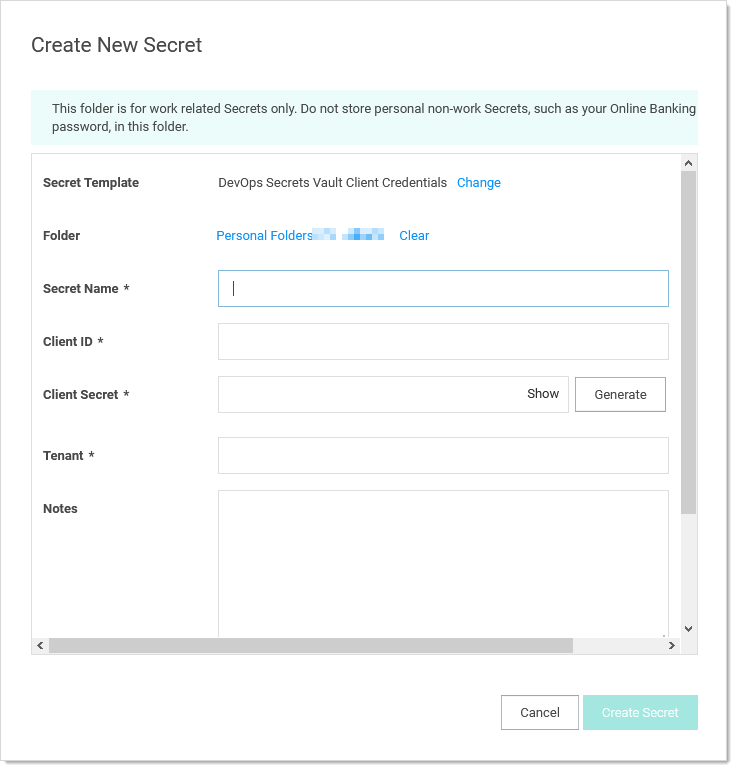
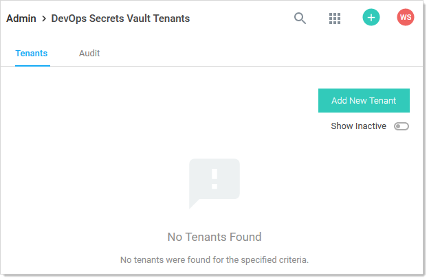
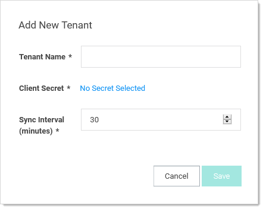

[title]: # (Syncing with DevOps Secret Vault)
[tags]: # (dsv, DevOps Secret Vault)
[priority]: # (1000)
[display]: # (all)

# Syncing with DevOps Secret Vault

## Overview

Secret Server (SS) can push its secrets to DevOps Secret Vault by creating a secret based on the "DevOps Secret Vault Client Credentials" template, which holds the client credentials for a DevOps Secret Vault tenant. Using the REST API, you can then register a DevOps Secret Vault tenant in SS. That tenant references that secret to push secrets to DevOps Secret Vault at a set sync interval.

## Behavior Test

You can manually push secrets to the DSV tenant, in addition to SS checking for secrets to push to tenants on a timer. SS will check for if a tenant needs updating every 30 minutes on the cloud or 10 minutes for an on-premises installation. Users are prevented from setting a tenant's sync interval to less than SS's timed iteration because there would be no benefit to doing so. When SS checks for secrets to be pushed to DSV, it only pushes secrets that have been changed since the last time they were updated in DSV. When a secret is pushed to DSV, its sync time is updated.

## Fields

All secret fields are copied to DSV except for fields that are marked as "Hide On View." The notes field of a secret maps to the secret description in DSV. Files are Base64 Encoded, then sent to DSV. They are stored as encoded, and need decoding for use.

## Setup in Secret Server

To configure pushing secrets to DSV:

1. Create a client in DSV. Save the client ID and secret that are generated when you created it. A DSV client is a container for a password.

   > **Note:** Please see the DSV documentation for details.

1. Create a secret to connect to DSV:

   1. [Create a new secret](../../secret-management/procedures/creating-secrets/index.md) based on the DevOps Secrets Vault Client Credentials template:

      

   1. Type the name for the new secret in the **Secret Name** text box.

   1. Type the DSV client ID in the **Client ID** text box.

   1. Type the DSV password for authentication in the **Client Secret** text box. If you do not have one, you can create a new here by clicking the **Generate** button. Then, create or configure a client in DSV using the password.

   1. Type the DSV tenant to connect to in the **Tenant** text box. A DSV tenant is your DSV cloud account and the rights to access it. Use the format: `https://<tenantname>.secretsvaultcloud.<region>` with the region being one of the following:

      - U.S. region: `com`
      - E.U. region: `eu`
      - APAC region: `au`

   1. Click the **Site** dropdown list to select your SS site.

   1. Click the **Create Secret** button.

1. Go to **Admin \> See All**. The Admin Menu page appears.

1. Click the **DevOps Secrets Vault** link. The DevOps Secrets Vault Tenants page appears:

   

1. Click the **Add New Tenant** button. The Add New Tenant popup appears:

   

1. Type a descriptive name for the tenant in the **Tenant Name** text box. This can be anything you wish.

1. Click the **Client Secret** link to select the secret you created earlier in this instruction.

1. Click the **Sync Interval** list box to select how often you want SS to push secrets to DSV for this tenant.

1. Click the **Save** button.

## API Examples

### Creating a DevOps Secret Vault Tenant

Use a POST to `/api/v1/devops-secrets-vault/tenant` using the body below to create a tenant in SS.


```json
{
  "Data": {
    "secretId": { "value": 79, "dirty": true },
    "tenantName": { "value": "LJDevTenant", "dirty": true },
    "syncInterval": { "value": 60, "dirty": true },
    "active": { "value": true, "dirty": true }
  }
}
```

The secret ID is the client ID for the secret based on the DSV Client Credentials template. The Sync Interval is how often SS checks if secrets needs to be pushed to DSV. Only secrets associated with active tenants are pushed to DSV. You are returned the tenant ID if the POST is successful.

### Creating a Sync Map

Use a POST to `/api/v1/devops-secrets-vault/add-sync` using this body to map a secret to a DSV tenant:

```json
{
"data": {
  "secretId": {
    "dirty": true,
    "value": 60
  },

  "dsvTenantId": {
    "dirty": true,
    "value": 1
  },

  "active": {
    "dirty": true,
    "value": true
  },

  "fieldNamesPath":{
    "dirty": true,
    "value": [
      "Demo","\$domain","qagreentest"
      ]
    }
  }
}
```

When the secret is mapped to a tenant, an initial sync immediately occurs. Following the initial sync, the secret is checked to determine if updates have been made when the sync Interval expires (making it "dirty") for the mapped tenant. If no changes have been made to the secret, then the secret is not pushed to DSV. You can reference fields from the secret to create the path in DSV. Secret Server will look for a `$`, then search for the following string as the [field slug names](../../secret-templates/secret-template-settings/field-slug-names/index.md) for the secret's template. The path in DSV follows this format: `/secrets/<DSV_secret_name>`.

### Manually Syncing a Secret

Use a POST to `/api/v1/devops-secrets-vault/sync` to manually trigger a push to DSV for existing sync maps. The list of integers contains the SyncMapIds of the secret to tenant mapping, so you can control which secret is pushed to which tenant.

```json
{
"data": [
  3, 4, 5
  ]
}
```

### Listing DevOps Secret Vault Tenants

List DSV tenants registered to SS by running a GET to `/api/v1/devops-secrets-vault/tenant`. Query parameters accepted:

- `filter.nameSearch=`
- `filter.includeInactive=`

### Getting a DevOps Secret Vault Tenant's Details

View the details of a single tenant by specifying a tenant ID in a GET to `/api/v1/devops-secrets-vault/tenant/{tenantId}`.

### Getting the Status of a Secret's Synchronization

View a secret's sync status by running a GET to `/api/v1/devops-secrets-vault/sync/status/{syncMapdId}`.

### Getting a List of Secret Synchronization Statuses

View a list of secret sync statuses by running a GET to
`/api/v1/devops-secrets-vault/sync/status`. Query parameters accepted:

- `filter.secretId=`
- `filter.includeInactive=`
- `filter.tenantId=`
