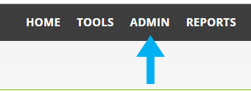
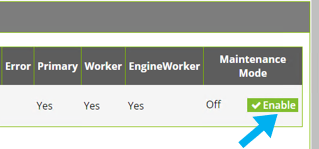
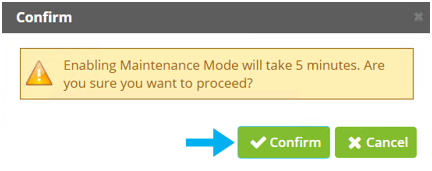
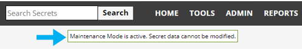

[title]: # (Enabling and Disabling Maintenance Mode)
[tags]: # (Administration, Enable, Disable, Maintenance mode)
[priority]: # (1000)

# Enabling and Disabling Maintenance Mode

Turning on Maintenance Mode allows you to temporarily prevent users from changing roles, Secrets, or Secret-related data such as dependencies, templates, and password requirements. For example, you would want to enable Maintenance Mode while migrating the Secret Server application to a new server with a different domain.

To turn on Maintenance Mode, perform the steps below.

1. In the Secret Server main dashboard window, click **ADMIN** on the menu bar.

1. In the **Administration** window, click **Server Nodes**.

1. In the **Web Server Nodes** window under the Maintenance Mode column, click **Enable**.

1. In the **Confirm dialog**, click **Confirm**.

**Note**:  When Secret Server is in Maintenance Mode; a notification bar is displayed to users.

1. To return Secret Server from Maintenance Mode to normal operation, click **Disable** in the **Web Server Nodes** window in the Maintenance Mode column.

**Note**: The Maintenance Mode notification bar will no longer be displayed once Secret Server is in its normal running mode.
