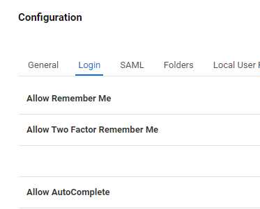
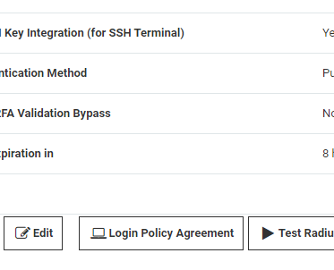
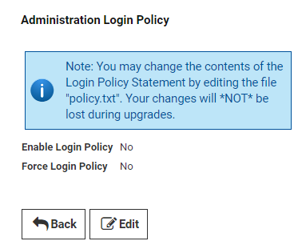
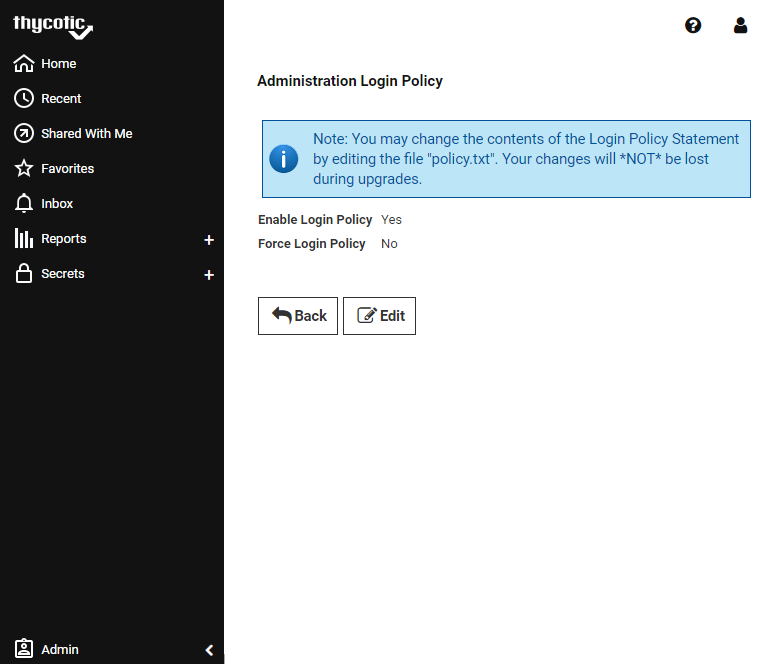

[title]: # (Enable Company Policy Banner)
[tags]: # (Advanced Encryption)
[priority]: # (1000)
[display]: # (all)

# Enable Company Policy Login Banner

Our company requires the login banner for usage agreements and conditions to be visible when users log into Secret Server.

To enable the login banner, follow the procedure below:

1. In the Secret Server main dashboard window, click **Administration** and then **Configuration**.

1. In the **Configuration** window, select the **Login** tab.

     

1. On the **Login** tab, scroll down to the bottom options and click **Login Policy Agreement**.

     

1. In the **Administration Login Policy** window, click **Edit**.

     

1. Select the checkbox for **Enable Login Policy** and click **Save**.

     

1. Log out of Secret Server and re-try logging in.

   On the Secret Server Login page, users logging into Secret Server will see the default message provided in the login policy box.

     

>**Note:** The login policy is not applicable to the mobile app and will not be shown.
