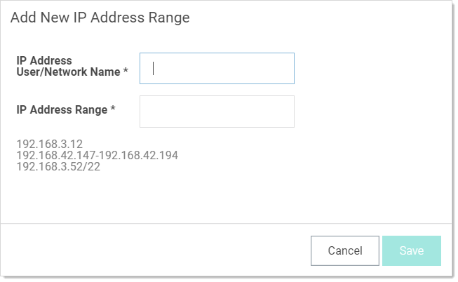
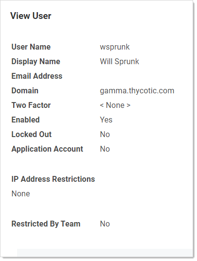

[title]: # (Restricting IP Addresses)
[tags]: # (Restricting IP Addresses)
[priority]: # (1000)

# Restricting IP Addresses

IP address restrictions allow you to control which IP address ranges users can use to log in to SS.

## Creating IP Address Ranges

To create an IP address range:
$1
$2
   
$1
$2
   
$1
$2$1
$2$1
$2
   

> **Note:** You can show or hide columns in the table by clicking the  button.

## Editing and Deleting IP Address Ranges

To edit an IP address range, go to the **IP Address Management** page, click on a range, and click **Edit**. To delete a range, click on the range and click the **Delete** button.

## Assigning an IP Address Range
$1
$2$1
$2
  
$1
$2
 
$1
$2$1
$2
> **Note:** Regardless of the restrictions, users can always log in when accessing SS on the server using a local IP address (127.0.0.1). This prevents total lockout from SS.
