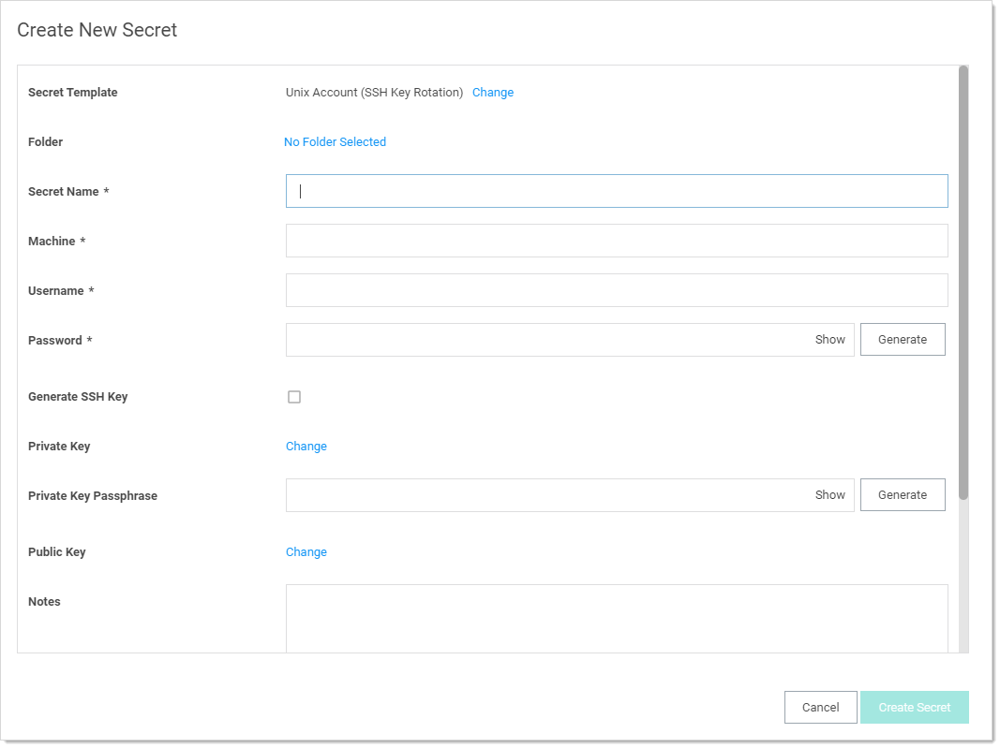
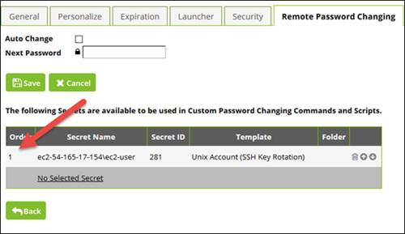
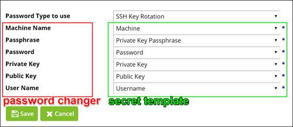
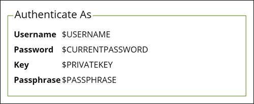

[title]: # (Custom SSH Key Rotation)
[tags]: # (SSH,key rotation)
[priority]: # (1000)
[display]: # (none)

# Custom SSH Key Rotation

This topic discusses how to change public keys for Unix accounts using Remote Password Changing (RPC) in Secret Server (SS). For a step-by-step tutorial on quickly getting started with the default SSH key rotation secret types and password changers, see our [Basic SSH Key Rotation](../ssh-key-rotation-basic/index.md). The current topic provides additional information for users who need to customize the default commands for their environment.

## Introduction

SSH key rotation allows you to manage your Unix account private keys and passphrases as well as their passwords. With key rotation, whenever the password is changed on the secret (manually, during a scheduled auto-change, or when checking in a secret that changes the password on check-in), the public/private key pair is regenerated and the private key encrypted using a new passphrase. The public key will then be updated on the Unix machine referenced on the secret.

Secret Server provides secret templates and password changers for SSH key rotation. 

## Requirements

To use our default SSH key rotation commands, the following minimum requirements must be met on the machine being managed:

- SSH key logins should be enabled on the target using keys in OpenSSH format. A secret can be created with keys in PuTTY format but they will be converted to OpenSSH when the key is rotated.
- Public keys should be stored in `[~userhome]/.ssh/authorized_keys` (not `authorized_keys2`).

- Grep and Sed should be installed on the target.

- If doing a privileged SSH key rotation, where a privileged user sets the key for another user, the privileged user must have sudo permissions that do not prompt for a password and the permissions to edit the user’s `authorized_keys` file with sudo.

The default command sets have been tested in the following Linux environments:

- CentOS Linux release 7.0.1406

- FreeBSD bsdRadiusServer 9.3-RELEASE-p5 i386

- Linux ubuntu 3.13.0-32-generic

If a system does not meet these requirements or has a different configuration than the tested Linux environments, it may still be possible to do key rotation by modifying the key rotation command sets. The command sets that may need to be edited and the process for doing so are described later in this topic.

## Secret Templates

Secret Server includes two secret templates for SSH key rotation: **Unix Account (SSH Key Rotation)** and **Unix Account (Privileged Account SSH Key Rotation)**. The first template changes the password and key on the account using the account's credentials. Use this template if both of the following conditions apply:

- The account is able to change its own password and modify its own `authorized_keys` file.

- The account password and key should only be changed by SS, which will always have the current password and keys.

**Unix Account (Privileged Account SSH Key Rotation)** uses an additional secret to provide the credentials for the connection that performs the password change and key rotation commands. You should use this template if either of the following conditions apply:

- The account is not able to change its own password or modify its own `authorized_keys` file.

- The account password and key may be changed outside of SS, and SS may not have the current account credentials. A privileged account that is able to change the password and `authorized_keys` files of other users will still be able to change the account credentials.

## Creating a New SSH Key Rotation Secret

When creating a new secret based on either of these templates you will see the following form:

1. Type the secret name in the **Secret Name** text box.
1. Type the machine in the **Machine** text box.
1. Type the username in the **Username** text box.
1. Click the **Generate** button to create a user password.
1. Click **Private Key** link to upload a file containing the private key.
1. If you are creating a new secret and want to generate a new, random private key, click to select the **Generate New SSH Key** check box. This disables the "Change" links for both the private and public keys.
1. If your uploaded private key was encrypted with a passphrase or you are generating a new key and wish to encrypt it with a passphrase, type that passphrase in the **Private Key Passphrase** text box. Otherwise, leave it empty.
1. If you are creating a new key and want to create a random passphrase for it, click this **Generate** button.
1. If you are uploading a private key, click the **Public Key Change** link to upload the corresponding public key. Uploading a public key is optional, but recommended. If not provided, SS regenerates it from the private key during key rotation, but if the key in the `authorized_keys` file is not in the same format as the generated key, the old key will not be removed when the new key is added.

If neither private key nor public key is attached to the secret, a key rotation creates a new key pair, attaches them to the secret, and adds the new public key to `authorized_keys`.

After the secret is created, you should see a successful heartbeat status. If heartbeat is not running, make sure that heartbeat and RPC are enabled under **Admin \> Remote Password Changing**.

> **Note:** Heartbeat status when either the private key/passphrase or password are incorrect is indeterminate and based on the host configuration. If the system allows log on as long as one of the two is correct, it will return a successful heartbeat when the password is wrong but the key is valid and vice-versa.

If you are adding a secret using the **Unix Account (Privileged Account SSH Key Rotation)** you will also need to specify which privileged account to use during key rotation. To do this:

1. Switch to the **Remote Password Changing** tab.

1. Click the **Edit** button.

1. Click the **No selected secret** link.

1. Choose a privileged Secret that can authenticate to the machine and use the sudo command to access other accounts' authorized_keys files and change their passwords. This can be any type of Unix secret and can use a password and/or private key to authenticate.

1. Click the **Back** button to exit edit mode.

## Editing the SSH Key Rotation Templates

To edit a template, go to **Admin \> Secret Templates**, choose the template you want to edit in the dropdown list of templates, then click **Edit**.

You can add, remove, or edit any fields you like, but if you change or replace any of the following fields you will need to update the password changer mapping for the template:

- Machine

- Username

- Password

- Private Key

- Private Key Passphrase

- Public Key

> **Note:** Private Key and Public Key must remain field type "File".

If you change any of the fields listed above, click the **Configure Password Changing** button to map the fields to the password changer. Click the **Edit** button and assign all the password changer fields to the corresponding fields on the secret template.

## Password Changers

Secret Server includes two password changers for SSH key rotation: **SSH Key Rotation** and **SSH Key Rotation Privileged Account**. The **Unix Account (SSH Key Rotation)** secret template uses the **SSH Key Rotation** password changer and the **Unix Account (Privileged Account SSH Key Rotation)** secret template uses the **SSH Key Rotation Privileged Account** password changer. Each of these password changers includes a set of command sets designed to change the password and public key on an account using the secret's credentials and using sudo with a privileged account, respectively.

 Although you can edit these password changers through **ADMIN \> Remote Password Changing \> Configure Password Changers**, clicking on the password changer and then **Edit** and **Edit Commands**, the recommended practice is to copy the existing password changers and then modify the copies. To do this:

1. Go to **ADMIN \> Remote Password Changing**.

1. Click the **Configure PasswordChangers** button.

1. Scroll down to the bottom of the page and click the **New** button.

1. Select the password changer you want to copy in the "Base Password Changer" list and give the new password changer a name.

1. Click **Save**. This creates a new password changer and copies the command sets from the original password changer.

1. Enter the authentication information (see below for more information), clicking the **Save** button in each Authentication field set.

1. Make the required changes to the command sets for your environment by editing existing lines, deleting lines, adding new lines, and rearranging lines.

## Authentication

The authentication section defines the credentials that will be used to connect to the machine and run the command set. These can be either the credentials of the secret or credentials from an associated secret. The command sets on the **SSH Key Rotation** password changer are designed to be run with the secret's credentials. Any customized password changer based on this password changer should use the secret's credentials in the Authentication section.

 Here is a typical authentication for **SSH Key Rotation**:

For more information about tokens beginning with a dollar sign used in the above screenshot, see the **RPC Mapped Fields** section in the [Secret Server User Guide](http://thycotic.force.com/support/s/article/User-Guide-Secret-Server).

The command sets on the **SSH Key Rotation Privileged Account** password changer are designed to be run with the credentials of an account that can change the password and public key on behalf of other users. Any customized password changer based on **SSH Key Rotation Privileged Account** should use the credentials off one of the secret's associated secrets. This is typically the first associated secret but can be any associated secret if your password changer requires more than one associated secret. The exception to this is validation which does not run a command set by default and uses the secret's credentials. If you modify validation to use a command set you will need to change the default authentication for validation if the command set uses sudo.

 Here is a typical authentication for **SSH Key Rotation Privileged Account** (except validation, which is identical to the authentication block used by **SSH Key Rotation**):

![Screenshot of a typical SSH Key Rotation Privileged Account Authentication: $[1]$USERNAME, $[1]$PASSWORD, $[1]$PRIVATE KEY, $[1]$PRIVATE KEY PASSPHRASE](images/clip_image010.jpg)

## Command Sets

### Overview

To handle cleanup and error-handling for key rotation two command set types were added: **Post Successful Change** and **Post Fail Change**. A password change using one of the two new password types will execute as follows:

1. Connect to the box using the specified credentials (secret credentials or an alternate secret's credentials).

1. Run the Password Change command set. This will add the new public key to the authorized_keys file. It does not change the password yet nor does it remove the old public key.

1. Verify using the new public key and old password. This verifies that the new key was added correctly.

1. If the verify check is successful, run the Post Success Change command set. This changes the password and, if successful, removes the old public key from authorized_keys if present.

1. If the verify check is unsuccessful, run the Post Failure Change command set. This removes the new public key from authorized_keys and does not change the password.

1. Return the success or failure of the overall process.

**Post Successful Change** and **Post Failure Change** are advanced command sets that are hidden by default. To see them, scroll to the bottom of the page and click the **Advanced Post Change Commands** link.

### Password Change Command Set

In other password types the Password Change command set is only responsible for changing the password. For the two key rotation password changers, the default Password Change command set checks for the existing public key on the secret, and if found, will append a new public key to authorized_keys (the old key is then removed in the Post-Reset Command Set). The password change is done in the Post Successful Change command set only after the key change has been validated.

### Verify Password Changed (Heartbeat) Command Set

Following this Reset Command Set, a Verify Password Changed is performed by attempting to connect to the host using the credentials on a secret to validate the new public key that was added to authorized_keys. If a command set is present, those commands are then run after connecting and the validation is a success only if both the connection and the command set are successful. (The command set is normally used when a secret uses alternate secrets as credentials in which case the alternate credentials are specified for authentication and command set does the actual validation of the secret.)

In the case of SSH key rotation, this validation heartbeat is run immediately after the reset command set using the current username, current password, new private key and new passphrase to connect for validation. If connection is successful, the validation is considered successful and Post Successful Change command set is run next to remove the old public key (if current private/public keys exist on the secret) from authorized_keys). If validation is not successful, the Post Fail Change command set is run to remove the new public key added during the reset.

### Post Successful Change Command Set

If the Password Change command set and Verify Password Changed are both successful, the Post Successful Change command set is run. This command set finalizes the key rotation by changing the password on the account and removing the old public key from authorized_keys.

### Post Fail Change Command Set

If the Password Change command set is successful but the Verify Password Changed fails, the Post Fail Change command set is run. This command set rolls back the changes made in the Password Change command set by removing the new public key from authorized_keys.

 For more information about customizing SSH command sets, see the [How to Create a Custom SSH Password Changer](http://thycotic.force.com/support/s/article/How-to-create-a-custom-SSH-password-changer) KB article.

### Notes

SSH Key Rotation scripts will typically be more complex than password change command sets that do not do key rotation. These scripts will often include tokens representing values from the secret and associated secrets as well as commands to verify success or failure of previous commands using $$CHECKFOR and $$CHECKCONTAINS. For more information about these features see the **Editing a Custom Command** section in the [Secret Server User Guide](http://thycotic.force.com/support/s/article/User-Guide-Secret-Server).

 The default command sets for **SSH Key Rotation Privileged Account** use sudo to execute several commands. These command sets assume that the sudo command will not prompt for a password. If your environment prompts for a password when using sudo the command sets will need to be modified to supply the password. If your environment caches the sudo credentials, the easiest way to handle this is to add the following two lines at the top of each command set on the SSH key rotation Privileged Account password changer:

sudo -i echo

$[1]$PASSWORD

This will pass the credentials from the first associated secret when prompted by sudo and cache the credentials for the rest of the script.

## Troubleshooting

- The SSH Password Changers are targeted to OpenSSH. If using a different SSH library or if the user keys are not in the users `/.ssh/authorized_keys` file you can check the commands used and modify them as appropriate under **Admin \> Remote Password Changing** and clicking **Configure Password Changers**. The password changers used are **SSH Key Rotation** and **SSH Key Rotation Privileged Account**.

- Errors are logged to **Admin \> Remote Password Changing**. Additional logs can be found in the Secret Server directory in the log subfolder. For example: `C:\inetpub\wwwroot\secretserver\log`.

- A change was made to how SSH script variables are named in order to differentiate them from tokens when testing command sets on the Configure Password Changers page. Non-token script variables should begin with an underscore. Anything in the script beginning with a dollar sign not followed by an underscore will be treated as a token and displayed as a field in the test dialog. For example

- - `$USERNAME`  – References the username from the Secret.
  - `$[1]$USERNAME`  – References the username from the first linked Secret.
  - `$_USERNAME`  – References a bash variable defined in the script.

 