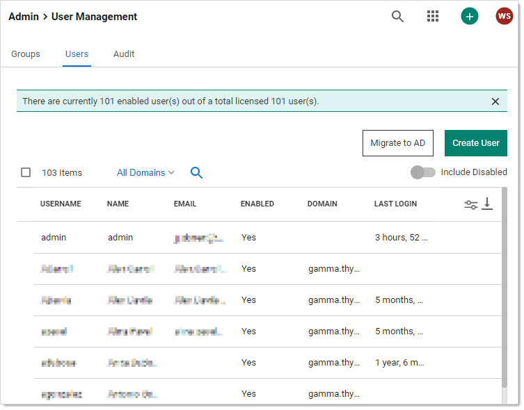
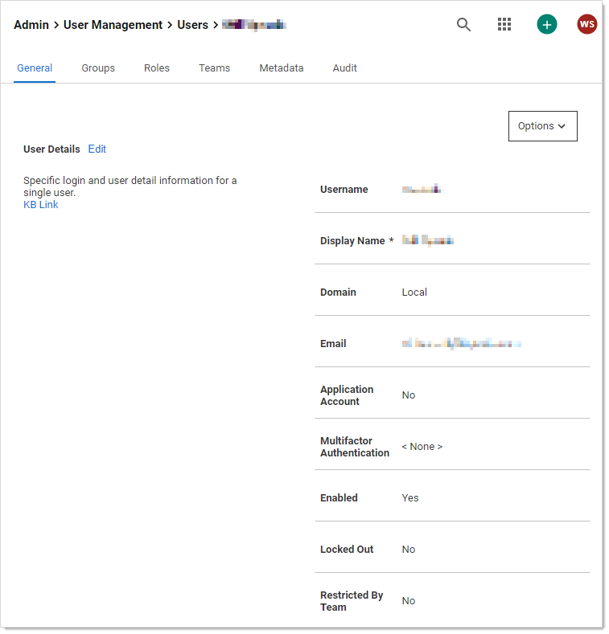
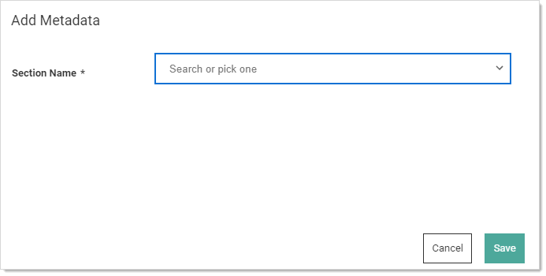
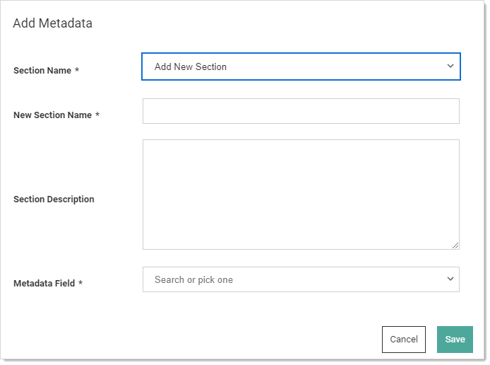
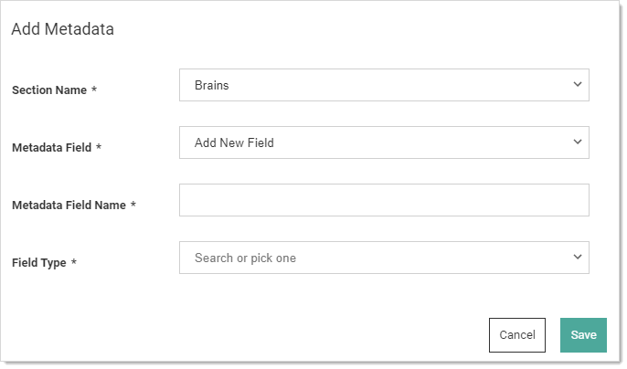
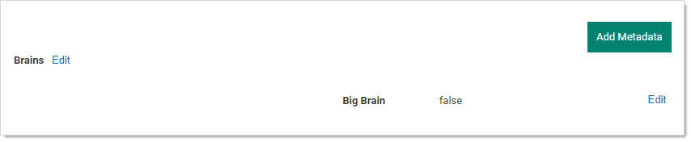
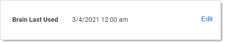

[title]: # (Object Metadata)
[tags]: # (Administration,metadata)
[priority]: # (1000)

# Secret Server Object Metadata

>**Important:** This feature is part of the early release of Secret Server 10.11. The general release is not till April 13, 2021 for the on-premises version and between April 3rd and May 15th 2021, depending on region, for the cloud version.

## Overview

Object metadata allows you to store extended information on several SS objects including users, groups, folders, dates, or secrets via the user interface or REST API. You can store most data types, including strings, Boolean values, numbers, dates, and users. You can combine this metadata into sections containing named fields of your defined types.

Unlike preexisting object fields, this metadata is flexible and dynamic. No coding, structural changes, or database schema changes are required. The only constraint is a role permission that controls who can add metadata fields or sections, which is granular down to the sections level on a given entity. For example, users that can view a user might be allowed to edit the values in the “public” metadata section and users that can edit a user might be allowed to edit all the sections for that user.

## Features

SS object metadata features:

- You can store user-defined metadata sections and field values on users, groups, folders, or secrets.
- Sections and fields are defined once and can be used across any applicable object. This allows for a common description across all objects. For example, all the objects could  have metadata fields for business owner, source system, and corporate     department name.
- Metadata fields are grouped or organized into sections.
- When viewing metadata, only populated fields appear. Field names with blank values are never present.
- You can define who can edit which sections via a role permission and by view or edit permissions the object.
- Each object maintains an audit history for all metadata fields, including previous values and who defined them.
- Audit history is viewable as a basic line chart for metadata fields stored as numbers. This provides a historical value table, as opposed to an audit log.

## Example Use Cases 

There are many ways to use SS object metadata. You could:

- Define common attributes from a corporate directory that are not available on a standard user, such as manager, hire date, or department.
- Allow defined users to add data to an object without allowing that user to edit the object itself. For example, the user could not edit a secret but can add notations on the secret that are useful to others accessing the object.
- Store external system link identifiers for integrations. For example, the employee ID from the HR system could be stored in the metadata for users. Integration jobs could then query this ID from metadata and use it for synchronization.
- Add a "department owner" field on a folder to store which department owns it. For instance, the folder contains secrets for marketing as defined by the metadata field.
- Avoid users putting numerous items into the notes field on a secret, resulting in a disorganized mess. With metadata, those items could be stored in properly named fields. This organizes the notes and allows them to be easily searched without having to parse a block of text.

## Adding Object Metadata

> **Note:** This instruction is on a user object. The process for folders, groups, and secrets is very similar.

1. Go to **Admin \> Users**. The User Management page appears:

   

1. Click on the desired user. The user's page appears:

   

1. Click the **Metadata** tab.

1. Click the **Add Metadata** button. The Add Metadata popup appears:

   

1. Click the **Section Name** dropdown list and select **Add New Section**. Additional controls appear:

   

1. Type the section name in the **New Section Name** text box.

1. (Optional) Type a description of the field in the **Section Description** text box.

1. Click the **Metadata Field** dropdown list and select **Add New Field**. Still more controls appear:

   

1. Type the field's name in the **Metadata Field Name** text box.

1. Click the **Field Type** dropdown list and select the desired data type. We chose Boolean.

1. (Optional) Click to select the **Value** check box if you want the field to be prepopulated to true. This only applies to the Boolean data type.

   > **Note:** Boolean fields always appear later because they always have a value.

1. Click the **Save** button. The new section and metadata field appears:

   
   The section appears in the top-left (*Brains*), and the field appears in the bottom right (*Big Brain*). We now have true or false field denoting if the user has a big brain.

1. Click the **Add Metadata** button again to add another field to the section. The Add Metadata popup returns.

1. This time, click the **Section Name** dropdown list and select the section that you just created.

1. Click the **Metadata Field** dropdown list box and select **Add New Field**. More controls appear:

1. Type the name of the new field in the **Metadata Field Name** text box. We chose *Brain Last Used*.

1. Click the **Field Type** dropdown list to select Date / Time. Date and time text boxes appear.

1. Add a date and time. You must add a value—otherwise there is no point in adding the field—blank fields are invisible.

1. Click the **Save** button. The new field appears on the Metadata tab:

   

1. Add additional fields as desired. 

1. The **Brains** section, **Big Brain** Boolean value, and **Brain Last Used** date / time fields are now available for use across all SS users. 

## Best Practices

How your organization uses object metadata requires some forethought, including:

- Will you allow anyone to add metadata or only a specific set of individuals? This is controlled by applying the above mentioned role.
- How do want to standardize the naming of sections and fields? One user might call the same field *business owner* and another might call it *subject expert* if you do not establish the field nomenclature up front.
- Do you want to create a "public" field section that is available to all users to edit, even those with read only permission on the object?