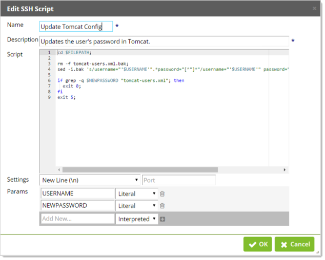
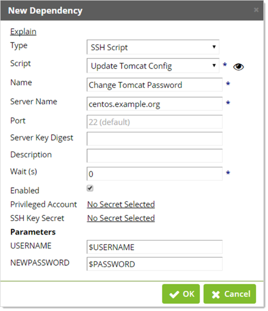

[title]: # (Creating and Using SSH Scripts)[tags]: # (API,Scripting,SSH)[priority]: # (1000)
# Creating and Using SSH Scripts

SSH scripts can be used in Secret Server (SS) to automate specific tasks.  An SSH script can be configured as a dependency of a secret and run after the password is successfully changed on the secret.

## Creating an SSH Script

1. From the **Admin** menu, click **Scripts**. 
1. Click the **SSH** tab on the Scripts page.
1. Click the **Create New** button. 
1. Type the name and description in their text boxes.
1. Paste the script in the text box.
1. Click the **OK** button.  

Using SSH scripts as dependencies requires that Remote Password Changing is turned on, so ensure that this is enabled on the Remote Password Changing page.

Scripts return all output results, which allows you to debug your script using the echo command (or any command that will write to standard output).

For example:

`echo The users name is $USERNAME`

An input box for specifying arguments will exist in places where the SSH scripts are used.  Argument values are specified next to their associated argument name.  Parameters to SSH scripts are referenced through named variables.  It is often beneficial to assign parameter variables to other more meaningful variables.

Another example:

`$GREETING = Welcome back`

`$NAME = Joe`

`echo $GREETING $NAME`

Output: `Welcome back, Joe`

In situations where the script should fail given a specific set of conditions, exit the script with a non-zero status code.  When scripts exit with a non-zero status, the failure is logged in the System Log.  The script is considered to have successfully run if it does not exit with a non-zero status code.

Example:

```powershell
if [ ! $MEETS_CONDITION -eq 0 ]; then

echo Failure

exit 1;

fi

echo Success
```

## Use Case

Update a user's password in the Apache user configuration file when it is changed in Secret Server:

 ```powershell
cd $FILEPATH;

rm -f tomcat-users.xml.bak;

sed -i.bak 's/username="'$USERNAME'".*password="[^"]*"/username="'$USERNAME'" password="'$NEWPASSWORD'"/' tomcat-users.xml;

if grep -q $NEWPASSWORD "tomcat-users.xml"; then
exit 0;
fi
exit 5;
 ```

## Adding an SSH Script as a Dependency

1. Navigate to **Admin > Scripts**. 
1. Select the **SSH** tab. 
1. Click **Create New** to create a script. 
1. Fill out the required fields **Name**, **Description**, and **Script**. 
1. (Optional) Change the setting for the environmental line ending in case your environment experiences issues with line termination. 
1. (Optional) Specify the port that the script will connect to.

When filling out the script there is some important information to remember. If you would like to use one of the SS variables such as $USERNAME, $NEWPASSWORD, or $CURRENTPASSWORD, you  need to specify that they are parameters. For example, take the following script from our use case:



 Within the script, parameters are specified with the dollar sign prefixed to the name. In the list of parameters, you simply specify their name without the dollar sign. This is so you can fill their values in later when implementing the script as a secret dependency.

When adding the SSH Script as a dependency to a secret, specify the built-in SS variables with the dollar-sign prefix. For example, using our use case:



If a parameter in the script is not specified in the list of parameters, then they will use environmental variables on the remote host.

 