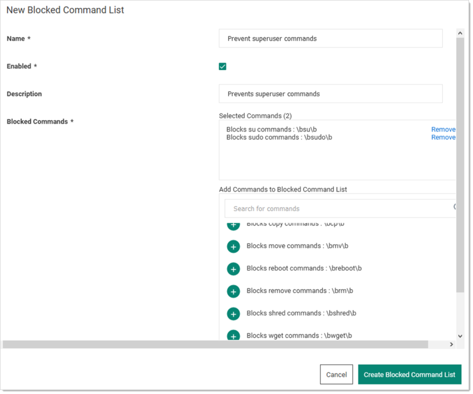

[title]: # (SSH Blocked Command Lists)
[tags]: # (SSH Proxy,Networking,command menu,blocked commands)
[priority]: # (1000)

# SSH Blocked Command Lists

## Overview

Secret Server (SS) supports privilege management and command restrictions for UNIX and other platforms with SSH interfaces. Privilege management is an additional layer of access control that you can apply to secrets with SSH launchers over SSH proxy. With privilege management, you can grant users access to a machine to block specific commands that a user may run as root or any other privileged account.

> **Note:** To use command restrictions, SS must have SSH Proxy and Enable Block Listing enabled.

With SSH blocked command lists, you can define disallowed commands when connecting as a privileged account. The blocked command list is defined by a series of regular expressions.

Upon launching a secret with an assigned SSH command blocklist, each command sent to the target is evaluated for a match on the blocklist. If the command is found to match a list entry, that command is blocked from execution. Blocked output is shown to the user at the terminal. 

## Requirements

System requirements:

- Secret Server 10.11 or later
- Secret Server Platinum Edition license or Secret Server Professional and Unix SUPM license
- SSH proxy must be enabled

# Creating SSH Blocked Command Lists

The format for specifying a blocked command follows a regular expression syntax that is typical to most scripting languages. The blocked commands are surrounded with `\b` word boundary anchors. For example, to block the `sudo` command, you use:

`\bsudo\b`

This expression blocks the execution of any command with the `sudo` string in it  (as a separate word), for example, these are blocked:

- `sudo`
- `sudo root`
- `sudo ls /usr/local/protected`
- `sudo shutdown -r +15 "quick reboot"`

And these are not: 

- `cat sudoku`

- `echo “sudo”`

To create a list of blocked commands:

1. Go to **Admin \> See All**.

1. Hover the mouse pointer over the **Actions** menu item and select **SSH Command Restrictions**. The SSH Command Restrictions page appears:

   

1. Click the **Blocked Command List** tab:

   

1. Click the **Create Blocked Command List** button. The New Blocked Command List page appears:

   

1. Type the list name in the **Name** text box.

1. Ensure the **Enabled** check box is selected.

1. **Either** select a predefined regex from the **Add Commands to Blocked Command List** dropdown list.
   **Or** add a custom regex of your own:

   1. Scroll to the bottom of the dropdown list.

   1. Click the **Create New Command** link. The Create Command and Add to Blocked Command List popup appears:

      

   1. Type the name for the command in the **Command Name** text box.

   1. Type or paste the regex in the **Command Pattern** text box.

   1. Click the **Create and Add** button. The command is added to the dropdown list.

1. Click the **Create Blocked Command** List button.

# Applying SSH Command Blocked Lists in Secret Settings

To enable privilege management for an account:

1. Navigate to a PuTTY secret’s **Settings** tab.

1. Go to the **SSH Launcher** section.

1. Click the **Edit** link.

1. Click the **Connect Using** dropdown list and select **Credentials on Another Secret**.

1. Click the **No Secret Selected** link to choose a secret containing your log on credentials, which the launcher uses when logging on the SSH service.

1. Enable command restrictions:

   1. Click the **Security** tab.

   1. Go to the **Other Security** section. 

   1. Click the **Edit** link to set **Enable Proxy** to Yes.

   1. Click the **Edit** link for the **Enable SSH Command Restrictions**. The Edit SSH Command Restrictions popup appears:

      

   1. Ensure the Restrict SSH Commands check box is selected.

   1. Click to select the Blocked Command Lists selection button.

   1. Click the **Owner**, **Edit**, and **View Permission** dropdown lists to  map the blocked command lists to users via those permissions. You can also leave them as unrestricted.

   1. Click the **Save** button.

# SSH Command Restrictions via a Secret Policy

You can apply SSH command restrictions to a secret policy for ease of management. You can apply secret policies to secret folders or directly to a secret itself.  To apply command restrictions, set a policy as follows:

**Table:** Secret Policy Security Settings for SSH Command Restrictions

| Section           | Item                                     | Setting             | Value                                 |
| -- | -- | -- | -- |
| Security Settings | Enable Proxy                             | Enforced            | Checked                               |
| Security Settings | Enable SSH Command Restrictions          | Enforced            | Checked                               |
| Security Settings | SSH Command Restriction Type             | Enforced            | Blocked List                          |
| Security Settings | SSH Command Blocklist for Secret Owners  | Enforced or Not Set | Desired Block Command List or Not Set |
| Security Settings | SSH Command Blocklist for Secret Editors | Enforced or Not Set | Desired Block Command List or Not Set |
| Security Settings | SSH Command Blocklist for Secret Viewers | Enforced or Not Set | Desired Block Command List or Not Set |

