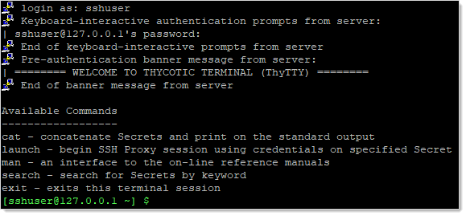
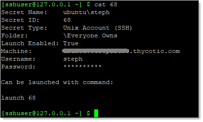
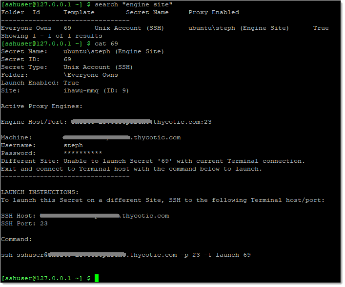
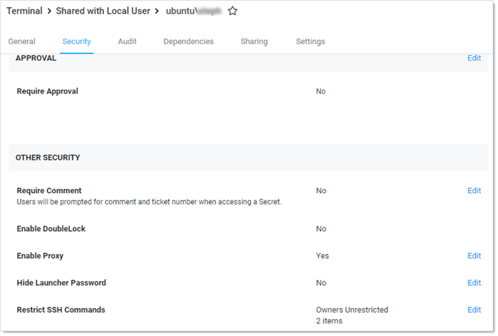
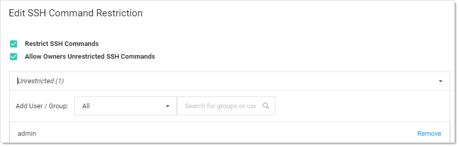
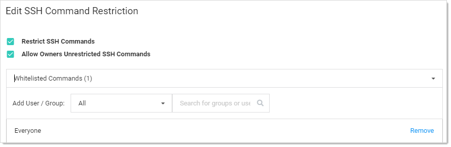
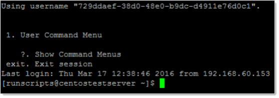

[title]: # (SSH Terminal Administration)
[tags]: # (SSH Terminal, CLI)
[priority]: # (1000)

# SSH Terminal Administration

## Introduction

This document discusses using an SSH terminal with Thycotic Secret Server (SS).

## Feature Summary

- Connect using SSH to a terminal hostname and port to log in to terminal and run commands

- Display custom terminal banner after successful connection

- Display available commands on successful login (display again with `man` command) 

- Log in to the terminal as a SS user (SSH Proxy must be enabled)

- Can set an inactivity timeout. Can be set to *disabled* or with a two-minute minimum.

- Start a terminal connection and launch in a single line. For example:

  `ssh <user>@<ss_ip> -t launch <secret_id>`

- Use two-factor authentication (2FA) for access (optional)

- Use the SSH terminal interface to SS for viewing and launching secrets 

- Use these commands:
  - `Man` command to display detailed command description
  - `Search` command to display matching secrets
  - `Cat` command to display secret details of with specified secret ID
  - `Launch` command to begin a Proxy launch session with specified secret ID
  
- Use up and down keystrokes for command history

- Supports custom SSH command menus and session recording logging

## Requirements

### System Requirements

- Secret Server 10.7.000000
- Secret Server **Professional** or **Platinum** Edition license

### Recommended

[RabbitMq Site Connector](https://updates.thycotic.net/link.ashx?RabbitMQSSL)

### Secret Server Permission Requirements

Admin:

- Administer Configuration
- Administer Proxying Configuration
- View Configuration
- View Proxying Configuration

User: View Secret

## Configuring SSH Terminal 

### Enabling SSH Terminal on Secret Server

1. Prerequisites:
  - Must meet Admin permission requirements (see [Secret Server Permission Requirements](#Secret-Server-Permission-Requirements))
  - Secret Server **Professional** or **Platinum** Edition license

1. Navigate to **Secret Server \> Admin \> SSH Proxy**.

  

1. Click the **Edit** button.

1. Type your SSH proxy configuration settings (see "Configuring SSH Proxies for Launchers" in the [Secret Server Administration Guide](https://thycotic.force.com/support/s/article/SS-ADM-EXT-Admin-Guide)):
  1. Enable **SSH Proxy** (required to use SSH terminal).
  
  1. (optional) Enable **Proxy New Secrets by Default**.

  > **Note:** To launch a secret via the terminal, the secret must have proxy enabled. Only SSH-based credentials can be launched in the terminal.

  1. Click to enable **SSH Terminal**.
  
  1. (optional) Customize the **Terminal banner** for your environment.
  
  1. (optional) Click to enable **Terminal Inactivity Timeout** (in seconds).
  
  1. The resulting settings should look something like this:

  

1. Specify the IP address for nodes (and engines) that will run SSH proxy:

  1.  Navigate to **Admin \> SSH Proxy \> Nodes.** 
  1. Set the **SSH Public Host.** This is the public hostname or IP that the client launcher connects to. In most cases, this is the same as the SSH bind address; however, there are cases where the public IP or host differs from the private IP that SS should bind to, such as NAT or Amazon EC2 instances.

  1. Set the **SSH Bind IP Address**. This defaults to (0.0.0.0). The IP Address of the network adapter that the SS SSH listener should bind to. This should not be localhost or 127.0.0.1. If you are not sure which bind IP address to use, you may use 0.0.0.0, which binds to all IPv4 interfaces on the machine.

### Enabling Terminal on Secret Server Distributed Engine

SSH terminal can also run on each proxy-enabled distributed engine (DE) site. 

> **Note:** To launch secrets on non-local sites, users **must** connect to an SSH terminal over an engine on this site.

1. Go to **Admin \> SSH Proxy \> Sites**. 
1. Click to select **Proxy Enabled**.
1. Type an **SSH Port**.
1. Go to **Admin > SSH Proxy > Engines**.
1. Type the **Hostname** and **IP Address** (description above).
1. Type the **SSH Bind Address** (description above).

## Logging into the SSH Terminal

1. From any SSH terminal, connect to hostname or IP address and port, as specified in the SSH Proxy Configuration page. Use the DE hostname or IP if connecting to an engine. Examples:

   `ssh 127.0.0.1 -p 22`

   `ssh user54@127.0.0.1 -p 22`

1. If not provided in the SSH connect command, enter your SS username and password at the **Login as:** prompt.
   
1. If successful, you will see the terminal banner displayed, along with a list of available commands.

## Increasing Maximum Concurrent Logins for Users

Logging in to SSH terminal counts against the number of concurrent SS sessions a user is allowed. For example, if **Maximum concurrent logins per user** is set to “1” and the user john.smith is logged into the SS Web user interface, then john.smith logs into SSH terminal, his first Web session will end, and he will have to log in again to use the Web user interface. 

To increase the maximum concurrent logins per user:

1. Go to **Admin > Configuration**. The Configuration page appears.
1. Click the **Login** tab.
1. Click the **Edit** button at the bottom of the page. The page becomes editable.
1. Click the **Maximum concurrent logins per user** dropdown list and select the desired number.
1. Click the **Save** button.

## SSH Terminal Login with Two Factor Authentication

SSH terminal is considered a Web service and can be used with two factor authentication (2FA). To enable 2FA for terminal:

1. Follow the steps in the **Two-Factor Authentication** section of the [Secret Server Administration Guide](https://thycotic.force.com/support/s/article/SS-ADM-EXT-Admin-Guide) to set up 2FA.

1. Go to **Admin \> Configuration \> Login \> Require Two Factor for these Login Types** and select one of these:
   - **Website and Web Service Login**
   - **Web Service Log on Only**

1. Enable 2FA on the SS user by going to **Admin \> Users \> Select a user \> Edit \> Two Factor** and select the 2FA option. 

   > **Note:** FIDO2 authentication is not supported in this version of SSH terminal. 

1. From any SSH terminal, connect to hostname or IP address and port, as specified in the SSH Proxy Configuration page. Use the distributed engine hostname or IP if connecting to an engine. Examples:

   `ssh 127.0.0.1 -p 22`

   `ssh username@127.0.0.1 -p 22`

1. If not provided in the SSH connect command, enter your SS username and password at the **Login as:** prompt. 

1. You will be prompted for a PIN or custom challenge message by your 2FA provider. Example:

   login as:  `duouser` **\<Enter\>**

   Using keyboard-interactive authentication.

   duouser@127.0.0.1’s password: `uewori#$%tdtd` **\<Enter\>**

   Using keyboard-interactive authentication.

   Pin Code: `3787` **\<Enter\>**

1. If successful, you will see the terminal banner displayed, along with a list of available commands.

## Escaping Special Characters

When manipulating secrets containing special characters, such as single quotes and double quotes, you must escape those characters in the command.

Example: To search for an item with a space in the name, put the name in single or double quotes:

`search “My Secret”`  or `search 'My Secret'` 

Example: To search for an item with a single quote embedded in the name, there are two options:

- Encase the term in double quotes:

  `search “Bob’s Secret”`

- Escape the single quote with a backslash:

  `search 'Bob\'s Secret'`

Example: Similarly, to search for an item with a double quote embedded in the name, there are two options:

- Encase the term in single quotes:

  `search '"Weird" Secret'`

- Escape the internal double quotes with a backslash:

  `search "\"Weird\" Secret"`

##  Terminal Commands

### man 

#### Syntax

`man [command name]`

#### Description

Displays command help for specific or all commands. *Man* is short for *manual*.

#### Examples

`man`

Short help for all commands.

`man cat`

A detailed description of the `cat` command. 

### search

#### Syntax

`search [-st] <search_text>  [-f <folder_id>] [-fav] [-r] [-sf <search_field>] [-skip <skip_results>] [-s] [-t <secret_template_id>] [-take <max_results>] `

#### Description

Returns a list of SS secrets by keyword, which you can filter using several command-line switches.

#### Parameters

`-st <search_text>`

Required. Text to search for. `-st` is optional. Returns 25 results by default. Use `-take` to change from the default.

`-f <folder_id>`

ID of the secret folder to limit the search to.

`-fav`

Only search "favorite" secrets. 

`-r`

Ignore restricted secrets in the search. Restricted secrets are included by default.

`-s`

Ignore subfolders in the search. Subfolders are included by default.

`-sf <search_field>`

ID of the secret field to limit the search to. Potential fields, which vary by secret template, can include the following examples:

- Address1
- Address2
- Address3
- Blog
- CardType
- City
- Combination
- Contact Number
- Country
- Email Address
- ExpirationDate
- Fax
- First Name
- FullName
- Home Phone
- Last Name
- Machine
- Mobile Phone
- Notes
- Number
- Password
- Pin
- PinCode
- Server
- SSN
- State
- Username
- Website
- Work Phone
- Zip

> **Note:** These fields match those on the REST API endpoint.

`-skip <skip_results>`

Skip this number of initial results. Useful for processing "pages" of results.

`-t <secret_template_id>`

Only search secrets based on the template with this template ID.

`-take <max_results>`

Take a total of only this number of results. Useful for processing "pages" of results. Defaults to 25 results.

#### Examples

`search -st admin`  

Find a list of secrets matching "admin." Returns 25 results (the default).

`search admin`  

Same search using alternate syntax. `-st` is not required. 

`search -st jones -fav`

Find a list of "favorite" secrets matching "jones" in any field Returns 25 results (the default).

`search admin -take 50`

Outputs a list of secrets matching “admin”, up to 50 results.

 `search Zardoz -take 50 - skip 50 -sf "Secret Name"`

Find a list of secrets with "Zardoz" in the "Secret Name" field. Return 50 results, starting with the 51st secret found.

`search admin -skip 25 -r`

Find a list of secrets matching “admin” in any field. Return 25 results, which is the default. Skip the first 25 results. Ignore restricted secrets.

### cat

#### Syntax

`cat [-s|-id|-secret-id] <secret_id> [-c|-comment <comment_or_access_request>] [-t|-ticket <ticket_number>] [-ticketsystemid <ticket_system_id>]`

#### Description

- Displays information on a secret. The available information depends on the secret's template. *cat* is short for *concatenate*. 
- Catches access errors, such as “comment required” or “requires approval”, and displays them on the terminal

- Audits "view" comments.

- Provides launch connection command instructions. Shows the correct launch parameter and a connection string (if the terminal connection and the site on the secret do not match).

> **Note:** If a required access element is not provided in the command, the terminal will respond
> with an error that should indicate what is missing.

#### Parameters

`[-s|-id|-secret-id] <secret_id>`

Required. The secret ID. Three optional switches.

`[-c|-comment <comment_or_access_request>]`

The text for the comment or access request. 

`[-t|-ticket <ticket_number>]`

The ticket number for the request. 

`[-ticketsystemid <ticket_system_id>]`

The unique ticket system ID.

#### Examples

`cat 24`

Display the contents of the secret with the ID 24. Only works after access is approved.

`cat -id 24` 

Alternate syntax. Display the contents of the secret with the ID 24.

`cat -id 25 -comment “Viewing this secret”`

Add a "view" comment to, and then display the contents of the secret with the ID 25.

`cat -id 26 -comment “Requesting view access to install software” -ticket 123 -ticketsystemid 2`

Add an "access request" comment to the secret with the ID 26. Assign the request the ticket number 123 and the ticket system ID of 2 to that request.

> **Note:** The most common secret restrictions are “requires view comment” or “requires access request.” The `-comment` parameter takes care of both of these because the underlying API call (`SecretAccessCreateArgs`) is agnostic.

### launch

#### Syntax

`launch [-s|-id|-secret-id] <secret_id> [-m|-Machine <machine_name>] [-c|-comment <view_comment_or_approval_request_reason>] [-t|-ticket <ticket_number>] [-ticketsystemid <ticket_system_id>]`

#### Description

- Creates a proxy connection to the machine

- Secret must have proxy enabled

- Supports launch from secrets with private keys

- Audits launches

#### Parameters

`[-s|-id|-secret-id] <secret_id>`

Required. The secret ID. Three optional switches.

`[-c|-comment <comment_or_access_request>]`

The text for the comment or approval request. 

`[-m|-Machine <machine_name>]`

Machine name for the launch. This may be required if a customized secret template does not contain a machine field or a launcher requires a machine entry on launch.

`[-t|-ticket <ticket_number>]`

The ticket number for the request.

`[-ticketsystemid <ticket_system_id>]`

The unique ticket system ID. 

#### Examples

`launch 24`

Begins the SSH proxy session with the secret with the ID 24 and the specified credentials and machine. Only works after access is approved.

`launch -id 24` 

Alternate syntax. Begins the SSH proxy session with the secret with the ID 24 and the specified credentials and machine. Only works after access is approved.

`launch -id 25 -comment “Launching this secret”`

Submits a "view" comment to the secret with ID 25. Begins the SSH proxy session with secret credentials and machine.

`launch -id 26 -machine XYZ -comment “Requesting view to launch temporary sudo account for the XYZ machine”`

Submits an "access request" comment to the secret with ID 26 on the machine XYZ with the ticket number 123 and ticket system ID 2.

## Launching a Secret with the SSH Terminal

### Launching a Secret on a Local Site

1. To launch, the secret must be:
  - Enabled for proxy **(SS \> Secret \> Security \> Enable Proxy)**
  - Shared with the terminal user 
1. Log in to the terminal with SS user credentials:

  
1. If the secret ID is unknown, search for the desired secret with the search command:

  
1. To view secret detail, get the secret ID from search results, and run

  `cat <secret_id>`

  

5. To launch the secret, enter the launch command as specified in the last line of secret details:

   `launch <secret_id>`

   

6. To exit the launch session and return to the terminal, type `exit`.

7. To exit the terminal session, type `exit` again.

### Launching a Secret on a Distributed Engine Site

1. To launch, the secret must be:
   - Enabled for proxy **(SS \> Secret \> Security \> Enable Proxy)**
   - Shared with the terminal user 

1. Log in to the terminal with SS user credentials:

   

1. If secret ID is unknown, search for the desired secret with the search command:

   

1. To view secret detail, get the secret ID from search results, and run

   `cat <secret_id>`

   

   

1. Note that the connection is not made, and instructions are displayed for logging into another distributed engine terminal to launch the secret.

1. Note the suggested parameters in the **Launch Instructions**.

1. Type `exit` and press **\<Enter\>** to disconnect from the current session:

   

1. Open a new SSH session suggested parameters:

   `ssh <secret_server_username>@<engine_hostname_or_ip> -p <Port> -t launch <secret_id>`
   
1. Enter the password to log in, and the secret should immediately launch.

### Launching a Secret upon Terminal Connection

1. To launch, the secret must be:

   - Enabled for proxy **(SS \> Secret \> Security \> Enable Proxy)**
   - Shared with the terminal user 

1. If the secret ID and connection string is known, you can log in and immediately launch the secret with the following command:

   `ssh <secret_server_username>@<hostname_or_ip> -p <Port> -t launch <secre_id>`

3. If you do not know that connection string, log into terminal and run:

   `cat <secret_id>`

4. Look at the **Launch Instructions** at the end of secret details, and note the parameters.

## SSH Terminal Launching with a Custom SSH Command Whitelist

SS terminal can launch secrets with custom SSH Command restrictions. For detailed instructions on SSH command menus, please consult the **Managing SuperUser Privilege** section of the [Secret Server Administration Guide](https://thycotic.force.com/support/s/article/SS-ADM-EXT-Admin-Guide).

> **Note:** Custom SSH command menus require either the SS Platinum or Unix SUPM add on license.

1. Go to **Admin > See All**. The Administration page appears.

1. Click the **SSH Command Menus** link. The SSH Command Menus page appears.

2. Click the **Create New** button.

3. Type a name, description and the SSH commands:
   
   
   
   Once one or more command menus have ben created, access can be controlled to individual Unix SSH secrets.
   
5. On the **Security** tab of a secret that can use a proxied SSH session, proxy must be enabled, as well as command menu restrictions. If **Allow Owners Unrestricted SSH Commands** is enabled, any user who is an owner of the secret has unrestricted use of the launched session. That is, that user is able to type in commands as in a normal SSH session. Additionally, other groups can be assigned the unrestricted role as well.

6. In the following example, the “admin” group is unrestricted, and everyone who is not in that admin group is restricted to only being able to run the whitelisted commands that are specified in the user command menu created above.
   

  

  When you click the Edit link:

  

  And click the dropdown list to select Whitelisted Commands:

  

1. A user who is subject to SSH command restrictions is presented with a screen similar to the following when launching this secret from SS terminal:
   

  

  The user simply enters the number of the command menu to see available commands or types “?” to display the options again:

   

  Only the commands listed can be run by this user. The user can either enter the number of the command to be run, or the name of the command, which is the word to the left of the equal = sign. Other options are available (as shown) to navigate through the available command menus, display help, or exit the session.

## SSH Terminal Launching with Session Recording

SS SSH terminal launches also support session recording for session client or server data. When a user launches a secret with session recording enabled through SSH terminal, session data is available in the Secret Audit tab as session data.

> **Note:** Session recording requires either SS Platinum or the Session Recording add on license.

> **Note:** See the Session Recording section of the [Secret Server Administration Guide](https://thycotic.force.com/support/s/article/SS-ADM-EXT-Admin-Guide). for more information.

To enable session recording: 

1. Go to **Admin > Configuration**. The Configuration page appears.
1. Click the **Session Recording** tab.
1. Click the **Edit** button at the bottom of the page. The page becomes editable.
1. Ensure the **Enable Session Recording** check box is selected.
1. Modify other settings as desired.
1. Click the **Save** button.

To enable session recording on a secret:

1. Open a secret.
1. Click the **Security** tab. 
1. Click the **Edit** link to the right of the **Session Recording Enabled** setting. The Edit Security popup page appears.
1. Click to select the **Session Recording Enabled** check box.
1. Click the **Save** button.

To view session data following a terminal secret launch:

1. Open a secret.
1. Click the **Audit** tab.
1. Find the **LAUNCH** action in the table.
1. Click the **View SSH Session Log** link.

