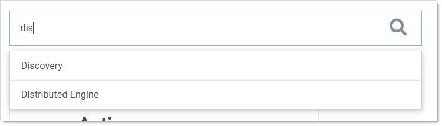
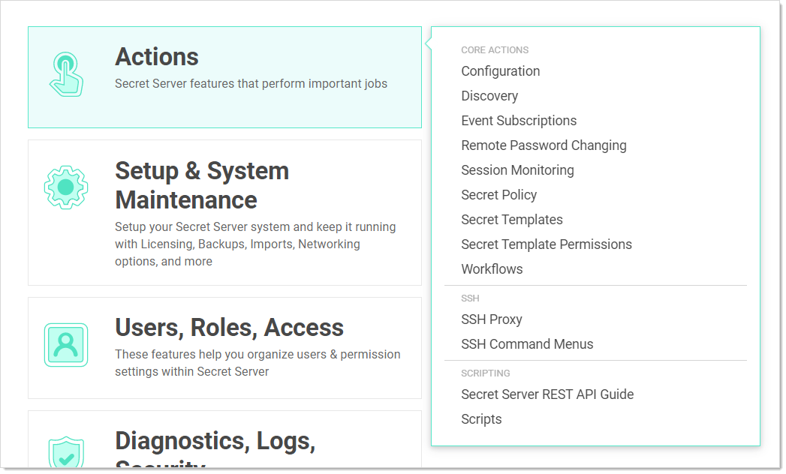

[title]: # (Administration Page)
[tags]: # (XXX)
[priority]: # (20)

# Administration Page

The Admin Page is a control panel for administering SS. You access it by clicking the Admin button on the dashboard menu and selecting See All from the list.

> **Note:** The most commonly sought items appear in the same list, so you can go directly to them without having to go to the Admin page.

**Figure:** Admin Page (Simplified View)

With it, you can quickly and easily find administration controls in several ways:

- **Text Search:** You can search for a concept, configuration, or component by typing a search term in the search text box. The text box automatically suggests items as you type:

  

  Once you see the item you desire, you simply click and you are brought to that page.

- **Topic button:** You can click one of the large buttons to see a list of related items:

  

  Once you see the item you desire, you simply click it, and you are brought to that page.

- **Views:** You have three views to choose from, which you set by clicking the view link. The link text states the current view. The views are:

  - Simplified View: The large, clickable buttons.

  - Alphabetized List: A text list of the available items:

    

  - Category: A text list of the available items bunched by category:

    
