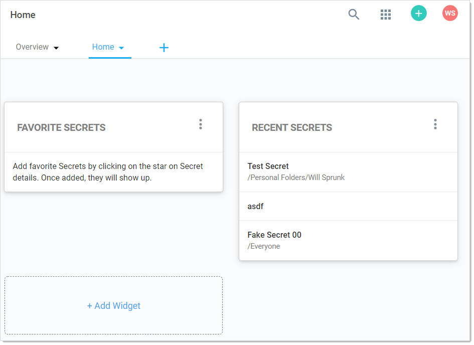

[title]: # (Application Dashboard)
[tags]: # (Dashboard, Widget)
[priority]: # (40)

# Application Dashboard

The SS Dashboard is the main page for searching and viewing secrets:

## Home Tab

By default, it contains the Favorite Secrets, Recent Secrets, and + Add Widget widgets (function boxes). You can add these widgets:

- Expired Secrets
- Out-of-Sync Secrets
- Reports
- Request Management

### Dashboard Widgets

#### Widget Types

**Table: Dashboard Widgets**

| Widget                                                       | Description                                                  |
| ------------------------------------------------------------ | ------------------------------------------------------------ |
| Expired&nbsp;Secrets&nbsp;&nbsp;&nbsp;&nbsp;&nbsp;&nbsp;&nbsp;&nbsp;&nbsp;&nbsp; | Displays expired secrets.                                    |
| Favorite Secrets                                             | Displays secrets marked as favorites.                        |
| Out-of-Sync Secrets                                          | Displays secrets that are out-of-sync—the heartbeat or RPC have failed. |
| Recent Secrets                                               | Displays the secrets viewed most recently.                   |
| Reports                                                      | Displays a report. Click the **Report Category** list to select a report from the drop-down menu. One report can be displayed per widget. Click the title of the report to navigate to the Report View page. |
| Request Management                                           | Displays any requests pending for the logged in user.        |
| + Add Widget                                                 | When clicked, adds a widget that is not currently displayed to the Dashboard. This widget's function is duplicated automatically when you add a new Dashboard tab. You cannot remove this widget. |

> **Note:** The Search and Browse widgets cannot be rearranged. They always remain in the top left region of the tab.

#### Managing Widgets

The following operations are available (by clicking the  icon) for managing widgets:

- **Delete:** Hide the widget.

- **Refresh:** Update the information in the widget. This is not available for all widgets.

## Overview Tab

The Overview tab provides several widgets for getting a quick understanding of your SS installation:

- **Active Monitoring Sessions:** Your current monitored sessions. See [Session Recording](#session-recording).
- **Approvals:** Your current in-process approvals. See [Secret Access Requests](#secret-access-requests).
- **Heartbeat Status:** A graphic of the current status of your heartbeats: success, pending, or failed. When you click on one of the statuses, you are brought to a report page for that status. For example, **Reports \> Secrets Failing Heartbeat**. When you click the **Current** link , you are brought to the **Reports \> Heartbeat Status by Day** page. See [Heartbeats: Automatically Testing Secret Credentials](#Heartbeats:-Automatically-Testing-Secret-Credentials)
- **Most Used Secrets:** A table of the most recently accessed secrets, listed by date and folder.
- **Password Rotation:** The state of your current password rotations. When you click the **Today** link you are brought to the **Reports \> RPC by Day** report page. See [Remote Password Changing](#remote-password-changing-(rpc)).

> **Note:** To see an overview of incoming system and subscription alerts, see the [Inbox](#alert-notification-center-(Inbox)).
