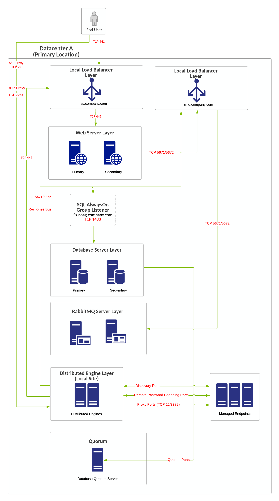
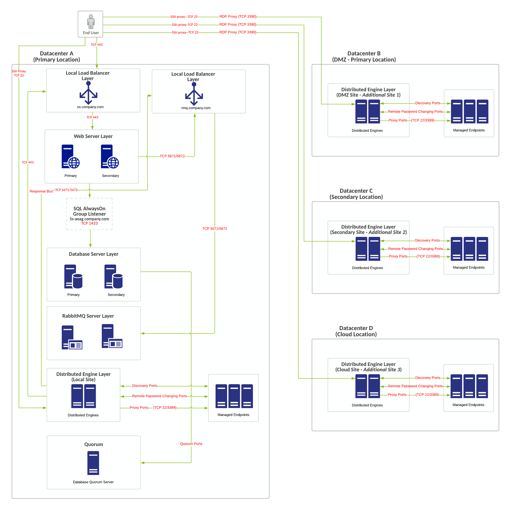
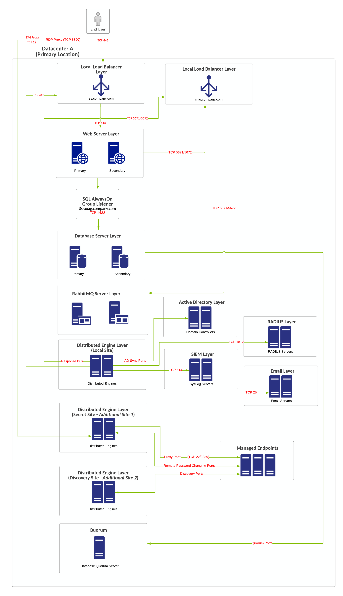
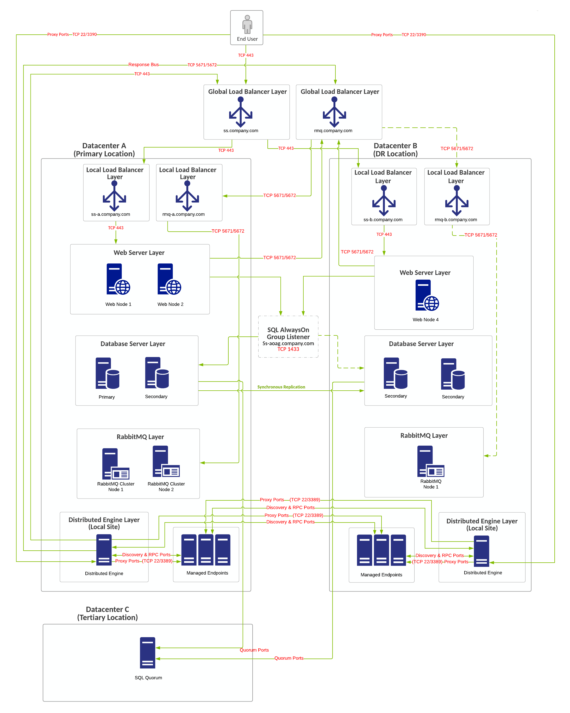
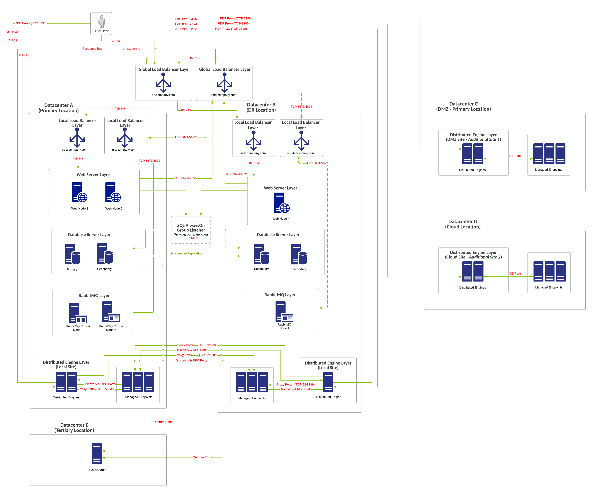
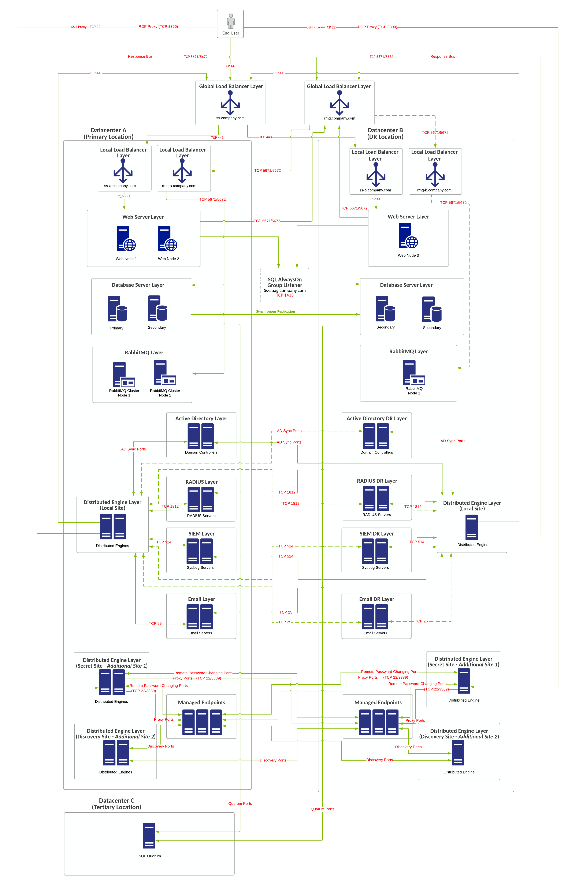
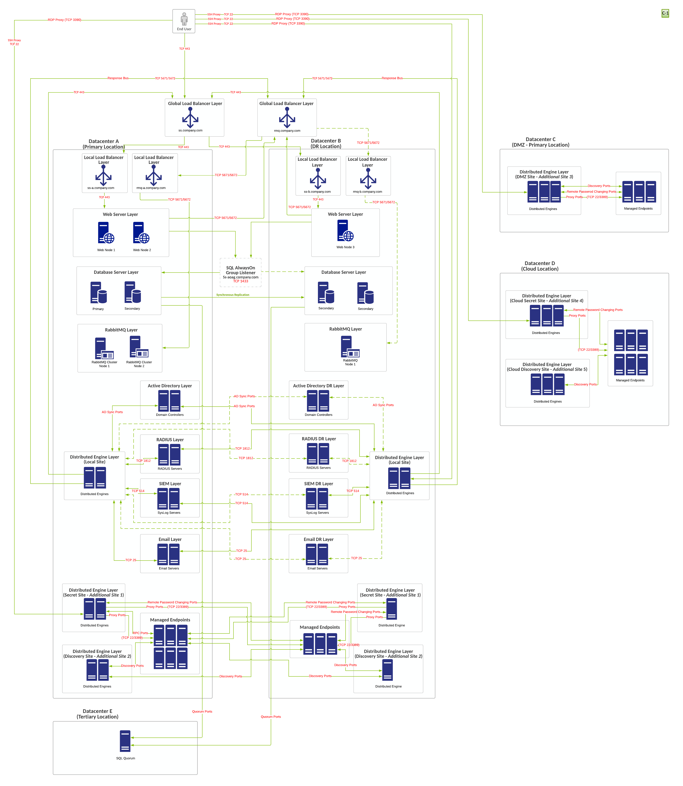

[title]: # (Distributed Engine Example Architectures)
[tags]: # (Secret Server, Architecture)
[priority]: # (1000)

# Distributed Engine Example Architectures

> **Note:** If you are a current customer with support hours for Thycotic Professional Services, you can discuss any of these diagrams in detail with one of our Professional Services Solutions Architects.

This reference architecture is our best practice architecture for Secret Server (SS) Distributed Engines (DEs). The two most common use cases are: 

- Distributing work across firewalled networks using the fewest ports possible to help ensure a better network security model 

- Separating work tasks away from the Web servers and placing the processing work on other dedicated servers within the Thycotic infrastructure to improve overall performance

Both of these use cases are covered with minimal and best high-availability solutions. The final reference architecture in this collection combines both uses cases with a high availability solution.

## Minimal HA Single-Site Deployment with No Distributed Engines

### Overview

- Minimum-cost HA configuration.

- No shared storage requirement.

- DEs for HA of local site, which is included with all licensing models.

- Single-site design with no native DR capacity. DR can be provided by VM replication if subnets are spanning locations, otherwise re-IP + DNS changes may be necessary.

- Recommended for further SS design variations.

### Requirements

#### General

- SQL Server Standard Edition with basic availability group configuration.

- SQL Server 2012 R2+.

- Use Windows authentication for SQL Server.

- You can use local load balancers for Web server nodes.

- We require a file-share witness for SQL quorum voting for SQL to stay online during single-node unplanned failures.

- [Distributed Engine Ports](../../networking/secret-server-ports/index.md).

- [Distributed Engine Proxy Configuration](../../networking/ssh-proxy-configuration/index.md).

- [SQL Quorum Ports](http://dsfnet.blogspot.com/2013/04/windows-server-clustering-sql-server.html).

#### Virtual IP or Computer

- ss.company.com: 443 (load balancer)

- ss.company.com: 5671 or 5672 (load balancer)

- ss-aoag.company.com: 1433 (created as part of SQL AlwaysOn configuration). Computer object or virtual IP.

- Windows Failover Cluster Object (created as part of Windows failover clustering configuration):

  - Computer object or virtual IP

  - One additional virtual IP address may be required as part of Windows failover cluster for single-site design for the network configuration of the failover cluster.

### Diagram

> **Note:** The reference number for this diagram is A1.

**Figure:** Minimal HA Single-Site Deployment with No Distributed Engines

## Minimal HA Single-Site Deployment with Distributed Engines for Additional Datacenters

### Overview

- Minimum-cost HA configuration.

- No shared storage requirement.

- RabbitMQ installed on separate dedicated servers.

- Two DEs for HA of local site, which is included with all licensing models.

- Distributed Engine licenses required for this design: 

  - Three DE site licenses added (for DMZ, secondary, and cloud Locations), one DE included per site.

  - One DE per site license added, which allows for second DE in each DE site for HA.

- All DEs require callback communication to Web servers  (TCP 443) and to the RabbitMQ response bus (TCP 5672 or 5671). This is pictured with one set of distributed engines (local site) but is not pictured for other DEs to keep the diagram easier to interpret.

- Recommended for further SS design variations.

### Requirements

#### General

- SQL Server Standard Edition with basic availability group configuration.

- SQL Server 2012 R2+.

- Use Windows authentication for SQL Server.

- You can use local load balancers for Web server nodes.

- We require a file-share witness for SQL quorum voting for SQL to stay online during single-node unplanned failures.

- [Distributed Engine Ports](../../networking/secret-server-ports/index.md).

- [Distributed Engine Proxy Configuration](../../networking/ssh-proxy-configuration/index.md).

- [SQL Quorum Ports](http://dsfnet.blogspot.com/2013/04/windows-server-clustering-sql-server.html).

#### Virtual IP or Computer

- ss.company.com: 443 (load balancer)

- ss.company.com: 5671 or 5672 (load balancer)

- ss-aoag.company.com: 1433 (created as part of SQL AlwaysOn configuration). Computer object or virtual IP.

- Windows Failover Cluster Object (created as part of Windows failover clustering configuration):

  - Computer object or virtual IP

  - One additional virtual IP address may be required as part of Windows failover cluster for single-site design for the network configuration of the failover cluster.

### Diagram

> **Note:** The reference number for this diagram is A2.

**Figure:** Minimal HA Single-Site Deployment with Distributed Engines for Additional Datacenters

## Minimal HA Single-Site Deployment with Distribute Engines for Separate Work Tasks

### Overview

- Minimum-cost HA configuration.

- No shared storage requirement.

- RabbitMQ installed on separate dedicated servers.

- Two DEs for HA of local site, which is included with all licensing models.

- Local site for AD or LDAP, SMTP, SIEM, or RADIUS integration.

- Distributed Engine licenses required for this design: 

  - Two DE site licenses added (for secret and discovery tasks), one DE included per site.

  - One DE per site license added, which allows for second DE in each DE site for HA.

- Single-site design with no native DR capacity. DR can be provided by VM replication if subnets are spanning locations, otherwise re-IP + DNS changes may be necessary.

- All DEs require callback communication to Web servers  (TCP 443) and to the RabbitMQ response bus (TCP 5672 or 5671). This is pictured with one set of distributed engines (local site) but is not pictured for other DEs to keep the diagram easier to interpret.

- Recommended for further SS design variations.

### Requirements

#### General

- SQL Server Standard Edition with basic availability group configuration.

- SQL Server 2012 R2+.

- Use Windows authentication for SQL Server.

- You can use local load balancers for Web server nodes.

- We require a file-share witness for SQL quorum voting for SQL to stay online during single-node unplanned failures.

- [Distributed Engine Ports](../../networking/secret-server-ports/index.md).

- [Distributed Engine Proxy Configuration](../../networking/ssh-proxy-configuration/index.md).

- [SQL Quorum Ports](http://dsfnet.blogspot.com/2013/04/windows-server-clustering-sql-server.html).

#### Virtual IP or Computer

- ss.company.com: 443 (load balancer)

- ss.company.com: 5671 or 5672 (load balancer)

- ss-aoag.company.com: 1433 (created as part of SQL AlwaysOn configuration). Computer object or virtual IP.

- Windows Failover Cluster Object (created as part of Windows failover clustering configuration):

  - Computer object or virtual IP

  - One additional virtual IP address may be required as part of Windows failover cluster for single-site design for the network configuration of the failover cluster.

### Diagram

> **Note:** The reference number for this diagram is A3.

**Figure:** Minimal HA Single-Site Deployment with Distribute Engines for Separate Work Tasks

## Best HA Multi-Site Deployment with No Distributed Engines

### Overview

- Higher-cost HA configuration.

- No shared storage requirement.

- RabbitMQ installed on dedicated systems.

- Uses a single RabbitMQ site connector design.

- Two DEs for HA of local site, which is included with all licensing models.

- Local site for AD or LDAP, SMTP, SIEM, or RADIUS integration.

- DR site acts as temporary site only with no intention for long-term usage—down DR site services can incur system downtime.

- Secondary SQL Server node at primary location is for planned failover (such as patching). Secondary SQL Server node in DR site is for unplanned failover.

- DE in DR location can be in passive/standby mode.

- DEs in primary and DR Locations require connectivity to managed endpoints in both locations.

- Can accommodate automatic failover with synchronous replication (30 ms or less latency between SQL Server DB nodes).

- Global load balancers for Web and RMQ configurations are configured to force all traffic to primary site unless primary site is down (priority group activation).

- All DEs require callback communication to Web servers  (TCP 443) and to the RabbitMQ response bus (TCP 5672 or 5671). This is pictured with one set of distributed engines (local site) but is not pictured for other DEs to keep the diagram easier to interpret.

- Recommended for further SS design variations.

### Requirements

#### General

- SQL Server Standard Edition with basic availability group configuration.

- SQL Server 2012 R2+.

- Use Windows authentication for SQL Server.

- Global and local load balancers.

- We require a file-share witness for SQL quorum voting for SQL to stay online during single-node unplanned failures.

- [Distributed Engine Ports](../../networking/secret-server-ports/index.md).

- [Distributed Engine Proxy Configuration](../../networking/ssh-proxy-configuration/index.md).

- [SQL Quorum Ports](http://dsfnet.blogspot.com/2013/04/windows-server-clustering-sql-server.html).

#### Virtual IP or Computer

- ss.company.com: 443 and rmq.company.com: 5671 or 5672 (two virtual IPs—global load balancer).

- ss-a.company.com: 443 and ss-b.company.com:443 (two virtual IPs—local load balancer).

- rmq-a.company.com: 5671 or 5672 (load balancer) and rmq-b.company.com: 5671 or 5672 (two virtual IPs—local load balancer).

- ss-aoag.company.com: 1433 (created as part of SQL AlwaysOn configuration). Computer object or virtual IP. May require two virtual IP addresses.

- Windows Failover Cluster Object (created as part of Windows failover clustering configuration):

  - Computer object or virtual IP

  - One additional virtual IP address may be required as part of Windows failover cluster for single-site design for the network configuration of the failover cluster.

### Diagram

> **Note:** The reference number for this diagram is B1.

**Figure:** Best HA Multi-Site Deployment with No Distributed Engines

## Best HA Multi-Site Deployment with Distributed Engines for Additional Datacenters

### Overview

- Higher-cost HA configuration.

- No shared storage requirement.

- RabbitMQ installed on dedicated systems.

- Uses a single RabbitMQ site connector design.

- Two DEs for HA of local site, which is included with all licensing models.

- Distributed Engine licenses required for this design: 

  - Two DE site licenses added (for DMZ and cloud locations), one DE included per site.

  - One DE per site license added, which allows for second DE in each DE site for HA and a third one for the local site (added to the primary location).

- DR site acts as temporary site only with no intention for long-term usage—down DR site services can incur system downtime.

- Secondary SQL Server node at primary location is for planned failover (such as patching). Secondary SQL Server node in DR site is for unplanned failover.

- DE in DR location can be in passive/standby mode.

- DEs in primary and DR Locations require connectivity to managed endpoints in both locations.

- Can accommodate automatic failover with synchronous replication (30 ms or less latency between SQL Server DB nodes).

- Global load balancers for Web and RMQ configurations are configured to force all traffic to primary site unless primary site is down (priority group activation).

- All DEs require callback communication to Web servers  (TCP 443) and to the RabbitMQ response bus (TCP 5672 or 5671). This is pictured with one set of distributed engines (local site) but is not pictured for other DEs to keep the diagram easier to interpret.

- Recommended for further SS design variations.

### Requirements

#### General

- SQL Server Enterprise Edition with availability group configuration.

- SQL Server 2012 R2+.

- Use Windows authentication for SQL Server.

- Global and local load balancers.

- We require a file-share witness for SQL quorum voting for SQL to stay online during single-node unplanned failures.

- [Distributed Engine Ports](../../networking/secret-server-ports/index.md).

- [Distributed Engine Proxy Configuration](../../networking/ssh-proxy-configuration/index.md).

- [SQL Quorum Ports](http://dsfnet.blogspot.com/2013/04/windows-server-clustering-sql-server.html).

#### Virtual IP or Computer

- ss.company.com: 443 and rmq.company.com: 5671 or 5672 (two virtual IPs—global load balancer).

- ss-a.company.com: 443 and ss-b.company.com: 443 (two virtual IPs—local load balancer).

- rmq-a.company.com: 5671 or 5672 (load balancer) and rmq-b.company.com: 5671 or 5672 (two virtual IPs—local load balancer).

- ss-aoag.company.com: 1433 (created as part of SQL AlwaysOn configuration). Computer object or virtual IP. May require two virtual IP addresses.

- Windows Failover Cluster Object (created as part of Windows failover clustering configuration):

  - Computer object or virtual IP

  - Two additional virtual IP addresses may be required as part of Windows failover cluster for single-site design for the network configuration of the failover cluster, representing both networks at each site.

### Diagram

> **Note:** The reference number for this diagram is B2.

**Figure:** Best HA Multi-Site Deployment with Distributed Engines for Additional Datacenters

## Best HA Multi-Site Deployment with Distributed Engines for Separate Work Tasks

### Overview

- Higher-cost HA/DR configuration.

- No shared storage requirement.

- RabbitMQ clusters installed on dedicated systems.

- Uses a single RabbitMQ site connector design.

- Two DEs for HA of local site, which is included with all licensing models.

- Local site for AD or LDAP, SMTP, SIEM, or RADIUS integration.

- Distributed Engine licenses required for this design: 

  - Two DE site licenses added (for secret and discovery tasks), one DE included per site.

  - One DE per site license added, which allows for second DE in each DE site for HA and a third one for the local site (added to the primary location).

- DR site acts as temporary site only with no intention for long-term usage—down DR site services can incur system downtime.

- Secondary SQL Server node at primary location is for planned failover (such as patching). Secondary SQL Server node in DR site is for unplanned failover.

- DE in DR location can be in passive/standby mode.

- DEs in primary and DR Locations require connectivity to managed endpoints in both locations.

- Can accommodate automatic failover with synchronous replication (30 ms or less latency between SQL Server DB nodes).

- Global load balancers for Web and RMQ configurations are configured to force all traffic to primary site unless primary site is down (priority group activation).

- All DEs require callback communication to Web servers  (TCP 443) and to the RabbitMQ response bus (TCP 5672 or 5671). This is pictured with one set of distributed engines (local site) but is not pictured for other DEs to keep the diagram easier to interpret.

- Recommended for further SS design variations.

### Requirements

#### General

- SQL Server Enterprise Edition with availability group configuration.

- SQL Server 2012 R2+.

- Use Windows authentication for SQL Server.

- Global and local load balancers.

- We recommend a file-share witness for SQL quorum voting. We recommend a cloud witness or DFSR share for witness configuration. This can handle the failure of both SQL Server nodes in the primary location.

- [Distributed Engine Ports](../../networking/secret-server-ports/index.md).

- [Distributed Engine Proxy Configuration](../../networking/ssh-proxy-configuration/index.md).

- [SQL Quorum Ports](http://dsfnet.blogspot.com/2013/04/windows-server-clustering-sql-server.html).

#### Virtual IP or Computer

- ss.company.com: 443 and rmq.company.com: 5671 or 5672 (two virtual IPs—global load balancer).

- ss-a.company.com: 443 and ss-b.company.com: 443 (two virtual IPs—local load balancer).

- rmq-a.company.com: 5671 or 5672 (load balancer) and rmq-b.company.com: 5671 or 5672 (two virtual IPs—local load balancer).

- ss-aoag.company.com: 1433 (created as part of SQL AlwaysOn configuration). Computer object or virtual IP. May require two virtual IP addresses.

- Windows Failover Cluster Object (created as part of Windows failover clustering configuration):

  - Computer object or virtual IP

  - Two additional virtual IP addresses may be required as part of Windows failover cluster for single-site design for the network configuration of the failover cluster, representing both networks at each site.

### Diagram

> **Note:** The reference number for this diagram is B3.

**Figure:** Best HA Multi-Site Deployment with Distributed Engines for Separate Work Tasks

## Best HA Multi-Site Deployment with Distributed Engines for Additional Datacenters with Separate Work Tasks

### Overview

- Higher-cost HA/DR configuration.

- No shared storage requirement.

- RabbitMQ clusters installed on dedicated systems.

- Uses a single RabbitMQ site connector design.

- Two DEs for HA of local site, which is included with all licensing models.

- Local site for AD or LDAP, SMTP, SIEM, or RADIUS integration.

- Distributed Engine licenses required for this design: 

  - Five DE site licenses added (for primary secret and discovery tasks, DMZ site, and cloud secret and discovery tasks), one DE included per site.

  - Two DE per site licenses added, which allows for second DE in each DE site for HA and a third one for the local site (added to the primary and DR locations).

- DR site acts as temporary site only with no intention for long-term usage—down DR site services can incur system downtime.

- Secondary SQL Server node at primary location is for planned failover (such as patching). Secondary SQL Server node in DR site is for unplanned failover.

- DE in DR location can be in passive/standby mode.

- DEs in primary and DR Locations require connectivity to managed endpoints in both locations.

- Can accommodate automatic failover with synchronous replication (30 ms or less latency between SQL Server DB nodes).

- Global load balancers for Web and RMQ configurations are configured to force all traffic to primary site unless primary site is down (priority group activation).

- All DEs require callback communication to Web servers  (TCP 443) and to the RabbitMQ response bus (TCP 5672 or 5671). This is pictured with one set of distributed engines (local site) but is not pictured for other DEs to keep the diagram easier to interpret.

- Recommended for further SS design variations.

### Requirements

#### General

- SQL Server Enterprise Edition with availability group configuration.

- SQL Server 2012 R2+.

- Use Windows authentication for SQL Server.

- Global and local load balancers.

- We recommend a file-share witness for SQL quorum voting. We recommend a cloud witness or DFSR share for witness configuration. This can handle the failure of both SQL Server nodes in the primary location.

- [Distributed Engine Ports](../../networking/secret-server-ports/index.md).

- [Distributed Engine Proxy Configuration](../../networking/ssh-proxy-configuration/index.md).

- [SQL Quorum Ports](http://dsfnet.blogspot.com/2013/04/windows-server-clustering-sql-server.html).

#### Virtual IP or Computer

- ss.company.com: 443 and rmq.company.com: 5671 or 5672 (two virtual IPs—global load balancer).

- ss-a.company.com: 443 and ss-b.company.com: 443 (two virtual IPs—local load balancer).

- rmq-a.company.com: 5671 or 5672 (load balancer) and rmq-b.company.com: 5671 or 5672 (two virtual IPs—local load balancer).

- ss-aoag.company.com: 1433 (created as part of SQL AlwaysOn configuration). Computer object or virtual IP. May require two virtual IP addresses.

- Windows Failover Cluster Object (created as part of Windows failover clustering configuration):

  - Computer object or virtual IP

  - Two additional virtual IP addresses may be required as part of Windows failover cluster for single-site design for the network configuration of the failover cluster, representing both networks at each site.

### Diagram

> **Note:** The reference number for this diagram is C1.

**Figure:** Best HA Multi-Site Deployment with Distributed Engines for Additional Datacenters with Separate Work Tasks

