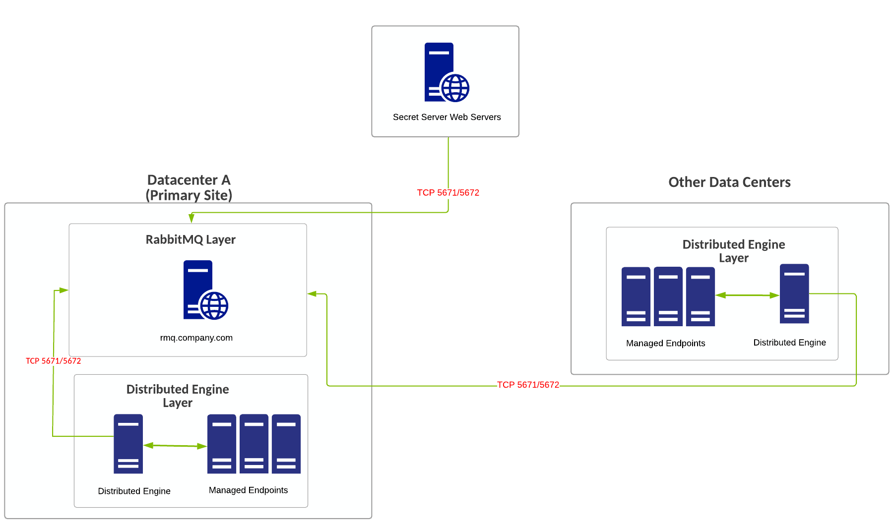
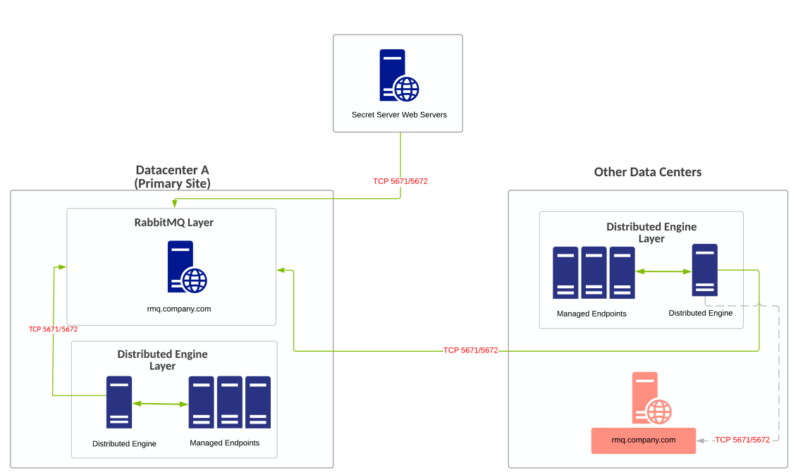
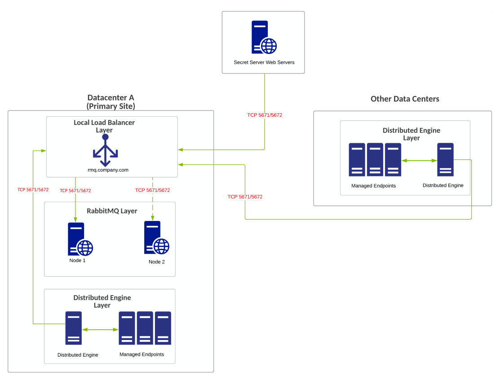
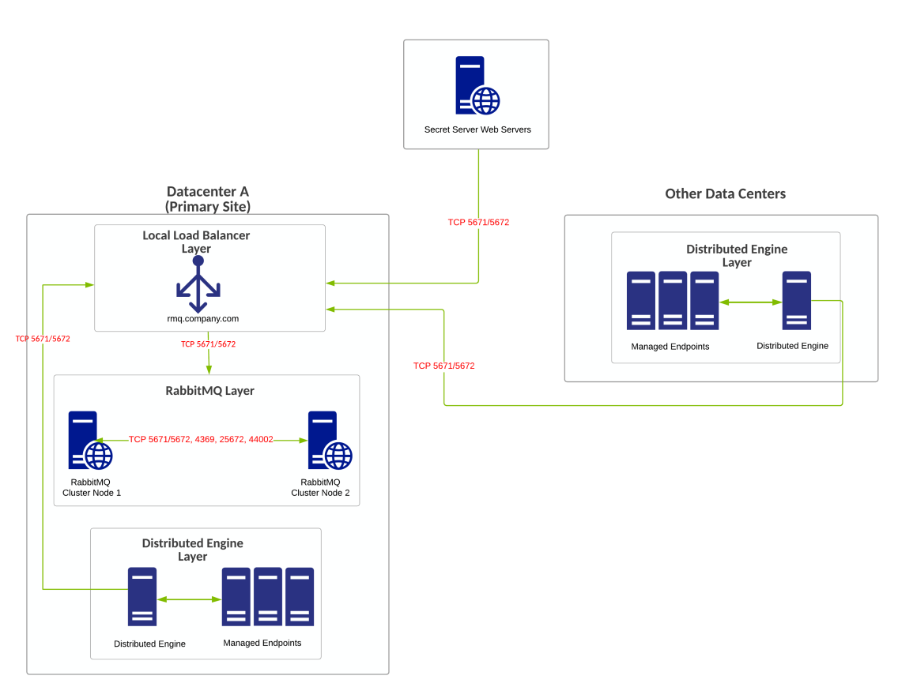
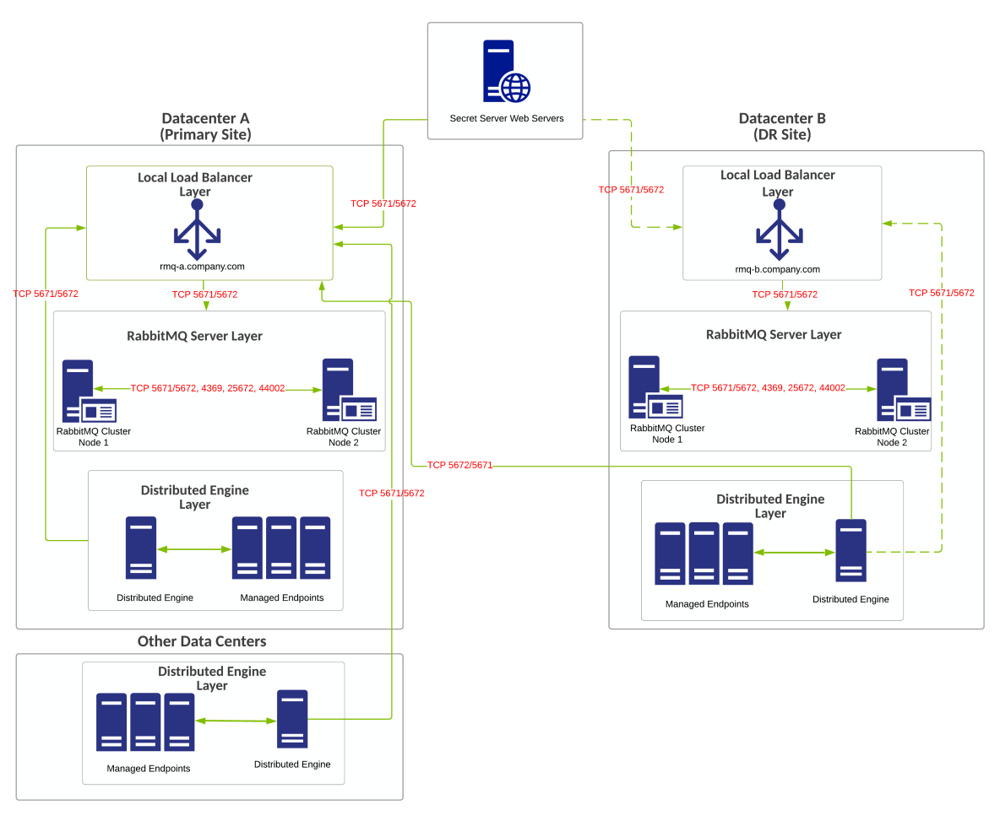
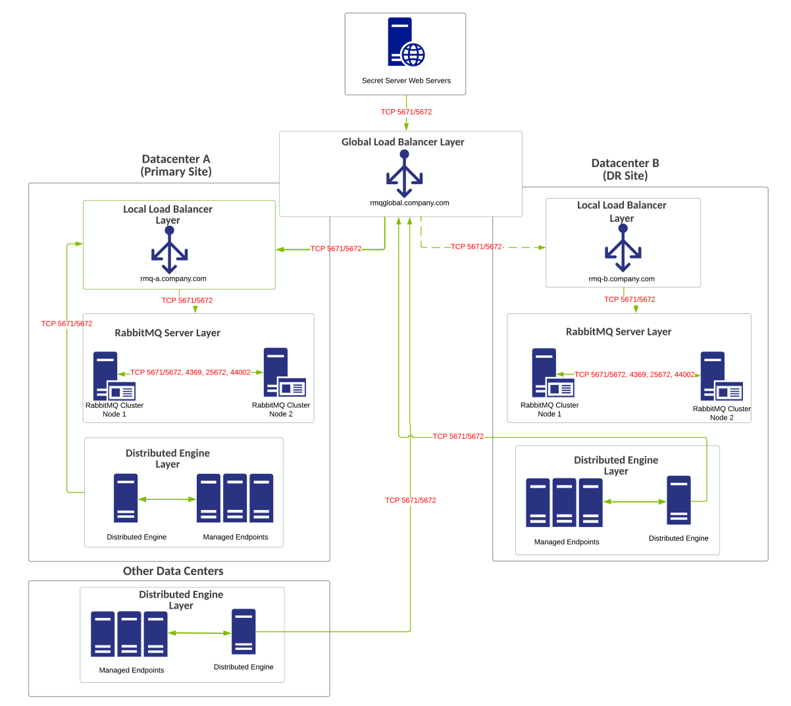

[title]: # (RabbitMQ Example Architectures)
[tags]: # (RabbitMQ, Architecture)
[priority]: # (1000)

# RabbitMQ Example Architectures

> **Note:** If you are a current customer with support hours for Thycotic Professional Services, you can discuss any of these diagrams in detail with one of our Professional Services Solutions Architects.

## Basic Single-Site Deployment

### Overview

- This is the lowest cost and most simple option.
- No high-availability (HA) design.
- No failover capability of RabbitMQ functions in a DR site.
- Distributed engines communicate to SS over callback ports (typically TCP 443, which is not shown in the diagram).
- RabbitMQ traffic is set via static DNS entry and communicates by TCP port 5671 or 5672 (do not use if using TLS).
- All Sites connect to one site connector in SS.

### Requirements

- Cross-data-center communication between DEs and RabbitMQ
- Does not require the creation of RabbitMQ policies, which are based on input from Professional Services.

### Diagram

> **Note:** The reference number for this diagram is A.

**Figure:** Basic Single-Site Deployment

## Basic Multi-Site Deployment

### Overview

- This is the basic single-site deployment plus a hot standby.
- No HA design.
- Hot standby of RabbitMQ for DR.
- Distributed engines communicate to SS over callback ports (typically TCP 443, which is not shown in the diagram).
- RabbitMQ traffic is set via static DNS entry and communicates by TCP port 5671 or 5672 (do not use if using TLS). You can use a CNAME record and update the record during failover.
- All Sites connect to one site connector in SS.

### Requirements

- Cross-data-center communication between DEs and RabbitMQ.
- Does not require the creation of RabbitMQ policies, which are based on input from Professional Services.

### Diagram

> **Note:** The reference number for this diagram is B.

**Figure:** Basic Multi-Site Deployment

## Minimum HA Multi-Site Deployment with Independent Nodes

### Overview

- Minimum HA RabbitMQ design.
- Independent RabbitMQ nodes under load balancer configuration.
- No failover capability of RabbitMQ functions in DR site.
- Distributed engines communicate to SS over callback ports (typically TCP 443, which is not shown in the diagram).
- RabbitMQ load balancer configuration only sends traffic to only node one unless it is down, then then it sends traffic to node two. Communicates by TCP port 5671 or 5672 (do not use if using TLS) . This provides localized high availability for patching and more.
- Singular nodes built as part of a load balancer configuration between multiple data centers is also a design possibility with the same type of load balancer configuration mentioned above. Do so will lose localized HA of RabbitMQ.
- All Sites connect to one site connector in Secret Server (RabbitMQ FQDN).

### Requirements

- Cross-data-center communication between DEs and RabbitMQ.
- Does not require the creation of RabbitMQ policies, which are based on input from Professional Services.
- Local load balancer.

### Diagram

> **Note:** The reference number for this diagram is C.

**Figure:** Minimum HA Multi-Site Deployment with Independent Nodes

## Minimum HA Multi-Site Deployment with Cluster

### Overview

- Minimum HA RabbitMQ design
- No failover capability of RabbitMQ functions in DR site.
- Distributed engines communicate to SS over callback ports (typically TCP 443, which is not shown in the diagram).
- RabbitMQ traffic is set to round-robin through load balancers to RabbitMQ nodes in cluster. Communicates by TCP port 5671 or 5672 (do not use if using TLS).
- All Sites connect to one site connector in Secret Server (RabbitMQ FQDN).

### Requirements

- Cross-data-center communication between DEs and RabbitMQ.
- Requires the creation of RabbitMQ policies, which are based on input from Professional Services.
- Local load balancer.

### Diagram

> **Note:** The reference number for this diagram is D.

**Figure:** Minimum HA Multi-Site Deployment with Cluster

## Average HA/DR Multi-Site Deployment

### Overview

- RabbitMQ clusters in multiple locations (typically primary and secondary DR site).
- Distributed engines communicate to SS over callback ports (typically TCP 443, which is not shown in the diagram).
- RabbitMQ traffic for each local load balancer configuration is set to round-robin traffic through load balancer to RabbitMQ nodes in each respective cluster. Communicates by TCP port 5671 or 5672 (do not use if using TLS).
- Two site connectors configured in SS. This is a good design for manual failover between the primary and disaster recovery site but will require manual changes within SS for full functionality to resume in DR. The distributed engines global configuration has only the option for one response bus. This implies that traffic may be sent to one RabbitMQ cluster but will be processed via response by the primary data center RabbitMQ cluster.
- The dotted line traffic for the DR distributed engines back to the RabbitMQ cluster indicates the down primary data center being down and the DR data center being online. In this case, this traffic would become active If the primary site is down. Any functions or secrets in SS assigned explicitly to that site connector will not function without reassigning those functions to the other site connector and RabbitMQ cluster.

### Requirements

- Requires the creation of RabbitMQ policies, which are based on input from Professional Services.
- Multiple load balancers.

### Diagram

> **Note:** The reference number for this diagram is E.

**Figure:** Average HA/DR Multi-Site Deployment

## Best HA/DR Multi-Site Deployment

### Overview

- RabbitMQ clusters are in multiple locations (typically primary and secondary DR site).
- Distributed engines communicate to SS over callback ports (typically TCP 443, which is not shown in the diagram).
- RabbitMQ traffic is set to force all traffic to the primary cluster in the primary site, unless the primary site is down. Communication through load balancer is via TCP port 5671 or 5672 (do not use if using TLS).
- Options available for site connector creation or use:
  - Sites and site connectors are intended to be primarily location based.
   - This design is best for situations where you want to localize RabbitMQ traffic and control traffic directly through the load balancer configurations.
- This design is best suited for true DR situations where we assume when the primary location is down or offline that the entire data center is also.
- If the primary location is only partially down (RabbitMQ only is offline), it is possible secrets or features in SS assigned to that specific site connector will not function correctly.

Site connector options:

- Three site connectors and three or more sites configured in SS to localize RabbitMQ traffic for each respective location-based RabbitMQ cluster:
  - One site connector for the global load balancer URL (Used for all other locations/sites).
   - One site connector for primary site.
   - One site connector for secondary (DR) site.
- Other data center's distributed engines typically connect to the primary site RabbitMQ cluster global load balancer FQDN/VIP.
- Alternatively, if traffic isolation is not as important, you can have one site connector and all sites point to it. Cross-data-center communication between DEs and all RabbitMQ clusters is required. A one-site connector design will eliminate application-side changes during failover.
- Traffic should be forced to RabbitMQ cluster or nodes in the primary site for proper functionality.

### Requirements

- Require the creation of RabbitMQ policies, which are based on input from Professional Services.
- Multiple load balancers.
- Global load balancers.

### Diagram

> **Note:** The reference number for this diagram is F.

**Figure:** Best HA/DR Multi-Site Deployment

