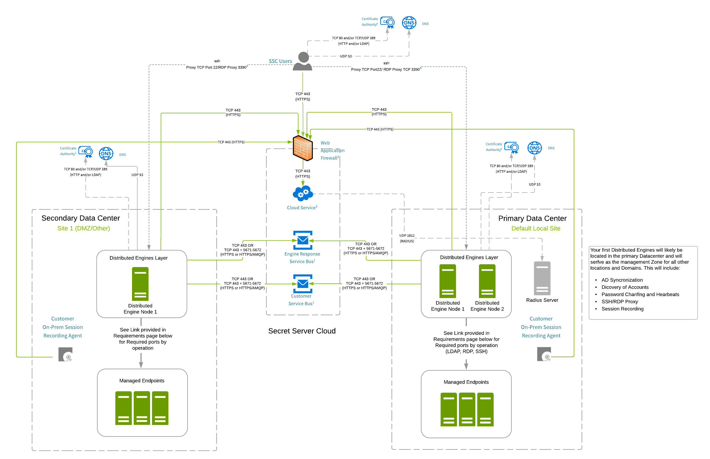

[title]: # (SSC Customer Example Architectures)
[tags]: # (Secret Server Cloud, Architecture,example)
[priority]: # (1000)

# Secret Server Cloud Customer Example Architectures

> **Note:** If you are a current customer with support hours for Thycotic Professional Services, you can discuss any of these diagrams in detail with one of our Professional Services support architects.

## Multi-Site with ASR Agents Example Architecture

**Figure:** Multi-site with ASR Agents Example Architecture

>**Note:** This design is fully supported by Thycotic.

> **Note:** Arrows indicate the direction of initial connection.

> **Note:** Reference architecture requirements:
>
> - Ports for accessing, managing and discovering end-points must have the required ports opened between the site DEs the appropriate devices. Please see [Ports Used by Secret Server](../../networking/secret-server-ports/index.md).
> - All DE servers must run on Windows Server 2012 to 2019.
> - Distributed Engines servers must have 4 cores and 4 GB RAM. We encourage increasing CPUs before RAM to improve DE efficiency.

> **Note:** Your first distributed engines will likely be located in the primary datacenter and will
> serve as the management zone for all other locations and domains. This includes:
>
> - AD synchronization
> - Account discovery
> - Password changing and heartbeats
> - SSH and RDP proxy
> - Session recording

## Details for All Architectures

### 1: Service Buses

IP Address allowlisting is not necessary unless outbound firewall rules are in place. If IP allowlisting is necessary, please contact [Thycotic Support](../../support/index.md) to obtain the shared engine response service bus and your dedicated customer service bus hostnames.  The TCP port requirement is based on the transport type configured in the distributed engine settings.  The default is Web sockets, which requires TCP 443. If the AMQP option is selected within the application, TCP 5671/5672 ports are also required.

### 2: Web Application Firewall (WAF)

IP Address allowlisting is not necessary unless outbound firewall rules are in place. Public IP is based on geographical location.

IP addresses for all regions: 45.60.38.37, 45.60.40.37, 45.60.32.37, 45.60.34.37, 45.60.36.37, and 45.60.104.37.

### 3: Content Delivery Network (CDN)

IP Address allowlisting is not necessary unless outbound firewall rules are in place. Public IP is based on geographical location.

Edge nodes for all regions: [Microsoft Edge Node List](https://docs.microsoft.com/en-us/rest/api/cdn/edgenodes/list). The edge node type or name is "Standard_Verizon."

### 4: RADIUS

Inbound allowlisting is necessary if RADIUS authentication is configured. IP addresses:

- secretservercloud.com: 40.76.197.147, 40.121.181.52
- secretservercloud.com.au: 20.36.47.199, 20.36.45.106
- secretservercloud.eu: 51.116.228.208, 51.116.228.152
- secretservercloud.com.sg: 137.116.141.200, 137.116.143.17
- secretservercloud.ca 13.88.237.67, 52.228.62.157

### 5: Distributed Engine (DE)

If external clients must be able to connect to internal SSH or RDP endpoints, an SSH proxy can be configured on the DE. Additionally, TCP port 22 needs to be open for inbound connections on the DE server, as well as appropriate configuration to allow inbound connections from the public Internet.

### 6: Certificate CRLs

Allowlisting is not necessary unless outbound firewall rules are in place. If it is necessary, access to CRLs or OSCP endpoints may be required. CRL and OSCP endpoints may differ from customer to customer. To determine the endpoints, review the certificates presented by the:

- Web application firewall
- Customer service bus
- Engine response service bus
- CDN for DE updates

<<<<<<< HEAD:secret-server-cloud/architecture/index.md
>**Note:** Obtaining and reviewing certificates is not within the scope of this document, but you can find resources online, such as [OCSP & CRL and Revoked SSL Certificates](https://www.digicert.com/kb/util/utility-test-ocsp-and-crl-access-from-a-server.htm), which is not owned or maintained by Thycotic.
=======
>**Note:** Obtaining and reviewing certificates is not within the scope of this document, but you can find resources online, such as [OCSP & CRL and Revoked SSL Certificates](https://www.digicert.com/kb/util/utility-test-ocsp-and-crl-access-from-a-server.htm), which is not owned or maintained by Thycotic.
>>>>>>> 193cd5523ae0a812aed775a159aae8133cfa51a0:architecture/secret-server-cloud/customer-examples/index.md
