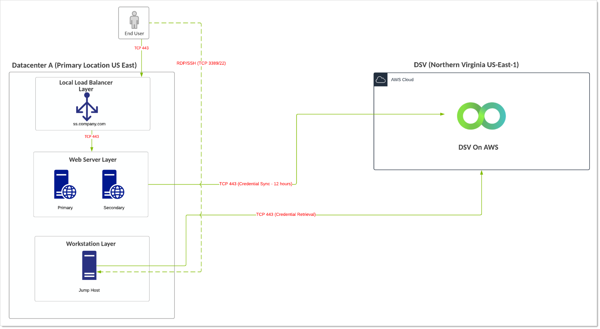
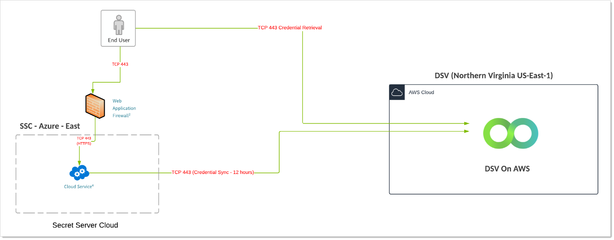
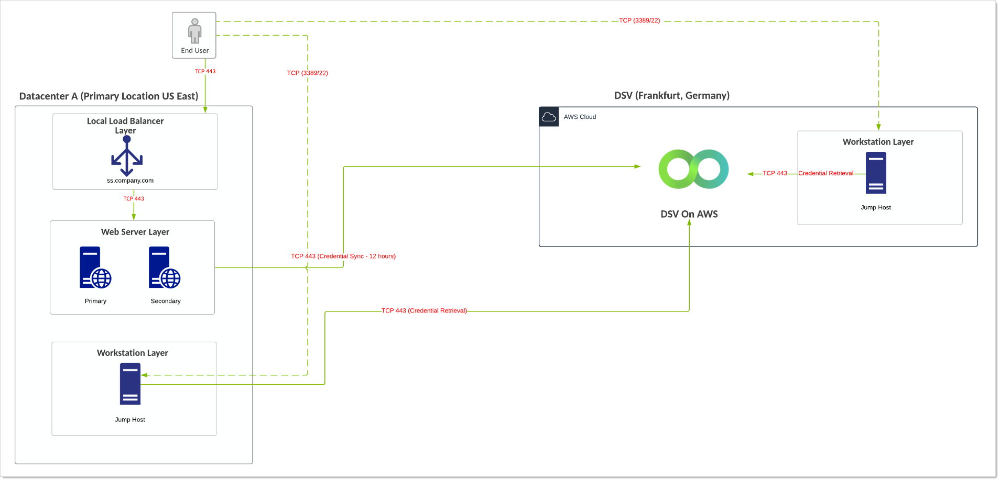
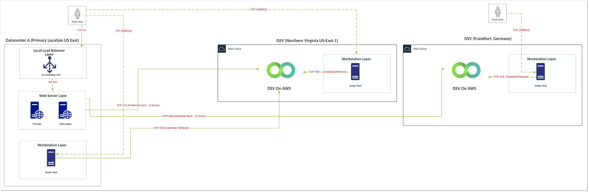

[title]: # (Secret Server and DevOps Secrets Vault Example Architectures)
[tags]: # (DevOps Secrets Vault, Architecture, Integration, DSV)
[priority]: # (1000)

# Secret Server and DevOps Secrets Vault Example Architectures

> **Note:** If you are a current customer with support hours for Thycotic Professional Services, you can discuss any of these diagrams in detail with one of our Professional Services Solutions Architects.

This reference architecture is our best practices for using Thycotic Secret Server (SS) with DevOps Secrets Vault (DSV). You can use DSV with Secret Server On-Premises or Cloud. DevOps Secrets Vault (DSV) is nimble, multi-platform privileged access manager specifically for developers and other IT professionals. So why might you want to integrate it with SS? Customers can use DSV as a native "backup" of critical SS secrets, effectively extending their on-premise instance into the cloud during SS outages. Similarly Secret Server Cloud (SSC) customers can back up their critical secrets to another cloud, effectively extending their SSC instance into another vendor's cloud during SS outages. SSC is hosted in Azure, and DSV is hosted in Amazon Web Services, which has a 99.999% uptime.

> **Note:** We suggest only doing this for critical secrets and not every secret in your environment. Back up critical IT infrastructure secrets, such as those needed if your data centers went down—routers, firewalls, and the like.

We discuss the following scenarios:

- SS on-premises with a single DSV instance (A-1)
- SSC with a single DSV instance (A-2)
- SS on-premises with a single DSV instance in a separate region (B-1)
- SS on-premises with multiple DSV instances in the same or a separate region (C-1)

## Secret Server On-Premises with a Single DSV Instance

### Overview

- Customer is using an on-premise installation of SS installed in physical or private cloud environment and is leveraging a free instance of DSV (Limited to 250 secrets, 2,500 API calls per month).
- When SS is down, user-to-jump-host connectivity becomes active and uses a break-the-glass account to connect to the jump host. The jump host then has the DSV executable available and can retrieve credentials when SS is down.
- DSV SLA is 99.999%.

### Requirements

- SS Premium/Professional/Platinum licensing and DSV Free Edition.
- Each tenant in the SS instance has a settable interval  to check if secrets need to be pushed to DSV again. Once that interval hits (or they use an event pipeline to trigger it), SS checks all the secrets associated to that tenant. Any secret that has had a change since the last time that tenant had the secret pushed to it is pooled. SS authenticates and for each secret it POSTs or PUTs the secret (depending on creation or update).
- The number of requests equals the number of updated tenants (authenticating for each tenant) plus the number of secrets that need updating updated per tenant (updating the secret in DSV).
- Compare the total 2,500 free API calls per month to your number of requests to determine if this fits the “free” DSV licensing model.

### Diagram

> **Note:** The reference for this diagram is A-1.

**Figure:** Secret Server On-Premises with a Single DSV Instance

## Secret Server Cloud with a Single DSV Instance

### Overview

- Customer using an on-premise installation of SS installed in physical or private cloud environment and is leveraging a free instance of DSV (Limited to 250 secrets, 2,500 API calls per month).
- When SS is down, the DSV executable is available and can retrieve credentials when SS is down. This is more convenient but less secure than other options.
- DSV SLA is 99.999%.
- SSC SLA is 99.9%.

### Requirements

- SS Premium/Professional/Platinum licensing and DSV Free Edition.
- Each tenant in the SS instance has a settable interval  to check if secrets need to be pushed to DSV again. Once that interval hits (or they use an event pipeline to trigger it), SS checks all the secrets associated to that tenant. Any secret that has had a change since the last time that tenant had the secret pushed to it is pooled. SS authenticates and for each secret it POSTs or PUTs the secret (depending on creation or update).
- The number of requests equals the number of updated tenants (authenticating for each tenant) plus the number of secrets that need updating updated per tenant (updating the secret in DSV).
- Compare the total 2,500 free API calls per month to your number of requests to determine if this fits the “free” DSV licensing model.

### Diagram

> **Note:** The reference for this diagram is A-2.

**Figure:** Secret Server Cloud with a Single DSV Instance

## Secret Server On-Premises with a Single DSV Instance in a Separate Region

### Overview

- Customer is using an on-premise installation of SS installed in a physical or private cloud environment and is using a free instance of DSV (Limited to 250 secrets, 2,500 API calls per month).
- When SS is down, user-to-jump-host connectivity becomes active and uses a break-the-glass account to connect to the jump host. The jump host then has the DSV executable available and can retrieve credentials when SS is down.
- Multiple jump hosts are provisioned in case the primary site is down.
- DSV SLA is 99.999%.

### Requirements

- SS Premium/Professional/Platinum licensing and DSV Free Edition.
- Each tenant in the SS instance has a settable interval  to check if secrets need to be pushed to DSV again. Once that interval hits (or they use an event pipeline to trigger it), SS checks all the secrets associated to that tenant. Any secret that has had a change since the last time that tenant had the secret pushed to it is pooled. SS authenticates and for each secret it POSTs or PUTs the secret (depending on creation or update).
- The number of requests equals the number of updated tenants (authenticating for each tenant) plus the number of secrets that need updating updated per tenant (updating the secret in DSV).
- Compare the total 2,500 free API calls per month to your number of requests to determine if this fits the “free” DSV licensing model.

### Diagram

> **Note:** The reference for this diagram is B-1.

**Figure:** Secret Server On-Premises with a Single DSV Instance in a Separate Region

## Secret Server On-Premises with a Multiple DSV Instances in the Same or a Separate Region

### Overview

- Customer is using an on-premise installation of SS installed in a physical or private cloud environment and is using a free instance of DSV (Limited to 250 secrets, 2,500 API calls per month).
- When SS is down, user-to-jump-host connectivity becomes active and uses a break-the-glass account to connect to the jump host. The jump host then has the DSV executable available and can retrieve credentials when SS is down.
- Multiple jump hosts are provisioned in case the primary site is down.
- When SS is down, user-to-jump-host connectivity becomes active and uses a break-the-glass account to connect to the jump host. The jump host then has the DSV executable available and can retrieve credentials when SS is down.
- DSV SLA is 99.999%.

### Requirements

- SS Premium/Professional/Platinum licensing and DSV Free Edition.
- Each tenant in the SS instance has a settable interval  to check if secrets need to be pushed to DSV again. Once that interval hits (or they use an event pipeline to trigger it), SS checks all the secrets associated to that tenant. Any secret that has had a change since the last time that tenant had the secret pushed to it is pooled. SS authenticates and for each secret it POSTs or PUTs the secret (depending on creation or update).
- The number of requests equals the number of updated tenants (authenticating for each tenant) plus the number of secrets that need updating updated per tenant (updating the secret in DSV).
- Each tenant in the SS instance has a settable interval  to check if secrets need to be pushed to DSV again. Once that interval hits (or they use an event pipeline to trigger it), SS checks all the secrets associated to that tenant. Any secret that has had a change since the last time that tenant had the secret pushed to it is pooled. SS authenticates and for each secret it POSTs or PUTs the secret (depending on creation or update).
- In this model, the DSV instance is provisioned in two regions. Some secrets synchronize to one region while other secrets synchronize to another. This may be ideal for large global deployments.

### Diagram

> **Note:** The reference for this diagram is C-1.

**Figure:** Secret Server On-Premises with a Multiple DSV Instances in the Same or a Separate Region

