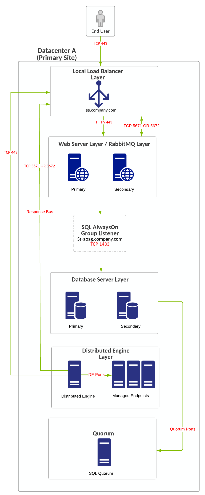
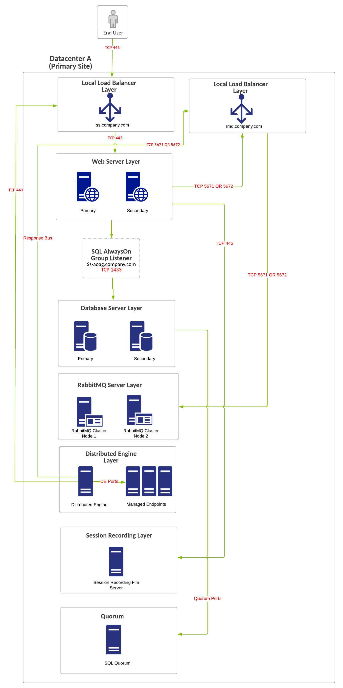
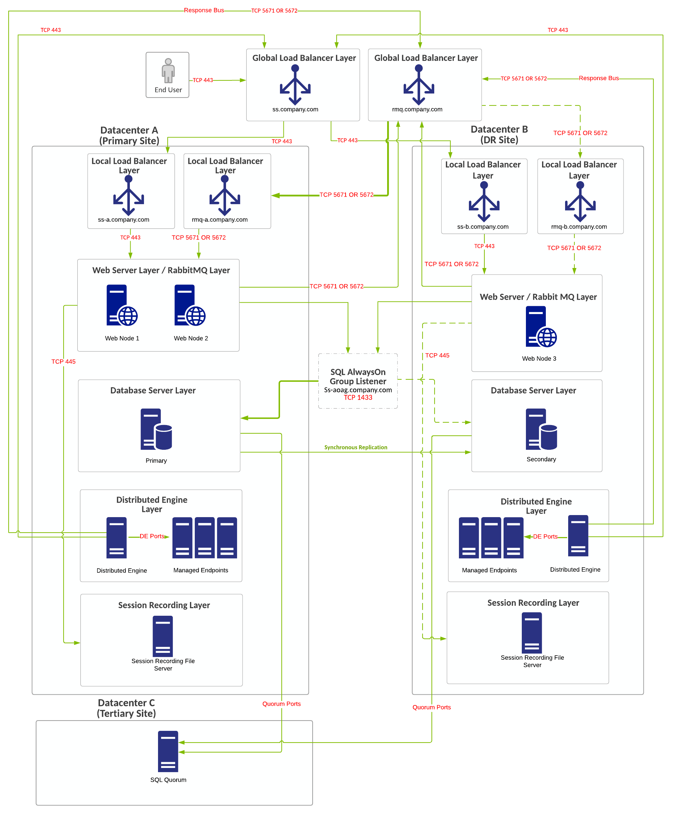
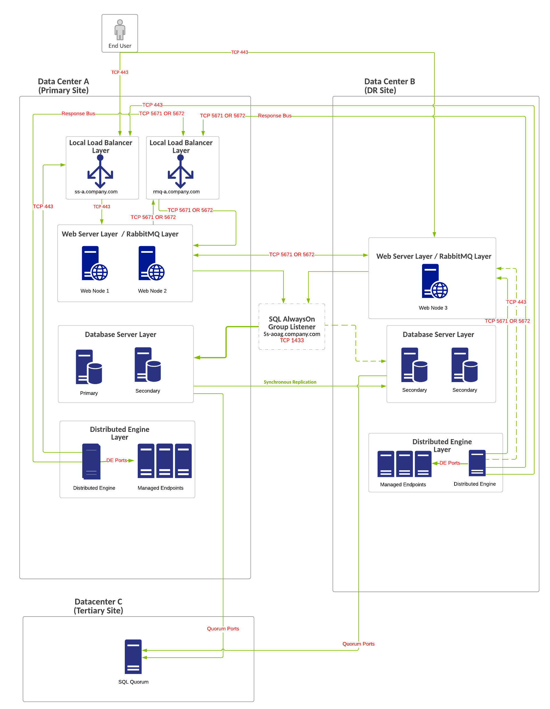
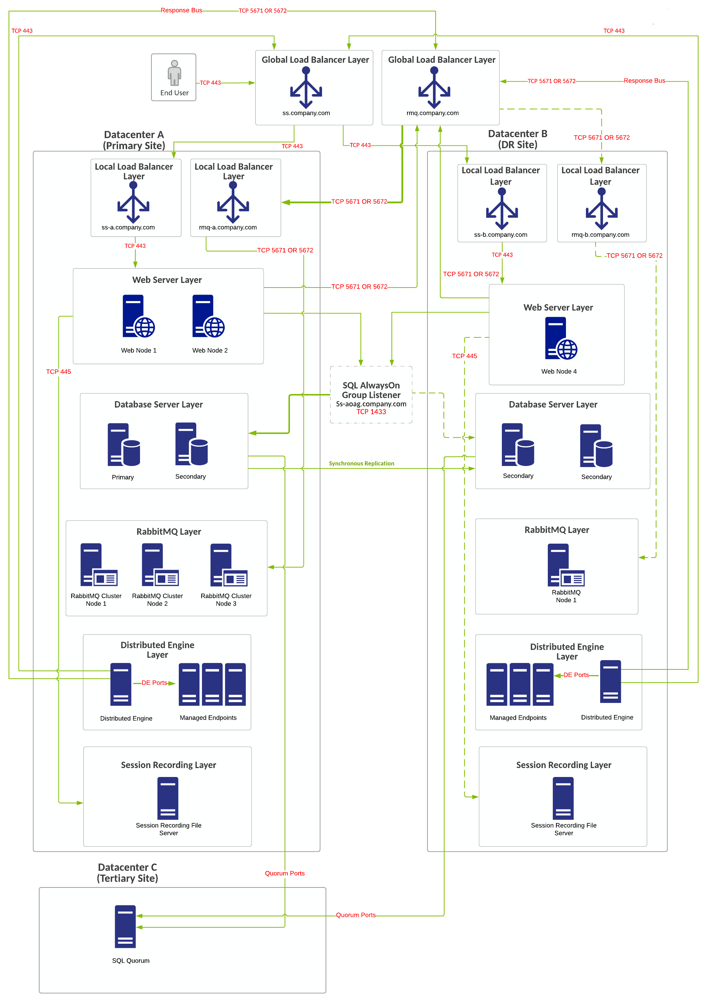
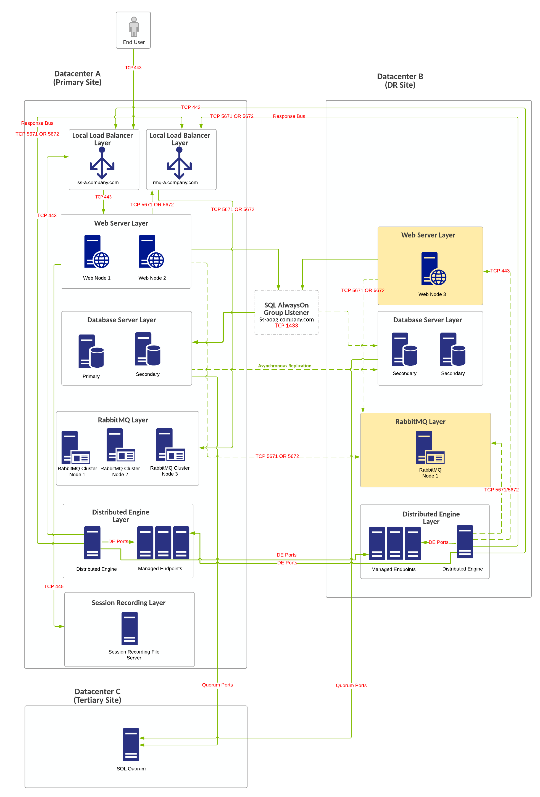
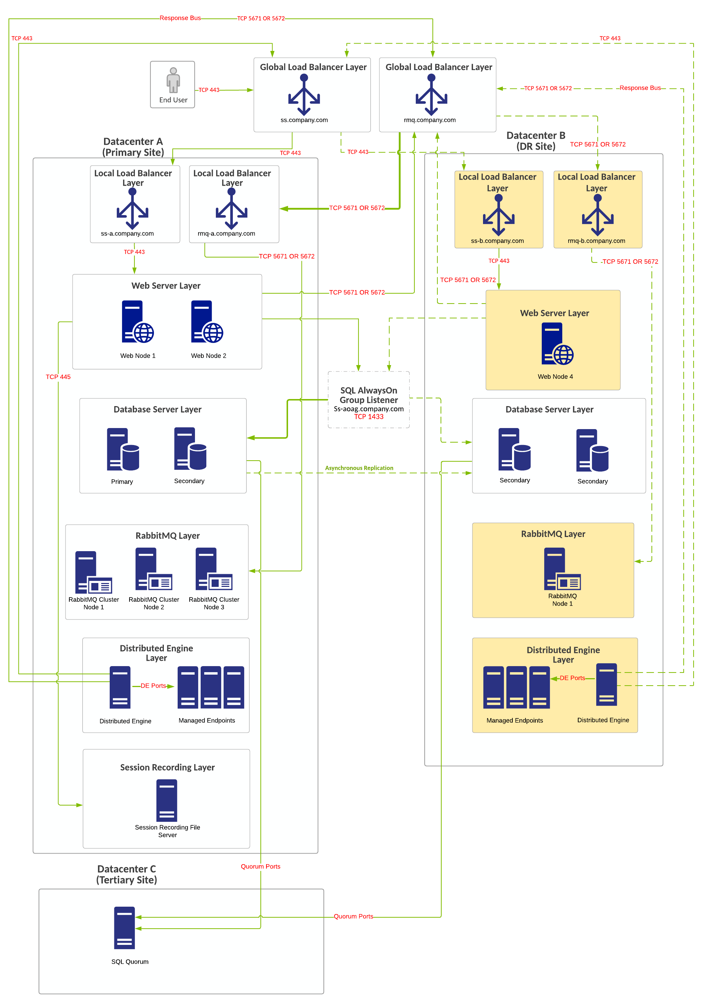
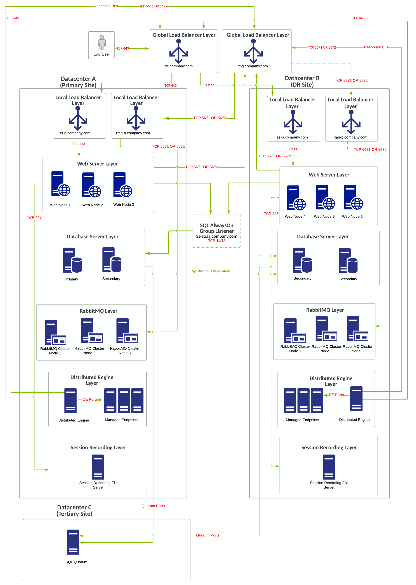

[title]: # (Secret Server Example Architectures)
[tags]: # (Secret Server, Architecture)
[priority]: # (1000)

# Secret Server Example Architectures

> **Note:** If you are a current customer with support hours for Thycotic Professional Services, you can discuss any of these diagrams in detail with one of our Professional Services Solutions Architects.

## Minimal Single-Site Enterprise Deployment

### Overview

- Single-site minimum-cost HA configuration.
- No shared storage requirement.
- RabbitMQ Installed on SS Web servers (typically in a cluster on a primary + secondary node).
- Single-site design with no native DR capacity. DR can be provided by VM replication if subnets are spanning locations, otherwise re-IP + DNS changes may be necessary.

### Requirements

#### General

- SQL Standard Edition: Basic availability group configuration. Local load balancers can be used for all Web server nodes.
- Configuring a file share witness for SQL quorum voting is required for SQL to stay online during single node unplanned failures.
- [Distributed Engine Ports](../../networking/secret-server-ports/index.md).
- [SQL Quorum Ports](http://dsfnet.blogspot.com/2013/04/windows-server-clustering-sql-server.html).

#### Virtual IP or Computer

- ss.company.com: 443 (load balancer)
- ss.company.com: 5671 or 5672 (load balancer)
- ss-aoag.company.com: 1433 (created as part of SQL AlwaysOn configuration). Computer object or virtual IP.
- Windows Failover Cluster Object (created as part of Windows failover clustering configuration):

  - Computer object or virtual IP
   - One additional virtual IP address may be required as part of Windows failover cluster for single-site design for the network configuration of the failover cluster.

### Diagram

> **Note:** The reference number for this diagram is A1.

**Figure:** Minimal Single-Site Enterprise Deployment

## Average Single-Site Enterprise Deployment

### Overview

- Single-site minimum-cost HA configuration.
- No shared storage requirement.
- RabbitMQ Installed on separate, dedicated servers.
- Single-site design with no native DR capacity. DR can be provided by VM replication if subnets are spanning locations, otherwise re-IP + DNS changes may be necessary.

### Requirements

#### General

- SQL Standard Edition: Basic availability group configuration. Local load balancers can be used for all Web server nodes.
- Configuring a file share witness for SQL quorum voting is required for SQL to stay online during single node unplanned failures.
- [Distributed Engine Ports](../../networking/secret-server-ports/index.md).
- [SQL Quorum Ports](http://dsfnet.blogspot.com/2013/04/windows-server-clustering-sql-server.html).

#### Virtual IP or Computer

- ss.company.com: 443 (load balancer)
- ss.company.com: 5671 or 5672 (load balancer)
- ss-aoag.company.com: 1433 (created as part of SQL AlwaysOn configuration). Computer object or virtual IP.
- Windows Failover Cluster Object (created as part of Windows failover clustering configuration):

  - Computer object or virtual IP
   - One additional virtual IP address may be required as part of Windows failover cluster for single-site design for the network configuration of the failover cluster.

### Diagram

> **Note:** The reference number for this diagram is A2.

**Figure:** Average Single-Site Enterprise Deployment

## Minimal Multi-Site Enterprise Deployment

### Overview

- Minimum cost HA/DR configuration
- No shared storage requirement
- Lower infrastructure footprint for DR
- DR site acts as temporary site only with no intention for long-term usage or becoming primary site.
- No secondary SQL node at primary site for "planned" failover.
- Secondary SQL node in DR site for planned or unplanned failover.
- Uses single RabbitMQ site connector design.
- Can accommodate automatic failover with synchronous replication (30 ms or less latency between SQL DB nodes).
- Global load balancers for Web and RMQ configurations are configured to force all traffic to primary site unless primary site is down (priority group activation)

### Requirements

#### General

- SQL Standard Edition (basic availability group configuration).
- If no global load balancers exist due to costs or infrastructure missing, local load balancers can be used for all Web server nodes, but DNS change may be required if primary location goes offline.
- Configuring a file share witness for SQL quorum voting is required for SQL to stay online during single-node unplanned failures. A cloud witness is recommended.
- [SQL Quorum Ports](http://dsfnet.blogspot.com/2013/04/windows-server-clustering-sql-server.html).

#### Virtual IP or Computer

- ss.company.com: 443, rmq.company.com: 5671 or 5672 (2 virtual IPs, global load balancer) 
- ss-a.company.com: 443, ss-b.company.com: 443 (2 virtual IPs, local load balancer) 
- rmq-a.company.com: 5671 or 5672 (load balancer), rmq-b.company.com: 5671 or 5672 (2 virtual IPs, local load balancer)
-  ss-aoag.company.com:1433 (created as part of SQL AlwaysOn configuration):
  - ss-aoag.company.com computer object or virtual IP. 
  - Two virtual IP addresses may be required as part of this configuration .
- Windows failover cluster object (created as part of Windows failover clustering configuration):
  - Computer object or virtual IP. 
  - Two additional virtual IP addresses may be required as part of Windows failover cluster for single site design for the network configuration of the failover cluster representing both networks at each respective site.

### Diagram

> **Note:** The reference number for this diagram is B1.

**Figure:** Minimal Multi-Site Enterprise Deployment

## Average Multi-Site Enterprise Deployment

### Overview

- Minimum cost HA/DR configuration with no shared storage requirement, resulting in a smaller infrastructure footprint for DR.
- RabbitMQ installed on SS Web servers (typically in a cluster on a primary+secondary node).
- DR site acts at temporary site only with no intention for long-term usage or becoming primary site.
- Multiple site connector design intended for RabbitMQ. All distributed engines communicate to one local load balancer/RMQ cluster for their response bus. There are two site connectors, one for each location.
- Global load balancers are unavailable, thus requiring a manual failover process/DNS change for Web traffic to the DR site. Additional application-specific changes will be needed for full functionality to resume in the DR site:
  - Change the internal site connector to the DR site connector.
  - Change the response bus to the DR site connector.
- Design assumes the Web server in the DR location is joined to the cluster and is online so that work is also being generated from Web servers in the DR location. If server is online and has roles configured, cross-data-center RabbitMQ communication may occur. Work may be generated at either location's Web servers and is placed on either site connector, based on how secrets are configured.

### Requirements

#### General

- SQL Enterprise Edition.
- DNS change may be required if primary location is offline.
- Configuring a file share witness for SQL quorum voting is required for SQL to stay online during single-node unplanned failures. A cloud witness is recommended.
- [Distributed Engine Ports](../../networking/secret-server-ports/index.md).
- [SQL Quorum Ports](http://dsfnet.blogspot.com/2013/04/windows-server-clustering-sql-server.html).

#### Virtual IP or Computer

- ss.company.com: 443 (load balancer).
- rmq.company.com: 5671 or 5672 (load balancer).
- ss-aoag.company.com: 1433 (created as part of SQL AlwaysOn configuration). ss-aoag.company.com computer object/virtual IP.
- Windows failover cluster object (created as part of Windows failover clustering configuration):
  - Computer object/virtual IP.
  - One additional virtual IP addresses may be required as part of Windows failover cluster for single-site design for the network configuration of the failover cluster.

### Diagram

**Note:** The reference number for this diagram is B2.

**Figure:** Average Multi-Site Enterprise Deployment

## Best Multi-Site Enterprise Deployment (C1)

### Overview

- Higher Cost HA/DR Configuration with no shared storage requirement. Smaller Infrastructure footprint for DR RabbitMQ clusters installed on dedicated systems.
- RabbitMQ clusters installed on dedicated systems, 
- DR site acts as temporary site only when there is no intention of long-term use or becoming primary site. Services in DR site being down can incur downtime.
- Secondary SQL node at primary site for planned failover "patching." Secondary SQL Node in DR Site for unplanned failover.
- Uses a single RabbitMQ site-connector design.
- Can accommodate automatic failover with synchronous replication (30 ms or less latency between SQL DB nodes).
- Global load balancers for Web and RMQ configurations are configured to force all traffic to go to primary site unless primary site is down (priority group activation).
- RabbitMQ three-node cluster minimum for production location in keeping with RabbitMQ design best practices. Classic mirrored queues will be retired in the future. Until then, two-node cluster designs may still be acceptable for customers who want less infrastructure footprint.

### Requirements

#### General

- SQL Enterprise Edition.
- Global and local load balancers.
- Configuring a file share witness for SQL quorum voting is recommended. A cloud witness or DFSR share is recommended for witness configuration. Simultaneous failure of both SQL nodes in the primary location will still allow cluster to survive.
- [Distributed Engine Ports](../../networking/secret-server-ports/index.md).
- [SQL Quorum Ports](http://dsfnet.blogspot.com/2013/04/windows-server-clustering-sql-server.html).

#### Virtual IP or Computer

- ss.company.com: 443, rmq.company.com: 5671 or 5672 (two virtual IPs, global load balancer).
- ss-a.company.com: 443, ss-b.company.com: 443 (two virtual IPs, local load balancer). 
- rmq-a.company.com: 5671 or 5672 (Load Balancer), rmq-b.company.com: 5671 or 5672 (two virtual IPs, local load balancer).
- ss-aoag.company.com: 1433 (created as part of SQL AlwaysOn configuration):
  - ss-aoag.company.com computer object/virtual IP.
  - Two virtual IP addresses may be required as part of this configuration.
- Windows failover cluster object (created as part of Windows failover clustering configuration):
  - Computer object/virtual IP.
  - Two additional virtual IP addresses may be required as part of Windows failover cluster for single-site design for the network configuration of the failover cluster representing both networks at each site.

### Diagram

> **Note:** The reference number for this diagram is C1.

**Figure:** Best Multi-Site Enterprise Deployment (C1)

## Best Multi-Site Enterprise Deployment (C2)

### Overview

- Higher cost HA/DR configuration with no shared storage requirement. Smaller Infrastructure footprint for DR.
- RabbitMQ clusters installed on dedicated systems.
- DR site acts as temporary site only when there is no intention of long-term use or becoming primary site. Services in DR site being down can incur downtime.
- Secondary SQL node at primary site for planned failover "patching." Secondary SQL Node in DR Site for unplanned failover.
- Can accommodate manual failover only with asynchronous replication (30 ms or more latency between SQL DB nodes).
- Singular site connector using only the local site. The local site comes with two distributed engines now. The distributed engine layer can be online/active but cross-data-center communication may occur (as depicted). It can alternatively be marked as yellow as other layers.
- Global load balancers are unavailable, thus requiring a manual failover process/DNS change for Web traffic to the DR site. Additional application-specific changes will be needed for full functionality to resume in DR site:
  - Change the internal site connector to the DR site connector.
  - Change the response bus to the DR site connector.
- Design assumes the Web server in DR location is joined to the cluster but is shut down (marked in yellow) so that no work is being generated from the Web servers in the DR location. If server is online and has roles configured, cross-data-center RabbitMQ communication may occur. The RabbitMQ layer is also marked as yellow, indicative of the server being built/online but the RabbitMQ service is shut down.
- In this design, a manual failover may proceed in the following order:
  - Bring database node only and force it to become the new primary.
  - Bring online the Web server layer.
  - Update DNS record to point to the DR Web server node
  - Bring RabbitMQ layer online for additional feature functionality. Switch the response bus, internal site connector, and custom URL if necessary. 
- If necessary while in DR, session recordings should be temporarily switched to database storage while in DR.
- RabbitMQ three-node cluster minimum for production location in keeping with with RabbitMQ design best practices. Classic mirrored queues will be retired in the future. Until then, two-node cluster designs may still be acceptable for customers who want less infrastructure footprint.

### Requirements

#### General

- SQL Enterprise Edition.
- DNS change may be required if primary location goes offline.
- Configuring a file share witness for SQL quorum voting is recommended. A cloud witness or DFSR share is recommended for witness configuration. Simultaneous failure of both SQL nodes in the primary location will still allow cluster to survive.
- [Distributed Engine Ports](../../networking/secret-server-ports/index.md).
- [SQL Quorum Ports](http://dsfnet.blogspot.com/2013/04/windows-server-clustering-sql-server.html).

#### Virtual IP or Computer

- ss.company.com: 443 (load balancer).
- rmq.company.com: 5671 or 5672 (load balancer).
- ss-aoag.company.com: 1433 (created as part of SQL AlwaysOn configuration). ss-aoag.company.com computer object/virtual IP.
- Windows failover cluster object (created as part of Windows failover clustering configuration):

  - Computer object/virtual IP.
   - One additional virtual IP addresses may be required as part of Windows failover cluster for single site design for the network configuration of the failover cluster.

### Diagram

> **Note:** The reference number for this diagram is C2.

**Figure:** Best Multi-Site Enterprise Deployment (C2)

## Best Multi-Site Enterprise Deployment (C3) with Manual Failover

### Overview

- Higher cost HA/DR configuration with no shared storage requirement. 
- Smaller Infrastructure footprint.
- RabbitMQ cluster installed on dedicated systems.
- DR site acts as temporary site only when there is no intention of long-term use or becoming the primary.
- Secondary SQL node at primary site for planned failover "patching." Secondary SQL Node in DR Site for unplanned failover.
- Can accommodate manual failover only with asynchronous replication (30 ms or more latency between SQL DB nodes).
- Singular site connector using only the local site. The local site comes with two distributed engines. 
- The distributed engine layer can be online/active. Cross-data-center communication may occur (as depicted). It can alternatively be marked as yellow as with other layers.
- Design assumes the Web server in DR location is joined to the cluster but is shut down (marked in yellow), so no work is being generated from Web servers in the DR location. Other layers also have its services shut down. The database is the only layer not marked as yellow due to services needing to run for the asynchronous replica to function. The Local Load balancer configurations are simply disabled in the global load balancer configuration and can be manually brought online when traffic is ready to flow to DR. 
- In this design, a manual failover may proceed in the following order: 
  1. Bring database node only and force it to become the new primary.
  1. Bring online the Web server layer.
  1. Enable the load balancer configurations to direct traffic to  the Web node. 
  1. Bring distributed engine and RabbitMQ layer online for additional feature functionality.
- Session Recordings, if necessary while in DR, should be temporarily switched to database storage while in DR.
- RabbitMQ three-node cluster minimum for production location in keeping with RabbitMQ design best practices. 
- Classic mirrored queues will be retired in the future. Until then, two-node cluster designs may still be acceptable for customers who want less infrastructure footprint.

### Requirements

#### General

- SQL Enterprise Edition.
- Global and local load balancers.
- Configuring a file share witness for SQL quorum voting is recommended. A cloud witness or DFSR share is recommended for witness configuration. Simultaneous failure of both SQL nodes in the primary location will still allow the cluster to survive.
- [Distributed Engine Ports](../../networking/secret-server-ports/index.md).
- [SQL Quorum Ports](http://dsfnet.blogspot.com/2013/04/windows-server-clustering-sql-server.html).

#### Virtual IP or Computer

- ss.company.com: 443, rmq.company.com: 5671 or 5672 (two virtual IPs, global load balancer).
- ss-a.company.com: 443, ss-b.company.com: 443 (two virtual IPs, local load balancer). 
- rmq-a.company.com: 5671 or 5672 (Load Balancer), rmq-b.company.com: 5671 or 5672 (two virtual IPs, local load balancer).
- ss-aoag.company.com: 1433 (created as part of SQL AlwaysOn configuration):
  - ss-aoag.company.com computer object/virtual IP.
  - Two virtual IP addresses may be required as part of this configuration.
- Windows failover cluster object (created as part of Windows failover clustering configuration):
  - Computer object/virtual IP.
  - Two additional virtual IP addresses may be required as part of Windows failover cluster for single-site design for the network configuration of the failover cluster representing both networks at each site.

### Diagram

> **Note:** The reference number for this diagram is C3.

**Figure:** Best Multi-Site Enterprise Deployment with Manual Failover (C3)

## Best Multi-Site Enterprise Deployment (C4) with Automatic Failover

### Overview

- Higher cost HA/DR configuration with no shared storage requirement. 
- Smaller Infrastructure footprint.
- RabbitMQ cluster installed on dedicated systems.
- Equal infrastructure at two sites—DR site can act as permanent secondary site for long-term use.
- Secondary SQL node at primary site for planned failover "patching." Secondary SQL Node in DR Site for unplanned failover.
- Uses a single RabbitMQ connector design.
- Global load balancers for Web and RMQ configurations are configured to force all traffic to go to primary site unless primary site is down (priority group activation).
- RabbitMQ three-node cluster minimum for production location in keeping with RabbitMQ design best practices. 
- Classic mirrored queues will be retired in the future. Until then, two-node cluster designs may still be acceptable for customers who want less infrastructure footprint.
- Multiple session recording servers in each location should consider leveraging DFSR or other methods to provide near real-time synchronization of data storage between data centers for active/active designs. This can impact design cost.

### Requirements

#### General

- SQL Enterprise Edition.
- Global and local load balancers.
- Configuring a file share witness for SQL quorum voting is recommended. A cloud witness or DFSR share is recommended for witness configuration. Simultaneous failure of both SQL nodes in the primary location will still allow the cluster to survive.
- [Distributed Engine Ports](../../networking/secret-server-ports/index.md).
- [SQL Quorum Ports](http://dsfnet.blogspot.com/2013/04/windows-server-clustering-sql-server.html).

#### Virtual IP or Computer

- ss.company.com: 443, rmq.company.com: 5671 or 5672 (two virtual IPs, global load balancer).
- ss-a.company.com: 443, ss-b.company.com: 443 (two virtual IPs, local load balancer). 
- rmq-a.company.com: 5671 or 5672 (Load Balancer), rmq-b.company.com: 5671 or 5672 (two virtual IPs, local load balancer).
- ss-aoag.company.com: 1433 (created as part of SQL AlwaysOn configuration):
  - ss-aoag.company.com computer object/virtual IP.
  - Two virtual IP addresses may be required as part of this configuration.
- Windows failover cluster object (created as part of Windows failover clustering configuration):
  - Computer object/virtual IP.
  - Two additional virtual IP addresses may be required as part of Windows failover cluster for single-site design for the network configuration of the failover cluster representing both networks at each site.

### Diagram

> **Note:** The reference number for this diagram is C4.

**Figure:** Best Multi-Site Enterprise Deployment with Automatic Failover (C4)

