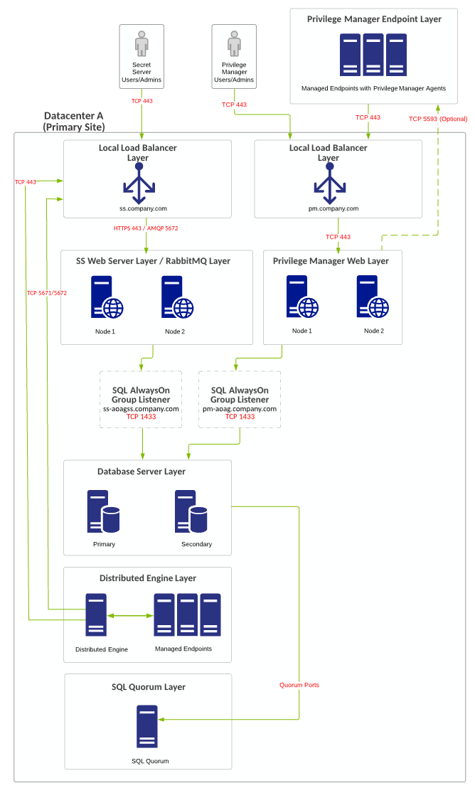
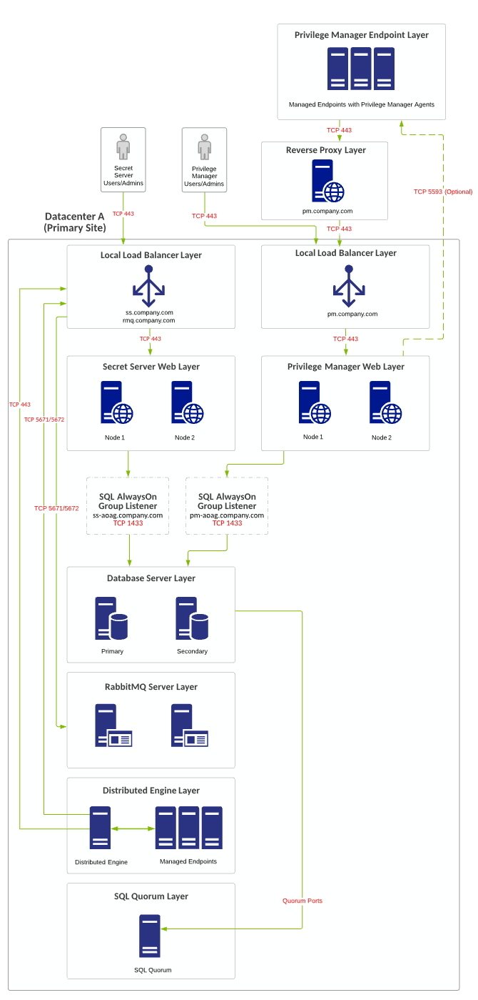
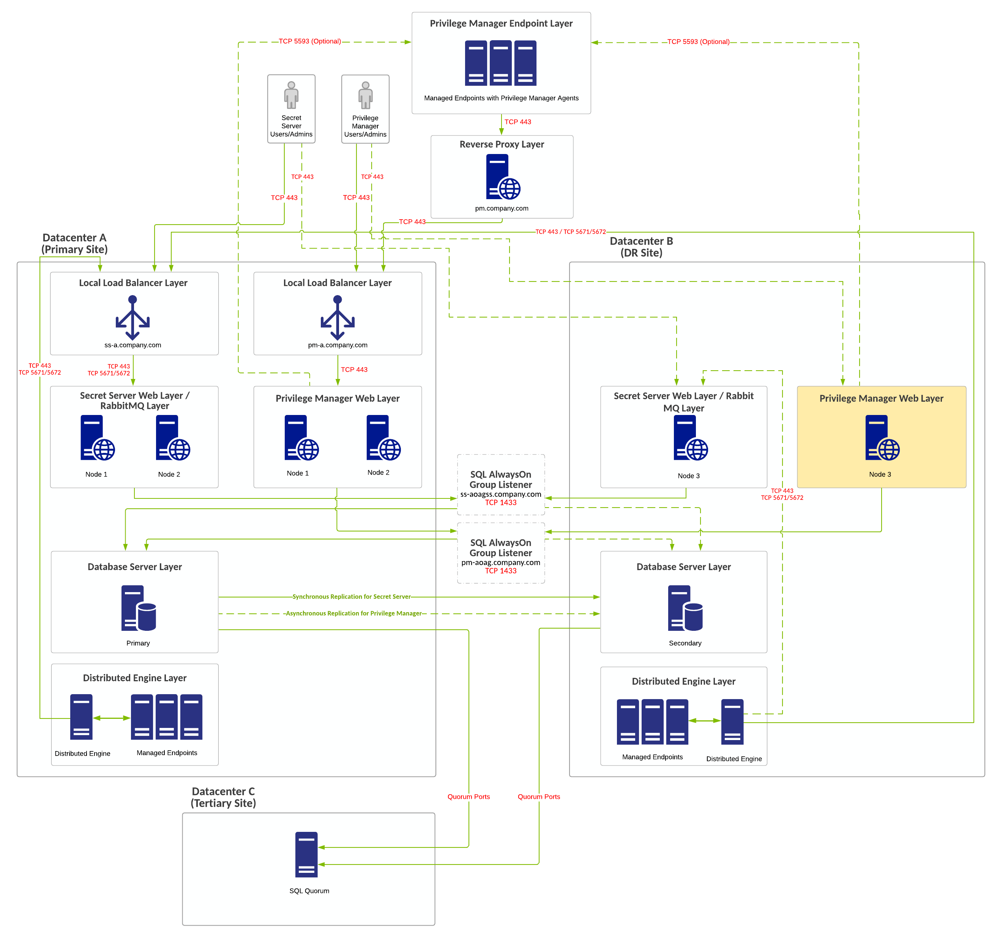
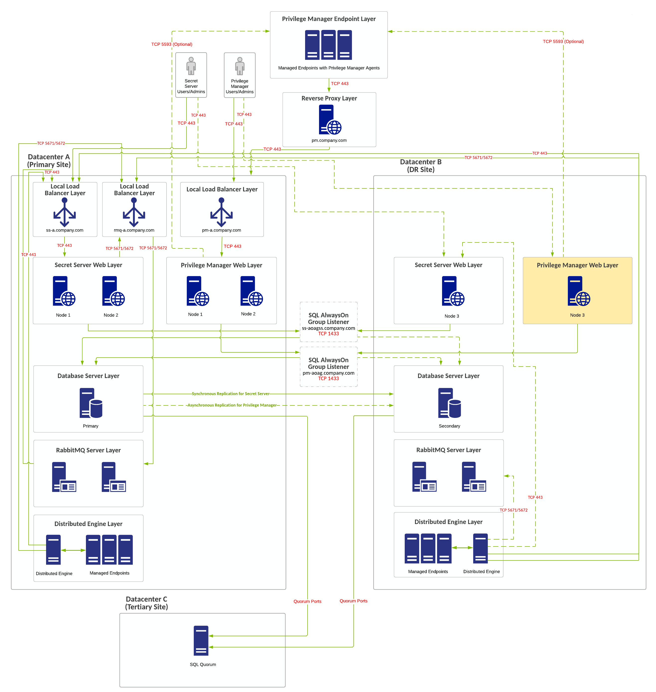

[title]: # (Secret Server and Privilege Manager Example Architectures)
[tags]: # (Privilege Manager, Architecture, Integration)
[priority]: # (1000)

# Secret Server and Privilege Manager Example Architectures

> **Note:** If you are a current customer with support hours for Thycotic Professional Services, you can discuss any of these diagrams in detail with one of our Professional Services Solutions Architects.

## Secret Server and Privilege Manager Integration

The benefits of Privilege Manager (PM) integration with Secret Server (SS) include:

- SS can be the authentication source for PM. This:

  - Adds SS MFA login options to PM log ons.
   - Gives one place for role assignments for both products.

- PM can use SS as a storage container.

When you use SS as the authentication source for PM, role permissions assigned in SS apply and determine user-access levels in PM.

> **Note:** Without SS integration, the authentication sources for PM can be NTLM for the Web server or Azure AD.

When using SS as a storage container for PM credentials:

- PM creates secrets for each local credential managed by PM.
- PM creates secrets for each configuration credential stored in PM. This includes the credentials PM uses for foreign system integration, such as AD sync and ServiceNow.
- PM pulls any changes from secrets. PM only stores the credentials in SS to use SS workflow options and for users to view them.

This integration is supported when the two applications are installed on the same server or separate servers, as long as PM can communication with SS via the SS REST API.

## Single Site with Minimum HA

### Overview

- Minimum-cost configuration with no shared storage requirement.
- RabbitMQ (for SS) is installed on the SS Web servers (typically in a cluster).
- Single-site design with no native DR capacity. DR can be provided by VM replication if subnets are spanning locations. Otherwise Re-IP + DNS changes may be necessary.
- PM is installed on separate Web servers.
- PM can integrate with SS for authentication and credential storage.
- PM can reside on the same database servers as SS or on separate ones, but SS and PM should not share the same database.

  > **Note:** Due to SQL basic availability groups with the Standard Edition, you need to have multiple SQL instances and a separate AlwaysOn availability group configuration.

### Requirements

- SQL Standard Edition with a basic availability group configuration.
- You can use local load balancers for all Web server nodes.
- For SQL to stay online during single-node unplanned failures, you must configure a file-share witness for SQL quorum voting.

### Diagram

> **Note:** The reference for this diagram is A-1.

**Figure:** Single Site with Minimum HA

## Single Site with Minimum HA and Separate RabbitMQ

### Overview

- Minimum-cost HA configuration with no shared storage requirement.
- RabbitMQ (for SS) is installed on the SS Web servers (typically in a cluster).
- Single-site design with no native DR capacity. DR can be provided by VM replication if subnets are spanning locations. Otherwise Re-IP + DNS changes may be necessary.
- PM is installed on separate Web servers.
- PM can integrate with SS for authentication and credential storage.
- PM can reside on the same database servers as SS or on separate ones, but SS and PM should not share the same database.

  > **Note:** Due to SQL basic availability groups with the Standard Edition, you need to have multiple SQL instances and a separate AlwaysOn availability group configuration.

- You can use a separate Web reverse proxy or Azure service bus configuration for Privilege Manager agent TCP 443 communication.

### Requirements

- SQL Standard Edition with a basic availability group configuration.
- You can use local load balancers for all Web server nodes.
- For SQL to stay online during single-node unplanned failures, you must configure a file-share witness for SQL quorum voting.

### Diagram

> **Note:** The reference for this diagram is A-2.

**Figure:**  Single Site with Minimum HA and Separate RabbitMQ

## Multiple Site with Manual Failover

### Overview

- Minimum-cost HA configuration with no shared storage requirement.
- RabbitMQ (for SS) is installed on the SS Web servers (typically in a cluster).
- SQL AlwaysOn configurations are either synchronous or asynchronous for the SS database and asynchronous only for the PM database.
- DR site acts as a temporary site only with no long-term use. Services in DR site being down can incur downtime.
- PM is installed on separate Web servers.
- PM can integrate with SS for authentication and credential storage.
- PM can reside on the same database servers as SS or on separate ones, but SS and PM should not share the same database.

  > **Note:** Due to SQL basic availability groups with the Standard Edition, you need to have multiple SQL instances and a separate AlwaysOn availability group configuration.

- You can use a separate Web reverse proxy or Azure service bus configuration for Privilege Manager agent TCP 443 communication.

### Requirements

- SQL Standard Edition with a basic availability group configuration.
- If global load balancers are not available due to cost or limited infrastructure, you can use local load balancers for all Web server nodes, but DNS change may be required if primary location goes offline.
- For SQL to stay online during single-node unplanned failures, you must configure a file-share witness for SQL quorum voting.

### Diagram

> **Note:** The reference for this diagram is B-1.

**Figure:**  Multiple Site with Manual Failover

###

## Multiple Site with Manual Failover and Separate RabbitMQ

### Overview

- Minimum-cost HA configuration with no shared storage requirement.
- RabbitMQ (for SS) is installed on the SS Web servers (typically in a cluster).
- SQL AlwaysOn configurations are either synchronous or asynchronous for the SS database and asynchronous only for the PM database.
- DR site acts as a temporary site only with no long-term use. Services in DR site being down can incur downtime.
- PM is installed on separate Web servers.
- PM can integrate with SS for authentication and credential storage.
- PM can reside on the same database servers as SS or on separate ones, but SS and PM should not share the same database.

  > **Note:** Due to SQL basic availability groups with the Standard Edition, you need to have multiple SQL instances and a separate AlwaysOn availability group configuration.

- You can use a separate Web reverse proxy or Azure service bus configuration for Privilege Manager agent TCP 443 communication.

### Requirements

- SQL Standard Edition with a basic availability group configuration.
- If global load balancers are not available due to cost or limited infrastructure, you can use local load balancers for all Web server nodes, but DNS change may be required if primary location goes offline.
- For SQL to stay online during single-node unplanned failures, you must configure a file-share witness for SQL quorum voting. We recommend a cloud witness.

### Diagram

> **Note:** The reference for this diagram is B-2.

**Figure:**  Multiple Site with Manual Failover and Separate RabbitMQ

## Multiple Site with Automatic Failover

###  Overview

- Improved HA configuration with no shared storage requirement.
- RabbitMQ (for SS) is installed on the SS Web servers (typically in a cluster).
- SQL AlwaysOn configurations are either synchronous or asynchronous for the SS database and asynchronous only for the PM database.
- DR site acts as a temporary site only with no long-term use. Services in DR site being down can incur downtime.
- PM is installed on separate Web servers.
- PM can integrate with SS for authentication and credential storage.
- PM can reside on the same database servers as SS or on separate ones, but SS and PM should not share the same database.

  > **Note:** Due to SQL basic availability groups with the Standard Edition, you need to have multiple SQL instances and a separate AlwaysOn availability group configuration.

- You can use a separate Web reverse proxy or Azure service bus configuration for Privilege Manager agent TCP 443 communication.

### Requirements

- SQL Standard Edition with a basic availability group configuration.
- If global load balancers are not available due to cost or limited infrastructure, you can use local load balancers for all Web server nodes, but DNS change may be required if primary location goes offline.
- For SQL to stay online during single-node unplanned failures, you must configure a file-share witness for SQL quorum voting. We recommend a cloud witness.

### Diagram

> **Note:** The reference for this diagram is C-1.

**Figure:** Multiple Site with Automatic Failover

## Multiple Site with Automatic Failover and Separate RabbitMQ

###  Overview

- Improved HA configuration with no shared storage requirement.
- RabbitMQ (for SS) is installed on dedicated servers (typically in a cluster).
- SQL AlwaysOn configurations are either synchronous or asynchronous for the SS database and asynchronous only for the PM database.
- DR site acts as a temporary site only with no long-term use. Services in DR site being down can incur downtime.
- PM is installed on separate Web servers.
- PM can integrate with SS for authentication and credential storage.
- PM can reside on the same database servers as SS or on separate ones, but SS and PM should not share the same database.

  > **Note:** Due to SQL basic availability groups with the Standard Edition, you need to have multiple SQL instances and a separate AlwaysOn availability group configuration.

- You can use a separate Web reverse proxy or Azure service bus configuration for Privilege Manager agent TCP 443 communication.

### Requirements

- SQL Enterprise Edition.
- Global and local load balancers.
- If global load balancers are not available due to cost or limited infrastructure, you can use local load balancers for all Web server nodes, but DNS change may be required if primary location goes offline.
- For SQL to stay online during single-node unplanned failures, you must configure a file-share witness for SQL quorum voting. We recommend a cloud witness.
- [Distributed Engine Ports](../../networking/secret-server-ports/index.md).
- [SQL Quorum Ports](http://dsfnet.blogspot.com/2013/04/windows-server-clustering-sql-server.html).

### Diagram

> **Note:** The reference for this diagram is C-2.

**Figure:**  Multiple Site with Automatic Failover and Separate RabbitMQ

## Best Multiple Site with Automatic Failover and Separate RabbitMQ

###  Overview

- Best HA configuration with no shared storage requirement.
- RabbitMQ (for SS) is installed on dedicated servers (typically in a cluster).
- SQL AlwaysOn configurations are either synchronous or asynchronous for the SS database and asynchronous only for the PM database.
- DR site acts as a temporary site only with no long-term use. Services in DR site being down can incur downtime.
- PM is installed on separate Web servers.
- PM can integrate with SS for authentication and credential storage.
- PM can reside on the same database servers as SS or on separate ones, but SS and PM should not share the same database.

  > **Note:** Due to SQL basic availability groups with the Standard Edition, you need to have multiple SQL instances and a separate AlwaysOn availability group configuration.

- You can use a separate Web reverse proxy or Azure service bus configuration for Privilege Manager agent TCP 443 communication.

### Requirements

- SQL Enterprise Edition.
- Global and local load balancers.
- If global load balancers are not available due to cost or limited infrastructure, you can use local load balancers for all Web server nodes, but DNS change may be required if primary location goes offline.
- For SQL to stay online during single-node unplanned failures, you must configure a file-share witness for SQL quorum voting. We recommend a cloud witness.
- [Distributed Engine Ports](../../networking/secret-server-ports/index.md).
- [SQL Quorum Ports](http://dsfnet.blogspot.com/2013/04/windows-server-clustering-sql-server.html).

### Diagram

> **Note:** The reference for this diagram is C-3.

**Figure:** Best Multiple Site with Automatic Failover and Separate RabbitMQ

