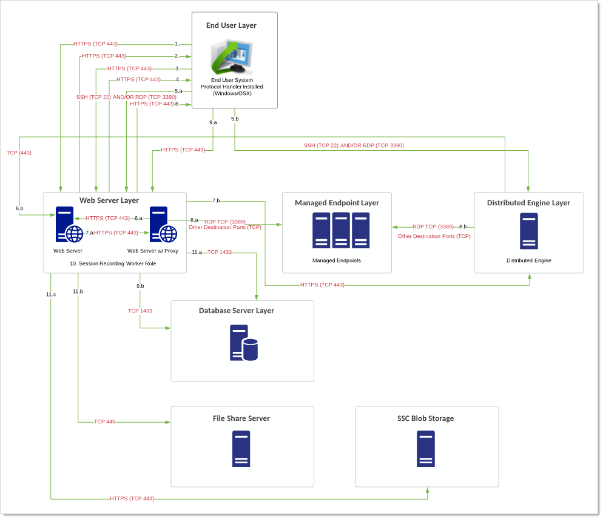
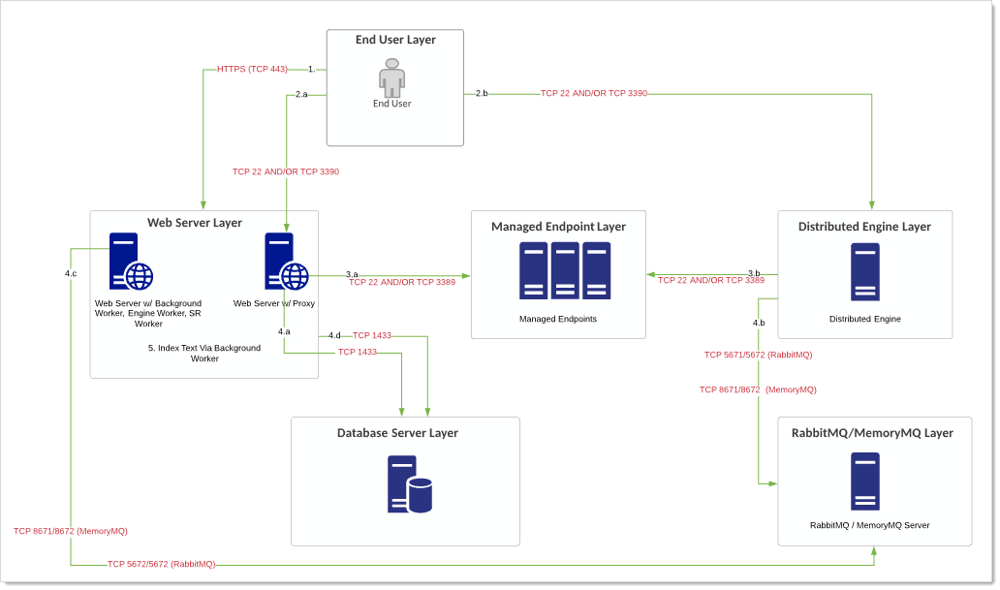
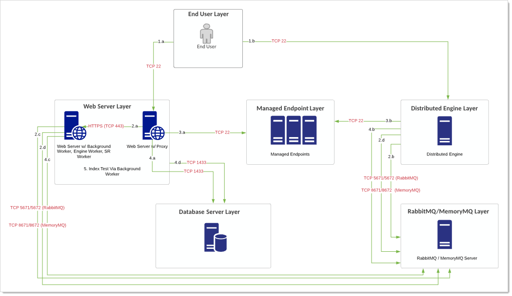
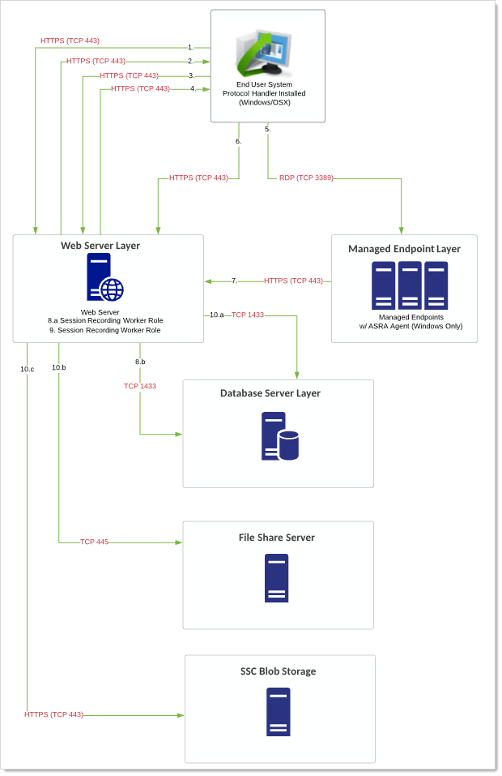
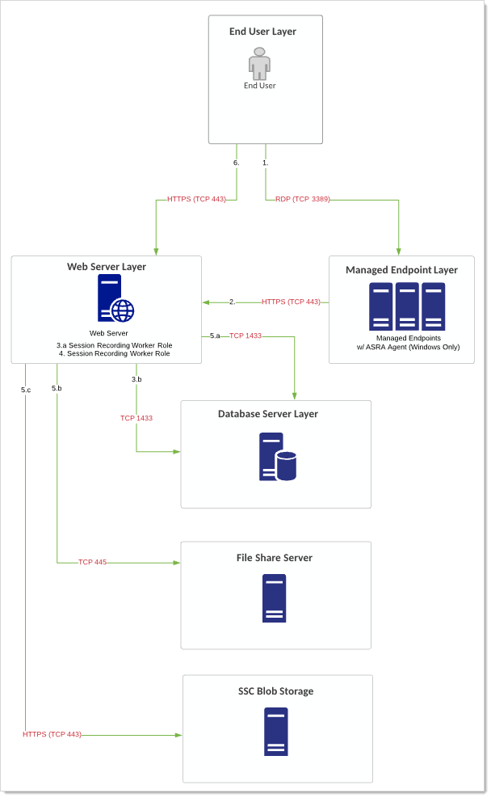

[title]: # (Session Recording Example Architectures)
[tags]: # (Session Recording, Architecture)
[priority]: # (1000)

# Session Recording Example Architectures

> **Note:** If you are a current customer with support hours for Thycotic Professional Services, you can discuss any of these diagrams in detail with one of our Professional Services Solutions Architects.

## Endpoint via Secret Server Launcher

### Overview

User connects to SS and clicks the launcher for a secret with a non-proxied session. This is the default. Session recording is enabled on the secret. This scenario applies to both SS and SSC.

Simplified flow:

User \> SS \> Protocol Launcher \> Endpoint System

### Data Gathered

Visual, video is created for video playback.

### Flow

> **Note:** These numbers also appear on the diagram.

1. User logs on SS. User clicks icon to launch a session for a secret within SS with session recording enabled.

1. SS launches protocol handler.

1. Protocol handler requests instructions from SS.

1. SS sends secret and the target remote server.

1. Protocol launcher starts RDP session to target server. Recording begins.

1. End user system via the protocol handler does one of two things:

   - RDP/SSH launchers: Uploads either recorded video segments every second.

   - Mac Launchers: Takes screenshots every second.

     This information is uploaded via HTTPS (configurable) and stored in the database.

1. The Web servers' session recording role does any encoding, transcoding, or re-composition of videos to ensure videos can be played back through the session monitoring page.

1. The final video recording is stored in the database or file-share server (preferable) after the video has been processed. For Secret Server Cloud customers, this is stored in customer-specific BLOB. Playback can only occur through the Session Monitoring section within SS.

### Diagram

> **Note:** The reference for this diagram is Flow 1.

**Figure:** Endpoint via Secret Server Launcher

### Notes

- Many of these ports are configurable. These diagrams reflect best practice ports. We strongly recommend using RabbitMQ for your message bus. The ports attached to RabbitMQ/MemoryMQ only need to be singular (SSL OR non-SSL). If using RabbitMQ for example, most customers will only need to utilize port TCP 5672.

- Session recording storage can be configured per site (separate file share servers), but the processing is still finalized from a Web server with session recording enabled. This means that data written from the Web server to the file share server may happen across different physical locations, which may add to the complexity of your networking requirements and may cause network saturation.

- If your client connection cannot support the needed bandwidth, the session data is still transmitted, but it takes longer to process each session. The protocol handler retries sending recordings to the Web server five times over the course of an hour. If that fails, it stops until the machine or service is restarted. The protocol handler itself terminates its launched session after 10 seconds if SS becomes unreachable. In a scenario where the protocol handler has terminated because SS is down, it stores the video recording in session monitoring up to the point when SS went down.  Please see [Session Recording Requirements](../../session-recording/session-recording-requirements/index.md) for more information.

## Endpoint via Secret Server Launcher and Proxy

### Overview

User connects to SS and clicks the launcher for a secret with a proxied session. Session recording is enabled on the secret.  This scenario applies to both SS and SSC.

Simplified flow:

User > Secret Server > Launcher > Secret Server/DE Proxy > Endpoint System

### Data Gathered

- For SSH secrets: Visual and Textual (keystroke/terminal output). Video is created for video playback and enhanced with textual data from the proxy.

- RDP secrets With RDP tunneling enabled: - Visual only. Video is created for video playback (same as the first scenario).

- For RDP proxy (new in 10.8):  Video and Keystrokes

> **Note:** As of the December 10th 2019 release, you can now choose from:
> - Record keystrokes only
> - Record video only
> - Do not record

### Flow

> **Note:** These numbers also appear on the diagram.

1. User logs on SS. User clicks icon to launch a session for a secret within SS with session recording enabled, and the secret proxies the request through either the Web server or a DE.

1. SS launches protocol handler.

1. Protocol handler requests instructions from SS.

1. SS sends connection details for Web server or DE proxy back to the protocol handler.

1. Protocol launcher starts tunneling session to Web server or DE.

1. DE or Web server proxy requests connection parameters for destination from SS.

1. SS sends connection parameters to an individual Web server or DE proxy.

1. Proxy starts remote session to target server.  Recording begins.

1. End user system via the protocol handler does one of two things:

   - RDP/SSH launchers: Uploads either recorded video segments every second.

   - Mac Launchers: Takes screenshots every second.

     This information is uploaded via HTTPS (configurable) and stored in the database.

1. The Web servers' session recording role does any encoding, transcoding, or re-composition of videos to ensure videos can be played back through the session monitoring page.

1. The final video recording is stored in the database or file-share server (preferable) after the video has been processed. For Secret Server Cloud customers, this is stored in customer-specific BLOB. Playback can only occur through the Session Monitoring section within SS.

### Diagram

> **Note:** The reference for this diagram is Flow 2.

**Figure:** Endpoint via Secret Server Launcher and Proxy

### Notes

- Many of these ports are configurable. These diagrams reflect best practice ports. We strongly recommend using RabbitMQ for your message bus. The ports attached to RabbitMQ/MemoryMQ only need to be singular (SSL OR non-SSL). If using RabbitMQ for example, most customers will only need to utilize port TCP 5672.

- Session recording storage can be configured per site (separate file share servers), but the processing is still finalized from a Web server with session recording enabled. This means that data written from the Web server to the file share server may happen across different physical locations, which may add to the complexity of your networking requirements and may cause network saturation.

- If your client connection cannot support the needed bandwidth, the session data is still transmitted, but it takes longer to process each session. The protocol handler retries sending recordings to the Web server five times over the course of an hour. If that fails, it stops until the machine or service is restarted. The protocol handler itself terminates its launched session after 10 seconds if SS becomes unreachable. In a scenario where the protocol handler has terminated because SS is down, it stores the video recording in session monitoring up to the point when SS went down.

- Please see [Session Recording Requirements](../../session-recording/session-recording-requirements/index.md) for more information.

## Endpoint via Secret Server Credentials and Proxy

### Overview

Scenario A: User connects to SS and generates proxy credentials for a specific secret with session recording enabled. The user launches a terminal (PuTTY) session or RDP proxy session outside of SS, connecting to either the SS Web server or a DE.

Scenario B: User connects via a PuTTY session to the SS Web server or a DE proxy using SSH Terminal. User then runs TTY commands to manually initiate a connection to a destination system with a retrieved secret via the command line.

This scenarios both apply to both SS and SSC.

Simplified flow:

Scenario A:

User > Secret Server > Generate Proxy Credentials > Secret Server/DE Proxy > Endpoint System

Scenario B:

User > SSH Terminal> Secret Server \> Provide Proxy Credentials > Secret Server/DE Proxy > Endpoint System

### Data Gathered

Textual data that passed through the proxy (client to server and server to client) is recorded and can be viewed without a video recording.

### Flow

> **Note:** These numbers also appear on the diagrams.

#### Scenario A

1. User logs on SS. User retrieves the proxy credential username and password for the configured secret.

1. User launches a PuTTY terminal session or RDP proxy session to a proxied Web server or DE, supplying the generated proxy credentials.

1. The Web server or DE matches the proxy credentials to the correct secret and uses the real credentials to connect to the destination system. Thus, the real credentials are never exposed to you or your machine.

1. Terminal output (server data) and client data (keystrokes) are recorded and are either written to the database by the Web server directly (Web server proxy) or is recorded by the DE proxy where the data is sent back in periodic 30-second chunks through RabbitMQ/MemoryMQ bus. The Web servers pull this work off the RabbitMQ/MemoryMQ bus for the engine worker role to store it in the database.

1. SS indexes the textual information using its background worker role for presentation in the session monitoring page.

#### Scenario B

1. User launches a PuTTY terminal session or RDP proxy session to a proxied Web server or DE, supplying the user's credentials. This requires the user to access to the relevant secrets.

1. The Web server or DE validates the username and password. If using a DE, a message is sent over the message bus to use SS to validate the credentials. The Web server provides a response to the DE. In some cases, SS may request additional information, such as a 2FA PIN code or a password re-do.

1. Terminal output (server data) and client data (keystrokes) are recorded and are either written to the database by the Web server directly (Web server proxy) or is recorded by the DE proxy where the data is sent back in periodic 30-second chunks through RabbitMQ/MemoryMQ bus. The Web servers pull this work off the RabbitMQ/MemoryMQ bus for the engine worker role to store it in the database.

1. SS indexes the textual information using its background worker role for presentation in the session monitoring page.

### Diagram

> **Note:** The reference for these diagrams is Flow 3.

**Figure:** Endpoint via Secret Server Credentials and Proxy (Scenario A)

**Figure:** Endpoint via Secret Server Credentials and Proxy (Scenario B)

### Notes

- Many of these ports are configurable. These diagrams reflect best practice ports. We strongly recommend using RabbitMQ for your message bus. The ports attached to RabbitMQ/MemoryMQ only need to be singular (SSL OR non-SSL). If using RabbitMQ for example, most customers will only need to utilize port TCP 5672.

- This flow offers two different scenarios and is most relevant to Linux administrators and SSH-related secrets.

- Please see [Session Recording Requirements](../../session-recording/session-recording-requirements/index.md) for more information.

## Endpoint via Secret Server Launcher and ASRA

### Overview

User connects to SS and clicks the launcher for a secret with a non-proxied session. This is the default. Session recording is enabled on the secret.  The Advanced Session Recording Agent (ASRA) is installed on the endpoint. This scenario applies to both SS and SSC.

Simplified flow:

User > Secret Server > Launcher > Endpoint System + Advanced Session Recording Agent

### Data Gathered

- Data Gathered: Visual, process, keyboard. Video is created for video playback and enhanced with process and keyboard data from the ASRA. The data includes visual data provided during the connection sequence with the destination system. Recorded session for playback is based on secret name.

> **Note:** As of the December 10th 2019 release, you can now choose from:
> - Record keystrokes only
> - Record video only
> - Do not record

### Flow

> **Note:** These numbers also appear on the diagram.

1. User logs on SS. User clicks icon to launch a session for a secret within SS with session recording enabled.

1. SS launches protocol handler.

1. Protocol handler requests instructions from SS.

1. SS sends the secret and the remote target server.

1. Proxy starts remote session to target server.  Recording begins.

1. End user system via the protocol handler does one of two things:

   - RDP/SSH launchers: Uploads either recorded video segments every second.

   - Mac Launchers: Takes screenshots every second.

     This information is uploaded via HTTPS (configurable) and stored in the database.

1. The destination system, via the ASRA, uploads keystroke and process (metadata) data by sending this information to the Web servers via HTTPS (TCP 443).

   > **Note:** Legacy ASR agents for on-premise deployments (prior to 10.7.000059) upload keystroke/process (metadata) by way of the response bus (RabbitMQ/MemoryMQ). This is no longer pictured in this diagram below.

1. The Web servers' session recording role does any encoding, transcoding, or re-composition of videos to ensure videos can be played back through the session monitoring page.

1. The final video recording is stored in the database or file-share server (preferable) after the video has been processed. For SSC customers, this is stored in customer-specific BLOB. Playback can only occur through the Session Monitoring section within SS.

### Diagram

> **Note:** The reference for this diagram is Flow 4.

**Figure:** Endpoint via Secret Server Launcher and ASRA

### Notes

- Many of these ports are configurable. These diagrams reflect best practice ports. We strongly recommend using RabbitMQ for your message bus. The ports attached to RabbitMQ/MemoryMQ only need to be singular (SSL OR non-SSL). If using RabbitMQ for example, most customers will only need to utilize port TCP 5672.

- This flow requires installing ASRA on the destination endpoint. ASRA is only available for Windows clients.

- This flow can be combined with [SSH proxying](#endpoint-via-Secret-Server-Launcher-and-Proxy).

- Session recording storage can be configured per site (separate file share servers), but the processing is still finalized from a Web server with session recording enabled. This means that data written from the Web server to the file share server may happen across different physical locations, which may add to the complexity of your networking requirements and may cause network saturation.

- If your client connection cannot support the needed bandwidth, the session data is still transmitted, but it takes longer to process each session. The protocol handler retries sending recordings to the Web server five times over the course of an hour. If that fails, it stops until the machine or service is restarted. The protocol handler itself terminates its launched session after 10 seconds if SS becomes unreachable. In a scenario where the protocol handler has terminated because SS is down, it stores the video recording in session monitoring up to the point when SS went down.

- Please see [Session Recording Requirements](../../session-recording/session-recording-requirements/index.md) for more information.

## Endpoint and ASRA

### Overview

User connects directly to an endpoint without accessing SS at any point  The Advanced Session Recording Agent (ASRA) is installed on the endpoint. This scenario applies to both SS and SSC.

Simplified flow:

User > Endpoint System + Advanced Session Recording Agent

### Data Gathered

- Data Gathered: Visual, process, keyboard. Video is created for video playback and enhanced with process and keyboard data from the ASRA.

> **Note:** As of the December 10th 2019 release, you can now choose from:
> - Record keystrokes only
> - Record video only
> - Do not record

### Flow

> **Note:** These numbers also appear on the diagram.

1. User logs on the destination system. SS is not accessed. This is sometimes called "headless recording."

1. The destination system, via the ASRA, uploads keystroke and process (metadata) data by sending this information to the Web servers via HTTPS (TCP 443).

   > **Note:** Legacy ASR agents for on-premise deployments (prior to 10.7.000059) upload keystroke/process (metadata) by way of the response bus (RabbitMQ/MemoryMQ). This is no longer pictured in this diagram below.

1. The Web server's session recording worker role pulls the keystroke, process (metadata), and video data off the external bus. This information is uploaded via HTTPS (configurable) and stored in the database.

1. The Web servers' session recording role does any encoding, transcoding, or re-composition of videos to ensure videos can be played back through the session monitoring page.

1. The final video recording is stored in the database or file-share server (preferable) after the video has been processed. For SSC customers, this is stored in customer-specific BLOB. Playback can only occur through the Session Monitoring section within SS.

### Diagram

> **Note:** The reference for this diagram is Flow 5.

**Figure:** Endpoint and ASRA

### Notes

- Many of these ports are configurable. These diagrams reflect best practice ports. We strongly recommend using RabbitMQ for your message bus. The ports attached to RabbitMQ/MemoryMQ only need to be singular (SSL OR non-SSL). If using RabbitMQ for example, most customers will only need to utilize port TCP 5672.

- This flow requires installing ASRA on the destination endpoint. ASRA is only available for Windows clients.

- This flow can be combined with [SSH proxying](#endpoint-via-Secret-Server-Launcher-and-Proxy).

- Session recording storage can be configured per site (separate file share servers), but the processing is still finalized from a Web server with session recording enabled. This means that data written from the Web server to the file share server may happen across different physical locations, which may add to the complexity of your networking requirements and may cause network saturation.

- If your client connection cannot support the needed bandwidth, the session data is still transmitted, but it takes longer to process each session. The protocol handler retries sending recordings to the Web server six times over the course of three hours. If that fails, it stops until the machine or service is restarted.
- Please see [Session Recording Requirements](../../session-recording/session-recording-requirements/index.md) for more information.