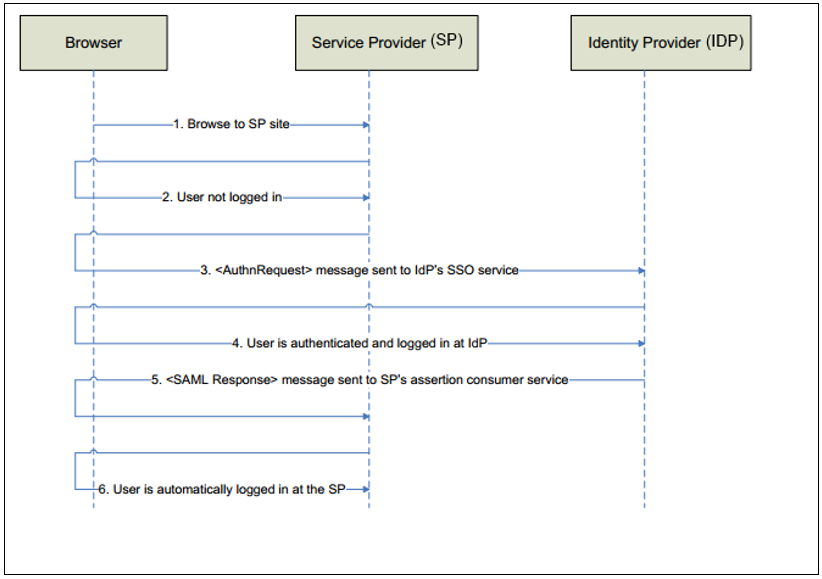
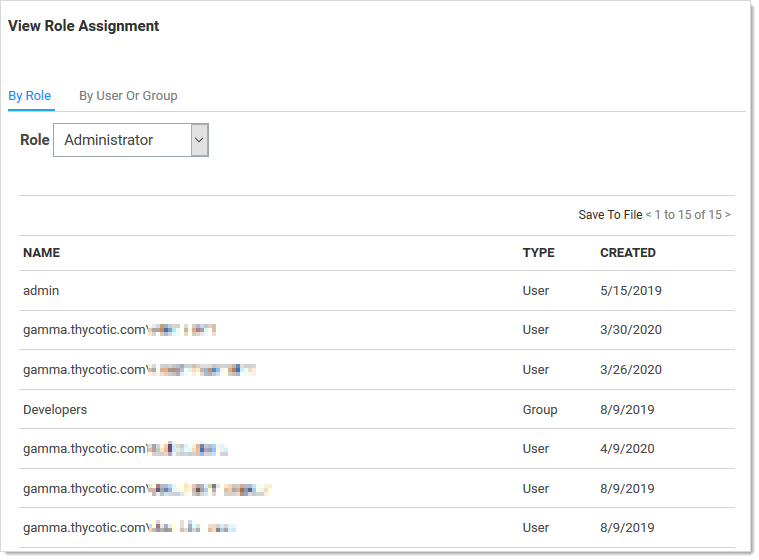
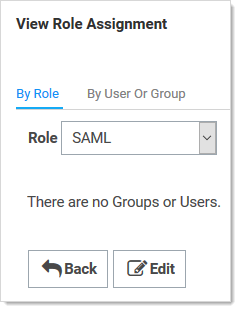
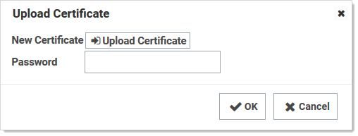

[title]: # (Configuring SAML Single Sign-on)
[tags]: # (authentication,SAML,SSO)
[priority]: # (1000)

# Configuring SAML Single Sign-on

> **Important:** This topic is for Secret Server v10.5 and later and assumes you have a running Identity Service Provider (IDP) with a signed certificate.

> **Note:** Secret Server does not support using SAML when Integrated Windows Authentication (IWA) is enabled.

> **Note:** This topic applies to Secret Server 10.5 and later. For earlier versions, please see [Configuring SAML in Secret Server](https://docs.thycotic.com/ss/10.8.0/authentication/configuring-saml-sso/index.md) (KBA).

## SAML Overview

Secret Server allows the use of SAML Identity Provider (IDP) authentication instead of the normal authentication process for single sign-on (SSO). To do this, SS acts as a SAML Service Provider (SP) that can communicate with any configured SAML IDP.

In the diagram below, SS acts as the service provider. Any configured SAML IDP can be used for this process and there are several well tested providers, including OKTA, OneLogin, Azure ADFS, and Microsoft ADFS.

**Figure:** Secret Server as a SAML Identity Provider

##  Prerequisites

### Licensing and Version

Secret Server Professional Edition or higher, upgraded to version 10.5 or later. To install a new SAML license, go to **Admin \> Licenses \> Install New License**.

### .NET Framework 4.6.2+

To use SAML 2.0, you must install .NET Framework 4.6.2 or higher on your Web server. This allows SS to use Microsoft’s “next generation” CryptoNG API for signing SAML requests, instead of being limited to the much older CryptoAPI. This is often necessary to use modern SSL certificates and is strongly recommended as a security best practice.

To download and install the latest version of .NET Framework: See [Microsoft .NET Framework 4.8 offline Installer for Windows](https://support.microsoft.com/en-us/help/4503548/microsoft-net-framework-4-8-offline-installer-for-windows) for the latest version as of when this topic was written. If you have already installed SS on the same Web server, you have already done this.

****

### Administer Configuration SAML Role Permission

The “Administer Configuration SAML” role permission is required to use SAML to access SS. To grant a user this permission from an administrator account:

1. Go to **Admin > Roles**. The Roles page appears.

1. Click the **Create New** button. The Role Edit page appears:

   

1. Type the name, such as `SAML`, in the **Role Name** text box.

1. Click to select the **Enabled** check box.

1. Click **Administer Configuration SAML** in the right side **Permissions Unassigned** list box.

1. Click the **\<** button to move the permission to the other side.

1. Click the **Save** button. The Roles page returns.

1. Click the Assign Roles button.name link of the newly created role. The View Role Assignment page appears:

   

1. Click the **Role** dropdown list to select the role you just created.

   

1. Click the **Edit** button. The Role Assignment page appears:

   

1. Move the desired users to the **Assigned** list using the same method as before.

1. Click the **Save Changes** button.

## Setting up Secret Server

1. Navigate to **Admin \> Configuration**.

1. Click the **SAML** tab:

   

1. Click the **Edit** button in the **SAML General Settings** section.

1. Click to select the **SAML Enabled** check box.

1. Click the **Save** button.

1. Under General Settings, click **Edit**, then check the **SAML Enabled** checkbox. **Save** changes.

1. Click the **Edit** button in the **SAML Service Providers** section.

1. Type a name for your SS service provider, such as `SecretServerServiceProvider`, in the **Name** text box.

1. Click the **Select Certificate** link. The Upload Certificate popup appears:

   

1. Click the **Upload Certificate** button to upload the certificate used for SS's HTTPS configuration.

1. Locate your certificate `.pfx` file and select it.

1. Click the **Open** button. The new certificate appears.

1. Type the access password for the private key of the certificate in the **Password** text box.

1. Click the **OK** button. The certificate is uploaded and tested, and the popup disappears. The certificate now appears in the SAML Service Provider Settings section.

   > **Note:** If you have an outdated version .NET Framework (earlier than 4.6.2), you may see an error recommending you upgrade to fix the error. Reload the certificate after you do so.

1. Click the **Save** button.

1. Click the Create New Identity Provider link. An Identity Provider popup appears.

1. Click the **Import IDP from XML Metadata** link.

1. Navigate to your `SecretServerSAMLMetadata.xml` file and select it. This is used for uploading into your IDP, which varies by provider. Follow instructions in the following section..

1. Click the Open button.

## Setting up IDPs

IDP setup varies by provider. Click one of the following links for instructions for your provider:

> **Note:** You must be logged in to access these links.

- [How To Set Up Okta For SAML Integration](https://thycotic.force.com/support/s/article/SS-Setting-up-OKTA-for-SAML) (KBA)
- [How To Set Up OneLogin For SAML Integration](https://thycotic.force.com/support/s/article/SS-Setting-up-OneLogin-for-SAML) (KBA)
- [How To Set Up Azure AD For SAML Integration](https://thycotic.force.com/support/s/article/SS-Setting-up-Azure-AD-for-SAML) (KBA)
- [How To Set Up ADFS For SAML Integration](https://thycotic.force.com/support/s/article/SS-Setting-up-ADFS-for-SAML) (KBA)

> **Note:** The username returned from the IDP to SS within the SAML Response/Assertion's subject statement must match the desired format. The format of the username passed depends upon how the user was created within SS.

> **Note:** If AD Sync was used to create SS users, the username returned from the IDP must match this format: `SecretServerUsername@ADsyncDomain` or`ADsyncDomain\SecretServerUsername`. If using SLO, ensure that the NameID is set correctly in the IDP as an outgoing claim for the Secret Server Service Provider. If a user has different sAMAccountName and userPrincipalName in Active Directory, custom rules in the IDP can be created.

## Lockout Workaround

Locked Out? Here’s how you get around SSO. If during the configuration process for SAML you lock yourself (as an administrator or a user) out of SS, you can log on SS without using the SSO workflow by using this URL string:

`[YourSecretServerInstanceName]/login.aspx?preventautologin=true`

The role permission needed for this is “Bypass SAML Login,” which admins have by default.

