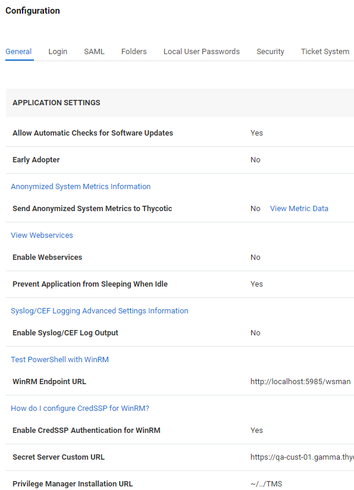
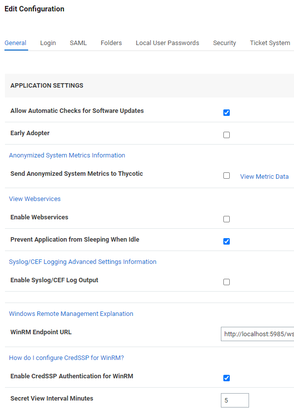
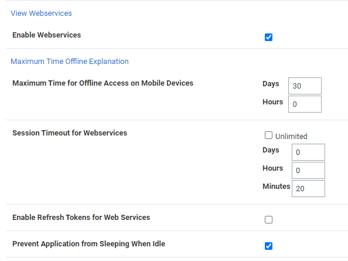
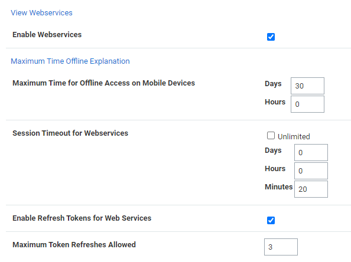

[title]: # "How to Enable Refresh Tokens for Web Services"
[tags]: # "authentication,refresh token,access token,web services"
[priority]: # "1000"

# How to Enable Refresh Tokens for Web Services

## Overview

Many modern secure applications use access tokens to ensure that users have access to the resources appropriate for them. Access tokens typically have a limited lifetime to ensure that information they contain or reference doesn't become stale, and to limit the time available for an attacker to use a stolen token.

When an access token expires or becomes invalid but the application still needs to access a protected resource, the application must use a new access token. To provide a new access token without requiring the user to grant permission a second time, OAuth 2.0 introduced an artifact called a *refresh token*.

Note the following:

- You cannot use a refresh token more than once.

- You cannot use a refresh token if your API Session Timeout is set to `unlimited`.

- In Secret Server, the refresh token "Time to live" equals the APISessionTimeout plus 15 minutes.

- Access tokens retrieved from REST can also be used for SOAP.

## How to Enable Refresh Tokens in Secret Server

### Procedure

You will receive a refresh token only if the option is enabled in **Admin** > **Configuration** as described below.

1. Click **Admin** > **Configuration** > then click the **General** tab.

   The **Enable Web Services** field is visible but not editable.

   

1. Scroll to the bottom of the window, click the **Edit** button, and scroll back up. The window title changes from **Configuration** to **Edit Configuration** and the **Enable Web Services** field is now editable.

   

1. Check the box next to **Enable Web Services**. The menu expands and the **Enable Refresh Tokens for Web Services** field is now visible.

    

1. Click to enable the check box next to **Enable Refresh Tokens for Web Services**. The menu expands and the **Maximum Token Refreshes Allowed** field is now visible.

   

1. Enter a numeral in the box next to **Maximum Token Refreshes Allowed**.

1. Scroll to the bottom of the page and click **Save**.

1. Authenticate with REST. You should receive both an access_token and a refresh_token.
1. Use the access token until it expires.
1. When the access token expires, POST to the same endpoint for authentication ("oauth2/token") with the body containing the following:

   `grant_type = "refresh_token"`

   `Set refresh_token  = <YOUR REFRESH TOKEN>`
1. You should receive a refresh_token and a new access_token.

### Example

````c++
[Net.ServicePointManager]::SecurityProtocol = [Net.SecurityProtocolType]::Tls12
$uri = "https:// < yoursecretserverinstance >"
$api = "$uri/api/v1"

function Authenticate {

    $args= @{
        username = "username"
        password = "password"
        grant_type = "password"
    }
  
    echo "----------------"
    echo "--Authenticate--"
    echo "----------------"
    $response = Invoke-RestMethod "$uri/oauth2/token" -Method Post -Body $args -ContentType "application/json"
    $global:token = $response.access_token
    $global:refreshToken = $response.refresh_token

    $global:headers = New-Object "System.Collections.Generic.Dictionary[[String],[String]]"
    $global:headers.Add("Authorization", "Bearer $token")
}

function Refresh {
    $args= @{
        grant_type = "refresh_token"
        refresh_token = $refreshToken
    }
  
    echo "---------------"
    echo "----Refresh----"
    echo "---------------"
    echo "--Sending Refresh Token"
    echo $refreshToken   
 
    $response = Invoke-RestMethod "$uri/oauth2/token" -Method Post -Body $args -ContentType "application/json"

    if($response.access_token){
        $global:token = $response.access_token
       $global:refreshToken = $response.refresh_token
        $global:headers = New-Object "System.Collections.Generic.Dictionary[[String],[String]]"
        $global:headers.Add("Authorization", "Bearer $token")
    }
}
````