[title]: # (Configuring Integrated Windows Authentication)
[tags]: # (Integrated Windows Authentication, IWA, Authentication, Credentials)
[priority]: # (1000)
[redirect]: # "SSIntegratedWindowsAuthentication"

# Configuring Integrated Windows Authentication

> **Note:** This article applies to Secret Server 10.6 and later.

## Introduction

Integrated Windows Authentication (IWA) allows users to log into SS automatically if they are logged into a workstation with their Active Directory credentials.

> **Note:** When using IWA, see [Using Mobile Devices with Windows Authentication Enabled](http://support.thycotic.com/KB/a142/using-mobile-devices-with-windows-authentication-enabled.aspx) to connect mobile applications to SS.

> **Note:** [Secure LDAP](http://support.thycotic.com/KB/a258/using-secure-ldap.aspx) only works with Integrated Windows Authentication in Server 2008 R2 and later.

## Setting Up Windows Authentication

### Task 1: Configuring Secret Server

1. Log into SS as a user with Active Directory administration privileges.

1. Navigate to **Administration > Active Directory**:

   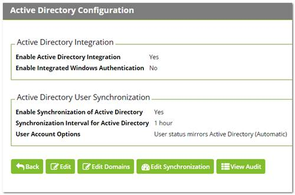

1. Click the **Edit** button. The Edit Active Directory Configuration page appears:

   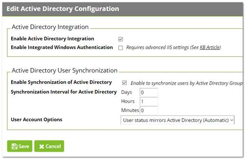

1. If necessary, click to select the following check boxes:
   - Enable Active Directory Integration
   - Enable Synchronization of Active Directory
   - Enable Integrated Windows Authentication.
1. Select your desired option from the **User Account Options** dropdown list.

1. Type the in the **Days**, **Hours**, and **Minutes** text boxes to choose a synchronization interval, which is how often SS pulls in users from AD.

1. Click the **Save** button. The Active Directory Configuration page reappears:

   

1. Click the **Edit Domains** button. The Active Directory Domains page appears:

   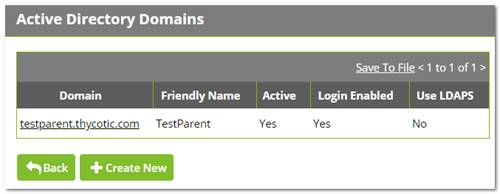

1. Click the **Create New** button. The Active Directory Domain page appears:

   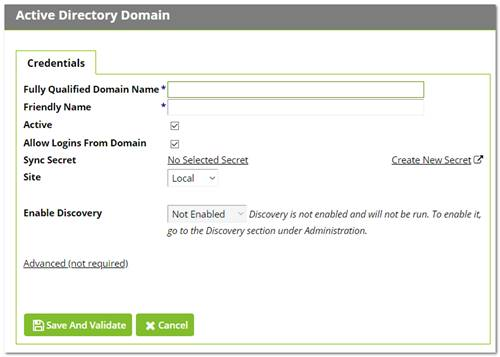

1. Type the domain name for single-sign-on in the **Fully Qualified Domain Name** text box.

1. Type the human-friendly name in the **Friendly Name** text box.

1. Click the **Save and Validate** button. The Active Directory Configuration page reappears:

   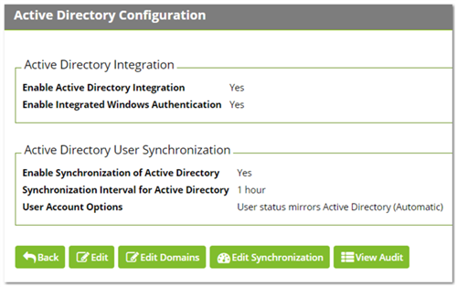

1. Click the **Edit Synchronization** button. The Synchronization Edit page appears:

   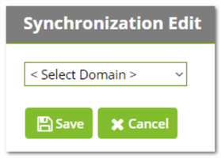

1. Click the dropdown list to select the desired domain. The page changes to show the groups for that domain:

   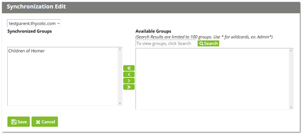

1. Use the **Available Groups** text box and **Search** button to locate your desired groups. The matching groups appear in the list:

   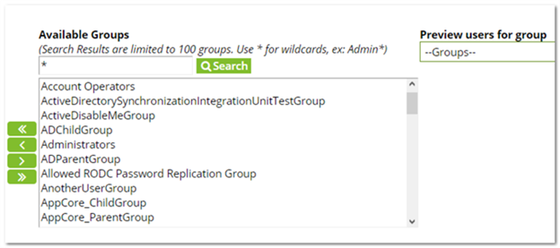

1. Select the desired groups and click the **<<** button to move them into the **Synchronized Groups** list.

1. Click the **Save** button. The Active Directory Configuration page reappears.

1. Click the **Synchronize Now** button in the **Messages** section. This pulls all the users of the specified groups into SS.

### Task 2: Configuring IIS

1. Start the Internet Information Services (IIS) Manager:

   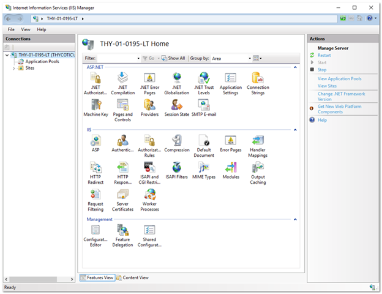

1. Navigate to and select your SS website in the **Connections** tree:

   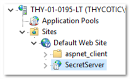

1. Double-click the **Authentication** icon in the **IIS** section to open the **Authentication** pane.

1. Enable the **Windows Authentication** parameter by right-clicking it and selecting **Enable**. For now, ignore the alert if it appears in the Alert section.

   >**Note:** If Windows Authentication is not visible, ensure that the Windows Authentication Role service is enabled in Windows. This is different than earlier versions.

1. Disable the **Anonymous Authentication**.

1. Disable the **Forms Authentication**. The alert in the Alert section should disappear.

1. When finished, the Authentication settings should look like this:

   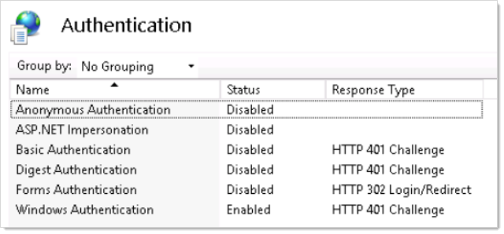

1. Restart your IIS server with an `iisreset` command.

1. On the SS folder, ensure users have read or higher permission, and ensure the security settings are set to be inherited by child objects. Because SS impersonates those users, they require access to SS files.

1. Log in to the SS site from an authenticated workstation.

### Task 3: Configuring Secret Server Launchers

By default, a launcher will not work when using IWA, resulting in an HTTP 401: Unauthorized error. If this is an issue, ensure SS is on Windows Server 2008 or later and complete the following steps:

1. Open IIS and browse to your SS application.

1. Click the **>** to see the application's folders:

   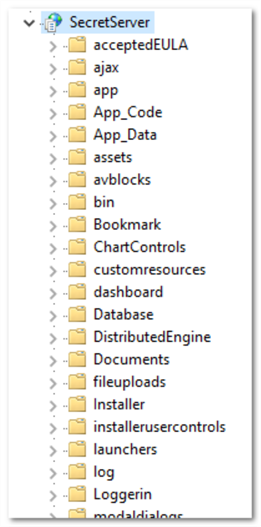

1. Click to select the **launchers** folder. The launchers Home panel appears:

   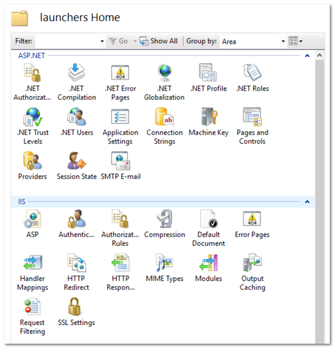

1. Double-click the **Authentication** icon in the **IIS** section to open the **Authentication** pane.

1. Ensure the **Anonymous Authentication** is set to **Enabled**.

1. Ensure the **Windows Authentication** is set to **Disabled**.

1. Ensure all others are disabled. When you are finished, the settings should look like this:

   

1. Click the **webservices** folder.

1. Double-click the **Authentication** icon in the **IIS** section to open the **Authentication** pane.

1. Ensure the **Anonymous Authentication** is set to **Enabled**.

1. Ensure the **Windows Authentication** is set to **Disabled**.

1. Ensure all others are disabled. When you are finished, the settings should look like this:

   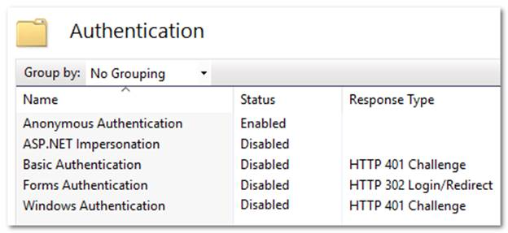

1. Click the **rdp** folder.

1. Double-click the **Authentication** icon in the **IIS** section to open the **Authentication** pane.

1. Ensure the **Anonymous Authentication** is set to **Enabled**.

1. Ensure the **Windows Authentication** is set to **Disabled**.

1. Ensure all others are disabled. When you are finished, the settings should look like this:

   

**Task 4: Configuring Distributed Engines**

Similarly, SS with distributed engines will not work with IWA by default. If this is an issue, complete the following:

1. In Windows Explorer, navigate to the `…\SecretServer\` folder:

   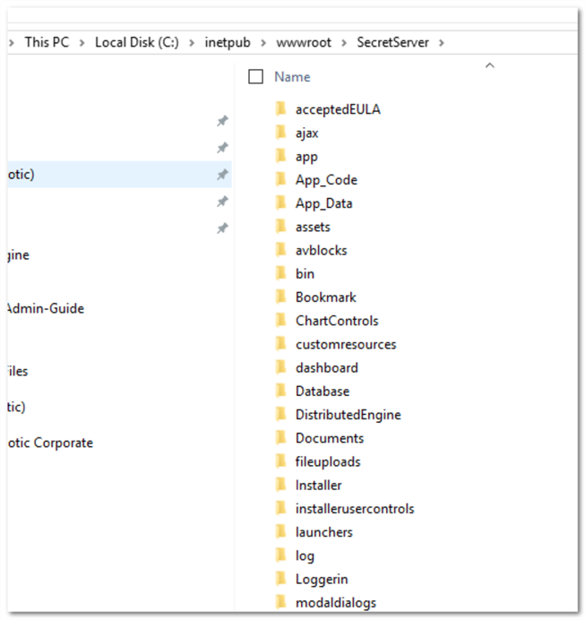

   This folder is mapped to your `SecretServer` folder in your webserver:

   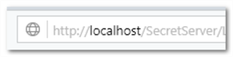

1. Create a subfolder named `…\SecretServer\integrations`.

1. Create a subfolder called `…\SecretServer\api` in the same location.

1. In your `…\SecretServer\api` folder, create a subfolder named `…\SecretServer\api\DistributedEngine`.

1. When you are finished, the new folders appear as follows:

   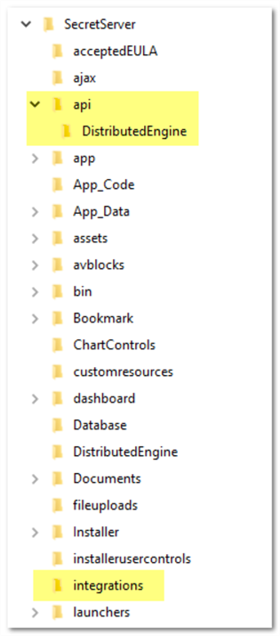

1. Start IIS Manager:

   

1. Navigate the **Connections** tree back to **integrations** folder in the **SecretServer** node:

   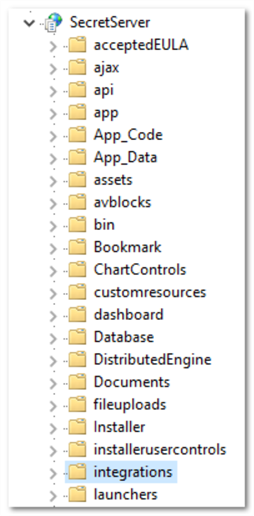

1. Double-click the **Authentication** icon in the **IIS** section to open the **Authentication** pane.

1. Ensure the **Anonymous Authentication** is set to **Enabled**.

1. Ensure the **Windows Authentication** is set to **Enabled**.

1. Ensure all others are disabled. When you are finished, the settings should look like this:

   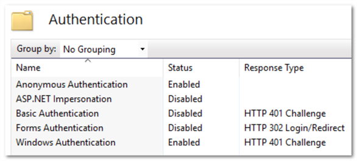

1. Navigate to the `…\SecretServer\api\DistributedEngine` folder.

1. Double-click the **Authentication** icon in the **IIS** section to open the **Authentication** pane.

1. Ensure the **Anonymous Authentication** is set to **Enabled**.

1. Ensure the **Windows Authentication** is set to **Disabled**.

1. Ensure all others are disabled. When you are finished, the settings should look like this:

   

### Task 5: Configuring Client Certificates

If you are using client certificates, configure the following in IIS for launchers to work:

1. Click to select the **launchers** folder. The launchers Home panel appears:

   

1. Double-click the **SSL Settings** icon. The settings panel appears:

   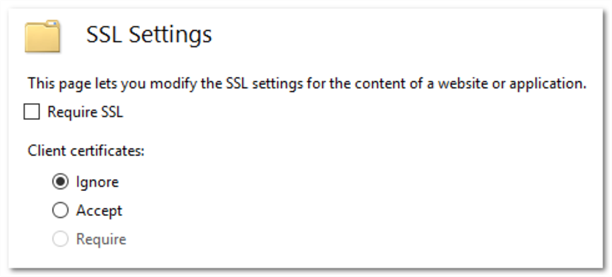

1. Click to set the **Client Certificates** selection button to **Accept**.

1. Click to select the **Webservices** folder.

1. Once again, double-click the **SSL Settings** icon.

1. This time, set the **Client Certificates** selection button to **Ignore**.

>**Note:** If you are not automatically logged in to SS after setting up IWA, IIS may not be handling the credentials correctly. To fix this, recreate the web site in IIS.

>**Note:** When testing IWA, keep in mind the requirements at [Internet Explorer May Prompt You for a Password](http://support.microsoft.com/kb/258063).

>**Note:**  You may not be able to log in using IWA on the server running SS for Server 2008 or later because of security settings.

## Troubleshooting

### Error "403 Forbidden" Message Is Displayed When Logging in

See [Integrated Windows Authentication Problem after Upgrading to Secret Server 10](https://thycotic.force.com/support/s/article/ka037000000HtzSAAS/Integrated-Windows-Authentication-problem-after-upgrading-to-10+) (KBA).

### AD User Prompted for Credentials Even Though IWA Is Active

A user is logged onto their machine with the same Active Directory credentials they can log into SS with, but the browser still prompts them for their credentials to reach the site. Ensure your SS site is included in a security zone that allows for automatic logon:

1. In Internet Explorer, go to Internet **Options > Security**.

1. Click the **Trusted Sites** security zone.

1. Click the **Custom Level** button. The Security Settings – Trusted Sites Zone dialog box appears:

   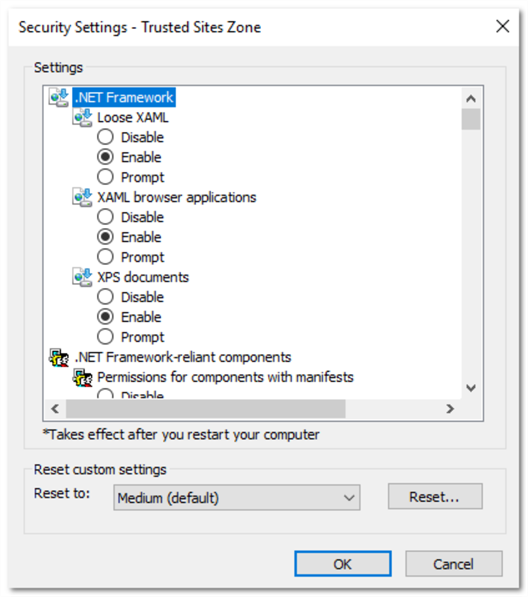

1. Scroll down to **User Authentication**.

1. Click to select the **Automatic logon with current user name and password** selection button.

1. Click the **OK** button.

### Logging in as a Local Account Is Not Available

In SS 10.0 and later, SS requires Integrated Mode in IIS. The Integrated Mode can only support either Window Authentication or Forms Authentication (used for local account authentication), not both. Because of this limitation, Forms Authentication must be disabled for the site when using Integrated Windows Authentication. Thus, logging in as SS local account is not available when IWA is enabled.

### Installing Windows Authentication in Windows Server 2012 Manager

1.  In Server Manager, click the **Manage** menu and select **Add Roles and Features**. The Add Roles and Features wizard appears.

1. Click the **Next** button. The Select installation type window appears.

1. Select the installation type.

1. Click the **Next** button. The Server selection window appears.

1. Select the destination server.

1. Click the **Next** button. The Server roles window appears.

1. Click to expand **Web Server (IIS) > Web Server > Security**.

1. Click to select **Windows Authentication**.

1. Click the **Next** button. The Select features window appears.

1. Click the **Next** button. The Confirmation window appears.

1. Click the **Install** button. The Results window appears.

1. Click the **Close** button.

