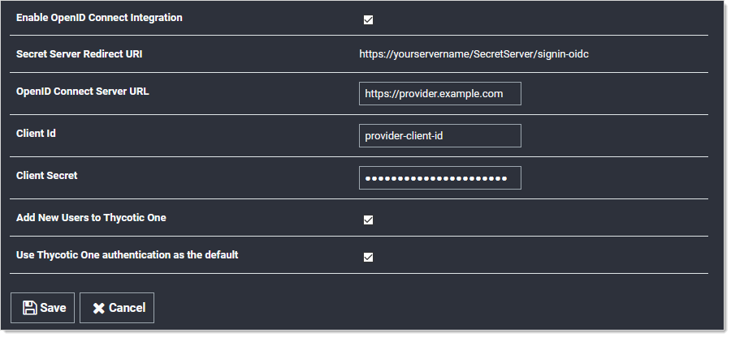
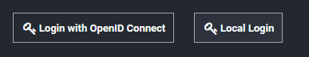

[title]: # (OpenID Connect Integration)
[tags]: # (Authentication,integration,openid)
[priority]: # (1000)

# OpenID Connect Integration

> **Note:** This applies to Secret Server Version 10.7 SP2+.

## Introduction

### OpenID Connect

OpenID Connect is an industry-standard single-sign-on (SSO) protocol. An identity provider implementing OpenID Connect can be used as an identity source for Secret Server (SS), allowing users to log in with external credentials.

### OpenID Connect Support in Secret Server

Secret Server implements OpenID Connect authorization code flow, allowing any standards-compliant provider to be used as an identity source. To use OpenID Connect, a SS administrator must configure the login integration. Additionally, user accounts must be created in SS that correspond to the external accounts.

## Prerequisites

### General

- Secret Server version 10.7 SP2+
- An OpenID-Connect-compatible identity provider, such as Thycotic One, Azure AD, Auth0, or Okta.

### Permissions

- To configure the login integration, a SS use must have Administer OpenID Connect permissions.
- To add user accounts that can be used with OpenID Connect, a SS user must have administer user permissions.

# Configuration

### Task One: Acquire and Configure an OpenID Connect Provider

1. Follow your OpenID Connect provider’s setup instructions for configuring a new identity client.
   
1. Gather the configuration data from the provider. To configure an OpenID Connect login provider, the provider must supply these:
   
   - **Provider URL**: An HTTPS URL, acting as an authentication endpoint. SS expects the provider URL to be the “issuer” URL of the provider. For example, if the OpenID Connect configuration for the provider is accessible at 
   
     `https://example.com/.well-known/openid-configuration`,
   
     then the URL used in the SS configuration should be
   
     `https://example.com`.
   - **Client ID**: The ID portion of the credentials used to interact with the provider.
   - **Client Secret**: The password portion of the credentials used to interact with the provider.
   
   The process for determining this information varies by provider and you can usually find it by following the provider-specific documentation for configuring an OpenID Connect client.
   
1. Configure the provider with the SS Redirect URI, as shown below, when configuring OpenID Connect integration in SS. It is usually `https://YourWebServer/SecretServer/signin-oidc`. The Secret Server Redirect URI value must be added to the provider’s configuration, so that the SS instance can perform the authentication handshake. This process varies by provider, but it is usually known as a post-login redirect URI or callback URI.

### Task Two: Configure Secret Server

1. Locate the SS OpenID Connect configuration at **Admin \> Configuration \> Login**:
   
   
   
1.  Click to select the **Enable OpenID Connect Integration** check box.

1.   Fill in the other values using the what you gathered earlier.

     > **Note:** The two Thycotic One options are not relevant unless you use Thycotic One as your OpenID Connect provider. They have no effect for other providers.
   
1. Click the **Save** button.

### Task Three: Matching External Accounts to Secret Server Users

Ensure a matching user already exists in SS, which is required when logging on an OpenID Connect account. OpenID provides for no user list synchronization or on-the-fly account creation. Users are matched according to the claims provided in their authentication ticket. Matching occurs using the following criteria:

- If the name identifier value matches an active user that has already logged in with OpenID Connect, then this user will be logged on.

- If not, then if the email or UPN values match an existing, unique, active SS user, then this user will be logged on.

Otherwise, the login attempt will fail, and information about the failure will be added to the system log.

### Task Four: Logging on with OpenID Connect

Finally, confirm the configuration by logging on with OpenID Connect. Once Open ID Connect has been configured, the SS login page will have a new **Login with OpenID Connect** button:

Clicking this button initiates the OpenID Connect log on process with the external provider. Depending on provider settings, you may be asked to approve the login request or grant access to specific profile info. Once you have approved the request and logged in to the external provider, you will be redirected back to SS and logged in as the corresponding local user.