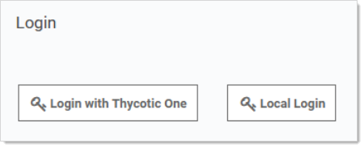
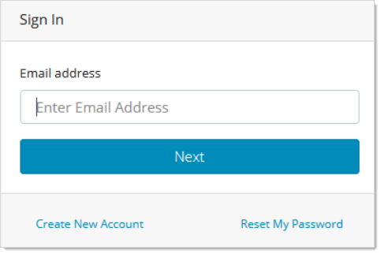
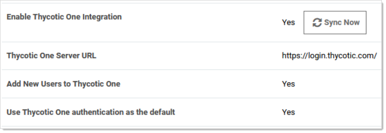
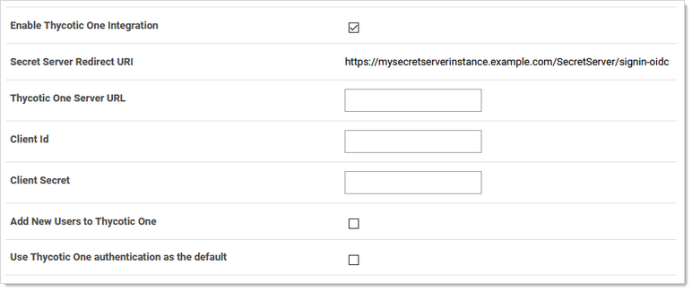

[title]: # (Thycotic One and Secret Server)
[tags]: # (Authentication, Thycotic One)
[priority]: # (1000)

# Thycotic One and Secret Server

## Overview

Thycotic One is the single-sign-on provider for Thycotic applications. With Thycotic One, one user account can be granted access to multiple Thycotic products, such as Secret Server (SS), Privilege Manager, DevOps Secrets Vault, and Account Lifecycle Manager.

Thycotic One enables login integration using the OpenID Connect protocol, an industry standard single-sign-on method.

This article describes the Thycotic One configuration options available in SS.

## Cloud versus On-Premise

Thycotic One is the default identity provider in SS Cloud. When you set up the cloud instance, it will already be configured and ready to use Thycotic One. The initial admin user will log in with their Thycotic One account, and optionally, all newly created SS accounts can be synchronized with Thycotic One, so they can log in that way as well.

Thycotic One integration is off by default in the on-premise release of SS, but it is supported. You can turn on Thycotic One integration and configure it. For example you might want to share an identity provider between your on-premise instance, and one or more other cloud products.

## Procedures

###  Logging in with Thycotic One

When Thycotic One integration is turned on, all SS users can log in either with their local passwords or with Thycotic One. All SS permissions and configuration will apply to that user regardless of how they logged in.

However, the local username and password and the Thycotic One username and password are not necessarily the same thing. In Thycotic One, you'll log in with your email address rather than your username, and the password you use may very well be different from the SS password.

You'll see this on the login screen:

Clicking **Local Login** will bypass Thycotic One and allow the user to log in with their local SS password. Clicking **Login with Thycotic One** will redirect the user to Thycotic One to authenticate. Once that is successfully done, the user will be redirected back to SS.

After clicking **Login with Thycotic One**, users will type their email address and password:

And then be redirected back to their dashboard in SS.

### Configuring Thycotic One

Thycotic One integration is configured on the **Admin** > **Configuration** page, under the **Login** tab. You can view the configuration there:

The **Sync Now** button provides a way for you to trigger a synchronization of your SS accounts with Thycotic One. In most cases, you will not need to use this, as synchronization will happen on a schedule or whenever a relevant event happens, such as enabling a user or performing an Active Directory synchronization. Only active user accounts with email addresses will be synchronized.

Click **Edit** at the bottom of the page to change the configuration. The available options are slightly different between the cloud and on-premise versions of SS.

#### Secret Server Cloud

When editing the options in SS Cloud, you'll see something like this:

Here are the available options:

- **Enable Thycotic One Integration:** Turn on to enable Thycotic One functionality. Turn off to completely disable Thycotic One logins and synchronization. Make sure you have an admin account with a working local password.
- **Secret Server Redirect URI:** For informational purposes, this shows the page address to which you are redirected after you have logged in with Thycotic One.
- **Thycotic One Server URL:** The Thycotic One server you have connected to. There is one separate Thycotic One instance in each SS Cloud region.
- **Secret Server Redirect URI:** For informational purposes, this shows the page address to which you are redirected after you have logged in with Thycotic One.
- **Client Secret:** Not shown, the client password portion of the credentials.
- **Secret Server Redirect URI:** For informational purposes, this shows the page address to which you are redirected after you have logged in with Thycotic One.
- **Use Thycotic One authentication as the default:** When checked, Thycotic One authentication is used for the REST and SOAP APIs and mobile apps. Users who have logged in with Thycotic One use their Thycotic One account passwords for those activities, rather than their local SS account passwords. When unchecked, they will use their local SS account passwords for those activities.

In Cloud, the server URL, client ID, and client secret cannot be edited—they are set up for you when the instance is provisioned and cannot be changed.

#### Secret Server On-Premise

When editing the options in SS on-premise, you'll see something like this:

Unlike in Cloud, the server URL, client ID, and client secret can be edited in an on-premise instance. You can generate Thycotic One credentials using Thycotic's cloud management portal, Cloud Manager. Otherwise, the configuration options behave the same as in Cloud.

### Generating a Thycotic One Credential

To generate a credential for use in an on-premise SS instance, follow the steps below:

1. From Cloud Manager, choose a Thycotic One region under Other Login Options.

1. Log into Thycotic One as a user that will be managing your organization's credentials. Create an account if you have not yet done so.

1. Go to Cloud Manager at https://portal.thycotic.com/.

1. Click **Sign In**. You are redirected to our tech support portal login.

1. Click the button for the Thycotic One region you chose. Since you are already logged in to Thycotic One, this will redirect you back to Cloud Manager.

1. Next, choose a team: In the menu, go to **Manage** > **Teams**. You may already have one if you have an existing cloud product. If not, create one. Each team can handle multiple Thycotic One credentials.

1. Having selected your team, go to **Organizations**. Again, if you already have an organization, you can use it; if not, you can create one. An organization provides a way to manage the global login policies for all users.

1. Go to **Credentials**. Click **Add**. An Organization Credential dialog box appears:

   

1. The available fields are as follows:

    - **Name:** A description of the application using this credential, for informational purposes.
   - **Post-Login Redirect URIs:** A list of valid URIs that will be allowed to authenticate with this credential. The value of "Secret Server Redirect URI" from your on-premise instance should go here. If users access your instance with more than one URI, you may want to add all of them here by clicking the **+** button to create additional fields. Unless an application supplies a URI that is an exact match to one of these, Thycotic One will not complete the authentication.

    - **Name:** A description of the application using this credential, for informational purposes.
   - **Credentials:** The fields in this area contain the values you need to put into the Thycotic One configuration in SS. Copy and paste them into the corresponding fields.

1. Once you capture all the values, click **Save**, and then save the configuration in SS as well. Your instance is now fully integrated with Thycotic One. If you selected the synchronization option, SS will immediately sync your active users with Thycotic One, and they'll receive welcome emails describing how to continue the process.

