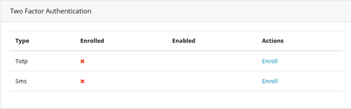
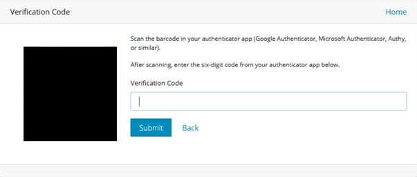
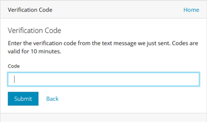
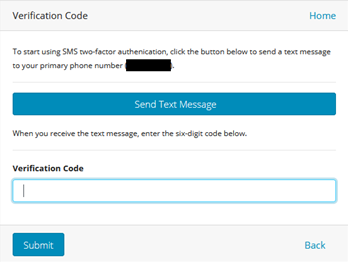

[title]: # (Using Two-Factor Authentication with Thycotic One)
[tags]: # (Two-Factor,Authentication,Thycotic One,Credentials,2FA)
[priority]: #

# Enabling Two-Factor Authentication in Thycotic One

When two-factor authentication is enabled, Thycotic One presents a two-factor challenge to the user logging in. The Thycotic One two-factor authentication supplements and does not replace any other two-factor authentication methods used by a client application such as Secret Server. Thycotic One supports two-factor authentication using TOTP or SMS. You can have only one two-factor authentication method active at any time. We recommend using TOTP over SMS whenever possible for better security.

## TOTP Two-Factor Authentication

To use TOTP two-factor authentication with Thycotic One, you must first have a mobile device with an installed TOTP application such as Google Authenticator, Authy, or Microsoft Authenticator. When you have the app installed, follow the steps below.

1. Log into Thycotic One and on the account homepage in the **User Home - Apps** dialog, click **Two-Factor Authentication**.

   

1. Choose **TOTP** and click **Enroll**.

   

   Thycotic One displays a barcode (redacted in the example shown).

   

1. Using the TOTP app on your mobile device, scan the barcode. You will receive multiple six-digit codes.

1. In the Verification Code field, enter one of the six-digit codes (a new code is generated every 30 seconds).

   

When you have correctly entered and submitted a six-digit code, the setup of TOTP two-factor authentication is complete. From this point forward, each time you attempt to log in you will receive a text message on your mobile device with a code that you must enter to complete the login process.

## SMS Two-Factor Authentication

To use SMS two-factor authentication with Thycotic One, you must first provide and verify a mobile phone number.
1. To provide a mobile phone number, log into Thycotic One, and on the account homepage in the **User Home - Apps** dialog, click **Profile**.

   

1. Click **Add Phone** and enter the country code and phone number of a mobile phone that accepts text messages.

   

1. Click **+Add** and **Verify**.

   Thycotic One sends a text message to the phone number, with a code.

1. Enter the code and click **Submit** in the Verification Code dialog.

   

   The phone number now appears as Verified on your profile page.

1.On the Thycotic One account homepage in the **User Home - Apps** dialog, click **Two-Factor Authentication**.

   

1. Choose **SMS** and click **Enroll**.

   

   Thycotic One sends a text message to your phone with a six-digit code.

1. Enter the six-digit code into the box provided.

   

When you have correctly entered and submitted the six-digit code, the setup of SMS two-factor authentication is complete. From this point forward, each time you attempt to log in you will receive a text message on your mobile device with a code that you must enter to complete the login process.
