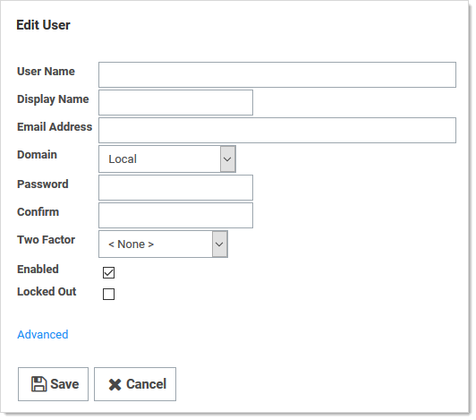

[title]: # (Duo Security Authentication)
[tags]: # (Authentication, Credentials, 2FA)
[priority]: #

# Duo Security Authentication

> **Note:** Using this method of two-factor authentication requires that you have an active account for Duo Security.

> **Note:** SS supports using Duo Security as a second factor of authentication. See below for setup instructions.
>
> Note:  For more information on Duo and Secret Server, see the [Thycotic Secret Server and Duo](https://www.duosecurity.com/docs/thycotic) page.

## Task 1: Create a Duo Application Representing Your Secret Server (Admin)

1. Sign up for a new Duo account, or log in to an existing one at [Duo Security](http://duosecurity.com).

1. Under **Applications**, create a new application of the **Thycotic Secret Server** type. Name the application as you wish.

1. Record the API hostname, integration key, and secret key from the new Duo application you just created.

## Task 2: Configure Secret Server to Use Duo (Admin)

> **Note:** Because Duo is a service, the SS instance must have outbound access (TCP port 443) to reach the API host to work. If there is a firewall rule preventing access to Duo's servers, two factor authentication will not work.

1. Open SS.

1. From the **Admin** menu, select **Configuration**.

1. Click the **Login** tab, and then click **Edit**.

1. Select the **Enable Duo Integration** check box.

1. Enter the **API Hostname**, **Integration Key**, and **Secret Key** values.

1. Click the **Save** button.

1. Go to **Admin \> Users** to create a test user. The Users page appears.

1. Click the **Create New** button. The **Edit User** page appears:

   

1. Click the **Two Factor** dropdown list and select **Duo**.

1. Type or select the other parameters for the new user. See [Users](../../../users/index.md).

1. Log on as the test user. If there are multiple two-factor devices available, you will be prompted to select one. If you are un-enrolled you will be given a link to perform self-enrollment. You are contacted via the Duo app, SMS, or a phone call for the second factor.

1. Add or configure actual users one at a time or by using bulk operations.

## Task 3: Setting up Duo (User)

1. Log on to SS.

1. After successful authentication, a new screen appears with the option to select a method to authenticate with.

1. Select one of the options (**Duo Push**, **Send SMS**, or **Phone)**, depending on your setup with Duo) and complete the selected authentication process to log in.
