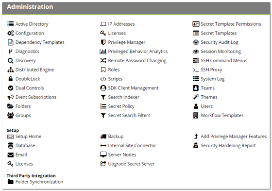
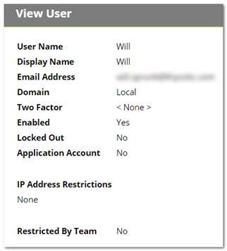
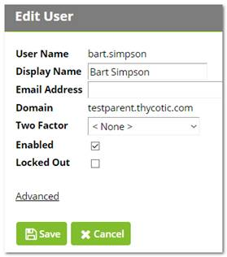
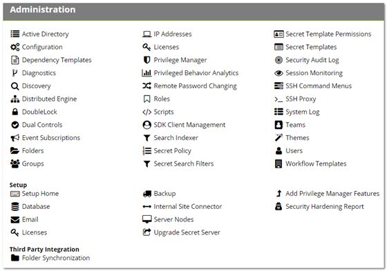
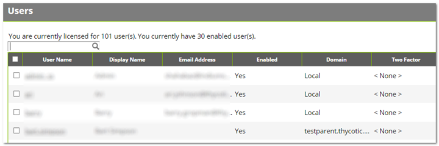
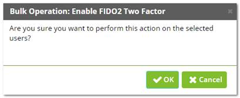
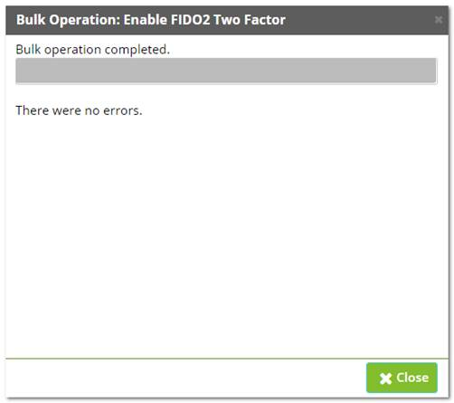
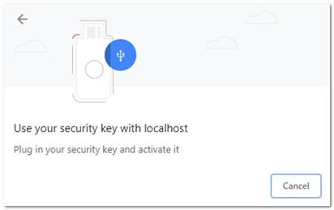
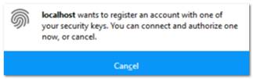

[title]: # (FIDO2/YubiKey Two-Factor Authentication Configuration)
[tags]: # (Authentication, Credentials, 2FA)
[priority]: #

# FIDO2 (YubiKey) Two-Factor Authentication Configuration

## Overview

### FIDO2

FIDO2 (Fast Identity Online, second edition) is an open authentication standard that uses physical devices for authentication. Thycotic uses it for two factor authentication (2FA) with FIDO2 providing the second authentication after a normal password entry—any FIDO2-enabled user attempting access to a SS account **must** have a FIDO2 device in hand. The device eliminates many password-related issues, such as phishing and man-in-the-middle attacks. It also speeds up the long on process over callback or texting 2FA.

### YubiKey

YubiKey is a FIDO2-compliant product series from Yubico, a commercial company. We recommend two of their devices--YubiKey 5 Series and Security Key by Yubico.

## Configuration

FIDO2 configuration follows these steps, which we cover in detail in this section:

1. Enable FIDO2 in your SS.

2. Set up the user's credentials.

3. Distribute the FIDO2 device to the user.

4. User registers his or her device.

### Prerequisites

- One FIDO2 device. We recommend the YubiKey series.
- A SS Vault license or greater.
- Administer Users or User Owner permissions in SS.
- A Firefox or Chrome browser.

### Enabling FIDO2 for a Single User

1. In SS, click the **Admin** menu item. The Administration page appears:

2. Click the **Users** button. The Users page appears:

3. Click the link in the **User Name** column for the user you want to configure. The View User page appears:

4. Scroll down and click the **Edit** button. The Edit User page appears:

5. Click the **Two Factor** list and select **FIDO2**.

6. Click the **Save** button.

### Enabling FIDO2 for Multiple Users

1. In SS, click the **Admin** menu item. The Administration page appears:

2. Click the **Users** button. The Users page appears:

3. Click to select the unlabeled check box next to each user you wish to include.

4. Click the **Select Bulk Operation** list below the table and select **Enable FIDO2 Two Factor**. A warning popup page appears:

5. Click the **OK** button. A confirmation popup page appears:

6. Click the **Close** button.

### Disabling FIDO2 for Users

Disabling FIDO2 for users, for both single and multiple, is almost the same as enabling them. There are two differences:

- For a single user, select **\<None\>** for the Two Factor list on the **Edit User** page.
- For multiple users, select **Disable FIDO2 Two Factor** in the **Select Bulk Operation** list on the **Users** page.

> **Note:** Disabling FIDO2 2FA does **not** remove device registration information from SS. If FIDO2 is re-enabled, the user can use the FIDO2 device without re-registering it.

### Unregistering Users from FIDO2

Resetting FIDO2 serves to unregister existing users. There is no way to reverse it—users will have re-register a FIDO2 device, even the same one.

Resetting FIDO2 for both single and multiple users is very similar to enabling FIDO2 for multiple users. The only difference is you select **Reset FIDO2 Two Factor** in the **Select Bulk Operation** list on the **Users** page. That is right, for single users—you do a bulk operation.

### Registering FIDO2 Devices (End User Operation)

1. After an admin registers the user in SS the user is prompted upon his or her next log on. For example, in Chrome:

​	Or in Firefox:

>**Note:** Legacy Microsoft Edge is not supported. Edge Chromium, version 79 or higher, is required for FIDO2 support.

2. The user inserts his or her FIDO2 device into a USB port on the computer.

3. The user activates it by touching the sensor on the device.

4. After successful registration, the user is **again** prompted with the same screen, which is authenticating the current session against the credentials that were just registered.

5. From then on, the user is prompted for his or her security after a successful username-password login. Once the key is authenticated, the SS Dashboard appears.

> **Note:** Only one FIDO2 device per user can be registered at any given time; however, the 2FA settings can be temporarily disabled or reset in the case of a lost or forgotten FIDO2 device.

# Auditing and Security

- Upon registration, a user's FIDO2 Credential, the FIDO2 Public Key JSON string, and the FIDO2 Counter is stored in the User's audit log.
- Upon each successful FIDO2 authentication, the FIDO2 counter value is updated and noted in the User's audit log.

# Troubleshooting and Issues

- If the user encounters an error or does not fulfill the authentication before the process times out, the user is redirected back to the username and password log on screen where the process can be reattempted.
- Authentication activities are logged in the user's audit log. 
- System errors are logged in the ss.log file in SS's log directory.