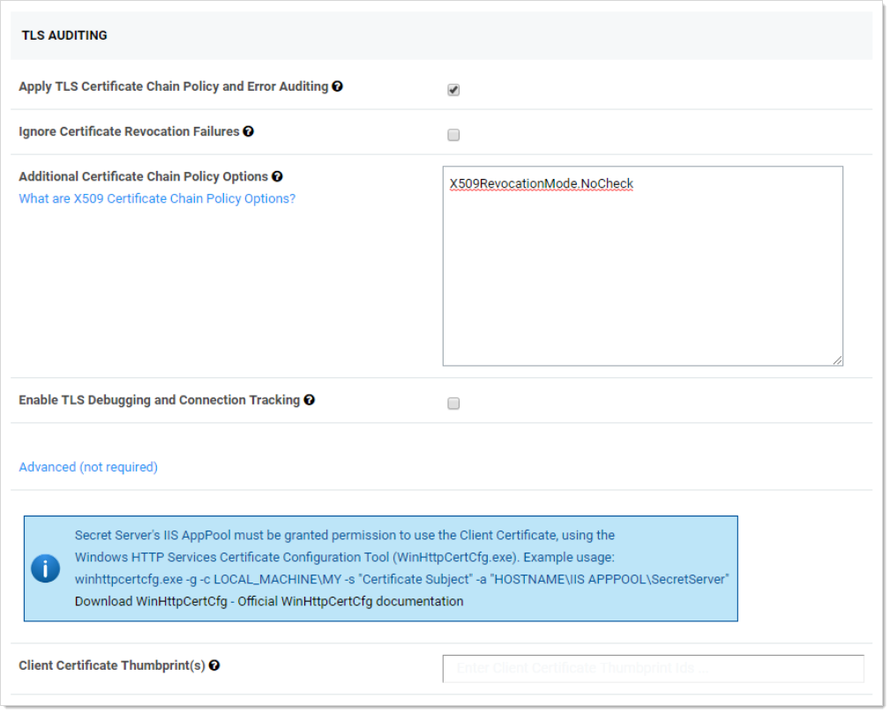

[title]: # (X.509 Certificate Security Chain Options)
[tags]: # (Authentication, Certificate, X.509)
[priority]: # (1000)

# X.509 Certificate Security Chain Options

Starting with version 10.4, Secret Server allows you to define a policy for validating X509 Certificates. This applies to all Active Directory domains using LDAPS. It also applies to any connections to syslog servers over TLS. Certificates that do not meet the policies specified in SS are rejected, denying connections to the server. All certificate validation failures are logged in the security audit log, which is available by going to **Admin > See All** and then **Security Audit Log**.

## Setting the Certificate Verification Policy

To set a verification policy:
$1
$2$1
$2$1
$2$1
$2   
   
   
$1
$21. If you wish to ignore certificate revocation warnings and allow revoked certificates, click to select the **Ignore Certificate Revocation Failures** check box.

## Certificate Validation Options

The following Microsoft enumerations are the available certificate chain policy options. For detailed descriptions of each option, see the linked documentation. 

### X509RevocationMode

Specifies the mode used to check for X.509 certificate revocation.

| Enumeration Item | Value | Description                                                  |
| ---------------- | ----- | ------------------------------------------------------------ |
| NoCheck          | 0     | No revocation check is performed on the certificate.         |
| Offline          | 2     | A revocation check is made using a cached certificate  revocation list (CRL). |
| Online           | 1     | A revocation check is made using an online certificate  revocation list (CRL). |

See [X509RevocationMode Enum](https://msdn.microsoft.com/en-us/library/system.security.cryptography.x509certificates.x509revocationmode(v=vs.110).aspx) for details.

### X509RevocationFlag

Specifies which X.509 certificates in the chain should be checked for revocation.

| Enumeration Item   | Value | Description                                                  |
| ------------------ | ----- | ------------------------------------------------------------ |
| EndCertificateOnly | 0     | Only the end certificate is checked for revocation.          |
| EntireChain        | 1     | The entire chain of certificates is checked for revocation.  |
| ExcludeRoot        | 2     | The entire chain, except the root certificate, is checked for revocation. |

See [X509RevocationFlag Enum](https://docs.microsoft.com/en-us/dotnet/api/system.security.cryptography.x509certificates.x509revocationflag?view=netcore-3.1) for details.

### X509VerificationFlags

Specifies conditions under which verification of certificates in the X.509 chain should be conducted. These values can be bitwise combined to indicate multiple flags.

| Enumeration Item                            | Value | Description                                                  |
| ------------------------------------------- | ----- | ------------------------------------------------------------ |
| AllFlags                                    | 4095  | All flags pertaining to verification are included.           |
| AllowUnknownCertificateAuthority            | 16    | Ignore that the chain cannot be verified due to an unknown certificate authority (CA). |
| IgnoreCertificateAuthorityRevocationUnknown | 1024  | Ignore that the certificate authority revocation is unknown when determining certificate verification. |
| IgnoreCtlNotTimeValid                       | 2     | Ignore that the certificate trust list (CTL) is not valid, for reasons such as the CTL has expired, when determining certificate  verification. |
| IgnoreCtlSignerRevocationUnknown            | 512   | Ignore that the certificate trust list (CTL) signer revocation is unknown when determining certificate verification. |
| IgnoreEndRevocationUnknown                  | 256   | Ignore that the end certificate (the user certificate) revocation is unknown when determining certificate verification. |
| IgnoreInvalidBasicConstraints               | 8     | Ignore that the basic constraints are not valid when determining certificate verification. |
| IgnoreInvalidName                           | 64    | Ignore that the certificate has an invalid name when determining certificate verification. |
| IgnoreInvalidPolicy                         | 128   | Ignore that the certificate has invalid policy when determining certificate verification. |
| IgnoreNotTimeNested                         | 4     | Ignore that the CA (certificate authority) certificate and the issued certificate have validity periods that are not nested when  verifying the certificate. For example, the CA cert can be valid from  January 1 to December 1 and the issued certificate from January 2 to  December 2, which would mean the validity periods are not nested. |
| IgnoreNotTimeValid                          | 1     | Ignore certificates in the chain that are not valid either  because they have expired or they are not yet in effect when determining certificate validity. |
| IgnoreRootRevocationUnknown                 | 2048  | Ignore that the root revocation is unknown when determining certificate verification. |
| IgnoreWrongUsage                            | 32    | Ignore that the certificate was not issued for the current use when determining certificate verification. |
| NoFlag                                      | 0     | No flags pertaining to verification are included.            |

See [X509VerificationFlags Enum](https://msdn.microsoft.com/en-us/library/system.security.cryptography.x509certificates.x509verificationflag(v=vs.110).aspx) for details.

## Troubleshooting

If you enable certificate policy validation and logging, you may have server connections rejected due to certificates that violate the set policies. These errors are recorded in the security audit log. If the information logged there is not enough to determine why a certificate was rejected, you can get additional log details by enabling TLS Debugging. This adds detailed information to the logs about each certificate checked.

Due to the possibility of exposing sensitive information in the logs, TLS debugging requires two steps to enable:
$1
$21. Change the global logging level to DEBUG. To do this, edit the `web-log4net.config` file in the root folder of your Web application. Follow the comments in the file to comment out the current log level line (the default is INFO), and uncomment the line that sets the value to DEBUG.

> **Important:** Only enable TLS debugging when you are actively troubleshooting a certificate validation issue. Disable this option when you are not to prevent logging of certificate details.

 