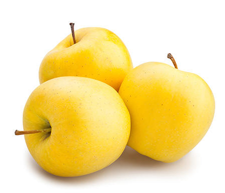

[title]: # (Golden Delicious Apple)
[tags]: # (folder structure)
[priority]: # (2)
# Golden Delicious Apple

The Golden Delicious is a yellow apple, one of the 15 most popular cultivars in the United States. It is not closely related to the Red Delicious.

