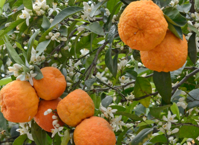

[title]: # (Bitter Oranges)
[tags]: # (folder structure)
[priority]: # (2)
# Bitter Oranges

Bitter orange, Seville orange, sour orange, bigarade orange, or marmalade orange refers to a citrus tree (Citrus × aurantium) and its fruit. It is native to southeast Asia and has been spread by humans to many parts of the world.

