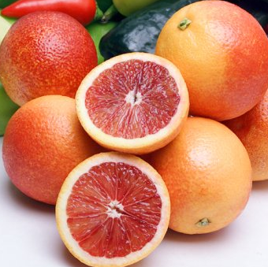

[title]: # (Blood Oranges)
[tags]: # (folder structure)
[priority]: # (2)
# Blood Oranges

The blood orange is a variety of orange (Citrus × sinensis) with crimson, almost blood-colored flesh.

The distinctive dark flesh color is due to the presence of anthocyanins, a family of polyphenol pigments common to many flowers and fruit, but uncommon in citrus fruits.[1] Chrysanthemin (cyanidin 3-O-glucoside) is the main compound found in red oranges.[2] The flesh develops its characteristic maroon color when the fruit develops with low temperatures during the night.[3] Sometimes, dark coloring is seen on the exterior of the rind, as well, depending on the variety of blood orange. The skin can be tougher and harder to peel than that of other oranges. Blood oranges have a unique flavor compared to other oranges, being distinctly raspberry-like in addition to the usual citrus notes.[3] The anthocyanin pigments of blood oranges begin accumulating in the vesicles at the edges of the segments, and at the blossom end of the fruit, and continue accumulating in cold storage after harvest.

