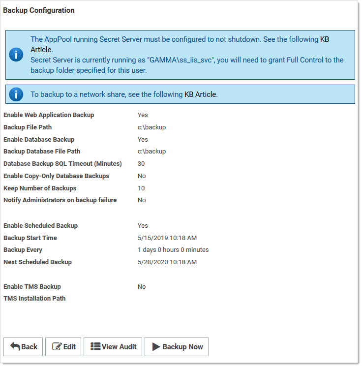

[title]: # (Backing up Secret Server to a Network Share)
[tags]: # (Backup Settings,network share)
[priority]: # (1000)
[redirect]: # "BackupToNetworkShare"

# Backing up Secret Server to a Network Share

Secret Server can be configured to backup to a network share instead of a local folder on the server. For example, you may want to do this such as when the SS database (SQL) is located on a different server than the web application server (IIS).

To back up:

1. Ensure the SS IIS Application Pool is running as a service account if it is not already. See
    [Running the IIS Application Pool As a Service Account](../../secret-server-setup/installation/running-ss-iis-app-pool-service-account/index.md).

1. Grant access to the network share (using Windows ACLs) to the account running the SS IIS Application Pool (so that SS can backup the application folder and zip it to the network share).

1. Grant access to the network share (using Windows ACLs) to the account running Microsoft SQL Server service. (so that Microsoft SQL Server can backup the SS database to the network share).
   You can change the service account running Microsoft SQL Server by going to SQL Server Configuration Manager.

1. Go to **Admin \> Backup**. This may require you to go to **Admin \> All** and search for **Backup**.

   

1. Note that the two file paths are from two different perspectives—Backup File Path is from the ASP.NET application server and Backup Database Path is from the Microsoft SQL Server (these may be on the same box in your environment, or they might not be depending on how you have configured SS).

1. Click the **Edit** button.

1. Type the SS backup path, such as `\\server01\backup\secretserver\`, in the **Backup File Path** text box.

1. Type the database backup path in the **Backup Database Path** text box.

1. Click the **Save** button.

