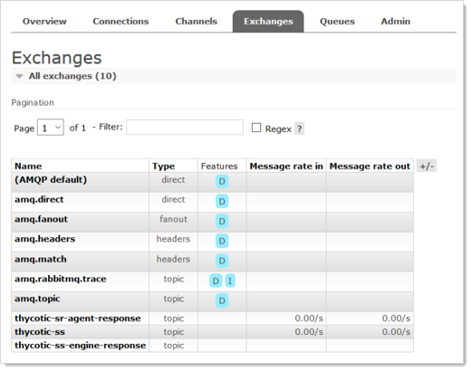
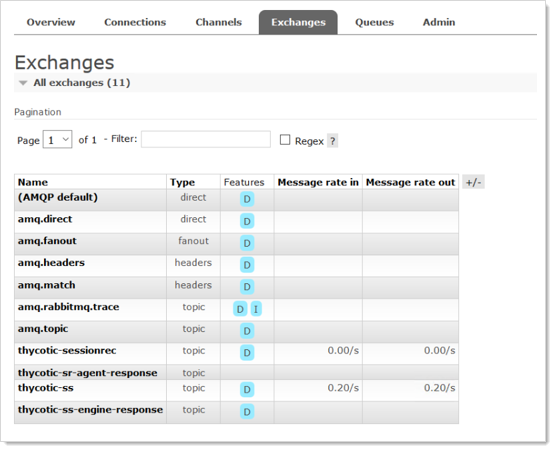

[title]: # (RabbitMQ Durable Exchanges)
[tags]: # (RabbitMQ Durable Exchanges)
[priority]: # (1000)

# RabbitMQ Durable Exchanges

## Overview

As of SS 10.7.59, the SS MessageQueue Client attempts to create RabbitMQ durable exchanges, logging the activity. A durable exchange is normally automatically re-created if RabbitMQ restarts for any reason. Any legacy non-durable exchanges disappear when RabbitMQ goes down and can only be manually recreated. 

If the MessageQueue client detects that creating a durable exchange failed, it will log an error and attempt to create a non-durable one. 

> **Important:** Any existing non-durable exchanges, from previous versions of SS, will also cause durable exchange creation to fail. See [Manually Creating Durable RabbitMQ Exchanges](#manually-creating-durable-rabbitmq-exchanges).

Non-durable RabbitMQ exchanges for SS would look similar to this, whether created by an earlier SS version or by a durable-version-creation failure:

Note the absence of a 'D' in the Features column, meaning that exchange is not durable. Durable exchanges, created by the current SS version (10.7.59+), look like this:

Earlier versions of SS (before 10.7.59) created non-durable RabbitMQ exchanges during a SS server or IIS restart. If the environment is clustered, the same is true of every node in that cluster. The current durable exchanges persist during any IIS restart, eliminating the need to restart SS or recreate the exchanges.

However, any existing non-durable exchanges prevent the creation of the newer durable ones. To remedy that, you need to restart all of the RabbitMQ servers in the cluster at the same time or manually delete the non-durable exchanges. 

# Manually Creating Durable RabbitMQ Exchanges

To enjoy the benefits of the durable exchanges, you must first eliminate any legacy non-durable exchanges from your RabbitMQ server or servers. There are two ways to do this:

- Restart the RabbitMQ server or all of the RabbitMQ servers in the cluster at the same time.  You can also stop the RabbitMQ service in `services.msc`. ==HOW DO YOU DO EITHER? WHY CHOOSE THIS OPTION?==

- Delete the exchanges manually:
  
  1. Click to select each SS non-durable exchange, including distributed engine ones.
  1. Scroll to the bottom of the window.
  1. Click the **Delete** button.
  1. Restart all of the SS instances and distributed engines to recreate the exchanges and connections.

