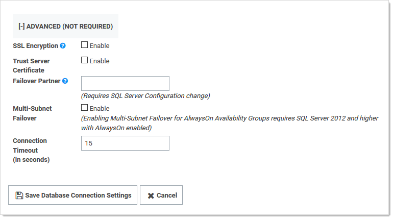

[title]: # (SQL Server Mirroring)
[tags]: # (SQL Server, mirroring, database, DR, HA, Disaster Recovery)
[priority]: # (1000)
[redirect]: # "SqlReplicationKnowledgeBase"

# SQL Server Mirroring

This topic describes the process of configuring Secret Server (SS) and SQL Server for a high-availability environment using Mirroring. The contents of this paper include:

- Configuring SQL Server 2016 for database mirroring with a failover partner and a witness
- The encryption used between the primary database and the mirror database
- Configuring SS to use mirroring to achieve high availability

> **Note:** This topic uses SQL Server 2016, but it is very similar to earlier versions.

## Introduction

Three different SQL Server instances are required to implement this scenario:

- **Primary database:** The main application database
- **Mirror database:**  Replicates all of the data on the primary database in a transactional manner
- **Witness database:** Monitors the health of the primary and mirror databases and initiates failover if necessary

In the setup described here, mirroring operates in synchronous mode, which means that a transaction does not commit on the primary database until it has committed on the mirror.

> **Note:** See [Prerequisites, Restrictions, and Recommendations for Database Mirroring](https://docs.microsoft.com/en-us/sql/database-engine/database-mirroring/prerequisites-restrictions-and-recommendations-for-database-mirroring?view=sql-server-ver15) for more on synchronous mirroring:

## Procedures

### Setting up Databases for Mirroring

To initiate database mirroring, the databases on the primary and secondary machines must have the same name. We recommend doing this before installation. To initially set up mirroring, in Microsoft SQL Server Management Studio, take a full backup of the database on the primary and then restore it onto the database on the secondary. When restoring the database, the "RESTORE WITH NORECOVERY" option must be selected.

### SQL Server Configuration

The three SQL Server instances should all be running under the same domain account. It is possible to run under different accounts but the configuration is more complex and not supported by Thycotic technical support. Each SQL Server instance should be configured to listen on TCP.

### Configuring Mirroring

To configure mirroring:

1. In Microsoft SQL Server Management Studio, drill down to the primary database in the Object Explorer.

1. Right click the primary database and select **Properties**. The Database Properties window appears.

1. Select the **Mirror** page.

1. Click on the **Configure Security** button. The Configure Database Mirroring Security Wizard appears on the introduction page.

1. Click the **Next** button. The Include Witness Server page appears.

1. Click to select the **Yes** selection button.

1. Click the **Next** button. The Choose Server to Configure page appears.

1. Click to select all three interface check boxes (principal, mirror, and witness servers).

1. Click the **Next** button. The Principal Server Instance page appears.

1. Click the **Principal server instance** dropdown list to select the current (primary) server.

1. Type a port number for connecting to the other servers in the **Listener port** text box. The port must be open for TCP communication on the machine's firewall and on any network devices that restrict access to this machine.

1. Click to select the **Encrypt data sent through this endpoint** check box. This enables RC4 encryption on data sent through this endpoint.

1. Type `Mirroring` in the **Endpoint name** text box. The endpoint name is for referencing the endpoint later.

1. Click the **Next** button. The Mirror Server Instance page appears.

1. Repeat the exact same configuration you set for the primary server instance with only the server instance name different (choose the mirror instance).

1. Click the **Next** button. The Witness Server Instance page appears.

1. Repeat the exact same configuration you set for the primary server instance with only the server instance name different (choose the witness instance).

1. Click the **Next** button. The Service Accounts page appears.

1. Type the domain user that SQL Server runs under for each instance's Service Accounts text box. For example `mydomain\sql_svc`.

1. Click the **Finish \>\>** button. Logins are created for each account and are given CONNECT permission on each endpoint, if needed. The Complete the Wizard page appears.

1. Click the **Finish** button

### Configuring Secret Server for Mirroring

> **Note:** The credentials used to access the primary database must also be valid on the mirror database for failover to work.

1. Go to **Admin > See All**. The admin panel appears.

1. Type Database in the **Search** text box and select **Database**. The Database Configuration page appears:

    

1. Click the **Edit** button.

1. Click the **Advanced (Not Required)** link. A new section appears:

   

1. Click the select the **SSL Encryption** check box.

1. Type the mirror server name in the **Failover Partner** text box.

1. Click the **Save Database Connection Settings** button.

### Testing Mirroring

This procedure is necessary to verify that failover will function correctly in the event that the primary server is unavailable or inoperable:

1. Open SQL Server Enterprise Manager.

1. Right click the primary database and select **Properties**.

1. Click the **Mirroring** tab.

1. Click the **Failover Now** button. This causes the database on primary to switch roles and become the mirror database. The mirror database becomes the primary. Clients using the application should be able to continue as before.

> **Note:** One request may fail before SS begins making requests to the new primary database.

### Database SSL Configuration

> **Note:** See [Enable encrypted connections to the Database Engine](https://docs.microsoft.com/en-us/sql/database-engine/configure-windows/enable-encrypted-connections-to-the-database-engine?view=sql-server-ver15) for instruction on configuring SSL for SQL Server.

The certificate authority used for the SSL certificates must be trusted on all of the machines that are a part of SS's installation. The SQL Server service account must be granted access to the certificate.

Procedure:

1. Open Microsoft Management Console by running `mmc` on the Windows command prompt.

1. Drill down to **Console Root \> Certificates \> Personal \> Certificates** in the navigation tree.

1. Right click the certificate and select **All Tasks \> Manage Private Keys**.

1. Grant the user account that SQL Server uses read permission.

1. Ensure SSL is enabled for both the primary and mirror database server. See [Configuring Secret Server for Mirroring](#configuring-secret-server-for-mirroring). It is not necessary to configure SSL on the witness server.
