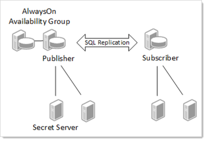
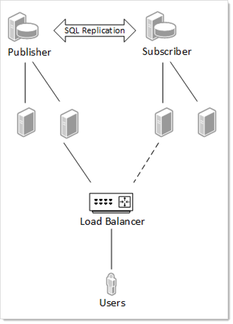
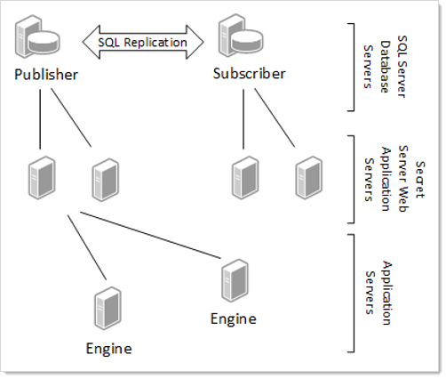

[title]: # (SQL Server Replication Best Practices)
[tags]: # (Backup, DR, HA, Disaster Recovery, sql server)
[priority]: # (1000)

# SQL Server Replication Best Practices

## Overview

Secret Server (SS) SQL Server replication is a set of technologies for copying and distributing data and database objects from one database to another and then synchronizing between databases to maintain consistency.

> **Important:** This topic is for information and planning only—we *strongly* recommend contacting [Thycotic Technical Support](../../support/index.md) before implementing any setup or strategy discussed here.

> **Note:** SS uses merge replication. The only version validated is pull-based merge replication. Push based replication has not been validated.

## SQL Server Replication

**Figure:** SQL Server Replication

### Benefits of Replication

Enabling SQL Server replication allows a database and application to be hosted closer together and this allows for the mitigation of network latency and outages.
- Decrease application server to database network latency
- Resolve issues with unreliable network connectivity
- Allows for distribution of workload in a scale out fashion
- Works across large distances

In a typical web-clustered version of SS, all application servers access a centralized database. In the event of a network outage, any users on affected application servers are not be able to use SS until network access was restored. In addition, poorly performing networks can introduce latency that may decrease the responsiveness of SS. This technology provides additional options when designing the network topology behind SS that can help alleviate these issues.

#### High Availability

SQL Server replication is *not* an option for high availability, but it can be coupled with other technologies like SQL Server AlwaysOn Availability Groups to provide high availability. Any architecture should be reviewed and designed with your database group.

#### Architecture

The SQL Server Replication technologies do all the work of ensuring data consistency between each database, and SS is designed to work well with this technology. When SQL Server replication is enabled on a specified database several system tables, views, stored procedures, and SQL Server jobs are added to the database schema. These tables store information about the data replication, and the procedures contain most of the code needed to perform the synchronization between databases.

#### Data Synchronization

This is the process through which SQL Server replication integrates changes from each database node. These changes include data changes as well as schema changes. Each subscribing database node has a synchronization interval that defines when it will synchronize any changes between the main publication node and itself. SS has been tested using pull-based subscriptions where a scheduled job on each SQL Server subscriber runs at a specified interval to trigger the synchronization.

#### Data Conflicts

Enabling SQL Server replication introduces the possibility of data conflicts occurring in the SS environment. This can happen when two people in different regions attempt to update the same set of data. Due to the disconnected nature of the technology, the system is unaware of this conflict until a data synchronization occurs. During synchronization, SQL Server attempts to resolve any conflicts based on a defined set of parameters. SS provides a setup script to help define optimal parameters for each article (table, view, and stored procedure) in the SS database.

#### SQL Server Replication Monitor and Conflict Viewer

SQL Server provides tools within SQL Server Management Studio that allow viewing of synchronization status, data conflicts, and publications. If a data conflict is not automatically resolved, use the Conflict Viewer tool to resolve the conflict and pick which set of data should be kept. It is possible that manual intervention could be required to resolve the conflict in the base tables on one of the nodes; otherwise, the conflict may still occur after the next synchronization.

For more information:

- [Replication Monitor](https://msdn.microsoft.com/en-US/library/ms180062%28v=sql.120%29.aspx)
- [Conflict Viewer and Interactive Resolver](https://msdn.microsoft.com/en-US/library/ms186562%28v=sql.120%29.aspx)

#### Tracking level

SQL Server replication tracks changes to each node by either row or column:

- Row-Level Tracking: Conflicts can occur when any change to any column is made on the same row even if it is not the same column.
- Column-Level Tracking: Conflicts only occur when the same columns are updated on a row.

For more information on row- and column-level tracking, see [Row-Level Security](https://docs.microsoft.com/en-us/sql/relational-databases/security/row-level-security?view=sql-server-2017)

#### Conflict Resolvers

SQL Server replication uses resolvers to determine the outcome of data conflicts between two database nodes. For example, the same row or column was updated on different nodes. These can be as simple as the publisher database always wins, last change by date wins, and many others.

Switch SS nodes over to subscriber databases. Any nodes that are configured to run background, engine, or session recording roles must remain on the publisher database.

For more information see:

- [Advanced Merge Replication Conflict Detection and Resolution](https://msdn.microsoft.com/en-us/library/ms151257%28v=sql.120%29.aspx)
- [Specify Merge Replication Properties](https://msdn.microsoft.com/en-us/library/ms151257%28v=sql.120%29.aspx)

### Secret Server and SQL Replication

There are many architectures for how SQL Replication can be setup. Determining the correct configuration requires proper planning with a good understanding of how SQL Replication works and the intended goals of using this technology. Here are a few examples.

**Figure:** Secret Server Web Cluster with SQL Server Replication

Some key points about designing the right architecture:

- Multiple web application servers can connect to the same database server.
- SS allows you to configure various roles (background, engine, session recording) that perform various services, such as heartbeat and password changing. These roles can only function on a node that has a connection to the publisher database and will not run on other nodes even if configured to do so. If no suitable node is available that has roles enabled and is connected to the publisher database, then certain activities such as secret heartbeat and remote password changing will be offline until such a node becomes available.
- SS Engines are an effective means to distribute workload to different networks or sites. Each engine must call back to a Web application node that connects to a publisher database.
- The diagram shows the publisher in an AlwaysOn availability group, but this is just an example. Depending on the needs of the organization, AlwaysOn could run on both the publisher and the subscribers or on neither. Many other high availability options could be leveraged alongside SQL
 Replication.

### Using a Subscriber When the Publisher Is Offline

**Figure:** Using a Subscriber When the Publisher Is Offline

It is important to note that there is a delay in data synchronization between database nodes. This is based on how frequently SQL replication is configured to synchronize. One way to mitigate this data latency is to have every user access a node connected to the publisher. This means that every user would be accessing the same database.

In the event of a network outage, a load balancer could be configured to fail over to the subscriber nodes. The data on the subscriber would be as up to date as the last synchronization, and when network connectivity is restored all data activity will be synchronized again. Obviously, if the issues of network latency or disconnects occur too frequently, this may not be a workable solution.

### Secret Server Distributed Engine

You can add SS distributed engines to different network segments, but you must still be able to call back to a SS Web application server that is connected to a publisher database node. This helps to ensure that heartbeats and password changes occur with the most up to date dataset.

**Figure:** SQL Replication and Secret Server Distributed Engines

### Secret Server Replication Settings

Keep in mind that this is a disconnected technology, so there are required decisions when setting it up:

- How often should synchronization occur?
- Should any resolvers override the provided defaults?
- Are there any operational considerations based on the type of secret data?

### Publications

We recommend setting up two publications for SS:

- Events: These are things that need to occur on a timely schedule, such as updating secrets. The events publication should be set to synchronize every minute. This means that if a secret were created in one region, it would not appear in another region for one minute. By default, this publication is called *SSPubEvents*.
- Logs: Information from each audit log is available on its server. We do not recommend setting log synchronization to less than hour. If this happens too frequently, the database could create deadlocks by constantly updating large sets of data. Once the logs merge, the events will appear in the order in which they occur and show on the server on which they took place. By default, this publication is called *SSPubLogs*.

### Tracking Level and Resolvers

Using the default SS implementation, most conflicts are resolved by taking the change made on the publication server as the winner (using the “publisher wins” resolver). It is assumed that the publication server is most likely the main server in an environment and therefore, most likely, the decider in a case of a conflict. Thus, we recommend doing functions, such as configuration changes or secret template definition changes, on the publication node. This is only an issue if two people update the same data on two different servers before a synchronization occurs.

There are some exceptions to the "publisher always wins" rule:

|Data&nbsp;Element&nbsp;&nbsp;&nbsp;&nbsp;&nbsp;&nbsp;&nbsp;&nbsp;&nbsp;|Resolver&nbsp;or Tracking&nbsp;Level&nbsp;&nbsp;&nbsp;&nbsp;|Example|
| ----------------------------- | --------------------- | ------------ |
| Secret Fields            | Last Update Wins        | If two people change a password on a secret to a new password, then the last person to make the change will win. |
| Secret Access Request Approval | Last Update Wins        | If two people are in a group that is requested to approve access, then the last person to approve or disapprove access would set that approval. |
| File Attachment           | Last Update Wins        |                                          |
| tbConfiguration           | Column Level          | Configuration changes are resolved by table column, not the default row-level where the entire row is resolved. This allows different configuration options to be set on different servers and not conflict with each other, but changing the same option would create a conflict. |

Always remember that the conflict is only resolved when synchronization occurs. If there is a synchronization window of 24 hours, there could be very different data on different servers for that entire 24-hour period. The risk of data conflicts increases with larger synchronization windows. The default recommended synchronization is every minute for most items and every hour for system logs.

For a complete listing of recommended settings navigate to the **SQL Replication Administration** page in an installed version of SS at **ADMIN \> Nodes \> SQL Server Replication \> Show Articles**.

### Conflict Auditing

When conflicts occur during synchronization, SS writes an event to the system log on the server that it has detected these conflicts. Depending on the type of conflict, more-specific information maybe written to the audit log for a specific data entity, such as a secret or folder. Notification of the conflict is written to the system, secret audit, folder audit, and other logs. To view complete details of the conflict, the SQL Conflict Viewer tool needs to be used to review the conflict by right clicking on the publication and choosing to View Conflicts.

As an example, if the same field changed on two different servers, resulting in a conflict, then the SS audit log will indicate the field was changed twice and then denote that there was a data conflict.

### Operational Latency

Give consideration to how your SS data is setup and managed. This is most easily described by an example where a manager uses a SS node in Europe and their employee works on a node in Australia. Due to network latency, the organization has changed the default event log synchronization interval from every minute to every five minutes. The employee requests access to a secret in Australia, but due to the synchronization window, the manager is not alerted until five minutes later because the manager is using the server in Europe. You can mitigate this issue by having operational groups work on data for their region or decreasing the synchronization window.

Options to manage data latency if data conflicts occur regularly:

- Distribution of duties: Only update secret templates on the main node.
- Distribution of data: Only edit secret data by region. For example, create
 a folder for Europe and one for Australia to segment the data. Only edit
 items in each folder when in the appropriate region.

### Article Settings

When setting up the SQL Replication Publication certain articles need settings other than the default settings. The recommended settings can be found within SS by accessing the SQL Server Replication page located at **Admin \> Nodes \> SQL Server Replication \> Show Articles**. This page can also be used to generate a setup script for both the Publication and Subscribers that uses these default settings. A Distributor will need to be created before running these scripts. For more information, see [Configuring Distribution](https://msdn.microsoft.com/en-US/library/ms151860%28v=sql.120%29.aspx).

### Compensate for Errors

When conflicts occur, an article that has the compensate_for_errors attribute set to true will automatically try to resolve the conflict. When false, a SQL Server administrator can use the SQL Server Conflict Viewer to review and resolve conflicts.

### Identity Range

SQL Server replication manages table identities by assigning ranges to the publisher and subscribers. Certain tables (logging or auditing) require larger assigned identity ranges. New ranges are only assigned when a data synchronization occurs. For more information, see [Replicate Identity Columns](https://msdn.microsoft.com/en-us/library/ms152543%28v=sql.120%29.aspx).

### Variations

How SQL Server replication is setup can vary greatly and there may be reasons to not use the standard setup. Consult with your database group for approaches that may work well in your environment. The architecture diagrams contained within this document are just high-level examples.

## Installing and Configuring SQL Server Replication

### Installation

There are a multitude of configuration options for SQL Server replication. At a high level, these are the steps to setup SS in a SQL Server replicated environment:

1. Install SS

1. Enable SS Clustering. For more information, see the [Secret Server: Server Clustering Administration Guide](../../networking/secret-server-clustering/index.md).

1. Setup a SQL Server replication distributor:

  >**Note:** This can run on the same database as the publication database or on a separate one on another server.

   1. This can be done from the SQL Server Management Studio by right clicking on the **Replication** node.
 
   1. Review what settings are appropriate for the distributor setup with your on-premise database group or with a database consultant.

1. Download the SQL publication script.
 
   1. In SS select **ADMIN \> Nodes \> SQL Server Replication \>Get SQL Publication Script**.
 
   1. Review this script and update the variables according to your environment.

  > **Note:** Advanced users can use the article list on that same page to configure SQL replication differently than this script to suit your environment.

1. Run this script on the SS Database. A DBA with administrative privileges is needed to run this. Please consult with your on-premise database group or review your configuration with a database consultant.

1. Create snapshots for each publication:
 
   1. Open SQL Server Management Studio
 
   1. Right click on each publication under **Replication \> Local
 Publications**
 
   1. Select **View Snapshot Agent Status**.
 
   1. Click **Start**
 
1. Download the SQL subscriber script:
   1. In SS select **ADMIN \> Nodes \> SQL Server Replication \>Get SQL Subscriber Script**.
 
   2. Review this script and update the variables to match your environment

1. Create a new database on the database server you intend to be your subscriber. Ensure the script uses this database and machine name. Set up permissions for the user or network account that SS uses to connect to this database.

1. Run the subscriber script on the publication database first and then on the subscriber database. If your variables are set properly, it will execute the appropriate part of the script.

1. Expand the **SQL Server Jobs** on the subscriber, and you should see two jobs named for each publication.

1. Right click these jobs to start them. After they complete, your subscriber database should have replicated the schema objects from the publication.

1. Switch SS nodes over to subscriber databases. The primary node *must* remain on the Publisher database, as must any node that an engine calls back to, but all other nodes can be reconfigured to use subscriber databases. Which nodes to switch depends on your specific needs as described in the previous sections. To switch an existing node to a subscriber database, log into that node and go the DbConnectionReset.aspx page by entering that page name in the URL field of your browser (`http[s]://<your_secret_server_name>/DbConnectionReset.aspx`). Step through the wizard, entering the name of the new server and database when prompted. After completing this step, recycle the node’s application pool.

### Troubleshooting the Installation

#### Replication Setup Scripts Fail

Make sure that the SQL Server replication feature is enabled before running the script. Check the error messages in the script output. Make sure you set all of the variables in the top of the script correctly (such as publisher server, database names, and subscriber server).

#### SQL Replication Job Fails

To see the error message, it is easiest to right click on the job and choose to view history. This error message can indicate the actual problem.

## Removing SQL Server Replication

Certain operations such as upgrading SS, adding or removing DoubleLocks from secrets, and enabling or disabling HSM cannot be performed while SQL Server replication is enabled. In order to perform these operations you must remove SQL Server replication. When you are done with the action that required you to remove replication you can install and configure it again by repeating the previous instructions.

You only need to remove replication from the Publisher and all Subscribers. The Replication Distributer does not need to be removed. These are the steps to remove SQL Server replication from your publisher and subscriber databases.

### On Each Subscriber

1. Stop the websites of all nodes using the subscriber database.

  > **Note:** You can see what database each node is using from **Admin \> Server Nodes**.

1. In SQL Server Management Studio, go to **Replication**, right-click **Local Subscriptions** and choose **Generate Scripts...**

1. In the **Generate SQL Script** dialog, click to select "Subscriptions in the following data sources" and select the SS subscription databases.

1. Select "To drop or disable the components."

1. Click **Generate Script \> Open in new query window**.

1. Click **Close** to close the dialog once the script is created.

1. The script contains sections to be run on both the subscriber and the publisher. Run the sections on the subscriber by uncommenting them and commenting those for the publisher.

1. Copy the script to a query window on the publisher server.

1. The script contains sections to be run on both the subscriber and the publisher. Run the sections on the publisher by uncommenting them and commenting those for the subscriber.

1. Perform any maintenance actions needed on the subscriber database and nodes.

### On the Publisher

1. Stop the websites of all nodes using the publisher database.

1. On the publisher, go to **Replication**, right-click **Local Publications** and choose **Generate Scripts...**

1. In the **Generate SQL Script** dialog **check Publications in the**
 **following data sources** and select the SS database.
1. Click to deselect the **Distributor Properties** check box.

1. Select **To drop or disable the components**.

1. Click **Generate Script \> Open in new query window**.

1. Click **Close** to close the dialog once the script is created.

1. Run the script.

1. Perform any maintenance actions needed on the subscriber database and nodes.

1. After all maintenance tasks are done, restore replication as described in [Installing and Configuring SQL Server Replication](#installing-and-configuring-sql-server-replication).

## Managing SQL Server Replication

Once replication is setup and working certain considerations should be given to managing it along with conflicts that can occur. The recommended settings for the publication have been tested to limit conflicts, but they can still occur. Here are some scenarios you might encounter:

| Scenario&nbsp;&nbsp;&nbsp;&nbsp;&nbsp;&nbsp;&nbsp;&nbsp;&nbsp;&nbsp;&nbsp;&nbsp;&nbsp;&nbsp;&nbsp;&nbsp;&nbsp;&nbsp;&nbsp;&nbsp;&nbsp;&nbsp;&nbsp;&nbsp;&nbsp;&nbsp;&nbsp;&nbsp;&nbsp;&nbsp;&nbsp;&nbsp;&nbsp;&nbsp;&nbsp;&nbsp;&nbsp;&nbsp;&nbsp;&nbsp;&nbsp; | Solution                                    |
| -------------------------------------------- | ------------------------------------------------------------ |
| Conflict automatically resolved | SQL Server was able to determine how to resolve the conflict. SS will log and audit this conflict. To see the specific details for the conflict, use the **SQL Server Conflict Viewer** in SQL Server Management Studio. |
| Conflict unable to be automatically resolved | A user with SQL Server access needs to open the conflict in SQL Server Management Studio. Access these by right-clicking on the publication and choosing to view conflicts. |
| Some data stops replicating | A table could become blocked if there are conflicts. Other data may continue to synchronize. If data in one region or database node is different than another after a synchronization, there could be conflicts that need to be reviewed and resolved. |
| SQL Replication Synchronization Times | The status of each publication and subscribing server along with the last time of synchronization can be located in SS by selecting **ADMIN \> Nodes \> SQL Server Replication**. |

## Web Server Nodes

The **Web Server Nodes** page now includes a column that lists the database server name and database name. This column also indicates whether the database is the publisher or a subscriber. To see the page:

1. Open SS.

1. Click the **Admin** menu item and select **All**.

1. Click the **Server Nodes** button. The Server Nodes page appears (not shown).

1. If you click the **SQL Server Replication** button, you can see more information about your SQL Server replication. The page pulls from the replication data and shows the:

   - Publication name
   - SQL server
   - Database
   - Subscription type (push or pull)
   - Status of the last sync
   - Last time that subscription was synced
   - Status of the last sync
   - Date of the last sync

  > **Note:** The same information is available within SQL Server Management Studio, but this page gathers all of the subscription information together in one place.

  As mentioned earlier, the **Get SQL Publication Script** and **Get SQL Subscriber Script** buttons will download replication script templates that you can use to set up replication for SS. You can fill in the variables at the top of each script to match your environment and run them as-is or modify them further if you need to customize the default scripts.

  The **Show Articles** button lists each article in SS that should be included in replication along with the recommended settings for SQL Server replication. These are *recommended settings* and do not show the current state of replication on the publisher.

## Secret Server Upgrade Scenario

New versions of SS may issue schema changes including indexes, column changes, and views. In some cases, SQL merge replication will not automatically replicate these schema changes. For this reason, we recommend removing any publications and subscriptions targeting the SS database, redirecting users to the web server at the primary site before performing any upgrade, and recreating the publication and subscriptions from new versions of the replication scripts.

In the following scenario, there are SS web servers installed at a site in Australia, the U.S., and the U.K. The U.K. is the publisher node and Australia and U.S. nodes are the subscribers.

1. Redirect all users to the U.K. SS URL.

1. Stop IIS at the Australia and U.S. sites.

1. Manually force a synchronization between the Australia subscriber and the U.K:
 
    1. Open SQL Server Management Studio and connect to the Australia  subscriber database server.
 
    1. Go to **Replication \> Local Subscriptions**.
 
    1. Right-click on one of the SS subscriptions (if you used the scripts provided by SS, they are called *SSPubLogs* and *SSPubEvents*) and select **View Synchronization Status**.
 
    1. Click the **Start** button to force a synchronization.

1. Repeat sub-steps 3 and 4 for all SS subscriptions.

1. Repeat sub-step 3 for the U.S. subscriber database.

1. Resolve any replication conflicts:
 
    1. Open SQL Server Management Studio and connect to the UK publisher database server.

    1. Go to **Replication \> Local Publications**.
 
    1. Right-click on one of the SS publications (if you used the scripts provided by SS they are called SSPubLogs and SSPubEvents) and select **View Conflicts**.
 
    1. Examine and resolve any unresolved conflicts.
11. Generate the script to remove replication on the subscriber databases as specified above.

12. Run it to remove replication.

9. Generate the script to remove replication on the publisher database as specified above.

14. Run it to remove replication.

15. Restart IIS on the SS web server in the U.K.

16. Run the SS web upgrade wizard.

17. Copy the website application directory to the web servers in Australia and the U.S.

14. Use the scripts generated from the SS UI to recreate replication on the publisher.

19. Push a snapshot to the Australia and U.S. subscriber databases.

20. Recreate replication at the subscribers.

21. Restart the jobs on the subscriber databases as described above.

22. Start IIS on the Australia and U.S. web servers.

19. Change redirection rules for Australia and U.S. users so they access the local Web server as normal.

## Other Information about SQL Server Replication

- [Upgrading SS with SQL Replication](https://updates.thycotic.net/links.ashx?SqlReplicationKnowledgeBase)
- [SQL Server Replication (MS Books Online)](https://msdn.microsoft.com/en-us/library/ms151198%28v=sql.120%29.aspx)
- [Snapshot Replication](https://msdn.microsoft.com/en-US/library/ms151832%28v=sql.120%29.aspx)