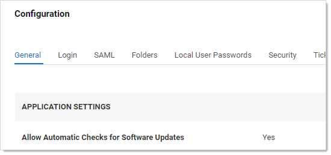
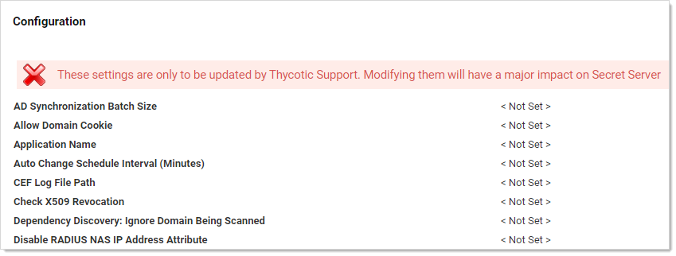

[title]: # (Best Practices)
[tags]: # (best practices)
[priority]: # (1000)

# Best Practices

## Getting Started

### Overview

This document was written after helping many customers successfully deploy Secret Server (SS) in their organizations. It covers the issues that most customers tackle as they consider which data to store, who needs access, what permissions to apply, and how to organize all their sensitive data. This document is not meant to cover everything

Think of SS as a platform for your organization to store all of its passwords and sensitive data. This means that it can be configured to work in many different ways depending on your industry, compliance requirements, and ultimate end goals. The trick is to know your objectives and then match the capabilities and best practices to your situation.

### Terminology

Throughout this topic, certain terms are used to refer to specific features or concepts within SS. Some of these terms corresponds to explicit roles defined within SS that may be referenced, while others are broader terms that system administrators should be familiar with.

#### Administrator

Access to all the features within SS can be granted to users by creating and assigning different roles. *Administrator* is one of the default roles that comes installed with SS. By default, this role contains all role permissions, but it can be customized as well. In this guide, when it is used in the context of a SS user, it is referring to the users who generally have most permissions and manage the system. Administrators have control over the global security and configuration settings.

> **Note:** Administrators in SS do **not** automatically have access to all data stored in the system—access to data is still controlled by explicit permissions on that data.

#### Basic User Role

The basic user role is a default role that comes installed with SS. This role is a slimmed down version of the user role and primarily focuses on creating and modifying secrets, as well as limited "view" permissions. Users that have this role assigned to them also have their own personal folder.

#### Folder

A folder in SS provides a hierarchical structure for organizing secrets. Some folders contain no secrets at all and may be used only to set permissions or policies on subfolders. Other folders may simply be a way to organize sub-folders that contain secrets. Folders are organized based on a "root" level folder structure, where "/" is the root level folder and any new folder created will be placed under that folder. Personal folders are unique and are created for each user, providing them the "personal folders" permission. Personal folders can contain sub-folders for the owner to organize their secrets. 

#### Role Based Access Control (RBAC)

Secret Server role based access control (RBAC) is a mechanism that restricts system access to authorized users and defines what type of access a user has within the system. Often these roles correspond to features within the product and those features may give users greater privileges to make changes within the system. RBAC is a core SS feature. 

#### Secret

A secret is any sensitive piece of information (typically a password) that you would like to manage within SS. Typical secrets include (but are not limited to) privileged passwords on routers, servers, applications, and devices. Files can also be stored in secrets allowing for storage of private key files, SSL certificates, license keys, network documentation, or even a Microsoft Word or Excel document.

#### Site

A site is a logical work container that can tell SS which distributed engines should manage work associated with specific tasks. Sites are critical to ensuring that SS can manage remote network segments, alternate locations, or even DMZs. By default, SS comes with the "local" site. That site is unique as it is the only site that can be configured for "web processing" or "engine processing." When the local site is configured for Web processing, the Web servers themselves act as distributed engines and are responsible for all engine work processing, in addition to the Web Server role specific work that they may be configured for. Any additional sites that are user created may only be configured for Engine processing. The "Local" site comes with two free engines under any licensing model that may be used. Any additional sites and engines must be licensed separately and will incur additional licensing costs.

#### User

This is the default role for new users that are added to SS. By default, this role contains several permissions that enable new users to interact with SS. Many of these permissions are centered around creating and modifying secrets, as well as several "view" permissions to access audit information. Additionally, access to advanced secret options, assigning secret policies, and a few other advanced permissions are assigned to this role. It also gives each user their own personal folder that is accessible only by each individual user added to the system. Besides the owner, only the "unlimited administrator" role can access these folders.

### Know Your Edition

As you read through this guide, some features may be referenced that are only available in certain editions of SS. To get an idea of what's available, you can reference the [main sales page](#https://thycotic.com/products/secret-server/) page online.

## Installation and Configuration

### Installation

Before installing SS, be sure to look at the [system requirements](../secret-server-setup/system-requirements/index.md). The process for installing SS is outlined in the [installation guides](../secret-server-setup/installation/index.md) matching the version of Windows Server you are using. If you have an active trial or have purchased SS licenses, you can find your licenses by logging into your account at [thycotic.com](http://www.thycotic.com/).

### Basic Configuration

Once SS is installed, see the  [End User Guide](../secret-server-end-user-guide/index.md) to begin setting up SS right away. This covers:

- Adding your licenses
- Basic security settings
- Configuring automatic backups
- Basic security settings
- Heartbeat
- Basic security settings
- Setting up access for local and AD users

### Advanced Configuration

Secret Server's Advanced Configuration page is intentionally hidden from casual access. You have to enter a URL—the page is not accessible by clicking a link. The URL format is:

`https://<server>.<subdomain>.<domain>/<ss install>/ConfigurationAdvanced.aspx`

For example:

`https://qa-test.acme-east.acmewidgets.com/acmesecretserver/ConfigurationAdvanced.aspx`

The easiest way to get to the page is:

1. Open your SS instance.

1. Navigate to **Admin \> Configuration**. The (regular) Configuration page appears:

   

1. Look at the URL for the page. The file name is `ConfigurationGeneral.aspx`.

1. Change the name to ConfigurationAdvance.aspx, leaving the rest of the URL as is.

1. Press **\<Enter\>** the (advanced) Configuration page appears:

   

1. Note the warning at the top of the page. It is serious, but it is also not *completely* correct. There are a few settings that may be important to your initial deployment. **Do not change any settings not directly discussed here without contacting Thycotic Customer Service first**.

1. The following settings might need adjustment:

   - **IP Address Header:** If you are using a load balancer and multiple SS Web server nodes, it is important to set this to `X-Forwarded-For`. That way, user audits reflect individual user IP addresses and not your load balancer IP address.
   - **Secret Computer Matcher Once Per Discovery:**  We mention this setting in the [Discovery Best Practices](../discovery/general-information/discovery-best-practices/index.md) topic, where we recommend setting it to `true` for for large environment discovery. Otherwise, the matcher runs every five hours, regardless of how often discovery is configured to run.

## Architectural and Design Considerations

You can view [reference architectures](../architecture/index.md) for SS. These reference architectures are, at minimum, refreshed every year and are created by our Professional Services Solutions Architect team. For this section, we provide some high-level architecture and design considerations that may help you design a more successful SS or SSC installation.

> **Note:** The following recommendations are primarily for SS on-premises. For SSC customers, many of the recommendations are still relevant, even though you only have control over increasing distributed engines—the only SS infrastructure you physically control when using SSC.

Consider some key questions about your SLA requirements for the application: 

- What are the RPOs and RTOs for the application?
- Is high availability or disaster recovery required? 
- Are you going to purchase SS or SSC?

Answering these helps determine what initial infrastructure is needed for your environment. You can then look at the reference architectures to help select a variation of the reference architecture that works best for your requirements. 

> **Note:** Many customers take a posted variation and alter it to meet their own needs.

When the Professional Services team works with our customers, we gather both architectural and stakeholder requirements to come up with a design that is sized correctly to meet all business needs. If you are planning to design Secret Server’s architecture yourself, we suggest planning additional infrastructure based on feature utilization needs in the following order:

### Session Recording

This is the most process- and memory-intensive feature of the product if it is used heavily. We recommend reviewing [Session Recording Caveats and Recommendations](../session-recording/caveats-and-recommendations/index.md) when planning to implement this feature, as it may require additional hardware or Web servers. Below are a few questions to ask yourself:

- Is the organization planning to use session recording and to what capacity? 
- How many secrets may have session recording enabled? 
- How many session recordings may occur concurrently?  

We recommend only enabling session recording on secrets that absolutely need it—such as those with compliance or legal requirements. Otherwise, we recommend enabling session recording only on high value, high impact assets. This includes "global" admin accounts, domain administrator accounts, and other high-level privileged assets within your environment. This should minimize additional infrastructure just for session recording .

### Discovery

This is another feature that can have a large impact on a SS environment. A large enterprise discovering thousands of systems may require additional Web servers or distributed engines. Below are a few questions to ask yourself:

- How many systems do you intend to discover? 
- How often should discovery run?
- How quickly does discovery need to complete? 

We recommend using out-of-the-box discovery sources where possible. Since discovery cannot be scheduled to run at a specific time, consider enabling discovery for the first time during off-peak hours so it will run around the same time each day or week. If discovering a large number of systems, ensure you have ample Web servers and engines to handle the load. For example, increasing CPU count for each distributed engine  can help distributed engines do more work in parallel. Please see [Discovery Best Practices](../discovery/general-information/discovery-best-practices/index.md) for details.

### API Use Case

Employing multiple integrations with our product may impact a SS environment. Below are a few questions to ask yourself:

- What integrations do you intend to use with SS? 
- What is the total number of API calls you anticipate per second, hour, or day? 

We recommend that if you require several integrations with SS where a high volume of API calls is anticipated, carefully consider how to configure your Web servers. You may want to have some Web servers dedicated to API use that have all Web roles explicitly disabled. You could place several such SS Web servers in a load balancer configuration.

### Remote Password Changes and Heartbeats

RPC and heartbeats may impact a SS environment if used heavily. Below are a few questions to ask yourself:

- How many secrets RPC? 
- How often should passwords be changed?
- How many RPC retries should be attempted?
- How often should we perform heartbeats?

We recommend carefully planning what types of secrets require different password changing schedules based on your company's information security policy. Generally, setting a large number of retry attempts for an RPC is not a good idea. The same goes for heartbeats.  Match these settings to the business use case, such as 10 password retry attempts and having heartbeats occur once per day. These small refinements can greatly reduce the load on SS. If you determine you need aggressive RPC and heartbeat schedules, consider having additional Web servers and distributed engines to handle the load.

### Proxying

Heavy proxying can impact SS infrastructure. Below are a few questions to ask yourself:

- How many systems are proxied? 
- Are they SSH or RDP connections? 
- What is the concurrent need?

We recommend proxy connections go through a distributed engine whenever possible. This offers a security advantage because ports, such as 3390 or 22, are not open inbound directly to your Web servers. You can review [SSH Proxy Configuration](../networking/ssh-proxy-configuration/index.md) to size proxy requests. 

### General On-Premise Considerations 

The areas mentioned below are often where we spend the most time with customers who have spent professional services time performing architectural health checks. These are the main areas we typically improve:

- Ensure that you have a database maintenance plan in place for SS. It should be implemented or reviewed by your organization's DBAs. Adjusting the data retention settings is not enough and does not substitute for having a maintenance plan.
- Ensure that RabbitMQ clustering configurations have work distribution policies in place. In most engagements, we use the [AutomaticSyncMode](https://thycotic.github.io/rabbitmq-helper/clustering/) policy.
- When designing multi-site, single-instance SS implementations, be cautious when configuring Web servers and enabling roles on all Web server nodes when inter-location latency is high (50 ms or greater). 
- When using the "local" site for Web processing when also using sites with distributed engine processing, consider using engine processing for the local site too. In most cases, when using both Web and engine processing, you are using both a built-in message broker (MemoryMQ) with (RabbitMQ). 
- Consider having dedicated systems for SS components, as proposed in our mid-range reference architectures. If using RabbitMQ, put it on a dedicated system that is not shared with the distributed engine service.
- For environments that contain 75,000 to over 100,000 secrets where secret searches are noticeably slow, we strongly recommend running `SecretSearchPerformance.sql` against your SS database, which can be found in `C:\inetpub\wwwroot\SecretServer\Database\SqlServer\OptionalOptimizations`.
- For large environments where discovery, RPC, and heartbeats will be used simultaneously, careful consider when to run discovery. Discovery can compete with RPC requests when both features are using the same site. For large environments, you may want to have a dedicated site and distributed engines for discovery and a separate dedicated site for secrets.

## Securing the encryption.config File

Security is a process—not a product. Take a look at the [Security Hardening Guide](../security-hardening/security-hardening-guide/index.md) to ensure your implementation of SS has optimal security. The guide contains more in-depth recommendations for not only configuring the application in a secure manner but also hardening the server or servers SS is hosted on.  That guide complements the information provided here.

One of the most important areas for SS hardening is protecting the `encryption.config` file that is created during installation. After the product is installed, this file exists in the main `\SecretServer\` directory. It is a very important file. This file (unencrypted), along with a backup of your Secret Server database, is all you need to get a Secret Server environment back up and running. Thus, it is imperative that you protect it. There are two ways to protect the `encryption.config` for on-premises SS and two others for SS Cloud.

### Secret Server On-Premises

For an on-premise installation of Secret Server, we recommend protecting your `encryption.config` file with an HSM. When using an HSM, though, there are other things that you should be mindful of:

- Is the HSM highly available? 
- Is the HSM capable of handling a high volume of access requests?
- What methods are available for retrieving the key from a backup if my HSM were to crash?

> **Important:** If your HSM is down and you do not have backups, there is nothing we can do to help recover your data. Carefully consider the configuration of an HSM for protecting `encryption.config`.

A second, less secure, option for protecting the `encryption.config` file is to use DPAPI combined with EFS. DPAPI is a setting that is enabled on each Web server within your Secret Server cluster. EFS adds an additional password to the `encryption.config` file. It is worth noting that both protection mechanisms can be compromised if an attacker were to log on interactively to Secret Servers Web servers and become a local administrator. Give careful consideration to securing remote access to Secret Server when leveraging DPAPI and EFS.

We recommend storing an unencrypted copy of the `encryption.config` file for disaster recovery scenarios where the Secret Server Web server is irrecoverable. Make a backup of this file immediately after installation (before securing it with a HSM or DPAPI + EFS) and to store the file on one or more media devices such as a hardware encrypted USB drive. The device should then be placed in a secure location, such as a safe. Access to the device should go through a chain of custody process in the event of an emergency where the original file is needed.

### Secret Server Cloud

If you are using Secret Server Cloud, there are two main methods for protecting your `encryption.config` file:

- Thycotic owns your `encryption.config` file and is responsible for keeping it secure. We put internal mechanisms in place to ensure that Thycotic does not have access to your data without your explicit permission.
- You configure a connection to AWS KMS to protect the `encryption.config` file. The master key is stored in AWS and under your complete control, inaccessible to Thycotic staff

## Privileged Account Management Strategy

It is important to have a privileged account management (PAM) strategy that helps you determine which types of features to leverage for your various accounts and sensitive data you will be storing. Below are some suggested guidelines for creating a strategic plan. We recommend reading all sections of the guide for a comprehensive look at ways you can secure your SS. However, these guidelines will also link to other parts of the guide so you can choose to jump to a specific section for more detail about a particular topic.

### Identify Data at Risk

Consider all the types of sensitive data your team needs to be securely stored and managed. Where are the biggest risks and pain points in your current password management strategy? Data at risk also often includes more than just passwords.

To get started, think through these key accounts and principles:

- All shared privileged accounts: these are accounts that don't identify an individual (for example: administrator, root, enable, service accounts). All of these should have randomized passwords that are changed frequently.
- Do your users have individual privileged accounts? Maybe each user has—separate AD account for domain admin rights?
- Every password in your organization should be different.
- Do your users have individual privileged accounts? Maybe each user has—separate AD account for domain admin rights?
- What passwords could be needed in an emergency, outside of regular business hours, or when someone is on vacation?

Typical account passwords and sensitive data being stored in SS:

- Active Directory domain administrator accounts
- Active Directory service accounts
- Application passwords (such as SAP and, custom apps)
- Cloud Administrative or Privileged Accounts
- Database accounts (such as MS SQL, Oracle, or MySQL)
- Network equipment passwords (such as router, switches, firewalls, phones, and appliances)
- Sensitive files (such as private key files, SSL certificates, and network documentation info)
- Software license keys, serial numbers, personnel data, and Wi-Fi passwords
- UNIX, Linux, Mac root, and local user accounts
- Website passwords (cloud services, DNS, Amazon AWS, vendors)
- Windows local administrator accounts

### Who Accesses Secret Server?

After determining the data you will store in SS, the next step is to decide [who](#Users-And-Groups) will use SS to access and manage that data. A common approach is to begin by focusing on one group of users and the passwords they use on a regular basis, later expanding to other teams once a good strategy has been put in place. However, you may find it more beneficial to organize SS for use by all of your users/teams at once so you can design an effective overall folder and policy structure that will work well across all teams.

### What Privilege Levels Are Necessary?

Giving a user access to an account in SS can entail different levels of privilege. Do you want a user to be able to edit the username, machine, or password of a secret, or only view the secret? Should they be able to share the secret with other users? Once you incorporate use of the Launcher into your users' workflow for authenticating to an application, do they really need to know a password, or can you mask it? The [Workflow Security](#workflow-security) section can help you determine and implement key measures to ensure users have least privilege necessary.

### What are your Password Requirements?

It's unlikely that all your accounts will have the same [password complexity requirements](#Password-Requirements) and [rotation schedule](#Secret-Expiration). In fact, for best security, you should have some variation. You can create sets of password requirements to control password length, characters, and complexity, then apply those to various account types using [secret templates](#Secret-Templates). Secret templates also allow you to set a default expiration period, which can translate to how often an account password will be changed automatically.

### Evaluate your Existing Setup

While transitioning to using a new tool for managing your passwords, it is important to take into account how accounts are currently used in your environment. The following questions can help evaluate this:

- Do some of your users have their own, individual AD domain admin accounts, or are there only a few shared domain accounts?
- Do users use local administrator accounts or privileged domain accounts for admin access to systems?
- Are permissions to resources (such as servers and applications) controlled using AD group policy?

### Define Your Core PAM Strategy

There are a few different strategies that typically work best in SS. Other methods of password management may work but require a more significant amount of time and effort to configure and maintain. The most commonly-used strategies are defined below.

### Individual Privileged Domain Accounts

In this scenario, IT team members have their own domain admin accounts that are tied to their identity. They use these accounts to gain elevated privileges to resources such as production servers. Permissions to the various resources they're permitted to access are controlled by AD.

To implement this in SS, each account is stored as its own AD account secret. Only the user tied to that account is granted permissions to the secret. A security setting such as check out (one-time password) or hide launcher password is enabled so the user depends upon SS to use the account. Therefore, all access to that account will be audited. When the IT admin needs elevated privilege to a box, they check out or view the secret and then use the launcher to access the machine.

A benefit of this strategy is that there is not conflict with multiple users trying to use the same account for access to one machine. This strategy provides great accountability—the security team knows the exact user accessing an account and the machine being accessed. The password is not shared among multiple users, and all privileged access is audited by SS.

A pitfall of this strategy can be that there is more management of permissions required in AD. While machines could be access or deny listed to force users to use the SS launcher, thus controlling machine access through SS, this can be tedious.

It is more secure, less work, and simpler to organize permissions for access to domain resources in AD. This strategy works best for organizations that already use AD heavily to control permissions of individual privileged users to domain resources. Ongoing maintenance will rely on updating permissions to resources in AD and ensuring that all new individuals' privileged accounts are being added for management under SS.

### Shared Privileged Domain Accounts

You may choose to have your users use shared privileged accounts to access resources. This strategy involves creating a few service accounts that have permissions to OUs or groups of computers. In SS, these accounts can be limited with the Launcher so they can only be used to Launch to certain computers. This means you can limit the number of domain accounts created and set permissions more broadly (such as at OU level). These passwords could be changed on a schedule or, where possible, used with Check Out to change the password after each use. Using this setup, accounts can be designated for team or function and can have varying Check Out intervals set to ensure that only one person at a time is using each account.

A benefit of this strategy is if individuals do not already have their own privileged domain accounts in AD, then giving them access to shared accounts means less setup in AD while still maintaining accountability for who uses which account, and which machine they access.

A pitfall of this strategy can be that if the team (or function-specific accounts) cover a broad number of machines that can be accessed, it may be a lot of work to set up launcher allow/deny lists to control access through SS. However, if these permissions are set only through AD, it will be difficult to have the visibility into these limitations for an auditor.

### Hybrid of Individual and Shared Accounts

Sometimes, your employees' roles may require longer, more specialized access. For those accounts, you can have individual privileged domain accounts, and for the other regular users you can use a few shared privileged domain accounts. All of these can be stored in SS, but with different settings governing their usage. For example, the shared accounts would still have check out enabled, while the individual privileged accounts will simply have permissions limited to an individual user, possibly with the password hidden using hide launcher password.

### What Is the Highest Risk?

Implementing a comprehensive PAM policy should eventually cover all of your privileged/shared accounts, but this can take some time. When looking at where to start, it is important to consider the areas of risk—where are the areas that need more immediate attention: 

- Is it local Windows admin accounts all sharing the same password?
- Pass-the-hash vulnerability? 
- Protecting your network equipment passwords? 
- Avoiding fines for not meeting compliance mandates? 
- Password misuse and auditing employee access to accounts?

Choose a starting point that gives your organization the most value, and then branch out from there.

## Users and Groups

At minimum, the administrators who manage and use your organization's privileged passwords and data on a regular basis will need to access your SS. SS users can be defined in a few ways: 

- Active Directory user accounts.
- Local SS user accounts.
- User accounts from an Azure Active Directory tenant.
- User accounts from another OLDAP source (Basic/Kerberos).
- User accounts from SAML integration (often AD accounts). If local accounts are provisioned via SAML, they must correspond and match local user accounts that are within SS.

SS also has the concept of groups, which can be local (you create them in SS), AD-synced (security groups from AD), oLDAP groups, or AzureAD groups . Groups are a powerful tool for assigning and maintaining permissions to secrets, and therefore should be given careful thought and planning. Below we review the two most common account and group strategies our customers use. These same concepts can apply for other directory service accounts and groups other than Active Directory. 

### Local Secret Server Accounts

Local users and groups have to be created and managed manually in SS, as they are not integrated with AD. The first account you create in SS is an example of a local account. Local groups can include local users and AD accounts, and can have a user established as the group owner that is permitted to add or remove users to or from the group.

### Active Directory Accounts

AD accounts can be added for access to SS either manually (one by one) or by AD security group. When adding users by security group, you choose which groups SS will synchronize with AD to update which users' access to SS is enabled or disabled. AD group synchronization happens on a regular, customizable interval to keep group membership changes that happen in AD up-to-date in SS as well.

### Local or Active Directory Accounts?

We recommend using one of these options:

- Only local users and groups (best security)
- Only AD users and groups (most convenient)
- A hybrid of AD users and local groups (balance of security and convenience)

You  need to choose an option that provides the levels of security and convenience that are acceptable for your organization. Using the AD accounts option is easy for user maintenance, but it limits the security of SS to the level of security of your AD. This may be fine—just be sure to consider the question of domain admin access to AD in combination with SS permissions.

#### Only Local Users and Groups

Creating local users and groups within SS provides a lot of flexibility because you can tailor permission assignment by group to your exact needs. The major benefit of local users and groups is security: users and group membership can be controlled entirely by role-based access control (RBAC) within SS. However, this approach requires more maintenance because creating or deleting users and managing group membership has to be controlled in SS.

#### Only AD Users and Groups

If you are considering using AD users and groups for SS access and permissions assignment, review your teams that need access to SS. Compare them to the corresponding groups in your AD. If your AD groups map to ways you want to assign access to secrets, you can synchronize your AD groups with SS and start assigning permissions to secrets (and levels of those permissions—View/Edit/Owner) by group. You can then effectively manage SS access and secret permissions completely from AD by changing AD group membership.

Many customers choose this option because they can maintain control in AD and do not have to worry about any user or group maintenance within SS. If you want to use this option but your AD groups don't match the way you want to assign secret permissions, you will need to create new AD groups to match this, or may want to consider the hybrid approach (below), using local groups instead.

This method, while more convenient, may require additional considerations:

- How are these AD groups being protected? 
- Are there controls in place which require elevated or high privilege accounts to modify these AD groups? 
- Are there alerts in place for when these groups are modified?
- Is the information security team closely monitoring these groups?

#### Hybrid of AD Users and Local Groups

A third option is to create local groups in SS and add AD users to those groups for the purpose of organizing how permissions are assigned to secrets. Many customers who use this setup will create a single AD security group (for example, SecretServerUsers) to use to synchronize their AD users with SS for log on. They then create additional local groups for their users to, which gives them permissions within SS, such as to their teams folder. They may also be added to other SS groups  that provide them with other privileges within the environment. 

This approach is more secure than using only AD groups and users, but  if Active Directory were compromised, intruders may still be able to reset an account password and gain log in access to SS. If secrets are stored in that user’s personal folder, those secrets may be compromised which may lead to lateral movement elsewhere within the organization.

### Business Users

A *business user* is a non-IT user, such as sales team members, office managers, data entry clerks, and marketing team members. They are allowed to access and use SS for managing non-privileged accounts, including individual or team application accounts and credentials. Non-privileged accounts include email login, social media password,  productivity software credentials, and more.

Business users are not permitted to manage privileged accounts, such as database server credentials, security appliance passwords, and cloud service root keys. Business users are also not permitted to administer SS.

Business users can:

- Access secrets: They can create, update and delete their own secrets within SS. For example, A user signing up for an online service can use the password generator to create a strong password, store that password in SS, and use the Web Password Filler to log in later. 

- Request and approve access to secrets:  Non-privileged secrets may need approval workflows. Business users can request access to these secrets and can act as approvers. For example, if access to an organization’s social media accounts requires authorization from a member of the marketing team, a business user can request access to the secret, and another business user can approve access.
- Share secrets with other users: Business users can share non-privileged secrets with other users of SS, whether or not they are business users.
- Access secrets using the mobile app:  Business users can use the Thycotic PAM application to access and manage their secrets.
- Use launchers: Business users accessing secured, but not privileged, systems can use SS launchers. For example, a user in a secure network segment who can only access an application via RDP may use an RDP launcher, as long as the tasks they are performing do not require privileged access.
- View audits of their secrets: Auditing capabilities are included for business users, allowing them to see who has accessed their shared secrets.

## Authentication Strategy

Defining your authentication strategy ensures you have standardized authentication practices in line with your SS RBAC scheme. SS offers a wide variety of authentication options that can add flexibility and security to your end user’s authentication process. 

### Strong Authentication

Protect the tool you are using to secure your privileged accounts by adding a second factor of authentication for users logging into SS. Two-factor authentication can be added whether users are logging in with local or AD accounts. For more information about using two-factor authentication with SS, see the [Security Hardening Guide](../security-hardening/security-hardening-guide/index.md).

### SAML

If your organization is already using SAML for SSO across your organization, it might be a good option for SS authentication too. SAML uses browser-based communication, between the service provider (Secret Server) and the identity provider (SSO providers) to broker authentication. For more information on configuring SAML with SS, please see the [SAML configuration guides](../authentication/saml/index.md). The major benefits SAML provides are:

- A consistent MFA strategy across all applications in your environment.
- Simplified authentication communication: The browser handles the process. For SSC, if the authentication strategy is to authenticate against the domain, that communication must flow from SSC to the distribute engine and finally to the domain controller and back for authentication. SAML shortcuts this by having the browser communicate to the service provider and identity providers, reducing authentication latency. 
- Easy to configure, manage, and add new users. 
- Supports multiple MFA options based on conditional access. For example, a user may only need to verify with one factor for accessing less critical apps, but SS uses two-factor authentication. 

### Directory Services

Secret Server provides a multitude of authentication options through directory services. It can sync users into the application from various LDAP sources. It is important to use an outside authentication source to automate user provisioning. The User Account Options setting in the  directory services configuration provides these options:

- Users are Enabled By Default (Manual)
- Users are Disabled By Default (Manual)
- User Status Mirrors Active Directory (Automatic)

There are benefits to each strategy, but the last one is usually best. Using a hybrid group structure prevents new users from gaining permissions before they have been reviewed, and if they are disabled in active directory, they are automatically deprovisioned from the system. This provides automatic user management and easier offboarding strategies.

If you decide to use a manual strategy, we suggest using the automatic user management feature to disable users who have been inactive for a defined period of months. This can prevent long-inactive accounts from being compromised and keep your list of active users current.

## Roles

Roles control which features of SS a user is able to use, view, or administer. Existing roles can be customized, and new roles can be created as needed. SS comes with several roles by default, including administrator, user, and read only. You should review the default roles and decide whether your organization needs further roles for various purposes such as third-party consultants or auditors.

> **Note:** Users with the default administrator role  (which contains all role permissions available) do **not** automatically have  access to all data stored in your SS. secrets are only visible to  a user based on the explicit secret permissions assigned to them.

We strongly recommend pulling one or both role permissions pertaining to unlimited administration mode out of the default administrator role. Unlimited administrator mode is a "break-the-glass" feature that allows a user to view all secrets in SS. By splitting the unlimited administration permissions into separate roles, it ensures no one user can both turn on the feature and operate as the unlimited administrator. 

Commonly, operational employees are assigned to the "unlimited administrator" role and a CISO or senior manager that is responsible for SS is assigned the "configure unlimited administrator" role. 

> **Note:** For more information about how unlimited administration mode works and how to effectively control the relevant role permissions, see the [Security Hardening Guide](../security-hardening/security-hardening-guide/index.md).

Other sensitive roles you may want to directly assign to individuals include: 

- Administer Role Assignment
- Administer Role Permissions
- Bypass SAML Login
- Create Root Folders
- Delete Secret

For administrator-related roles, we typically recommend having these associated to your planned internal SS subject matter experts. Usually customers have a dedicated group or groups associated with administrator only roles and functions. You can create administrator tiers depending on the size of your organization and the tasks you expect the administrators to perform. This can reduce administrative overhead and provide a path for employees to gain further experience with the product. 

We recommend creating AD groups for these administrative roles to ensure that these groups are protected and can only be modified by higher-privilege accounts. Ensure proper monitoring and alerting is in place when creating groups that are intended for high-privilege role access within SS.

### Role Definition and Assignment

Once you have defined your roles, they will seldom need to be changed. Access to modify and assign roles should be tightly controlled.

### Group Assignment

If roles are assigned to groups, then assignment of the groups will also need to be controlled. Often very sensitive role permissions, such as unlimited administrator, are assigned at the user level to limit the risk of granting group assignment permissions. Roles that are individually assigned should be routinely audited at least once a year to ensure users are only assigned the permissions needed for their job. 

## Permissions

You have different sets of passwords that should only be viewed by particular administrators. You may also have passwords that should be read-only to some administrators, editable by others, and not even visible to still others. All of these options are possible using the permissions within SS.

Permissions can be allocated at the individual user level but it tends to be easier to manage over time if you allocate your permissions at the group level. You will need to decide if your existing AD groups could work for these permissions or if you need to create new AD groups or if you want to create and manage local groups in SS.

For more information about what each level of permissions entails, see the [Secret Server Role Permissions List](../roles/role-permission-list/index.md).

## Folder Structure

### Using Folders to Control Access (Inherit Permission)

You can apply permissions (View/Edit/Owner) at the secret level. This allows you to apply very granular permissions on a single secret if needed. Managing permissions on each secret is powerful for situations where you need that flexibility, but it tends to be harder to manage over hundreds or thousands of secrets. Instead, you should consider using folders to control permissions for most secrets. This can be done by creating a folder structure that best represents your organization, teams or data being stored and then applying permissions on the folders, using inheritance across folders where appropriate. Secrets placed in a folder can then inherit the permissions of the folder.

### Deciding on your Folder Structure

The folder structure creates a hierarchy for organization and permissions. This means that folders near the root level need to break out access in high level terms and then get more specific permissions (typically breaking inheritance) as you move down to the "leaf level" sub-folders.

For example:

— Customers 
— Human Resources 
— Information Technology 
—— Development Services 
——— Programmers 
—— Technical Services 
——— Database 
———— Oracle 
———— SQL Server 
——— Systems 
———— Network Infrastructure 
———— Unix 
———— Windows 
— Vendors 

The most typical configuration is to break out the folders based on the teams that need to use those folders with the most restrictive permissions at the deepest subfolders of the tree.

For instance, an Oracle DBA might have the following permissions on the above folders:

— Information Technology (view) 
—— Database (view) 
——— Oracle (view/edit/owner) 
——— SQL Server (view/edit) 
—— Technical Services (view) 

> **Note:**  If the "require view permission on a specific folder for visibility" setting (Admin \> Configuration \> Folders) is enabled, a user cannot see the full folder structure unless they have view permissions on all the parent folders of a folder. For example, a user with view on the Oracle folder in our example, would also need view on Database, Technical Services, and Information  Technology to see the full folder path.

There are settings under **Admin** \> **Configuration** \> **Folders** to control whether inheritance on folders and secrets should be turned on and also whether users should always see all folders. There are many ways to configure this for your organization.

The most common approach is:

- Use inheritance.
- Do not allow users to see folders unless they explicitly have view permission by enabling the "require view permission on a specific folder for visibility" setting. 
- Require all secrets to have a folder.

> **Note:** Consider using our [User Teams](../user-teams/index.md) feature to align your groups within SS to a team. This can help prevent users from sharing secrets with other individuals outside of their own team.

This approach allows different teams or even different departments within your organization to use the same SS instance independently.

If a business need arises to break permission inheritance on a folder or secret, we recommend tracking or auditing those folders because manually applying permissions can increase your administrative overhead.

## Secret Policy

A *secret policy* is a set of security and remote password changing settings that are normally applied to a secret on the Security or Remote Password Changing tabs. The benefit of using a secret policy is not only that settings can be applied in bulk to secrets (that is, by folder), but that these settings can also be enforced, preventing users from changing them.

Secret policies should be established to apply settings to secrets that are key to the workflow your organization is working toward. For example, if your primary concern is more detailed auditing around service account usage and you also have a requirement that all service account passwords change every 60 days at 2 A.M. on the next Tuesday, you can create a policy that includes these settings and apply it to the folders that will contain all of your service accounts. Whenever new accounts are added to the folder, such as when they are imported via discovery, the settings will automatically be applied and enforced.

Secret policies can also be updated after they have been assigned to folders. Therefore, if your password policy changes and you need your service account passwords to change every 30 days, you can update the policy and it will immediately apply to all secrets the policy is assigned to.

As with permissions, secret policies can be inherited too. Be mindful of where you disable secret policy inheritance to ensure that exceptions to secret policies are tracked. Also, disabling secret policy inheritance may lead to increased administrative overhead.  

## Discovery

This section discusses some key best practices around using SS's Discovery feature to find and manage accounts in your environment. See [Further Resources](#_Further_Resources) for a link to the comprehensive guide to configuring and using Discovery.

### Discovery Workflow

While it may be tempting to immediately get started using discovery to get your accounts under control, there are a few things you can do ahead of time to make the enforcement of your organization's password policies more streamlined:

- Know which secret template you want to import accounts to. This can effect password changing and Launcher settings that are applied to your imported accounts.
- Have a folder structure established so you have folders appropriated for each type or category of discovered accounts.
- Apply a secret policy to the folders you import to.

Having these settings in place can save you the considerable amount of time it could take to have to re-organize all of your accounts and policies post-import.

### Enterprise Deployment Considerations

We broadly recommend starting small and choosing specific objectives when working with discovery. If you are an organization that has 15 domains, for example, you may choose to first work with discovery within the domain you are most concerned about. Make the objectives even more specific where possible. An example first objective might be to configure discovery for finding all local administrator accounts on all your servers and creating discovery rules for ensuring that new servers have their password changed shortly after being built. Systems with internal elevated risk may also be a good place to start. Other examples are provided below. 

#### Cloud Accounts

In more recent SS versions, we support discovery of [Google Cloud Platform](../discovery/discovery-platform-specifics/google-cloud-platform-discovery/index.md) service accounts, VM instances, and [AWS Instances](../discovery/discovery-platform-specifics/aws-discovery/index.md).

#### Local Windows Accounts

How many local Windows accounts in your environment use the same password? Are they local admin accounts? Use discovery to quickly mitigate the risk of pass-the-hash attacks by finding all of your local Windows accounts and setting their passwords to unique, strong passwords managed by SS. Where your admins previously had to remember one password to access all machines with local admin rights, they now have to remember zero passwords because they can use SS to find the machine and launch an RDP session using the local admin account without ever knowing, copying, or typing the password.

#### Find Backdoor Accounts

Ensuring that users are not creating backdoor administrative accounts on Windows machines is very important as these can compromise general security as well as open the potential for a user to access a machine directly without being audited. By running discovery on a regular interval and having discovery rules alerting you when new accounts are found, you can ensure that users any new local Windows account being created are identified in addition to being either removed or brought into SS.

#### Service Accounts

Many organizations do not know where their AD service accounts are being used across the network. By using discovery to scan your network, you can find all of the Windows services, application pools and scheduled tasks that are run by AD service accounts. Once these accounts are found and brought into SS, having discovery run on a regular basis will find any new locations where the account is being used since they were added to SS. With discovery rules, those additional dependencies can be automatically added to the existing secrets. We recommend making sure that the service account discovery has run before using SS to change the service account password.

#### Unix Accounts

When scanning for Unix accounts, we recommend using SSH key validation, as discussed in the [Security Hardening Guide](../security-hardening/security-hardening-guide/index.md). This ensures that you are only connecting and trying to authenticate to UNIX servers that have a valid and trusted SSH key.

#### ESX/ESXi accounts

Local accounts on ESX/ESXi systems should not change once the server is set up and configured. We recommend creating discovery rules that monitor your ESX/ESXi servers and email the proper teams to inform them of any new account found. These accounts really should not be created, so it is important to monitor them and ensure that no one is creating them maliciously.

## Workflow Security

Often you will have situations in which you want users to have access to accounts, but only under certain circumstances, such as on a specific day or after the approval of a manager. Maybe your compliance requires that you have the ability to monitor an active RDP, or that you use a one-time password for certain accounts. This section examines best practices around workflow security settings in SS as well as scenarios when these settings are commonly used.

### Hide Launcher Password

Many times, giving an employee access to a resource through SS does not require that he or she have access to the actual password for the account used. As long as the application a user needs can be started by the launcher, there is no reason the user needs to copy/paste or type the password. The hide launcher password setting implements the following:

- Users with access to the secret will see only asterisks (\*\*\*\*) in the password field
- There will be no copy-to-clipboard, field history, or unmask icons next to the field

> **Note:** Users with edit permissions to a secret with "hide launcher password" enabled can still view the password when editing the secret. To prevent all possible access  to the password, limit users to view permission only.

This can be an important way to reduce exposure of your privileged account passwords. Hiding launcher passwords can be enabled for secrets under the Security tab of a secret or by applying a secret policy. You can also remove the ability for a user to see the password for any secret with a launcher by removing the "view launcher password" permission from their role.

### Require Approval

The "requires approval for access" setting is typically employed in the following cases:

Simple approval workflows:

- When a user should be required to request access to a secret for a certain time period
- When an administrator would like to approve a user's access to a secret in advance for a time in the future (such as a maintenance period outside normal business hours)
- When a group of administrators would not like anyone to access a secret without the approval of another administrator

Advanced approval workflows:

- When requiring a multi-tier approval process that involves having more than one individual approve access to a secret
- When requiring multiple workflow steps, each with different reviewers and a varied number of required approvers
- When selecting “owners” as a review group

This setting can be turned on under the Security tab for an individual secret, but can also be applied via a secret policy. When enabling "requires approval for access," remember that users will still need to have at least view permission to the secret to request access to it. Once access has been granted to the secret, they have whichever level of permission was assigned to them for the secret (view, edit or owner). The approvers of the secret are specified when enabling the setting, and these individuals will be able to modify the time that the requestor originally submitted their access request for or deny the request altogether.

> **Note:** Please see our documentation on [Secret Workflows](../secret-workflow-templates/index.md) for more advanced workflow use cases.  For highly sensitive or privileged accounts, we do recommend implementing multi-tier approval processes where possible. 

To require all approvers of a secret to also request access from another approver, be sure to enable the "owners and approvers also require approval" setting.

### Require Comments

Requiring comments to be entered when viewing a secret can be an excellent way to ensure users are accessing a secret for legitimate reasons. You can even view the comments in the audit of the secret to historically track if a secret was accessed for the originally intended purpose. Managers can routinely review these comments and determine where employee training may be required. 

A common example would be enabling require comments on a domain administrator account that is stored in SS: A user may enter a comment that indicates he or she needs to use the domain administrator account to “perform adding a user to a group.” In many cases, a domain administrator account should not be used for this purpose and often this work can be done with a lesser privileged account within the environment.

Requiring comments can also be combined with [Ticketing System Integration](../ticketing-system-integration/index.md). This is a great way to align secret access with a valid ticket number and a comment. This can help with compliance and track usage of a secret tied to a specific task, which may provide more granular information as to why a secret is needed.

### Check Out

There are times when users need to be able to access a password directly, but you still want to have control over how long they are able to use the account without the need to approve access each time. In this case, hiding the launcher password is not a possibility, but there is also concern about having the user know what the password is after they are done using it. Another concern if often the risk of the hash of the password being stored locally on remote devices after each use and potentially being vulnerable to a pass-the-hash attack.

"Check out" is a security setting that means:

- Only one user at a time has access to a secret
- A user can only access the secret for a predetermined check out interval, such as 30 minutes
- At the end of a check out interval (check in), or when a user manually checks in the account before the time is up, the secret is available for check out by another user
- When enabled, the password can also be changed automatically upon check in

Domain administrator accounts are a great example of a case in which using check out to change the password every time it is used can be extremely beneficial. This ensures that users are not copying the password to Notepad or writing it down for later use and also invalidates the hash that was stored on the remote machine after a remote desktop session.

Check out can be turned on under the Security tab for an individual secret, but can also be applied via a secret policy.

### Session Monitoring

For critical systems and highly privileged accounts, sometimes simply having an audit trail showing when someone viewed the account in SS is not enough. Maybe the auditor also wants to be able to review what was done with the account on a remote session. For these critical secrets, it is recommended to enable session recording for the secret. When session recording is enabled, all launcher sessions can be recorded for later viewing by the auditor or manager in the event they need to investigate the actions performed during a remote session.

What constitutes a "critical system" is subjective. Departments may define this differently, so having them involved in those discussions can be helpful. Some of these systems may be explicitly selected based on risk, compliance, or from the auditing team. 

One of the most important things is to not consider all accounts or secrets critical, enabling session recording for them all. That can cause performance issues within your environment—session recording is the single most intensive feature of SS. 

Before enabling session recording, you may want to evaluate your users' roles to determine who can monitor real-time sessions and view recordings. The permissions to look for are "administer session monitoring," "view session monitoring," and "view session recording."

Session monitoring can be turned on under the Security tab for an individual secret, but can also be applied via a secret policy.

## Secret Templates

Secret templates in SS define the types of data (secrets) that can be stored, and the settings for that data. You can store just about any type of sensitive data in SS.

It is important to review the available templates and decide which ones should be available to your users as well as where you would like to make changes to the default templates included.

### Configuring Templates

You can customize existing templates or create new templates if necessary. Many templates are included by default that cover common account types. For example, the AD Account template contains the following settings:

- Domain, username, password, and notes fields
- 30-day expiration period, applying to the password field
- RDP launcher, requiring user input for computer to connect to
- Password changing and heartbeat enabled
- AD password changer, with default password requirements

These settings are typically sufficient for most organizations to use out-of-box. However, you may wish to enable other settings or change settings such as enforcement of a naming convention or more complex password requirements. In this case, you have the flexibility to either modify the existing template, copy the existing template to use as a base for a new template, or create a new template from scratch. The following sections cover some fundamental template settings available for you to customize.

One best practice we often recommend is simply leaving default templates the way they are and duplicating the templates you plan to use. Then customize the newly duplicated templates as needed. Name them something your employees will recognize and readily use.

### File Attachments

Do not forget files. You can have fields on your secret template attaching files. This can be used for storing license key files, private keys, SSL certificates, even Microsoft Word or Excel documents that contain sensitive data.

### Naming Patterns

SS supports enforcement of naming patterns for secret names. Naming patterns allow you to maintain consistency for secret names and can help ease both browsing and grouping secrets by name. Naming patterns use regular expressions and allow you to enter a descriptive error message to describe your naming standard to users. The most common naming standard used is RESOURCE\ACCOUNT (for example, server0001\administrator). You can find this setting by clicking Edit from the template designer page.

### Password History

SS automatically keeps all history on all fields on a secret template. This means that all previous values for machine, username, password and any other fields will be kept. This is helps ensure that previous passwords can be found if needed.

### Password Requirements

Password Requirements determine the password compliance rules (for example, 16 characters, one uppercase, one lowercase, one symbol and one number). These can be customized and applied to passwords at the secret template level or per individual secret (under the Security tab). This controls the complexity of passwords generated by SS. Password requirements can also be enforced when users try to edit or create new passwords, and can be viewed for password compliance in reports. This allows you to have different complexity rules for different types of passwords if needed (such as Oracle, SQL, Windows, and UNIX). You can choose to have SS enforce the password requirements on add/edit by turning on validation on the secret template (click Edit from the template designer page).

We have added new password [validation criteria](../secret-templates/template-password-requirements/index.md) to recent versions of SS, which further helps create unique passwords. We also added [custom password-exclusion dictionaries](../secret-templates/custom-password-exclusion-dictionaries/index.md) that can help personalize which words may never be used as part of a password that is generated.

Talk to your security management, auditors and industry experts to find out the best password complexity settings for your environment. Do not hesitate to stipulate complex passwords, such as 100-character random-generated passwords with symbols, alphanumeric uppercase and lowercase)—using a platform like SS makes it easy to work with passwords so complexity and length do not matter (for launchers, copy-to-clipboard, and auto change). In fact, very large passwords can add to security since administrators will be far less likely to remember them or write them down or want to type them.

Another thing to consider when creating password requirements is which character sets should be used. Some systems may not work well with certain characters. For example, underscores can be problematic in certain mainframe environments. You can create your own character sets (Admin \> Secret Templates \> Character Sets) for use in password requirements. These can then be used when passwords are generated by SS.

### Secret Expiration

SS uses expiration to ensure that passwords are changed on a regular basis. Secrets can be set to expire on an interval such as 30 days (or other intervals as needed). Expiration is often combined with automatic password changing to control how often a password is changed (whenever it expires, SS will queue the secret up for a password change).

You can also control which field is used for expiration. This does not have to be the password field—you could use expiration on a license key and set expiration to when the license is going to expire. When a secret expires, you can then update the expiration field (say license key) and it will no longer be expired. This is a generic way to ensure that a specific field on a secret is changed on a regular basis.

### Session Launcher

The Launcher can be configured on the secret template to allow any tool to be launched using the secret such as Remote Desktop, PuTTY, Web launcher or a custom launcher you configure for a particular executable file, for example, MS SQL Management Studio, SSH clients, FTP tools and more. This can also be used with the "hide launcher password" setting to allow administrators to launch tools without revealing the password.

## Template Management

It is worth spending time in the beginning to get your secret templates the way you want them before users start adding data. Therefore, when a user goes to create a new secret it will be clear which secret template to use instead of selecting the wrong one and attempting to fit account information into an unsuitable template. You can use an option on the secret called "convert template" to later convert a secret to another template, but it is much simpler to plan before your organization begins adding data.

### Basic Configuration

When creating new secret templates, make sure you configure Remote Password Changing, password requirements, secret expiration and the launcher. Ensure your secret template names are descriptive and use terms your users understand. For instance, if you have one template that expires and one that does not, make sure it is clear from the name. If your organization does not use the term AD account, change it to match the organization's language.

### Deactivate Unused or Retired Templates

SS comes with many secret templates preconfigured. You should decide which you want to use and then deactivate the others. You can also retire secret templates if your requirements change over time—secrets remain when a secret template is deactivated but no one will be able to create new secrets for that secret template.

SS uses soft deletes rather than hard deletes (data is marked as inactive rather than actually deleted), which is essential for auditing. Secrets and secret templates can be inactivated but not deleted.

### Limit Secret Template Administrators

Changing secret templates should be limited to only a small subset of your SS admins. Create a separate role that has the "administer secret templates" role permission and remove it from administrator if you have a lot of administrators. Once you have secret templates configured, it is unlikely they will need to be changed frequently so very few people should need access.

### Override Settings at the Secret

Many of the settings at the secret template can also be overridden at a secret based on that template. For example, if you create a secret for your AD service accounts with a 30-day expiration but need 90 days for a specific AD service account, you can set it to 90 days for that one secret. This gives some flexibility for secrets that need to behave differently than other secrets using the same secret template.

## Alerting and Reporting

Event subscriptions are a great way to send alerts based on various activities. One of the most common event subscriptions we recommend  is alerts based on "unlimited administrator" mode being turned on. This can be aligned to alert your CISO or a manager within your information security team, as this should happen only rarely. Other useful event subscriptions to consider:

- Backup Configuration – Backup Failure
- Configuration – Edit
- Encryption – Key Management Disabled 
- Role
- Role Permission
- Site – Engine Offline

These alerts can be sent to different people or can even be sent to users that do not have a SS account. For some of the suggestions above, you may have some of these alerts go to a manager of the systems administration team rather than the information security team. Sending alerts to team members that are responsible for different portions of the application allows for flexibility in who may have to respond to these events. 

There are many useful built-in reports. For example, a license audit report may be useful to an auditor, while the built-in reports for secret policies may be useful for information security. It is a good idea to meet with various teams to determine what reporting requirements they may have. Please review our [event subscription](../events-and-alerts/event-subscription-page/creating-event-subscriptions/index.md) and [reporting](../reports/scheduled-reports/index.md) documentation for more information. 

## Data Retention and Database Size Management

The [Audit Data Retention](../events-and-alerts/audit-data-retention/index.md) documentation may be helpful for very large environments where there is audit and log retention flexibility. For example, some of these tables within the database are sizeable, so if your environment exceeds 50,000+ secrets, it may be a good idea to make some adjustments. Similarly, you could have a smaller environment, say 25,000+ secrets, but if you are using all SS features heavily, adjustment might be helpful. 

Deleting the data within here should not substitute for a database maintenance plan and should be only considered complimentary to one. Lastly, individual audit tables, such as the “secret audit”, cannot be managed independently outside of this configuration unless adjusting those tables directly within the database. Thus, we do not recommend doing unless under direct instruction of our support or professional services teams.

## API and Extensibility

APIs and built-in extensibility features are one of the best ways to improve the automation and flexibility of SS and address novel use cases. PAM Maturity relies on the consistent handling of credentials across your organization. Using the API is a great way to enforce consistency, without additional administrative overhead. 

Features like event pipelines can help to organize secrets and users, as well as tweak some settings that are not enforced via policy. Additionally, you can discover and manage new device types using extensible discovery or custom password changers. This section covers some high-level best practices for these features and how best to employ them in your environment.

### Running PowerShell with Secret Server

Secret Server’s extensible features almost all use PowerShell from the Web servers or distributed engines to execute code. Create a service account for these tasks and store it in a secure location with the other SS service accounts. Documentation for our [API and Scripting](../api-scripting/index.md) components can be found in our Knowledge Base.

#### PowerShell Runspaces

Runspaces are instances of the PowerShell engine within a process. They define the context a PowerShell runs in and preserve session state using variables and functions that you define, including modules that you load.

For scripts executing on the local or default site, SS generates a runspace to localhost on the Web server (Web site processing) or distributed engine (engine processing or SSC). For scripts running against a specified site, any engine associated to that site may run the script and accomplish the work. This means any dependent configurations need to be made across all Web servers or engines within a site. 

This runspace is generated using a specified secret credential in all cases. The credentials used are critical in the operations of PowerShell in SS and a least-permissioned approach should be used. 

A domain account, that is, a member of the “remote management users” or “local admin” groups, on the engines or Web servers will have enough permissions to generate the runspace SS needs to execute code. Further restrictions to deny interactive log on can be applied; however, it is important to know what account to use for a least-permissions approach. 

You can simplify the assignment of the privileged account in individual locations in SS by specifying a "site run as" secret. This is a default secret for PowerShell running that prevents you from having to manually associate the secret in each place it is used. We highly recommend to configuring this setting on each site under the site’s settings.

#### CredSSP

CredSSP is an authentication mechanism that is designed to delegate credentials across multiple sessions in PowerShell. By default, the runspace uses CredSSP authentication. This is not ideal as there are some security concerns with CredSSP. It is generally better to disable CredSSP authentication under all used sites, and instead implicitly pass credentials into the scripts. CredSSP does have dependent configurations that are required before it can be used. 

However, If CredSSP is required, be very explicit with your delegate computer list. Allowlisting this option with an asterisk (*) may seem easy, but it allows an attacker to scale horizontally across your network. 

### API 

The API is a powerful tool for improving automation and flexibility of your SS deployment. Automation tools can pull dynamic credentials from the vault or leverage the API to create new secrets as part of an automation pipeline. 

If your organization does not have script experts to improve your PAM program’s flexibility, Thycotic Professional Services can help to scope and create custom integrations to address your use cases. Contact your account manager or customer success manager to engage professional services.

#### API Authentication

Carefully consider your authentication strategy for the API when automating workflows. Authentication strategies that do not require hard coding a password into a configuration or script file are preferred. SS Provides a few mechanisms to accomplish this:

##### Software Development Kit

The SS Software Development Kit (SDK) is a mechanism to authenticate machines to a SS instance, without having to pass implicit credentials into the system for each set of calls. To ensure proper RBAC, the SDK is associated to a specific API user in SS . On the local system, once the SDK is initialized, it leverages DPAPI to encrypt the config files, tying it to the user who initialized it. You can use multiple SDK instances on the same machine; however, each instance needs its own directory. 

##### Integrated Windows Authentication

You can enable Integrated Windows Authentication (IWA) in IIS to use native Windows authentication for API user authentication. This allows the domain to supply authentication between the Web server and SS. This is a great option to remove credentials and automate authentication for automation processes in your environment. 

> **Note:** IWA is only available for SS On-Premises.

### Event Pipelines

[Event pipelines](../events-and-alerts/event-pipelines/index.md) are a powerful feature that configures tasks that run based on triggers and filters. If scripting is not an option for you, pipelines can be a script-free way to accomplish a lot of what the API provides. You can use event pipelines to build the core automation of a mature PAM deployment. 