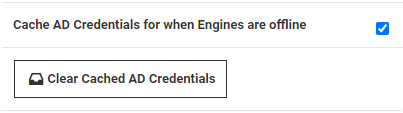

[title]: # (Active Directory Credential Caching)
[tags]: # (AD,credential,cache)
[priority]: # (1000)

# Active Directory Credential Caching

## Overview

Active Directory credential caching enables users to access Secret Server even when the domain controller is unavailable. When caching is enabled, Active Directory credentials are cached for 30 days in the on-premise editions, and for 90 days in Secret Server Cloud.

With credential caching enabled, whenever a domain user successfully logs into Secret Server, their domain password is hashed using PBKDF2, and stored in the Secret Server database along with the current time stamp.

If a domain user attempts to log in but Secret Server is unable to contact a domain controller, it falls back to the cached credentials to attempt to provide access. If the hash of the entered password matches the hash of the cached credentials and the time has not expired, the authentication will be successful.

## AD Caching Configuration

AD credential caching is disabled by default, but an administrator can enabled or disable it at any time using the steps below:

1. Click **Admin** > **Configuration** and click the **Login** tab.  

1. Scroll to the bottom of the window and click the **Edit** button. The tab becomes editable:

   

1. To enable caching, click to select the **Cache AD Credentials for when Engines are offline** check box.

1. To disable caching, click the **Clear Cached AD Credentials** button.

## Auditing

Audit logs are recorded in the system log whenever cached credentials are found to be expired or when a successful login attempt has been made using cached credentials.