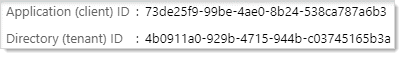
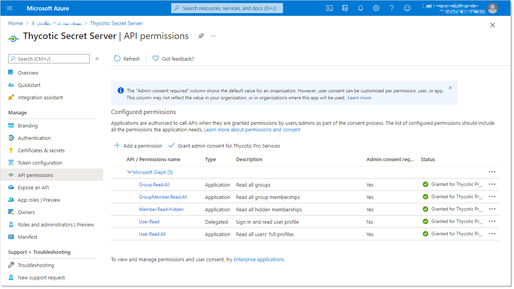

[title]: # (Create an Azure Application Registration)
[tags]: # (Azure, Azure Active Directory)
[priority]: # (1002)

# Create an Azure Application Registration

The steps provided can be used to create the App Registration required for configuring Azure Active Directory integration.

> **Important:** This integration requires .NET Framework version 4.8 or later.

## Azure Portal Method

### Create the Application Registration

1. Log on the Azure Portal

1. If needed, switch to the intended directory.

1. Navigate to the **Azure Active Directory** blade.

1. Click **App registrations** on the left pane in the **Manage** section.

1. Click the **New registration** button. The App Registrations page appears.

1. Type `Thycotic Secret Server` in the **Name** text box.

1. Click to select the **Accounts in the organizational directory only** selection button to choose single tenant.

1. In the **Redirect URI (optional)** section, click to select **Web** in the dropdown list.

1. Type `https://<Your Secret Server URL>/signin-oidc` in the text box to the right of the list.

1. Click the **Register** button. Once the app registration is created, the Azure portal opens the blade to this object.

1. In the blade for this app registration, take note of the **Application (client) ID** and **Directory (tenant) ID**. These will be needed for Secret Server configuration. For example:

   

### Add Client Secret to the Application Registration

1. Click **Certificates & secrets** on the left panel in the **Manage** section. The Certificates & Secrets page appears.

1. Go to the **Client Secrets** section.

1. Click the **New Client Secret** button. The Add a Client Secret section appears.

1. Type `Secret Server` in the **Description** text box.

1. Click to select your desired expiration in the **Expires** selection button.

   > **Note**: If the client secret is set to expire, SS must updated upon or before expiration for this integration to function correctly.

1. Click the **Add** button. The client secret appears in the Client Secrets section.

1. Record the text string in the Value column for that secret.

### Add API Permissions to the Application Registration

1. Click **API Permissions** on the left panel in the **Manage** section. The API Permissions page appears.

1. If any default permissions appear in the unlabeled configured permissions table, click the **…** button and select **Remove Permission**.

1. Click the **Add a Permission** button. The Request API Permissions page appears.

1. Click the **Microsoft Graph** panel button. A wizard begins.

1. Click **Application Permissions** when asked **What type of permissions does your application require?** The **Select Permissions** section appears.

1. In the search text box, type `Group`. A GroupMember section appears.

1. Click to expand the section.

1. Click to select the **GroupMember.Read.All** check box.

1. Repeat the process for the following application permissions:
   - Group.Read.All
   - GroupMember.Read.All
   - Member.Read.Hidden
   - User.Read.All
   
   and for the User.Read delegated permission. The result should look like this:

   
   
1. Click the **Add Permissions** button. A prompt appears.

1. Click the **Yes** button to grant consent to all accounts in the directory. You will receive a notification for "grant consent," and a green checkmark appears in the Status column on the Configure Permissions page.

## Script Method

The script below is provided as-is, and future use may require adjustment if Microsoft changes the AzureAD PowerShell module. 

At the time of writing, there is no command in the AzureAD module granting admin consent to the app. That step has to be performed via the Azure Portal.

[Download the script](./scripts/azuread_sample.ps1)