[title]: # (Create an Azure App Registration)
[tags]: # (Azure, Azure Active Directory)
[priority]: # (1000)

# Create Azure App Registration

The steps provided can be used to create the App Registration required for configuring Azure Active Directory integration.

# Azure Portal

### Create the App Registration

1. Log in to the Azure Portal
1. Switch to the intended Directory (_if needed_)
1. Navigate to the **Azure Active Directory** blade
1. Click **App registrations** on the left pane, under the Manage section

   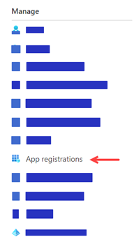

1. Click **New registration**
1. In the **Register an application** blade enter the following:

   | Field | Value |
   | -------------- | ------------------- |
   | Name | `Thycotic Secret Server` |
   | Supported account types | Single Tenant (`Accounts in this organizational directory only`) |
   | Redirect URI | (**Web**) `https://{Secret Server URL}/signin-oidc` |

   An example:

   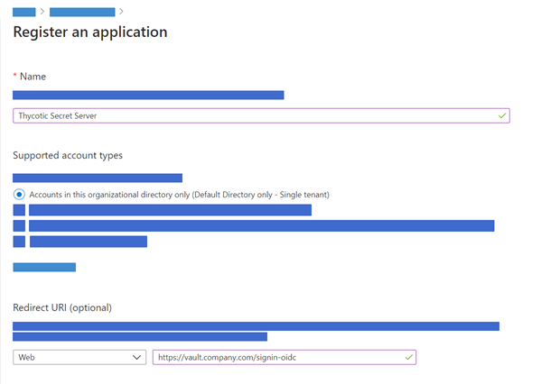

1. Click the **Register** button

   > **Note**: Once the App Registration is created, the Azure Portal should open the blade to this object.

1. In the blade for this App Registration, take note of the **Application (client) ID** and **Directory (tenant) ID**. These will be needed for Secret Server configuration.

   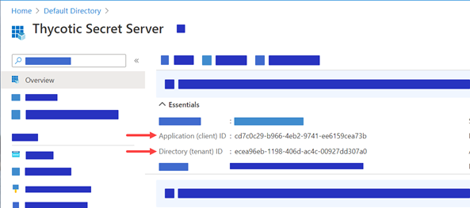

1. Navigate to the **Authentication** on the left panel under the Manage section

   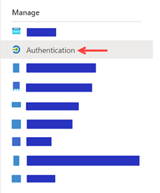

1. Under the **Implicit grant** section, **check both** boxes for `Access tokens` and `ID tokens.`

   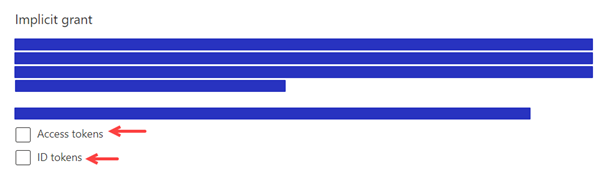

1. Click **Save** (_ensure you receive the portal notification that the application Authentication was updated_)

### Add Client Secret to the App Registration

1. Navigate to the **Certificates & secrets** on the left panel under the Manage section

   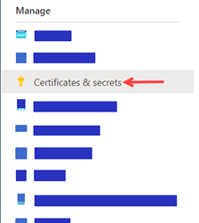

1. Under the **Client secrets** click **New client secret**

   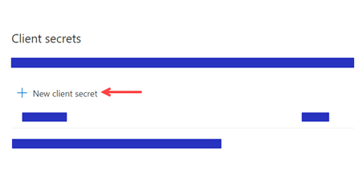

1. Add a description: `Secret Server`
1. Set the Expires option desired
   > **Note**: If the Client secret is set to expire, that Secret Server will have to be updated upon or before expiration for this integration to function correctly.

1. Click **Add**
1. Save the value displayed for the Secret Server configuration

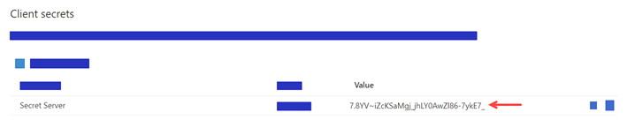

### Add API Permissions to the App Registration

1. Navigate to **API permissions** on the left panel under the Manage section

   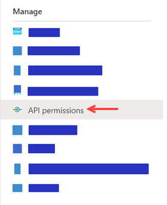

1. Remove any default permissions that may exist (_click the `...` and select `Remove permission`_)

1. Click **Add a permission** under **Configured permissions** section

   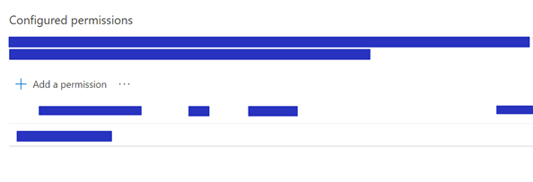

1. In the **Request API permissions** panel, select **Microsoft Graph**

   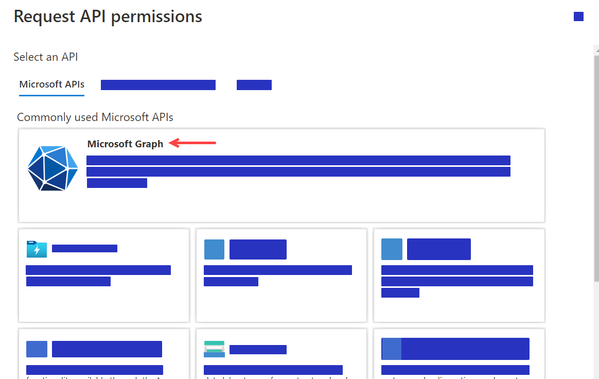

1. Click **Application permissions** when asked, `What type of permissions does your application require?`

   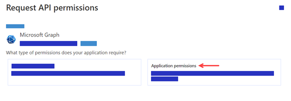

1. A **Select permissions** section will show up below.

1. Search for **Group**
1. Expand **Group** and **check** `Group.Read.All`
1. Expand **GroupMember** and **check** `GroupMember.Read.All`

   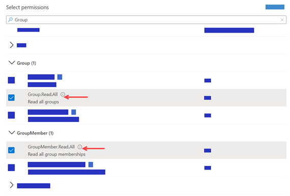

1. Search for **Member**
1. Expand **Member** and **check** `Member.Read.Hidden`

   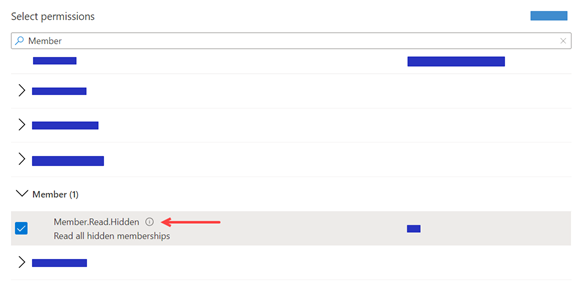

1. Search for **User**
1. Expand **User** and **check** `User.Read.All`

   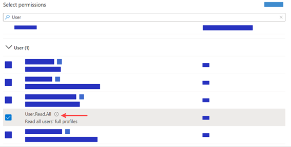

1. Click t **Add permissions** button to add the permissions

   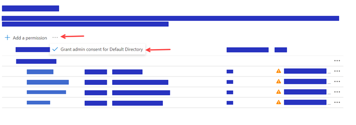

1. Click **Yes** to the prompt to grant consent to _all accounts_ in the Directory

   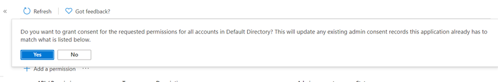

1. Once you receive the notification for _Grant consent_ you should **see the Status** change to green checks

   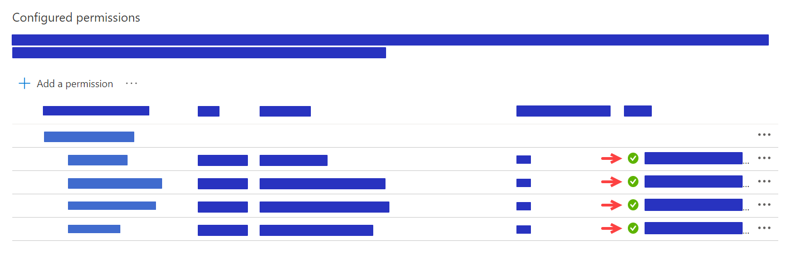

# Script Method

> **Note:** The below code is provided as-is and future use may require adjusting based on the changes made by Microsoft with the AzureAD PowerShell module.


```powershell
Get-AzureADServicePrincipal -Filter "DisplayName eq 'Microsoft Graph'"
```

The output of the above should show the AppID is `00000003-0000-0000-c000-000000000000`.

Assigning the Graph API permissions requires knowing the ID of each permission. The below list should be accurate, but the complete list of permissions and associated IDs can be pulled using the `az ad sp show` command noted below.

```batch
az ad sp show --id 00000003-0000-0000-c000-000000000000 > microsoft_graph_permission_list.json
```

- Group.Read.All - `5b567255-7703-4780-807c-7be8301ae99b`
- GroupMember.Read.All - `bc024368-1153-4739-b217-4326f2e966d0`
- Member.Read.Hidden - `f6a3db3e-f7e8-4ed2-a414-557c8c9830be`
- User.Read.All - `a154be20-db9c-4678-8ab7-66f6cc099a59`
