[title]: # (Azure Active Directory)
[tags]: # (Azure, directory service, active directory)
[priority]: # (1000)

[display]: # (all)

# Integrate Secret Server with Azure Active Directory

> **Important:** This integration requires .NET Framework version 4.8 or later.

Use these steps to integrate Secret Server with Azure Active Directory.

## Azure Portal

### Create the App Registration

1. Login to the Azure Portal
1. Switch to the intended Directory (_if needed_)
1. Navigate to the **Azure Active Directory** blade
1. Click **App registrations** on the left pane, under the Manage section

   

1. Click **New registration**
1. In the **Register an application** blade enter the following:

   | Field | Value |
   | -------------- | ------------------- |
   | Name | `Thycotic Secret Server` |
   | Supported account types | Single Tenant (`Accounts in this organizational directory only`) |
   | Redirect URI | (**Web**) `https://{Secret Server URL}/signin-oidc` |

   An example:

   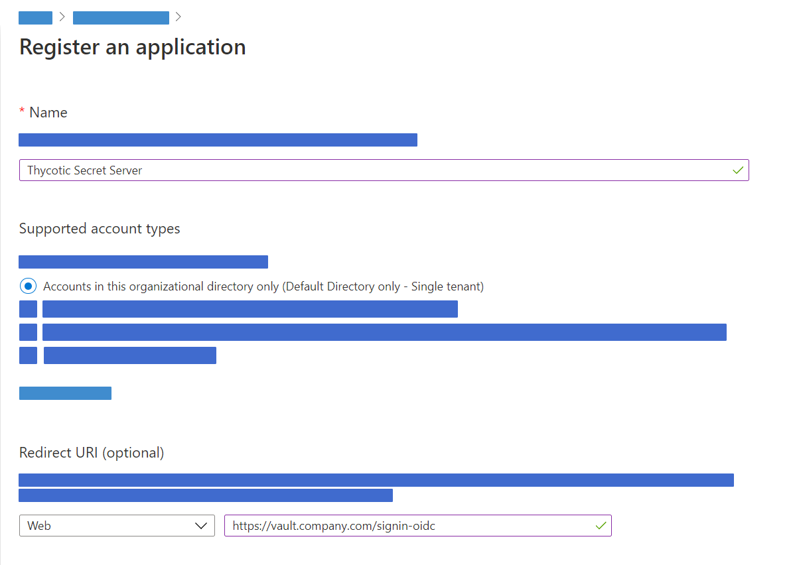

1. Click the **Register** button

   > **Note**: Once the App Registration is created the Azure Portal should open the blade to this object.

1. In the blade for this App Registration, take note of the **Application (client) ID** and **Directory (tenant) ID**, these will be needed for Secret Server configuration.

   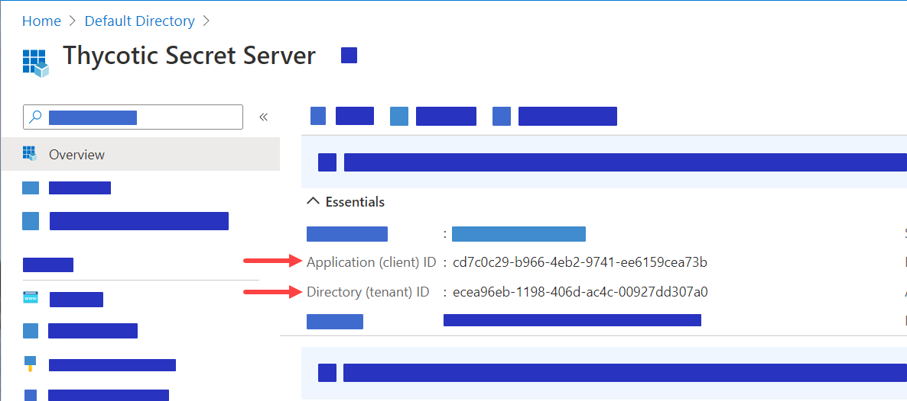

1. Navigate to the **Authentication** on the left panel under Manage section

   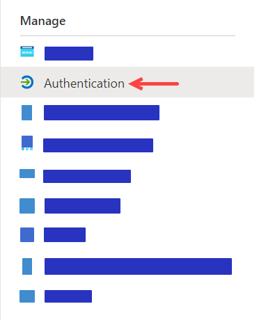

1. Under the **Implicit grant** section **check both** boxes for `Access tokens` and `ID tokens`

   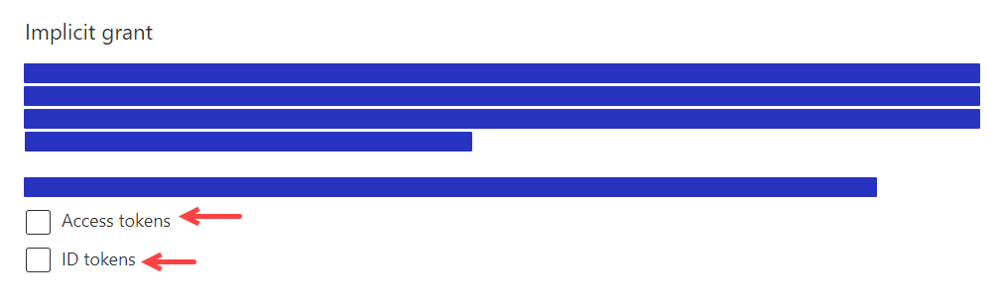

1. Click **Save** (_ensure you receive the portal notification that the application Authentication was updated_)

### Add Client Secret to the App Registration

1. Navigate to the **Certificates & secrets** on the left panel under Manage section

   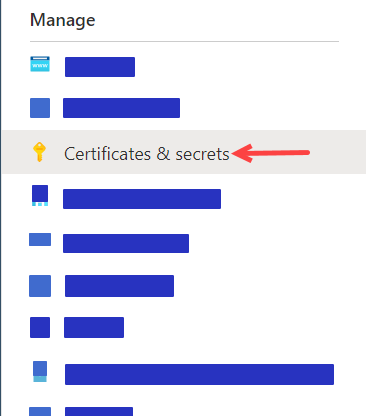

1. Under the **Client secrets** click **New client secret**

   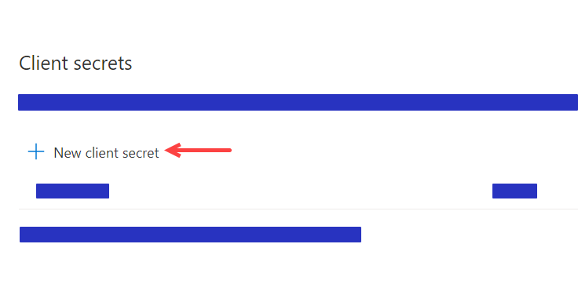

1. Add a description: `Secret Server`
1. Set the Expires option desired
   > **Note**: If the Client secret is set to expire that Secret Server will have to be updated upon or before expiration for this integration to function properly.

1. Click **Add**
1. Save the value displayed for the secret for the Secret Server configuration

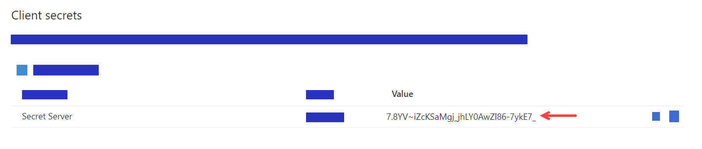

### Add API Permissions to the App Registration

1. Navigate to **API permissions** on the left panel under Manage section

   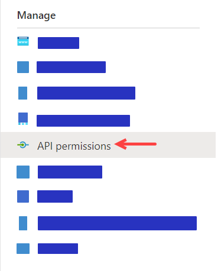

1. Remove any default permissions that may exists (_click the `...` and select `Remove permission`_)

1. Click **Add a permission** under **Configured permissions** section

   

1. In **Request API permissions** panel select **Microsoft Graph**

   

1. Click **Application permissions** when asked `What type of permissions does your application require?`

   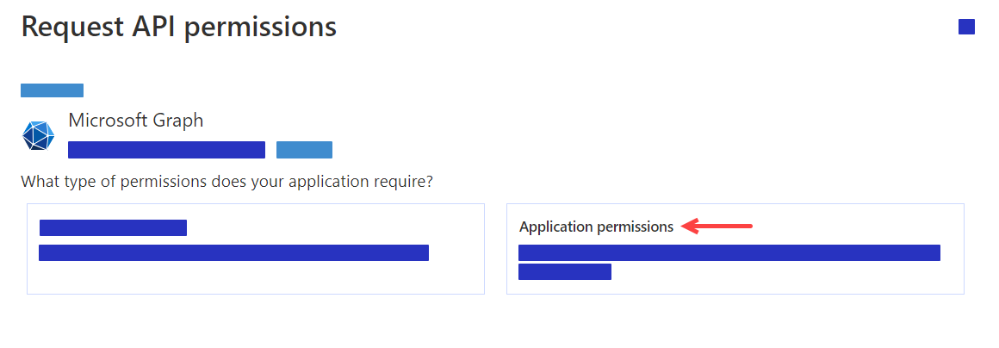

1. A **Select permissions** section will show up below.

1. Search for **Group**
1. Expand **Group** and **check** `Group.Read.All`
1. Expand **GroupMember** and **check** `Groupmember.Read.All`

   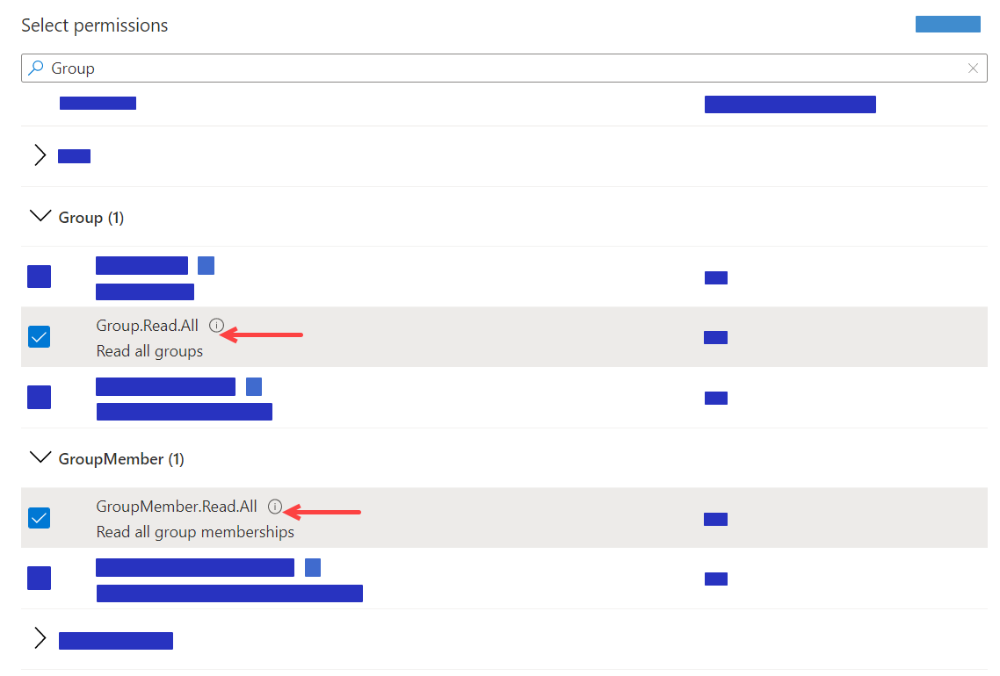

1. Search for **Member**
1. Expand **Member** and **check** `Member.Read.Hidden`

   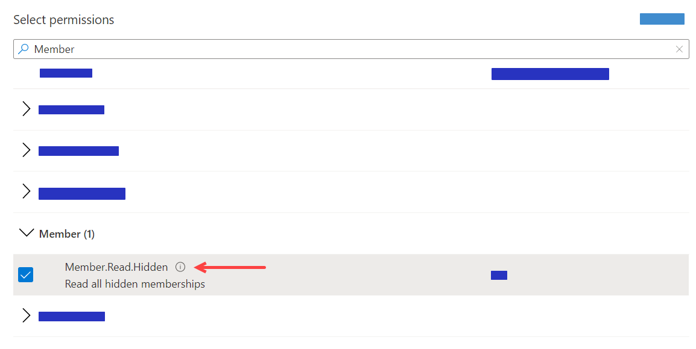

1. Search for **User**
1. Expand **User** and **check** `User.Read.All`

   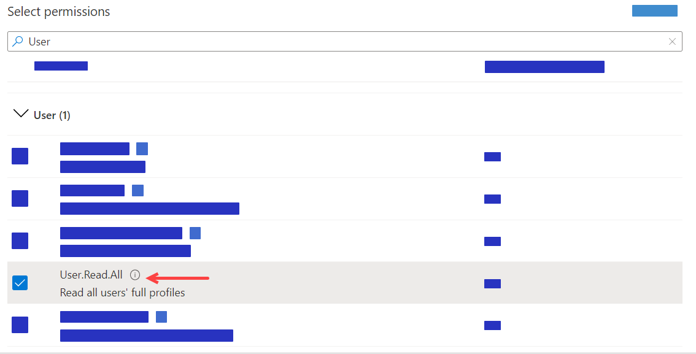

1. Click **Add permissions** button to add the permissions

   

1. Click **Yes** to the prompt to grant consent to _all accounts_ in the Directory

   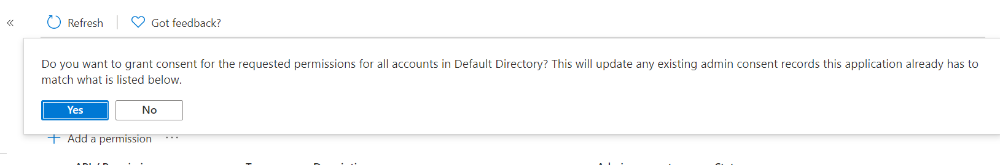

1. Once you receive the notification for _Grant consent_ you should **see the Status** change to green checks

   

## Secret Server Directory Services

1. Navigate to **Admin | Directory Services**.

1. Click the **Add Domain** button.

1. Click the **Azure Active Directory Domain**.

1. Using the values saved from previous steps when creating the App registration, paste or type in:

   - Friendly domain name

   - Tenant ID

   - Client ID

   - Client Secret

1. Ensure the **Active** check box remains checked.

1. (Optional) Click the **Multifactor Authentication** dropdown list to select your desired MFA.

1. Click the **Validate & Save** button. Once validation completes you should see the Friendly domain name listed.

1. Click the name of the new domain to open the configuration page.

1. Click the **Groups** tab.

1. Click the **Edit** link next to **Synchronized Groups**.

1. Scroll to or search for each desired group that contains users you want to sync, in the **Select Groups** table.

1. Ensure each group's check box is **checked**.

1. Click the **Save** button to save your changes. You should now see the selected groups in the Synchronized Groups table.

1. Click the **Directory Services** breadcrumb link at the top of the page to navigate back to the Directory Services page.

1. Click the **Sync Now** button to sync the directory groups.
