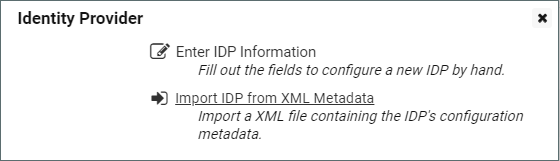

[title]: # (Setting Up ADFS for SAML)
[tags]: # (directory services,active directory,sAMAccountName,UPN)
[priority]: # (1000)
[display]: # (all)

# Setting Up SAML for Secret Server in Azure Active Directory

## Azure AD Configuration

To set up SAML-based single sign-on for Secret Server in Azure Active Directory, follow the [procedures](https://docs.microsoft.com/en-us/azure/active-directory/manage-apps/add-application-portal-setup-sso) provided by Microsoft.

* You will need to download the `SecretServerSAMLMetadata.xml` file from `[YourSecretServerInstance.Name]/samlmetadata`.

* You will need to use `https://[YourSecretServerInstanceName]/saml/SLOService.aspx` for the logout URL.

## Secret Server Configuration

After you have set up SAML SSO for Secret Server in Azure AD, open Secret Server and make the configurations specified below.

1. In Secret Server, click **Admin \> Configuration \> SAML** tab.

1. On the **SAML** tab, click **Create New Identity Provider**.

   

1. Click **Import IDP from XML Metadata** and select the `SecretServerSAMLMetadata.xml` file you downloaded.

   

## Syncing Usernames in Azure AD and Secret Server

For users to be authenticated by the SSO workflow you are setting up, Secret Server usernames must match Azure AD usernames. If you manually add usernames to Secret Server or Azure AD, you must inspect them carefully to ensure that they match. You can also use Secret Server Discovery to sync Secret Server usernames in bulk with Azure AD usernames.

Once a username matches in both systems, the user can log into their desktop computer using their Azure AD credentials and then browse to Secret Server without being prompted again for authentication.

 >**Note**: If you have accounts in which the sAMAccountName differs from the UPN name, you can create custom rules to accommodate the differences. See the Directory Services section of the Secret Server documentation.

## Advanced Certificate Signing Settings

If you apply advanced certificate signing settings to the Secret Server IdP application in Azure AD, use the same settings found in Secret Server for the following:

* **Require Signed SAML Response**

* **Require Signed Assertion**

* **Require Signed Assertion Or Signed SAML Response**.

You can find these settings in Secret Server by clicking **Admin \> Configuration \> SAML** tab and clicking **Advanced Settings** next to your identity provider.
