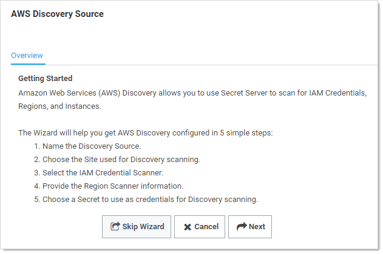
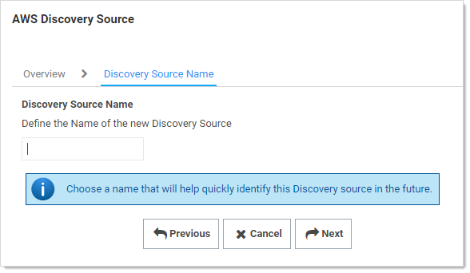
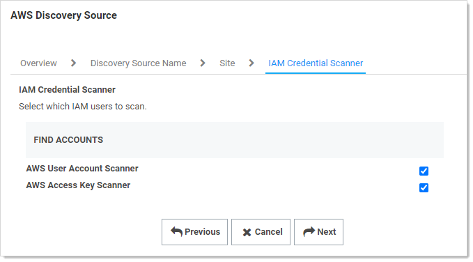
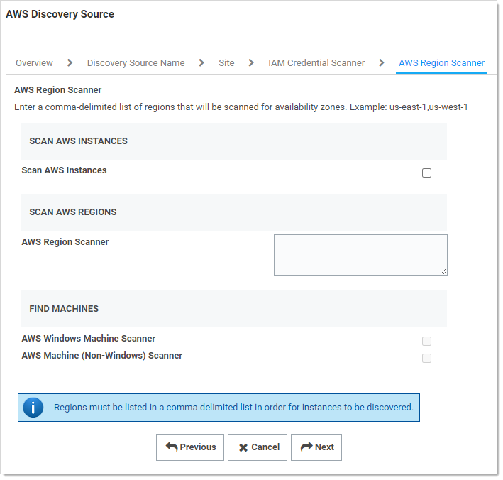
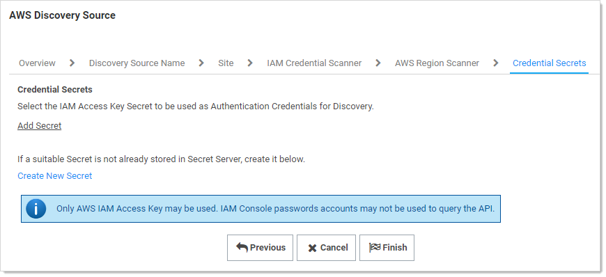
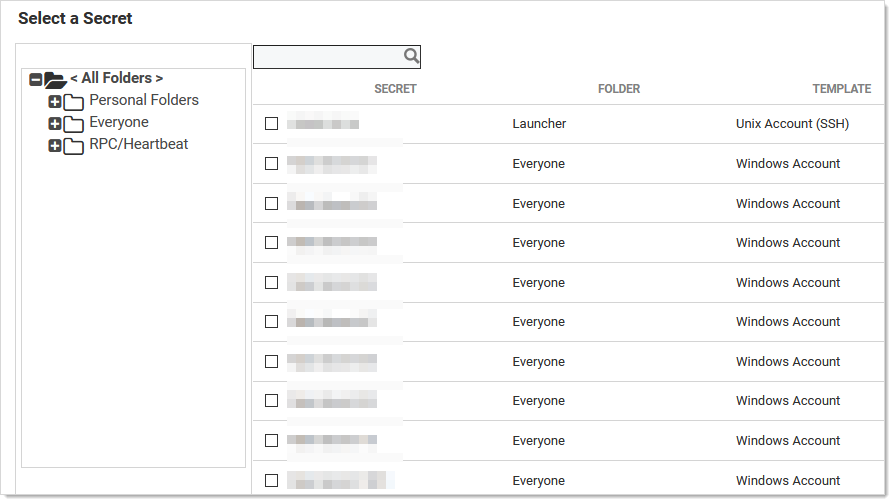

[title]: # (AWS Instance Discovery)
[tags]: # (AWS, Instance Discovery)
[priority]: # (1000)

# AWS Instance Discovery

SS can now scan for instance resources in AWS. You can add this ability in the scanner settings section or through the wizard.

1. Create and AWS discovery source. See [Enabling AWS Discovery](../enabling-aws-discovery/index.md).

1. Navigate to **Admin \> Discovery**:

   

1. Click the **Create Discovery Source** dropdown list and select **AWS (Amazon Web Services)**. The AWS Discovery Source wizard Overview page appears:

   

1. Click the **Next** button. The Discovery Source Name page appears:

   

1. Type the name of the AWS discovery source in the **Discovery Source Name** text box.

1. Click the **Next** button. The Site page appears:

   

1. Click the **Add Site** list box to select the site.

1. Click the **Next** button. AWS Service Account Scanner page appears:

   

1. Click the check boxes for the scanners you desire. 

1. Click the **Next** button.

   

1. Click to select the **Scan AWS Instances** check box.

1. Type the regions you wish to scan for instances. The regions must be listed in a comma-delimited list for instances to be discovered.

   > **Note:** See [Regions, Availability Zones, and Local Zones](https://docs.aws.amazon.com/AmazonRDS/latest/UserGuide/Concepts.RegionsAndAvailabilityZones.html) for more information on AWS regions.

1. Click to select the check boxes for the scanners you desire:

   - **AWS Windows Machine Scanner**: This is a machine scanner that scans each region and pulls all of the AWS Windows OS VM instances.
   - **AWS Machine (Non-Windows) Scanner**: This is a machine scanner that scans each region and pulls all of the AWS Non-Windows OS VM instances.

1. Click the **Next** button. The Credential Secrets page appears:

   

1. Click the **Add Secret** link. The Select a Secret popup appears:

   

1. Navigate the folder tree and select the secret you created earlier. As soon as you select the check box, the popup disappears and the secret appears under the Add Secret link.

1. Click the **Finish** button.

