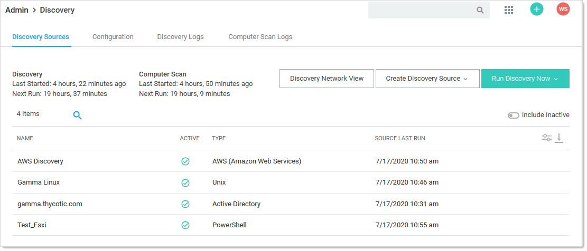

[title]: # (AWS Account Discovery)
[tags]: # (AWS, Account Discovery)
[priority]: # (1000)

# AWS Account Discovery

> **Note:** Please click the table of contents on the left to see any sub-pages to this one. Click the table of contents on the right to see headings on this page.

> **Note:** Discovery must be enabled in SS to discover AWS accounts.

SS can scan Amazon Web Services (AWS) for accounts that can access the cloud resource. Two types of secrets can be discovered and managed through SS:

- AWS Access Key: Keys used for programmatic integration with AWS.
- AWS Console Account: User login accounts for AWS.

**AWS Account Discovery**

**Note:** Please click the table of contents on the left to see any sub-pages to this one. Click the table of contents on the right to see headings on this page.

**Note:** Discovery must be enabled in SS to discover AWS accounts.

SS can scan Amazon Web Services (AWS) for accounts that can access the cloud resource. Two types of secrets can be discovered and managed through SS:

- AWS     Access Key: Keys used for programmatic integration with AWS.
- AWS     Console Account: User login accounts for AWS.

 

## Enabling AWS Discovery

\1.  For SS to communicate with AWS, users with sufficient privileges need to create an access key for their account in AWS Identity and Access Management (IAM). The account used to do this requires the following permissions to discover users and access keys:

1. - `iam:ListUsers`
   - `iam:GetLoginProfile`
   - `iam:ListAccessKeys`

**Note:** These permissions are limited to the resources the user is allowed to access.

\2.  Once this access key is created, use the access key and secret key to create a secret in SS using the Amazon IAM key template.

\3.  Create a new AWS discovery source and use the Amazon IAM key as the credentials secret for the discovery source.

**Note:** AWS only allows programmatic integration through access keys. This type of secret is required for discovery to work. Discovery must be enabled in SS for this feature to work.

 

## Password Management in AWS

SS can manage password and access keys for AWS IAM accounts.

### Amazon IAM Keys

Password changing, privileged password changing, and running heartbeats are available for Amazon IAM key secrets. When an Amazon IAM key has its password changed through SS, the new secret key is generated automatically and is not set by user input.

During password changing, you can disable or remove old keys through settings available in the advanced configuration:

- `<add     key="ShouldDeletePreviousKey" value="true" />`
- `<add     key="ShouldInactivatePreviousKey" value="true" />`

**Important:** Altering advanced settings can significantly impact the performance and behavior of SS, so there is no direct link anywhere in SS to the Advanced Settings page. If you need to change any advanced setting (as mentioned in this guide), please contact Thycotic Technical Support.

### Amazon IAM Console Password

Password changing, and privileged password changing are available for Amazon IAM console password secrets. Due to AWS IAM’s restrictions on programmatic integration, this secret type cannot use SS heart beat.

In addition, an Amazon IAM key secret must be associated with an Amazon IAM console password secret for password changing to occur. To associate the two:

1. Create the Amazon IAM console password secret,     and an Amazon IAM Key secret for an account that has the permissions to     change the console user’s password. This can be the console account’s own     access keys, if the user has permission.
1. Navigate to the RPC tab of the Amazon IAM     Console Password.
1. Under **Change Password Using Privileged Account** select **Edit**, and choose     the IAM key secret created in the previous step. RPC should now be     possible on the console password secret.

### Permissions Required for Secret Key Changes

**Note:** These permissions are at the most granular level. You can implement broader methods through wildcard resource restrictions, permission policies, or groups.

Privileged Permissions: (those the AWS account needs to change another users’ access keys):

- `iam:DeleteAccessKey` on     resource `arn:aws:iam::<account>:user/<otherUserName>`
- `iam:UpdateAccessKey` on     resource `arn:aws:iam::<account>:user/<otherUserName>`
- `iam:CreateAccessKey` on     resource `arn:aws:iam::<account>:user/<otherUserName>`
- `iam:ListAccessKeys` on     resource `arn:aws:iam::<account>:user/<otherUserName>`

Basic Permissions (those the AWS account needs to change its own access keys):

- `iam:DeleteAccessKey` on     resource `arn:aws:iam::<account>:user/${aws:username}`
- `iam:UpdateAccessKey` on     resource `arn:aws:iam::<account>:user/${aws:username}`
- `iam:CreateAccessKey` on     resource `arn:aws:iam::<account>:user/${aws:username}`
- `iam:ListAccessKeys` on     resource `arn:aws:iam::<account>:user/${aws:username}`

### Permissions Required for Changing the Amazon IAM Console Password

**Note:** These permissions are at the most granular level. You can implement broader methods through wildcard resource restrictions, permission policies, or groups.

The permissions are:

·     Privileged Permission: `iam:UpdateLoginProfile` on `resouce arn:aws:iam::account>:user/<otherUserName>`

·     Basic Permission: `iam:ChangePassword` on resource `arn:aws:iam::<account>:user/${aws:username}`

 

## AWS Instance Discovery

SS can now scan for instance resources in AWS. These can be added in the scanner settings section or through the wizard.

Create AWS Discovery Source

Navigate to Admin > Discovery

Click the **Create Discovery Source** dropdown list and select **AWS (Amazon Web Services)**. The AWS Discovery Source wizard Overview page appears:

Click the **Next** button. The Discovery Source Name page appears:

Type the name of the AWS discovery source in the **Discovery Source Name** text box.

Click the **Next** button. The Site page appears:

Click the **Add Site** list box to select the site.

Click the **Next** button. AWS Service Account Scanner page appears:

Click the check boxes for the scanners you desire. 

Click the **Next** button.

Click to select the **Scan AWS Instances** check box.

Enter the regions you wish to scan for instances. Note: The regions must be listed in a comma delimited list in order for instances to be discovered.

More information on AWS regions: https://docs.aws.amazon.com/AmazonRDS/latest/UserGuide/Concepts.RegionsAndAvailabilityZones.html

Click the check boxes for the scanners you desire. 

**AWS Windows Machine Scanner**: This is a machine scanner that scans each region and pulls all of the AWS Windows OS VM instances.

**AWS Machine (Non-Windows) Scanner**: This is a machine scanner that scans each region and pulls all of the AWS Non-Windows OS VM instances.

Click the **Next** button. The Credential Secrets page appears:

Click the **Add Secret** link. The Select a Secret popup appears:

Navigate the folder tree and select the secret you created earlier. As soon as you select the check box, the popup disappears and the secret appears under the Add Secret link.

Click the **Finish** button.

### Viewing Discovery Scanners for the AWS Discovery Source

 

To view these scanners:

Go to **Admin > Discovery**

Click the discovery source name link in the table. The Discovery Source page for it appears.

Click the **Scanner Settings** button in the top right of the page. The Discovery Source Scanner Settings page appears, which lists the scanners.

AWS Scanner Advanced Settings

In AWS Discovery Source Scanner Settings, select a machine scanner

Platform Include Filter: Comma separated list for platforms to include in the scan. Ex: windows

Platform Exclude Filter: Comma separated list for platform to exclude from the scan.Ex: windows

Custom Additional Filters: Additional filters to scan may be included. Ex: tag:Purpose=store,database;

Instance Name Preference: If found on the instance, this will be used for the Computer Name. Consider how the machine will be accessed with the selection. If selection is not found then defaults to PrivateDnsName.