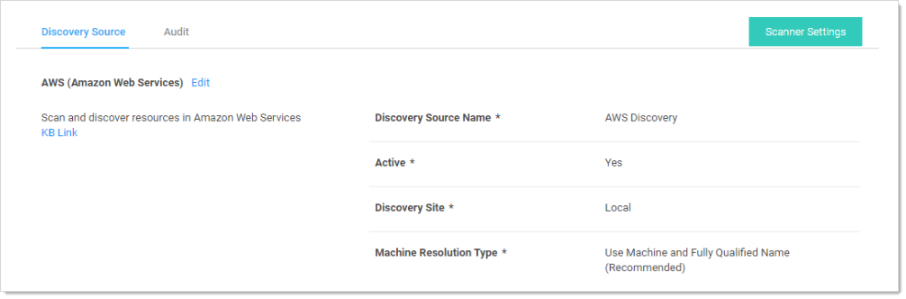

[title]: # (Viewing Discovery Scanners for the AWS Discovery Source)
[tags]: # (AWS, Account Discovery, scanner)
[priority]: # (1000)

# Viewing Discovery Scanners for the AWS Discovery Source

 To view these scanners:

1. Go to **Admin > Discovery**.

   

1. Click the discovery source name link in the table. The Discovery Source page for it appears:

   

1. Click the **Scanner Settings** button in the top right of the page. The Discovery Source Scanner Settings page appears, which lists the scanners.

   

1. Click pencil edit icon for the machine listing. The settings for that scanner appears:

   

1. Complete the following settings:

   - **Platform Include Filter**: Comma separated list for platforms to include in the scan. Example: `windows`.
   - **Platform Exclude Filter**: Comma separated list for platform to exclude from the scan. Example: `windows`,
   - **Custom Additional Filters**: Additional filters to scan. Example: `tag:Purpose=store,database;`
   - **Instance Name Preference**: If found on the instance, this is used for the Computer Name. Consider how the machine will be accessed with the selection. If selection is not found, it defaults to PrivateDnsName.

1. Click the **OK** button.

