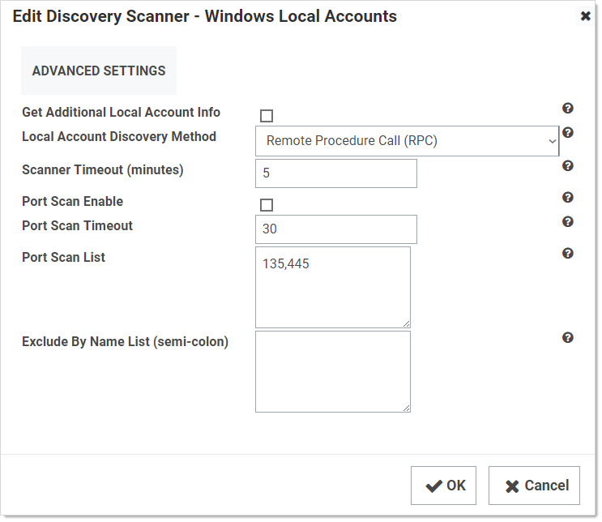
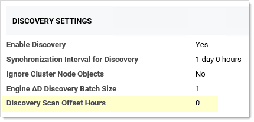
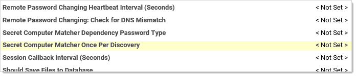
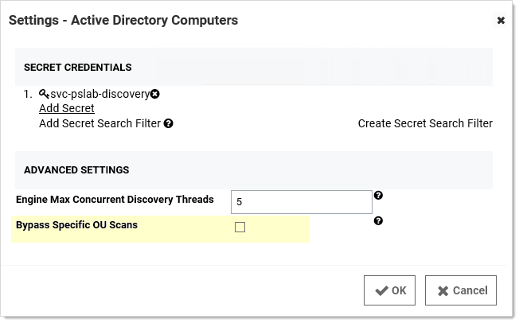

[title]: # (Discovery Best Practices)
[tags]: # (Discovery, Best Practices)
[priority]: # (1000)

# Discovery Best Practices

## Overview

This document covers the most common settings to tune to make discovery more efficient. Environmental factors contribute to some these settings. 

## Global Settings 

The settings below might make discovery more efficient, regardless an organization’s size. 

### Enabling Port Scanning

#### Introduction

*Port scanning* is a scan that can be conducted before the regular discovery scan to potentially reduce discovery time—if specified ports are unavailable on a given machine, the standard discovery scan will eventually timeout (the default is five minutes). Port scanning eliminates that timing out process, which saves time.

**Figure:** Edit Discovery Scanner for Windows Local Accounts

Port scanning for discovery has three configurations or controls:

- Port Scan Enable: Whether to port scan at all. Defaults to unchecked. 

- Port Scan Timeout: How long (in seconds) the port scan will try before giving up. Defaults to 30.

- Port Scan List: A comma-delimited list of ports to scan. These depend on the configuration of the systems you will scan. Defaults to NetBIOS (135) and Active Directory services (445).

Examples of scanners that have a port-scanning timeout option for Active Directory include: 

- Windows local accounts 

- Active Directory user accounts 

- All dependency scanners 

#### Accessing Port Scanning

Simply go to **Admin \> Discovery Configuration \> Edit Discovery Sources (button) \> Configure Discovery Scanners (button) \> Accounts (tab)**, and then click the pencil icon for the desired scanner. If the configurations are on that page, that scanner supports port scanning. See the previous figure.

#### Additional Reasons to Consider Discovery Port Scanning

##### Lowering the Discovery Scanner Timeout May Cause Issues

If you lower the regular discovery scanner timeout, without port scanning enabled, you may kill a running scan. In addition, non-Active-Directory discovery scanners, such as a custom PowerShell scanner, that are slow or prone to hanging may also be disrupted or even crash if the regular discovery scanner timeout is set too low. As a best practice, we recommend enabling port scanning and not lowering the regular scanner timeout, which defaults to five minutes, unless Thycotic Support asks you to. Do not lower the port scanning timeout below 15 seconds.

##### Secrets with Multiple Dependencies May Create Especially Long Timeouts

Without discovery port scanning enabled, discovery scanners rely on the standard timeout, which defaults to five minutes. If a secret has multiple dependencies, the system may have a chain of discovery timeouts  to process, one at a time. With the default five-minute timeout on all the systems, timing out can take a long time, especially if you have a lot of machines turned off or unavailable. Discovery port scanning greatly reduces that. 

To calculate the maximum timeout for discovery use this formula (with all systems using the same timeout value and each secret having the same number of dependencies): 

`(number of secrets) × (number of dependencies) × (timeout value) = (maximum minutes for discovery scans) `

For example, using the default five-minute timeout value for 35 secrets, each with three dependencies:

`35 × 3 × 5 = 525`

Thus, 8.75 hours (525 ÷ 60) of timeout are possible and enabling discovery port scanning becomes a really good idea, especially if you have a lot of machines down at any given time.

> **Note:** We can ignore clustered objects as part of a discovery scan, but we cannot ignore disabled computer objects, so SS tries to scan each object that exists within AD. If you have a centralized area for disabled computer objects, consider configuring discovery to be OU specific and excluding your disabled computers OU to make discovery more efficient.

### When to Run Discovery 

Currently, you cannot set when discovery runs via a control or setting. You can, however, approximately set when it runs by disabling and enabling it at the desired time. It runs daily around the same time as when it was first enabled and then again according to whatever the [discovery scan offset hours](#discovery-scan-offset-hours) interval was set to. If you are running discovery once per day, we suggest:

- Choosing a start time outside your normal business hours, such as midnight. 

- First running several ad-hoc discoveries when your network traffic normally drops at the end of the day. Record how long each discovery process takes. Remember, this can vary greatly if a lot of machines are down, which is why we suggest conducting more than one discovery.
  
   > **Note:** It might be fun to run one test with discovery port scanning disabled, just to see the difference.
   
- Using the average time the test runs took, calculate when to start discovery at a time when no anticipated portion of the discovery period is during your high-traffic times. We suggest having an end buffer as long as possible to account for variability, so if your average discovery time is fairly long, it might be best to start discovery soon after your network traffic drops off for the evening. This is especially true if your machine pool is growing.

For example, if your tested average discovery time was four hours and your network traffic is busy between 0600 and 1800, you should run discovery between 1800 and 0200, the closer to 1800 the better.

### Discovery Settings

**Figure:** Discovery Settings Page in Edit Mode 

The settings are:

- Synchronization Interval for Discovery: How often you want the regular discover scan to occur.

- Ignore Cluster Node Objects: A check box that tells SS to not run discovery on machines identified as “msclustervirtualserver.” Do not change this setting.

- Engine AD Discovery Batch Size: A legacy setting that should always be set to 1.

- See [Discovery Scan Offset Hours](#discovery-scan-offset-hours) for a discussion of the last setting.

> **Note:** There is another “Discovery Batch Size” setting on the Advance Settings page, which is usually only available to Thycotic Customer Support. This setting, too, is legacy, and should not be set.

## Environment-Specific Considerations 

### Discovery Scan Offset Hours

This section discusses a setting that allows you to quickly discover changes without greatly increasing traffic.

**Figure:** Discovery Settings Page in View Mode

The “discovery scan offset hours” (DSOH) setting is for customers that need to detect new (to the network) systems quickly without excessive network traffic during business hours. For example, you might need this feature if you have lots of server testing (systems are up and down) or laptops (systems are connected or not). The trick is doing this while minimizing the networking load. 

We accomplish this with discovery scan offsets. With these, you have multiple synchronization scans per day, rather than just one, where SS attempts to scan each and every system, but first SS looks up each system to see if that system is flagged for scanning. The process goes like this:
$1
$21. Once set, each timer starts counting down. Until that timer runs out, SS ignores the scanned system if it runs a discovery scan.
$1
$21. The next time SS does a discovery scan, it sees the flag is present and scans the system. 

The period the “scan me” flag is down (the period the timer is running) is defined by the DSOH setting. Thus, DSOH essentially tells SS how long before scanning that discovered system again. 

For example, if you have a discovery scan offset of 12 hours and a discovery interval of four hours:
$1
$21. At four-hours: The next time discovery runs , it ignores the objects that were scanned the first time (because their timer was set to 12 hours), but it does process any newly discovered objects. 
$1
$21. At 12 Hours:  In four more hours, the scan runs again. This time, the 12-hour scan offset has expired, and all the timers of the original objects are zeroed out. The process begins anew—discovery scans every object because its timer is zeroed out, which makes it flagged for scanning. After scanning, each object’s timer starts to count down, which makes it unflagged for scanning.

###  Advanced Settings

> **Note:** These settings reside in the ConfigurationAdvanced.aspx file, which you should not edit unless Thycotic Support asks you to.

#### Run Secret Computer Matcher Once per Discovery

**Figure:** Secret Computer Matcher Once per Day

During the discovery process, secrets are matched with their machine. For smaller customers, this likely has little performance impact. For very large customers, the performance impact is noteworthy. We recommend that large businesses enable this option to decrease matcher resource use. 

By default, the secret computer matcher runs once every five hours (this is non-configurable). This means the matcher runs four times per day, and only one of those times could coincide with discovery running at four-hour intervals. The other three will not run in tandem with discovery and thus will increase network traffic. If you enable this setting, the matcher will instead run after each discovery completes. If discovery only runs once, the matcher only runs once too. This more efficient because discovery can take hours to run, and having the matcher run several times during that period wastes processing.

#### Limit the Network Traffic Caused by Nested Organizational Units

**Figure:** Discovery: Bypass “Scan Specific OUs”

If you configure discovery for Active Directory to scan by separate OUs and not by the entire domain, nested OUs can overwhelm your message bus. This occurs because each OU generates its own message unless you enable this setting. So if your enterprise has a complex tree of nested OUs, as many large businesses do, you could experience this issue. Smaller enterprises with single or a small number of nested OUs can ignore it. If you change the configuration in the Advance Configuration page file, it will affect all discovery source settings (some scanners have a similar configuration that only affects them). Alternatively, for more flexibility, you can configure this individually at the scanner level by checking the Bypass Specific OU Scan check box on the Settings - Active Directory tab for the scanner:

**Figure:** Tuning Active Directory Settings

## Engines and Engine Workers

The number of distributed engines and engine workers within your environment can affect how fast discovery completes. Increasing CPU counts on your existing engines may help them to complete a diverse set of tasks more efficiently but might not have much effect on discovery processing time. If an engine is doing discovery, only a subset of consumers run and they will run into a prefetch count limit (30 messages per engine). Thus, increasing the number of engines and engine workers might decrease total discovery time by increasing that prefetch limit.