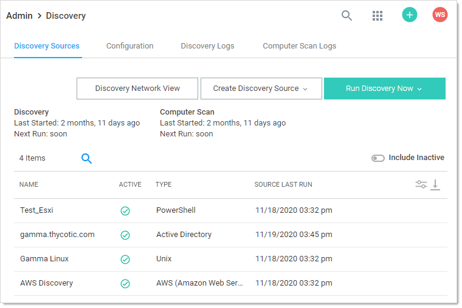
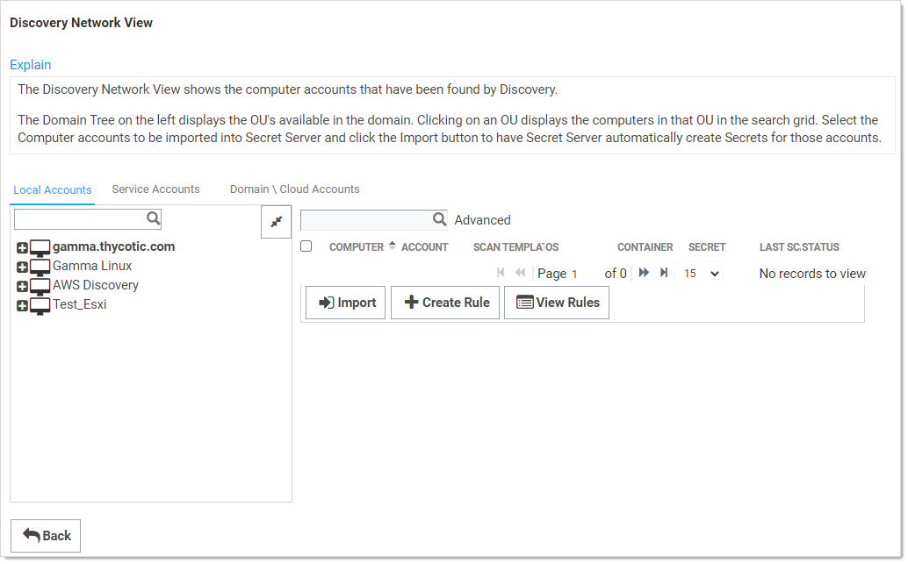
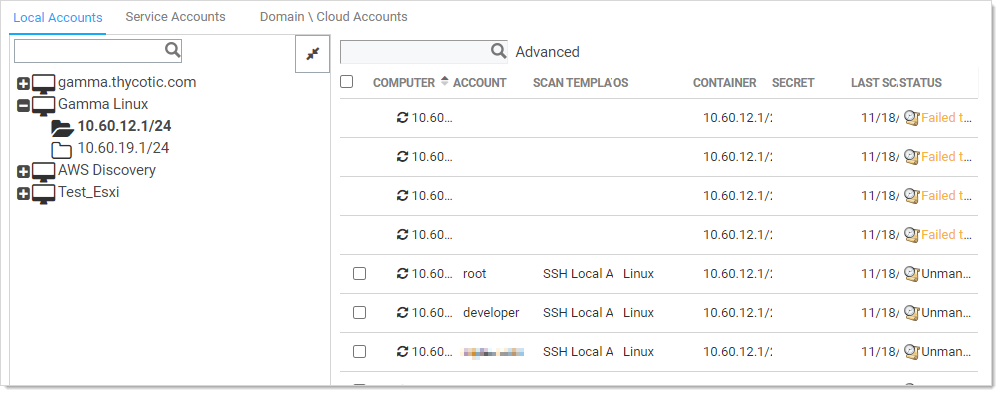
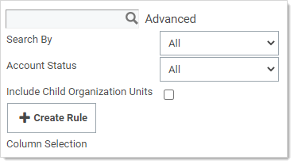

[title]: # (Running AD Discovery)
[tags]: # (discovery,active directory)
[priority]: # (1000)

# Running and Interpreting Active Directory Discovery

This topic discusses how to configure, run, and interpret discovery scans on Active Directory systems. After the initial configuration, normally the discovery source is set to active, which runs the follow-on tasks automatically. You can also manually run ether a discovery (locate computers on the domain) or computer (inspect the individual computers) scan.

## Step One: Discovery Configuration

Running a discovery on an AD system is easy, assuming everything was configured correctly. To that end, follow these instructions first:

- [Setting Permissions for Active Directory Scans](../permissions-active-directory-discovery/index.md)
- [Creating Active Directory Discovery Sources](../creating-active-directory-discovery-source/index.md)
- [Enabling Specific OU Domain Discovery](../../../general-information/discovery-enabling-specific-ou-domain/index.md) (optional)

## Step Two: Discovery Scan

When you complete the configuration and there is at least one active discovery source and discovery is enabled (the Active check box is selected), you can run a discovery scan manually or wait for an automatic one to start. A typical scan:

1. Runs discovery matching: The discovery matcher creates a link between existing active secrets and any existing secrets in SS based on their machine names, accounts and dependencies. The matcher is automatic. When matches are found, the corresponding existing discovery results appear as "managed" in the discovery network view with a link to the existing secret or dependency.

1. Runs discovery rules: SS attempts to match any unmanaged discovery results to the rule's parameters. If a rule matches the results, discovery automatically imports the results using the settings in the discovery rule. Once finished, discovery begins.

1. Runs the find host ranges scanner: The scanner (using the Windows discovery base scanner) runs with an Active Directory domain input template. The scanner determines which OUs are to be scanned and populates its organizational unit output template with a list of those OUs. The output template will be used by the following find machine scanner and also by the find local accounts scanner, which does not require machine information.

1. Runs the find machine scanner: The scanner (using the Windows Discovery base scanner) examines OUs from its organizational unit input template via LDAP and creates a list of machines with which it populates its Windows computer output template. This is the list of computers to run a dependency scan on. The find dependencies scanner uses this instance of the output template as its input template.

> **Note:** You can see logs of this process by going to the Discovery Logs tab on the Discovery page.

To run a manual discovery scan, on the **Admin** menu, click the **Run Discovery Now** button and select **Run Discovery Scan**. 

## Step Three: Computer Scan

Once the computers in the desired AD domain or OU are discovered, a computer scan runs AD queries on each machine found during the discovery scan to attempts to the collect the information the discovery source was configure to collect, which can include local accounts, Windows services, scheduled tasks, and IIS application pools. Specifically, the scan:

1. Runs the find local accounts scanner: Using the file load discovery base scanner, SS examines OUs from its organizational unit input template via LDAP and creates a list of all AD admin accounts with which it populates its Active Directory account output template. This is the list of discovered admin accounts.

1. Runs the find dependencies scanner: Using the Windows discovery base scanner, SS examines a list of machines from its Windows computer input template using various technologies. For example, applications pools use Microsoft Web Administration (WMA) or, failing that, Windows Management Instrumentation (WMI). Services use WMI, and scheduled tasks use Windows' task scheduler interfaces. The find dependencies scanner can return any number of output templates as desired. These include: com+ application, computer dependency (basic), PS dependency, remote file, SQL dependency (basic), SSH dependency (basic), SSH key rotation dependency, Windows application pool, Windows scheduled task, and Windows service.

> **Note:** You can see logs of this process by going to the Computer Scan Logs tab on the Discovery page.

To run a manual computer scan, on the **Admin** menu, click the **Run Discovery Now** button and select **Run Computer Scan**.

## Step Four: Viewing Discovery Results

### Browsing Discovery Results

1. Go to **Admin \> Discovery**. The Discovery Sources tab of the Discovery page appears: 

   

1. Click the **Discovery Network View** button.  The Discovery Network View Page appears:

   

   The Discovery Network View page shows any discovered computer accounts. The domain tree on the left displays the domains as folders with OUs for that domain presented as folder contents. Clicking on a folder and then on an OU displays the computers in that OU in the table on the right. For example:

   

   > **Note:** For large numbers of domains you can type the domain name in the unlabeled search box over the domain folder tree and press \<Enter\> to narrow what domains are presented to you. 
   
   The discovery page has tabs for local account, service accounts, and domain or cloud accounts.  All are very similar and draw from the same network tree on the left. 

### Searching Discovery Results

To search for a specific discovery source or OU, type the source or OU name in the search bar displayed at left. If results are found, click the result shown below the search field to highlight it. Now, only machines from that source or OU will be displayed at right.

To search for a specific computer name, account, or service name, type the search term in the search field on the right. Matching results are filtered below the search field. 

To use advanced search settings, click the **Advanced** link beside the search field. The Search By and Account Status dropdown list boxes and Create Rule button appear:

Select an option in the **Search By** menu to narrow the search results to match an account, computer, operating system, or rule.

> **Note:** "Rule" only appears in the list box if discovery rules exist for local accounts. When you select it, another menu appears for selecting a rule. For more information about creating and searching with rules, see [Discovery Rules](../../../general-information/discovery-rules/index.md).

Click the **Account Status** dropdown list to select accounts managed or unmanaged by SS.

Click to select the **Include Child Organization Units** check box to match search results within child OU's of the OU highlighted in the folder tree.

### Understanding Discovery Results

The table below describes the contents of each column:

**Table:** Discovery Results

| Column             | Description                                                  | Account Type  (Local,  Service) |
| ------------------ | ------------------------------------------------------------ | ------------------------------- |
| **Account**        | Username of discovered account.                              | Both                            |
| **Computer**       | Computer  name of the machine scanned. This is obtained from AD during the  first part of the discovery process. | Both                            |
| **Last Connected** | Last date a user logged into the machine.                    | Local                           |
| **Last Scanned**   | Last  date that the machine was scanned by discovery.        | Both                            |
| **Org Unit**       | Organizational Unit the machine is joined to. This information is obtained from AD during the first part of the discovery process. | Local                           |
| **Secret**         | If a secret name appears here, a credential secret already exists for the account listed in the account column. Otherwise, this column is blank. | Both                            |
| **Service Name**   | Name of  a discovered dependency.                            | Service                         |
| **Status**         | Indicates that an account is managed by SS, connectivity issues, or no accounts detected. For more information about error messages, see [Discovery Error Messages](../../../general-information/discovery-error-messages/index.md). | Both                            |
| **Type**           | Discovered dependency type icon. See the following table.    | Service                         |

Service account dependency types identified in the **Type** column:

**Table:** Service Account Dependency Types

| Type                 | Icon                                                         | Service Name              |
| -------------------- | ------------------------------------------------------------ | ------------------------- |
| **Application Pool** |  | IIS application pool name |
| **Scheduled Task**   |  | Scheduled task name       |
| **Windows Service**  |  | Service name              |

> **Note**  To correctly identify and import IIS application pools for IIS 7 or higher, SS requires a trust relationship between the scanned domain and domain that the SS Web server is joined to. 