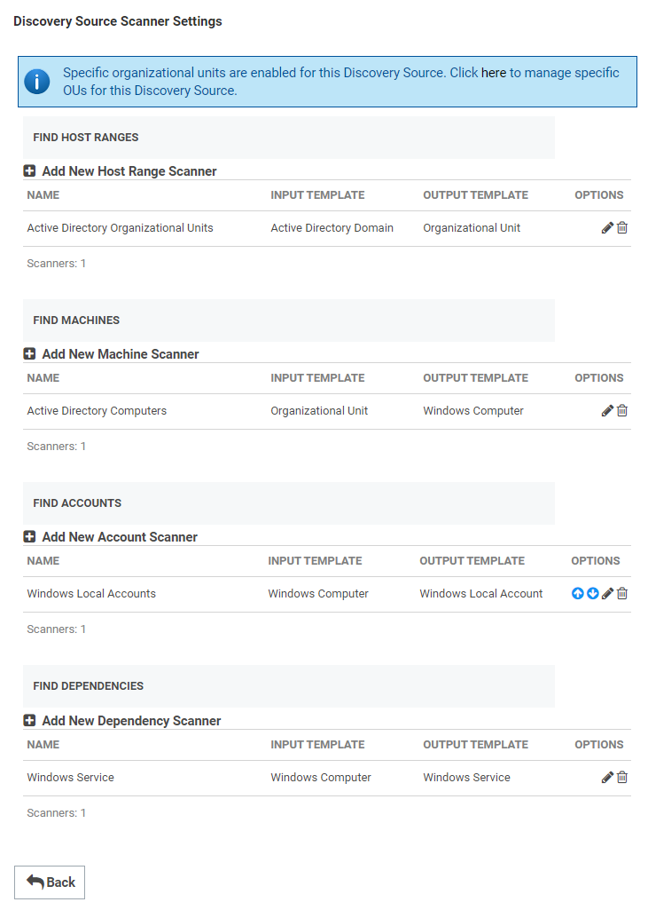
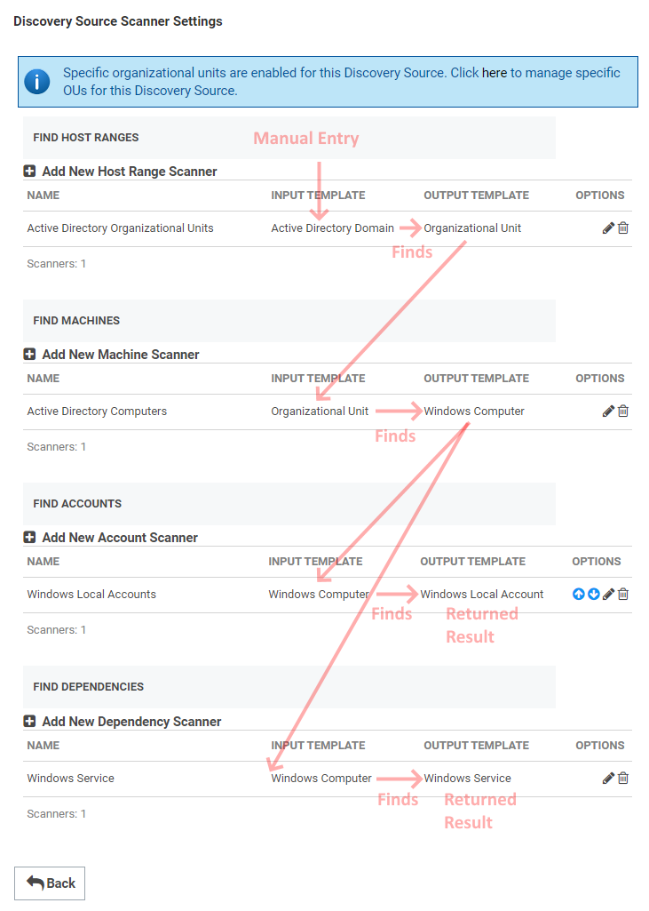
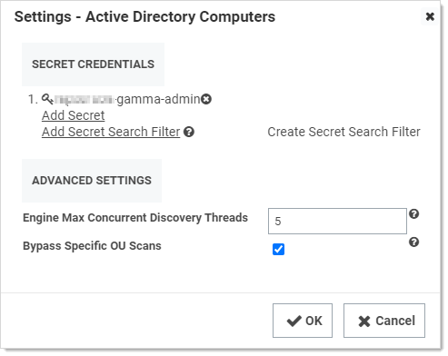
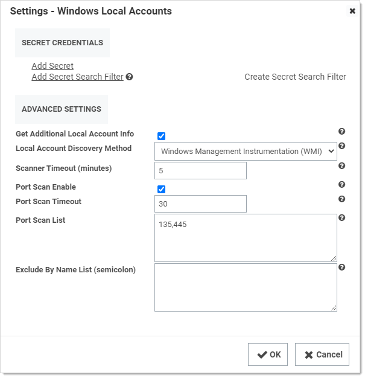

[title]: # (Discovery Sources, Scanners, and Templates)
[tags]: # (discovery,discovery scanner,discovery source,discovery scanner)
[priority]: # (1000)

# Introduction to Discovery Sources, Scanners, and Templates

## Discovery Source

A *discovery source* is a named collective, ordered system that conducts discovery. There are five broad types: Active Directory, Amazon Web Services, Unix, VMware ESX\ESXi, and Google Cloud Platform.

Configuring discovery is defining the parameters of the discovery source, once the general type is chosen.

Each discovery source is a configurable definition of how to scan for computer assets in a given environment. A subcomponent of discovery source, called a scanner, details how to perform those scans.

## Discovery Scanner

A *discovery scanner* is a component of a discovery source that that collects information during a discovery. There are four general types of scanners, called *scan templates* (in their sequential running order): 

- Find host ranges
- Find machines
- Find (local) accounts
- Find dependencies

> **Note:** They are called scan *templates* because when you create an instance of a discovery source, it includes scanners based on a standardized set of scanners specific to the platform the discovery source is designed for and the type of performed scan. That is, when you create a discovery source, you are instantiating a set of of scanner objects copied from a set of static templates. You cannot modify the templates, but you can modify the scanners based on them.

**Figure:** Example Scanner Template for Active Directory

Thus, a discovery source consists of an ordered sequence of discovery scanners, along with some data specific to the whole discovery source. Each scanner has a defined input and output, which are also based on object templates. A discovery source can have more than one scanner of a given type.

## Discovery Input Template

The defined input type for a discovery scanner. An instance of the template contains the data needed to conduct the scan. The input template is often, but not always, an output template of the preceding scanner in the sequence. Some examples include Active Directory domain, AWS discovery source, organizational unit, and Windows computer.

## Discovery Output Template

The defined output type for a discovery scanner. An instance of the template contains the data produced by the scan. The output template is often, but not always, an input template of the next scanner in the chain. Other times, the output may be used by another non-adjacent scanner in the discovery source. 

You can also have more than one scanner of the same type in the same discovery source. For example, you could have both the Windows Local Accounts and Active Directory User Accounts scanner active in the Find Accounts section. Click the **+** icon next to the scanner section to see what other scanners are available there.

Some examples include: Active Directory account, AWS access key, ESXi local account, host range, organizational unit, and Windows local account.

## Example

The following figure shows the data flow through the discovery source as the scanners receive and output data via input and output templates. The dataflow is as follows:

1. The original input, the domain, comes from the discovery source and was manually inputted. 
1. The Active Directory Organizational Units (of type Find Host Ranges) scanner receives the domain via the Active Directory Domain input template.
1. The scan discovers the OUs of the inputted domain and returns those OUs via the Organizational Unit output template.
1. The Active Directory Computers (of type Find Machines) scanner receives the OUs from the Organizational Unit output template.
1. The scanner discovers the Windows computers belonging to the inputted OUs and returns those Windows computers via the Windows Computer output template.
1. The Windows Local Accounts (of type Find Accounts) scanner receives the Windows computers from the Windows Computer output template.
1. The scanner discovers local accounts belonging to the inputted Windows computers and returns those local accounts via the Windows Local Account output template to SS *and* to the Windows Service scanner.
1. The Windows Service (of type Find Dependencies) scanner receives the Windows computers from the Windows Computer output template. This is the same input received in the last step by SS.
1. The scanner discovers Windows services belonging to the inputted Windows computers and returns those Windows services via the Windows Service output template to SS.

**Figure:** Discovery Scanner Dataflow

 

## Editing and Adding Discovery Scanners

Many of the discovery scanners can be edited after instantiation by the discovery source. Sometimes the editable data is the same as was originally inputted for the discovery, and sometimes it is something else altogether. For example, with the above example, when you click the pencil icon in the Options column of the scanner for the Active Directory computers scanner, you see:

The Secret Credentials section is the same as the credential secret defined when creating the discovery source. The Advanced Settings section contains settings that were not initially configurable in the discovery scanner.

In another example, when you edit the Windows Local Account scanner, you see this:

In this case, you see many default configuration settings that were not originally settable in the discovery source. For example, you can use a different credential secret or change the ports scanned by the scanner. As mentioned above, you can also add entire scanners too—that is, more than one scanner of the same type.