[title]: # (Controlled Access Documentation)
[tags]: #
[priority]: # (1000)
[display]: # (content,print)

# Google Cloud Platform Discovery and Service Accounts

## Overview

Secret Server can manage Google Cloud Platform (GCP) service accounts and VM instances. This feature allows users to run discovery to pull and manage VM Instances, as well as import and manage GCP service accounts.

## Configuration

### Task 1: Creating GCP Service Accounts

These are special accounts created in GCP to make authorized API calls for Compute Engine and other GCP applications. 

> **Note:** See [GCP Service Accounts](https://cloud.google.com/iam/docs/service-accounts) for more information.

Secret Server uses the GCP service account to make authorized API calls to GCP to pull projects, zones, instances, service accounts and service account keys.

To create the service account:

1. Click the **IAM & Admin** dropdown list in the left menu in GCP and select **Service Accounts**. A list of service accounts appears.

3. Click the **+ Create Service Account** button. The "Service account details" page of the Create Service Account wizard appears:

   

3. Type the service account name in the **Service Account Name** text box.

3. Start to type the service account ID name and select the service account in the **Service Account Name** text/list box.

3. Click the **Create** button. The "Grant this service account access to project (optional)" page appears:

   

3. Click the **Role** list box and select **Service Account Key Admin**.

3. Click the **+ Add Role** button to add another role.

3. Click the new **Role** list box and select **API Keys Admin roles**.

3. Click the **Continue** button.  The "Grant users access to this service account (optional)" page appears:

   

3. Click the **+ Create Key** button in the **Keys** section. The "Create key (optional)" popup appears:

   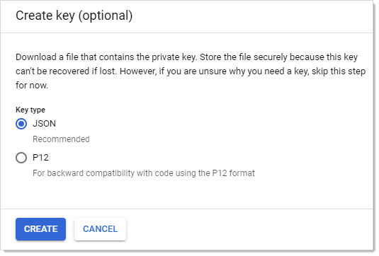

3. Click to select the **JSON** selection button.

3. Click the **Create** button.  This creates and downloads a JSON private key file. A confirmation popup appears:

   

3. Click the **Close** button in the bottom right. The service account is created, and its JSON private key is on your computer.

> **Note:** Note where you downloaded the file. You will need it later in this instruction.

> **Note:** For more information on this process, see [Creating and managing service accounts](https://cloud.google.com/iam/docs/creating-managing-service-accounts#creating) on the GCP website.

### Task 2: Setting GCP Permissions

GCP permissions are IAM permissions from the IAM & Admin section of GCP. Without the proper permissions, GCP discovery, RPC, and heartbeat may not function properly. 

For the service accounts to have access to a project, you must add the service account IAM permissions in each Project. If you did not add the permissions when you created the service account, you need to add the IAM permissions in the project they were created in as well.

#### Discovery

To run discovery in Secret Server, the GCP service account needs the "project viewer" read only permission, which can list projects, zones, service accounts, and instances.

To add the permission In GCP:

1. Click the **IAM & Admin** dropdown list in the left menu in GCP and select **IAM**. The "Permissions for project…" page appears.
1. Click the **Add** button. The "Add member to…" page appears.
1. Type the service account email address in the **Members** text box.
1. Click the **Roles** dropdown list to select **Project \> Viewer** (you can also type it).
1. Click the **Add** button. The new member appears in the table on the "Permissions for project…" page.

#### RPC/Heartbeat

To run RPC/Heartbeat in Secret Server, the service account needs the "service account key admin" permission, which can create, delete, and rotate service account keys.

To add the permission In GCP:

1. Click the **IAM & Admin** dropdown list in the left menu in GCP and select **IAM**. The "Permissions for project…" page appears.
1. Click the **Add** button. The "Add member to…" page appears.
1. Type the service account email address in the **Members** text box.
1. Click the **Roles** dropdown list to select **Service Account Key Admin** (you can also type it).
1. Click the **Add** button. The new member appears in the table on the "Permissions for project…" page.

GCP Console - IAM Manage Keys Permission

### Task 3: Creating a GCP IAM Service-Account Secret

Secret Server now has a build in GCP IAM Service Account Key template. 

> **Note:** To create a Secret using GCP IAM service account key template, you must have the service account’s JSON private key file from GCP (created earlier).

Create a new secret (see [Creating Secrets](../../secret-management/procedures/creating-secrets/index.md) for details): 

1. Click the **+** on the **Secrets** item on the main menu. The "Create New Secret" page appears:

   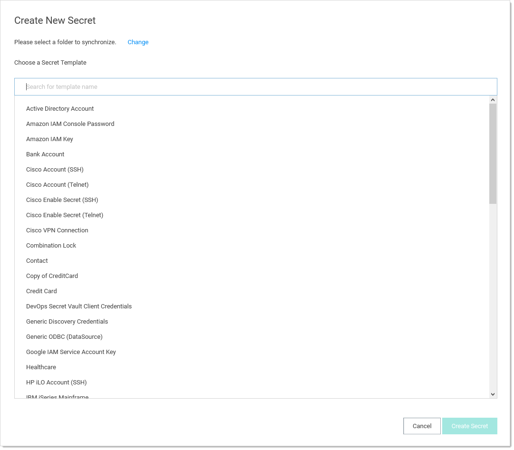

1. Select **Google IAM Service Account Key** as the template. Another "Create New Secret" page, tailored to GCP, appears:

   

1. Click to select a folder for the new secret.

1. Type the secret's name in the **Secret Name** text box.

1. Type the service account email address (use client_email from the JSON private key file) in the **Email** text box.

1. Type the private key ID (use private_key_id from the JSON private key file) in the **Private Key ID** text box.

1. Click the **Change** button to upload the JSON private key file you created earlier.

1. Click the **Create Secret** button. 

### Task 4: Creating an RPC/Heartbeat Password Changer

Secret Server can check if a service Account key is valid and can rotate the Service Account key. This should work the same as any other RPC or Heartbeat. **Note:** RPC and Heartbeat must be enabled

RPC/Heartbeat can be tested from the Password Changers page

1. In SS, go to **Admin \> Remote Password Changing**:

   

1. Click the Configure Password Changers button. The Password Changers Configuration page appears:

   

1. Click the **Google IAM Service Account Key** link. The "Google IAM Service Account Key" page appears:

   

1. Test the heartbeat: Click the **Test Action** button in the **Verify Password Changed Commands** section. The Test Action popup appears:

   

1. Ensure that the **JSONPRIVATEKEY** text box is populated. The others are optional.

1. Click the **OK** button. The popup goes away. If successful, this appears on the previous page:

   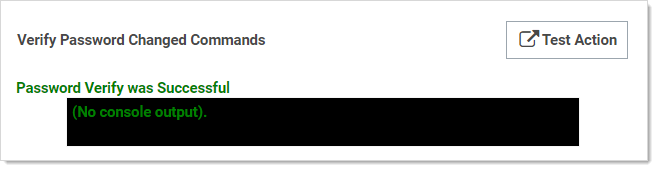

1. Test RPC: Click the **Test Action** button in the **Password Change Commands** section. The Test Action popup appears:

   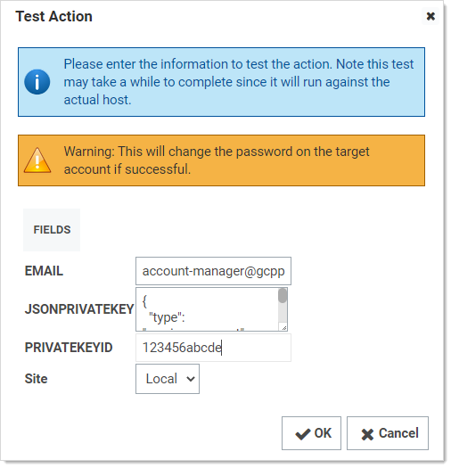

1. Ensure that the **JSONPRIVATEKEY** and **Email** text boxes are populated. The others are optional.

1. Click the **OK** button. The popup goes away. If successful, this appears on the previous page:

   

1. Test RPC with admin credentials: Click the **Test Action** button in the **Password Change By Admin Credentials Commands** section. The Test Action popup appears:

   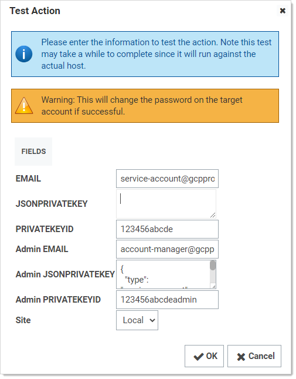

1. Ensure that all text boxes are populated except  **JSONPRIVATEKEY**, **Admin Email**, and **Admin PRIVATEKEYID**, which are optional.

1. Click the **OK** button. The popup goes away. If successful, this appears on the previous page:

   

## Discovery

Secret Server now has a built-in GCP discovery source wizard that creates the scanners to pull the projects, zones, service accounts. To create a GCP discovery source:

1. In SS, go to **Admin \> Discovery**:

   

1. Click the 

1. Go to Admin menu, then select Discovery

\2.   Click Edit Discovery Sources

\3.   Click Create New

\4.   Select GCP Discovery Source

\5.   Click OK

\6.   Then follow the Wizard steps

Secret Server - GCP Discovery Wizard 

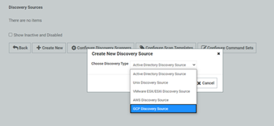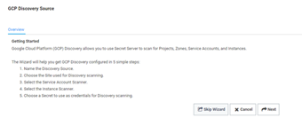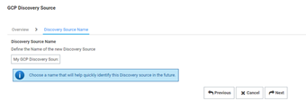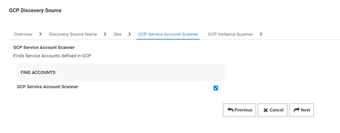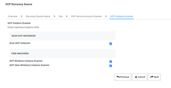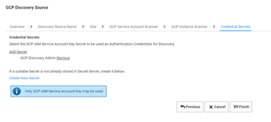

### Scanners

Currently there are 4 Discovery Scanners for the GCP Discovery Source. (In the future, we may add an Instance Local Account and a Service Account Dependency Scanner.)

**GCP Project Scanner** - This is a Host Range Scanner type that will scan GCP and pull all of the Projects that the provided GCP Service Account secret has access to.

**GCP Windows Instance Scanner** - This is a Machine Scanner type that will scan each Project and pull all of the GCP Windows OS VM Instances.

**GCP (Non-Windows) Instance Scanner** - This is a Machine Scanner type that will scan each Project and pull all of the GCP Non-Windows OS VM Instances.

**GCP Service Account Scanner** - This is an Account Scanner type that will scan each Project and pull all of the GCP Service Accounts.

To view these scanner

\1.   Go to Admin menu, then select Discovery

\2.   Click on Edit Discovery Sources

\3.   Select the GCP Discovery Source

Secret Server - GCP Discovery Source Scanners

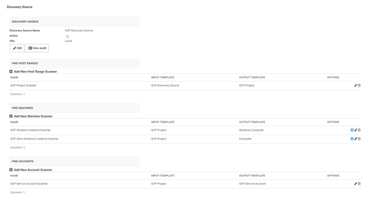

## Instance Custom Filter

This option is only available for the Instance Scanners. The Custom Filter Setting can be used to include or exclude instances by using a filter expression to filter by name, label, or any other field allowed by GCP. 

·     Value must be a string, number, or boolean

·     Comparison operator must be =, !=, >, or <

·     Use parentheses ( ) around each filter

·     Combine different filters using AND or OR (all caps) Ex: (name="instanceName") AND (labels.key="value")

Secret Server - GCP Discovery Instance Custom Filter

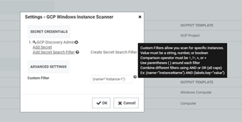

More information on how to [filter for specific Instances](https://cloud.google.com/compute/docs/reference/rest/v1/instances/aggregatedList#query-parameters).

Other useful filters:

·     status=”StatusValue”

o  StatusValues

§ Running

§ Terminated

·     zone="https://www.googleapis.com/compute/v1/projects/{ProjectName}/zones/{ZoneName}"

Unfortunately at this time Google has an open issue the tag filter not working: https://issuetracker.google.com/issues/143463446

## Service Account Import

From the Discovery Network View, Secret Server can import Service Account keys and automatically take over the account. This import process will create a new Secret for the Service Account key, delete the associated key, create a new key, and save the json private key file with the Secret, so this can be easily managed by Secret Server.

To Import a Service Account

\1.   Go to Admin menu, then select Discovery

\2.   Click on Discovery Network View

\3.   Select the Domain\Cloud Account tab

\4.   Select the Service Account(s) to import

\5.   Click Import

\6.   Secret:

\1.   Select a Secret Type: Google IAM Service Account Key

\2.   Select a Folder

\3.   Enter a Secret Name (It auto fills $EMAIL)

\4.   Select a Site

\7.   Key:

\1.   When importing GCP Service Account keys, the only option is take over the account. Meaning, Secret Server will trigger a Remote Password Change on import, to rotate the imported key, and obtain a new json private key file. With the json private key file, Secret Server can then manage the GCP Service Account.

\8.   Import Key:

\1.   Select a Secret to use for the initial take over of the account.

\9.   Key Rotation: 

\1.   Secret to use for future key rotations, either option would need the permissions mentioned above.

\2.   Select Use Secret Credential

\1.   If you wish it to use the imported Service Account to rotate itself, and it has permissions to rotate keys.

\3.   Select Use Privileged Account

\1.   If you wish to use another Service Account that has permissions to rotate keys.

Secret Server - GCP Discovery Service Account Import

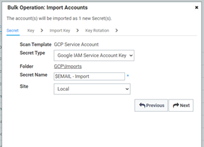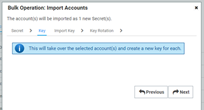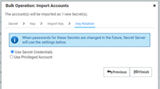

## Errors/Resolutions

**Error**

**Resolution**

**GCP Console**

Create Keys Failed: AccessDenied, Google.Apis.Requests.RequestError Permission iam.serviceAccountKeys.create is required to perform this operation on service account projects/-/serviceAccounts/discovery-me@gcpprojectname.iam.gserviceaccount.com. [403] Errors [ Message[Permission iam.serviceAccountKeys.create is required to perform this operation on service account projects/-/serviceAccounts/discovery-me@gcpprojectname.iam.gserviceaccount.com.] Location[ - ] Reason[forbidden] Domain[global] ]

The Service Account being used to rotate the key does not have necessary permission to perform this task.

Go to GCP console, select IAM, select the Service Account and add the **Service Account Key Admin** permission. Once the Service Account has permission, in Secret Server, select the Secret to rotate, stop the current rotation, and then try it again.

GCP IAM permission 

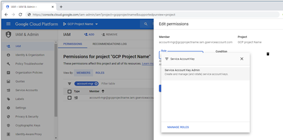

Create Keys Failed: ArgumentError, Google.Apis.Requests.RequestError Maximum number of keys on account reached. [429] Errors [ Message[Maximum number of keys on account reached.] Location[ - ] Reason[rateLimitExceeded] Domain[global] ]

The Service Account being rotated, has reach the maximum number of keys allowed. GCP max is 10 keys.

Go to GCP console, select IAM, select the Service Account and remove the unused keys. Once the Service Account has less than 10 keys, in Secret Server, select the Secret to rotate, stop the current rotation, and then try it again.

GCP Max Keys 

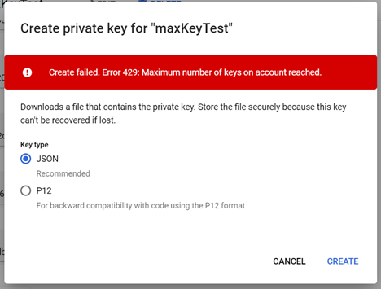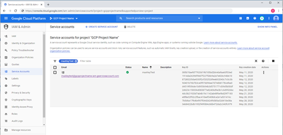

DiscoveryConsumer: Synchronizing Organizational Units failed for [Our Google Cloud]! Error: An issue was encountered during the scan. Google.Apis.Requests.RequestError Access Not Configured. Compute Engine API has not been used in project 123456 before or it is disabled. Enable it by visiting https://console.developers.google.com/apis/api/compute.googleapis.com/overview?project=123456 then retry. If you enabled this API recently, wait a few minutes for the action to propagate to our systems and retry. [403] Errors [ Message[Access Not Configured. Compute Engine API has not been used in project 123456 before or it is disabled. Enable it by visiting https://console.developers.google.com/apis/api/compute.googleapis.com/overview?project=123456 then retry. If you enabled this API recently, wait a few minutes for the action to propagate to our systems and retry.] Location[ - ] Reason[accessNotConfigured] Domain[usageLimits] ] , -2146233088

The Service Account used for Discovery has access to a GCP Project that has not been set up or it is disabled.

Go to GCP console and set up Compute Engine, this will require billing information.

GCP Compute Engine set up 

DiscoveryConsumer: Synchronizing Machines failed for [GCP Discovery Source]! Error: An issue was encountered during the scan. Google.Apis.Requests.RequestError Invalid value for field 'filter': 'filtername="value"'. Invalid list filter expression. [400] Errors [ Message[Invalid value for field 'filter': 'filtername="value"'. Invalid list filter expression.] Location[ - ] Reason[invalid] Domain[global] ] , -2146233088 Exception Caught: Google.Apis.Requests.RequestError Invalid value for field 'filter': 'filtername="value"'. Invalid list filter expression. [400] Errors [ Message[Invalid value for field 'filter': 'filtername="value"'. Invalid list filter expression.] Location[ - ] Reason[invalid] Domain[global] ] Attempting GCP scan for Instances Parameters are valid. Checking for permissions to list Projects.. Has permissions to list Projects.. Starting scan..

OR

DiscoveryConsumer: Machine Scan completed but the following computers failed authentication: An issue was encountered during the scan. Google.Apis.Requests.RequestError Invalid value for field 'filter': 'filtername="value"'. Invalid list filter expression. [400] Errors [ Message[Invalid value for field 'filter': 'filtername="value"'. Invalid list filter expression.] Location[ - ] Reason[invalid] Domain[global] ] , -2146233088. DiscoverySource: GCP Discovery Source ScanItemTemplateId: 12 HostRangeName: GCP Discovery Source SpecificOu: GCP Discovery Source ComputerItems: 0

The Instance Scanner Custom Filter is not valid.

In Secret Server, go to the GCP Discovery Source. Edit the Instance Scanner and update the Custom Filter setting.

More information on [how to filter instances](https://cloud.google.com/compute/docs/reference/rest/v1/instances/aggregatedList#query-parameters) on GCP website.

 

An issue was encountered during the scan. Error:"invalid_grant", Description:"Invalid grant: account not found", Uri:"", -2146233088

The Service Account does not exist in GCP. There may be a typo or it was deleted in GCP.

Go to GCP console and create a Service Account to use. See **GCP Service Accounts** section above.

 

An issue was encountered during the scan. Google.Apis.Requests.RequestError The caller does not have permission [403] Errors [Message[The caller does not have permission] Location[ - ] Reason[forbidden] Domain[global]], -2146233088

The Service Account does not have permissions in IAM.

Go to GCP console, select IAM, add Service Account with permissions. See **GCP Permissions** section above.

 

 